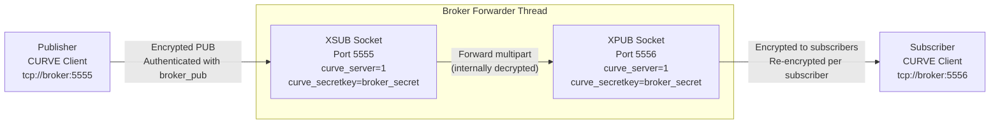

# MX33-Overview

# MX33 Overview
Relevant source files
- [CMakeLists.txt](https://github.com/KhairulM/MX33/blob/97255c15/CMakeLists.txt)
- [README.md](https://github.com/KhairulM/MX33/blob/97255c15/README.md)
- [config.yaml](https://github.com/KhairulM/MX33/blob/97255c15/config.yaml)
- [srvs/register_robot.hpp](https://github.com/KhairulM/MX33/blob/97255c15/srvs/register_robot.hpp)

This document provides a high-level introduction to the MX33 multi-robot mapping system, including its purpose, architecture, core components, and key capabilities. It serves as the entry point for understanding how MX33 enables collaborative 3D mapping across multiple autonomous robots.

For detailed architectural diagrams and component interactions, see [System Architecture](/KhairulM/MX33/1.1-system-architecture). For building and deploying the system, see [Quick Start Guide](/KhairulM/MX33/1.2-quick-start-guide). For in-depth documentation of individual components, see [Core Components](/KhairulM/MX33/2-core-components).

## Purpose and Scope

MX33 is a distributed multi-robot mapping system designed to enable collaborative 3D environment reconstruction. Multiple robots equipped with depth cameras (Intel RealSense or ZED) independently explore an environment while publishing pointcloud data to a centralized map server. The system aggregates sensor data from all robots into a unified global OctoMap, handling coordinate frame transformations and providing exploration services such as frontier detection.

The system is built on a publish-subscribe architecture with service-oriented extensions, using ZeroMQ for inter-process communication and MessagePack for efficient serialization. It integrates with ROS 2 for visualization and monitoring, while maintaining independence from ROS for core functionality.

**Sources**: [README.md51-56](https://github.com/KhairulM/MX33/blob/97255c15/README.md#L51-L56)[CMakeLists.txt1-5](https://github.com/KhairulM/MX33/blob/97255c15/CMakeLists.txt#L1-L5)

## System Capabilities

MX33 provides the following core capabilities:
CapabilityDescription**Multi-Robot Mapping**Aggregate pointclouds from multiple robots into a single global 3D occupancy map**Dynamic Robot Registration**Robots can join and leave the mapping session dynamically via service calls**Coordinate Frame Management**Automatic transformation of robot-local sensor data to a global coordinate frame**Frontier Detection**Identify exploration frontiers for path planning and autonomous exploration**Sensor Flexibility**Support for Intel RealSense D435/D455 and ZED stereo cameras**Message Encryption**Optional CurveZMQ encryption for secure communication over untrusted networks**ROS 2 Visualization**Real-time publication of the global map to ROS 2 topics for monitoring**Service Discovery**Dynamic service registration and lookup through a centralized broker
**Sources**: [README.md1-48](https://github.com/KhairulM/MX33/blob/97255c15/README.md#L1-L48)[config.yaml1-41](https://github.com/KhairulM/MX33/blob/97255c15/config.yaml#L1-L41)

## Core Executables

The system consists of three primary executables that work together to implement the mapping pipeline:

### Component Overview

```
Built from CMakeLists.txt

PointcloudTF messages

PointcloudTF messages

Message forwarding

RegisterRobot::Request

RegisterRobot::Request

GetFrontiers service

broker
(Message Router)

robot
(Sensor Client)

robot
(Sensor Client)

map_server
(Global Mapper)
```

**Diagram: Core Executables and Message Flow**
ExecutableSource FilePrimary RoleKey Dependencies`broker`[broker.cpp](https://github.com/KhairulM/MX33/blob/97255c15/broker.cpp)Message routing and service registrycppzmq, yaml-cpp`map_server`[map_server.cpp](https://github.com/KhairulM/MX33/blob/97255c15/map_server.cpp)Global map construction and frontier detectioncppzmq, PCL, octomap, rclcpp`robot`[robot.cpp](https://github.com/KhairulM/MX33/blob/97255c15/robot.cpp)Sensor data acquisition and publishingcppzmq, realsense2, PCL, yaml-cpp
**Sources**: [CMakeLists.txt90-125](https://github.com/KhairulM/MX33/blob/97255c15/CMakeLists.txt#L90-L125)[README.md52-56](https://github.com/KhairulM/MX33/blob/97255c15/README.md#L52-L56)

### broker

The `broker` executable implements a ZeroMQ-based message broker with two primary functions:

1. **Message Forwarding**: Operates a pub-sub proxy between frontend (port 5555) and backend (port 5556) sockets
2. **Service Registry**: Maintains a directory of available services on ports 5557 (lookup) and 5558 (add/remove)

The broker is stateless and requires no configuration beyond port assignments, making it highly reliable and simple to deploy.

**Sources**: [README.md73-91](https://github.com/KhairulM/MX33/blob/97255c15/README.md#L73-L91)[config.yaml3-7](https://github.com/KhairulM/MX33/blob/97255c15/config.yaml#L3-L7)

### map_server

The `map_server` executable is the core mapping component that:

- Subscribes to `PointcloudTF` messages via the broker backend
- Transforms robot-local pointclouds to a global coordinate frame using pre-configured `global_to_odom_tf` transformations
- Inserts points into an `octomap::OcTree` instance for 3D occupancy mapping
- Provides `RegisterRobot` and `GetFrontiers` services via `Server<Req,Res>` instances
- Publishes the global map to ROS 2 topics for visualization

**Sources**: [README.md93-125](https://github.com/KhairulM/MX33/blob/97255c15/README.md#L93-L125)[config.yaml9-19](https://github.com/KhairulM/MX33/blob/97255c15/config.yaml#L9-L19)

### robot

The `robot` executable runs on each physical or simulated robot and:

- Acquires depth data from RealSense or ZED cameras at 15 FPS
- Converts camera frames to PCL pointclouds
- Publishes `PointcloudTF` messages containing pointcloud data and `odom_to_base_link` transforms via `Publisher<PointcloudTF>`
- Registers with `map_server` using `Client<RegisterRobot::Request, RegisterRobot::Response>`

**Sources**: [README.md126-149](https://github.com/KhairulM/MX33/blob/97255c15/README.md#L126-L149)[config.yaml21-41](https://github.com/KhairulM/MX33/blob/97255c15/config.yaml#L21-L41)

## Communication Framework

MX33 implements a custom communication framework over ZeroMQ that provides high-level abstractions for distributed messaging:

### Core Communication Classes

```
Message Broker Infrastructure

Publisher-Subscriber Pattern

msgpack::pack(T)

msgpack::unpack(T)

connects to

connects to

Request-Reply Pattern

msgpack::pack(Req)

msgpack::unpack(Req)

msgpack::pack(Res)

msgpack::unpack(Res)

Client<Req,Res>
(include/client.hpp)

zmq::socket_t
ZMQ_REQ

zmq::socket_t
ZMQ_REP

Server<Req,Res>
(include/server.hpp)

Publisher<T>
(include/publisher.hpp)

Subscriber<T>
(include/subscriber.hpp)

zmq::socket_t
ZMQ_PUB

zmq::socket_t
ZMQ_SUB

broker executable

Frontend
Port 5555

Backend
Port 5556

Service Lookup
Port 5557

Service Registry
Port 5558
```

**Diagram: Communication Framework Class Hierarchy and Broker Ports**
Class TemplateHeader FileSocket TypeSerializationUsed By`Publisher<T>`[include/publisher.hpp](https://github.com/KhairulM/MX33/blob/97255c15/include/publisher.hpp)ZMQ_PUBmsgpackrobot`Subscriber<T>`[include/subscriber.hpp](https://github.com/KhairulM/MX33/blob/97255c15/include/subscriber.hpp)ZMQ_SUBmsgpackmap_server`Client<Req,Res>`[include/client.hpp](https://github.com/KhairulM/MX33/blob/97255c15/include/client.hpp)ZMQ_REQmsgpackrobot`Server<Req,Res>`[include/server.hpp](https://github.com/KhairulM/MX33/blob/97255c15/include/server.hpp)ZMQ_REPmsgpackmap_server
All classes support optional CurveZMQ encryption when provided with broker public key paths via the `broker_public_key_path` parameter in [config.yaml14-26](https://github.com/KhairulM/MX33/blob/97255c15/config.yaml#L14-L26)

**Sources**: [CMakeLists.txt44-50](https://github.com/KhairulM/MX33/blob/97255c15/CMakeLists.txt#L44-L50)[README.md9-30](https://github.com/KhairulM/MX33/blob/97255c15/README.md#L9-L30)[config.yaml14-26](https://github.com/KhairulM/MX33/blob/97255c15/config.yaml#L14-L26)

## Message Types and Services

The system defines strongly-typed messages and service interfaces using MessagePack serialization:

### Primary Message Types
Message TypeDefinition FilePurposeKey Fields`PointcloudTF`[msgs/pointcloud_tf.hpp](https://github.com/KhairulM/MX33/blob/97255c15/msgs/pointcloud_tf.hpp)Sensor data transport`robot_id`, `pointcloud`, `odom_to_base_link_tf``Transform`[msgs/transform.hpp](https://github.com/KhairulM/MX33/blob/97255c15/msgs/transform.hpp)6-DOF transformations`position`, `orientation``Pointcloud`[msgs/pointcloud.hpp](https://github.com/KhairulM/MX33/blob/97255c15/msgs/pointcloud.hpp)3D point data`points` array
### Service Interfaces
ServiceRequest TypeResponse TypePurpose`register_robot``RegisterRobot::Request``RegisterRobot::Response`Robot registration with map server`get_frontiers``GetFrontiers::Request``GetFrontiers::Response`Frontier detection for exploration
Each message type includes a `MSGPACK_DEFINE` macro for automatic serialization/deserialization.

**Sources**: [srvs/register_robot.hpp1-21](https://github.com/KhairulM/MX33/blob/97255c15/srvs/register_robot.hpp#L1-L21)[CMakeLists.txt44-47](https://github.com/KhairulM/MX33/blob/97255c15/CMakeLists.txt#L44-L47)

## Technology Stack

MX33 integrates multiple open-source libraries to provide its functionality:

### Core Dependencies

```
MX33 Executables

Configuration & Integration

Mapping & Persistence

Sensor & Processing

Communication Layer

depends on

optional

optional

libzmq
(ZeroMQ core)

cppzmq
(C++ bindings)

msgpack
(Serialization)

libsodium
(Optional: CurveZMQ)

librealsense
(Intel RealSense SDK)

ZED SDK
(Optional: Stereolabs)

PCL 1.3+
(Point Cloud Library)

octomap
(3D Occupancy Mapping)

yaml-cpp
(Config parsing)

rclcpp
(ROS 2 client library)

sensor_msgs
(ROS 2 messages)

broker

map_server

robot
```

**Diagram: Dependency Graph from CMakeLists.txt**

### Library Versions and Build Requirements
LibraryMinimum VersionBuild LocationPurposelibzmqLatest[lib/libzmq](https://github.com/KhairulM/MX33/blob/97255c15/lib/libzmq)Core messaging infrastructurecppzmqLatest[lib/cppzmq](https://github.com/KhairulM/MX33/blob/97255c15/lib/cppzmq)C++ wrapper for ZeroMQmsgpackcpp_master branch[lib/msgpack/include](https://github.com/KhairulM/MX33/blob/97255c15/lib/msgpack/include)Header-only serializationlibrealsensev2.56.3System installRealSense camera driverZED SDK3.xSystem install (optional)ZED camera supportPCL1.3+System installPoint cloud processingoctomapLatest[lib/octomap](https://github.com/KhairulM/MX33/blob/97255c15/lib/octomap)3D occupancy mappingyaml-cppLatest[lib/yaml-cpp](https://github.com/KhairulM/MX33/blob/97255c15/lib/yaml-cpp)YAML configuration parsingROS 2Humble/FoxySystem installVisualization integration
The ZED SDK is optional and detected at compile time. If not found, the `robot` executable will only support RealSense cameras [CMakeLists.txt12-20](https://github.com/KhairulM/MX33/blob/97255c15/CMakeLists.txt#L12-L20)

**Sources**: [README.md1-48](https://github.com/KhairulM/MX33/blob/97255c15/README.md#L1-L48)[CMakeLists.txt7-43](https://github.com/KhairulM/MX33/blob/97255c15/CMakeLists.txt#L7-L43)

## Configuration System

MX33 uses a centralized YAML configuration file ([config.yaml](https://github.com/KhairulM/MX33/blob/97255c15/config.yaml)) to manage runtime parameters:

### Configuration Structure
SectionParametersUsed By`broker``frontend_port`, `backend_port`, `service_registry_lookup_port`, `service_registry_add_port`broker`map_server``broker_ip_address`, `transformation_file_path`, `map_resolution`, `map_save_path`, `broker_public_key_path`, `pointcloud_topic`, `register_robot_name`, `get_frontiers_name`, `frame_id`map_server`robot``robot_id`, `broker_ip_address`, `pointcloud_topic`, `register_service_name`, `broker_public_key_path`, `camera_type`, `realsense.*`, `zed.*`robot
The `transformation_file_path` parameter points to a text file (e.g., `global_to_odom_tf_scene3.txt`) that defines the `global_to_odom` transform for each robot, enabling coordinate frame alignment in multi-robot scenarios. See [Coordinate Frame Transforms](/KhairulM/MX33/5.2-coordinate-frame-transforms) for details.

**Sources**: [config.yaml1-41](https://github.com/KhairulM/MX33/blob/97255c15/config.yaml#L1-L41)

## Key Features

### Multi-Robot Coordinate Alignment

The system supports multiple robots operating in a shared environment by pre-defining the transformation between each robot's odometry frame and a global reference frame. These transformations are specified in the file referenced by `map_server.transformation_file_path` in [config.yaml11](https://github.com/KhairulM/MX33/blob/97255c15/config.yaml#L11-L11)

**Transformation File Format**:

```
robot_id x y z qx qy qz qw

```

Each line defines the 7-DOF pose (translation + quaternion rotation) for transforming a robot's local frame to the global frame [README.md110-124](https://github.com/KhairulM/MX33/blob/97255c15/README.md#L110-L124)

### Optional Message Encryption

When `broker_public_key_path` is configured in [config.yaml14-26](https://github.com/KhairulM/MX33/blob/97255c15/config.yaml#L14-L26) the system enables CurveZMQ encryption:

1. The broker loads its CURVE key pair
2. Clients (robot, map_server) load the broker's public key
3. All pub-sub and service messages are encrypted in transit

This requires building libzmq with libsodium support [README.md11-12](https://github.com/KhairulM/MX33/blob/97255c15/README.md#L11-L12)

### ROS 2 Integration

The `map_server` publishes the global OctoMap to ROS 2 topics, enabling visualization in RViz and integration with ROS-based navigation stacks. The map is published on the `/global_map` topic with frame ID specified in [config.yaml18](https://github.com/KhairulM/MX33/blob/97255c15/config.yaml#L18-L18)

**Sources**: [README.md177-184](https://github.com/KhairulM/MX33/blob/97255c15/README.md#L177-L184)[CMakeLists.txt35-105](https://github.com/KhairulM/MX33/blob/97255c15/CMakeLists.txt#L35-L105)

## Workflow Summary

The typical operational workflow:

1. **Start broker**: Initializes message routing and service registry on configured ports
2. **Start map_server**: Subscribes to pointcloud messages, registers mapping services, initializes OctoMap
3. **Start robot(s)**: Each robot registers with map_server, begins publishing PointcloudTF messages at 15 FPS
4. **Map construction**: map_server aggregates pointclouds, applies coordinate transforms, updates OctoMap at 5 Hz
5. **Visualization**: Global map published to ROS 2 for real-time monitoring
6. **Exploration**: Robots query `get_frontiers` service to identify unexplored regions

See [Quick Start Guide](/KhairulM/MX33/1.2-quick-start-guide) for detailed startup instructions and [System Architecture](/KhairulM/MX33/1.1-system-architecture) for component interaction diagrams.

**Sources**: [README.md150-176](https://github.com/KhairulM/MX33/blob/97255c15/README.md#L150-L176)

---

# System-Architecture

# System Architecture
Relevant source files
- [README.md](https://github.com/KhairulM/MX33/blob/97255c15/README.md)
- [include/broker.hpp](https://github.com/KhairulM/MX33/blob/97255c15/include/broker.hpp)
- [map_server.cpp](https://github.com/KhairulM/MX33/blob/97255c15/map_server.cpp)
- [robot.cpp](https://github.com/KhairulM/MX33/blob/97255c15/robot.cpp)

## Purpose and Scope

This document describes the high-level architecture of the MX33 multi-robot mapping system, explaining how the three primary components (broker, map server, and robot clients) interact to enable collaborative 3D mapping. It covers the overall system design, component responsibilities, communication patterns, and data flow.

For detailed information about individual components, see [Core Components](/KhairulM/MX33/2-core-components). For communication framework implementation details, see [Communication Framework](/KhairulM/MX33/3-communication-framework). For configuration and deployment, see [Configuration and Deployment](/KhairulM/MX33/5-configuration-and-deployment).

---

## System Overview

The MX33 system follows a **three-tier architecture** consisting of:

1. **Core Infrastructure**: `Broker` - centralized message routing and service discovery
2. **Mapping Services**: `MapServer` - global map construction and frontier detection
3. **Data Producers**: Robot clients - sensor data acquisition and publishing

**Architecture Diagram**

```
External Systems

Robot Client Layer

Mapping Services Layer

Core Infrastructure Layer

Publisher

Publisher

Publisher

Subscriber

Client

Client

Service Registry

publishes /global_map

octomap::OcTree::insertPointCloud()

rs2::pipeline::start()
sl::Camera::grab()

Broker
class: Broker
file: broker.cpp

MapServer
class: MapServer
file: map_server.cpp

Robot Client
class: RobotClient
file: robot.cpp

Robot Client
class: RobotClient
file: robot.cpp

Additional Robots...

ROS 2
rclcpp::Node
Publishers

OctoMap Library
octomap::OcTree

Sensors
rs2::pipeline
sl::Camera
```

**Sources**: [map_server.cpp58-630](https://github.com/KhairulM/MX33/blob/97255c15/map_server.cpp#L58-L630)[robot.cpp47-367](https://github.com/KhairulM/MX33/blob/97255c15/robot.cpp#L47-L367)[include/broker.hpp17-220](https://github.com/KhairulM/MX33/blob/97255c15/include/broker.hpp#L17-L220)

---

## Component Responsibilities

### Broker

The `Broker` class ([include/broker.hpp17-220](https://github.com/KhairulM/MX33/blob/97255c15/include/broker.hpp#L17-L220)) serves as the central communication hub with two distinct responsibilities:
FunctionalityImplementationPorts**Pub-Sub Forwarding**`runForwarder()`Frontend: 5555, Backend: 5556**Service Registry**`runServiceNameRegistryLookup()`, `runServiceNameRegistryModify()`Lookup: 5557, Add: 5558
The broker operates with three concurrent threads:

- `tForwarder` - routes messages between publishers and subscribers
- `tLookup` - handles service name resolution requests
- `tModify` - processes service registration/unregistration

**Sources**: [include/broker.hpp53-73](https://github.com/KhairulM/MX33/blob/97255c15/include/broker.hpp#L53-L73)[include/broker.hpp88-132](https://github.com/KhairulM/MX33/blob/97255c15/include/broker.hpp#L88-L132)[include/broker.hpp134-219](https://github.com/KhairulM/MX33/blob/97255c15/include/broker.hpp#L134-L219)

### MapServer

The `MapServer` class ([map_server.cpp58-630](https://github.com/KhairulM/MX33/blob/97255c15/map_server.cpp#L58-L630)) aggregates pointcloud data from multiple robots into a unified 3D occupancy map. Key responsibilities:
ComponentTypePurpose`register_robot_server``Server<RegisterRobot::Request, RegisterRobot::Response>`Robot registration endpoint`get_frontiers_server``Server<GetFrontiers::Request, GetFrontiers::Response>`Exploration frontier queries`pointcloud_subscriber``Subscriber<PointcloudTF>`Receives pointcloud streams`global_map``std::shared_ptr<octomap::OcTree>`3D occupancy grid`ros2_node``std::shared_ptr<rclcpp::Node>`ROS 2 integration
The map server runs five concurrent threads ([map_server.cpp142-163](https://github.com/KhairulM/MX33/blob/97255c15/map_server.cpp#L142-L163)):

1. `registerRobotThread()` - handles robot registration requests
2. `getFrontiersThread()` - serves frontier detection queries
3. `processPointcloudsThread()` - receives and processes pointcloud messages
4. `constructGlobalMapThread()` - updates OctoMap at ~100Hz
5. `ros2SpinThread()` - publishes to ROS 2 topics

**Sources**: [map_server.cpp58-166](https://github.com/KhairulM/MX33/blob/97255c15/map_server.cpp#L58-L166)[map_server.cpp177-247](https://github.com/KhairulM/MX33/blob/97255c15/map_server.cpp#L177-L247)[map_server.cpp301-382](https://github.com/KhairulM/MX33/blob/97255c15/map_server.cpp#L301-L382)

### Robot Client

The `RobotClient` class ([robot.cpp47-367](https://github.com/KhairulM/MX33/blob/97255c15/robot.cpp#L47-L367)) encapsulates individual robot functionality:
ComponentTypePurpose`register_client``Client<RegisterRobot::Request, RegisterRobot::Response>`Registers with MapServer`pointcloud_publisher``Publisher<PointcloudTF>`Publishes sensor data`camera_pipeline``rs2::pipeline`RealSense data acquisition`zed``sl::Camera`ZED camera integration (optional)
Supported camera backends ([robot.cpp39-45](https://github.com/KhairulM/MX33/blob/97255c15/robot.cpp#L39-L45)):

- `REALSENSE` - Intel RealSense D435/D455 cameras
- `ZED` - Stereolabs ZED cameras with built-in pose tracking
- `RANDOM` - Synthetic data for testing

**Sources**: [robot.cpp47-154](https://github.com/KhairulM/MX33/blob/97255c15/robot.cpp#L47-L154)[robot.cpp156-177](https://github.com/KhairulM/MX33/blob/97255c15/robot.cpp#L156-L177)[robot.cpp333-366](https://github.com/KhairulM/MX33/blob/97255c15/robot.cpp#L333-L366)

---

## Communication Infrastructure

**Communication Patterns Diagram**

```
Request-Reply Pattern

1.Lookup service

2.Return address

3.Direct ZMQ_REQ

4.ZMQ_REP

Client<Req,Res>
robot.cpp:52

Service Registry
5557:Lookup
5558:Register

Server<Req,Res>
map_server.cpp:72-73

Publish-Subscribe Pattern

ZMQ_PUB

ZMQ_SUB

Publisher<PointcloudTF>
robot.cpp:53

Broker
XSUB:5555 → XPUB:5556

Subscriber<PointcloudTF>
map_server.cpp:75
```

**Sources**: [include/publisher.hpp](https://github.com/KhairulM/MX33/blob/97255c15/include/publisher.hpp)[include/subscriber.hpp](https://github.com/KhairulM/MX33/blob/97255c15/include/subscriber.hpp)[include/client.hpp](https://github.com/KhairulM/MX33/blob/97255c15/include/client.hpp)[include/server.hpp](https://github.com/KhairulM/MX33/blob/97255c15/include/server.hpp)

### Message Serialization

All messages use **MessagePack** for efficient binary serialization. The message structure convention ([msgs/pointcloud_tf.hpp](https://github.com/KhairulM/MX33/blob/97255c15/msgs/pointcloud_tf.hpp)):

```
struct PointcloudTF {
    std::string robot_id;
    Pointcloud pointcloud;
    Transform odom_to_base_link_transform;
    MSGPACK_DEFINE(robot_id, pointcloud, odom_to_base_link_transform);
};
```

Key message types:

- `PointcloudTF` - Pointcloud with robot ID and transform ([msgs/pointcloud_tf.hpp](https://github.com/KhairulM/MX33/blob/97255c15/msgs/pointcloud_tf.hpp))
- `RegisterRobot::Request/Response` - Robot registration service ([srvs/register_robot.hpp](https://github.com/KhairulM/MX33/blob/97255c15/srvs/register_robot.hpp))
- `GetFrontiers::Request/Response` - Frontier query service ([srvs/get_frontiers.hpp](https://github.com/KhairulM/MX33/blob/97255c15/srvs/get_frontiers.hpp))

**Sources**: [msgs/pointcloud_tf.hpp](https://github.com/KhairulM/MX33/blob/97255c15/msgs/pointcloud_tf.hpp)[srvs/register_robot.hpp](https://github.com/KhairulM/MX33/blob/97255c15/srvs/register_robot.hpp)[srvs/get_frontiers.hpp](https://github.com/KhairulM/MX33/blob/97255c15/srvs/get_frontiers.hpp)

### Security Layer

Optional **CurveZMQ** encryption ([include/broker.hpp40-47](https://github.com/KhairulM/MX33/blob/97255c15/include/broker.hpp#L40-L47)[include/broker.hpp90-102](https://github.com/KhairulM/MX33/blob/97255c15/include/broker.hpp#L90-L102)):
ComponentConfigurationPurposeBroker`private_key[41]` loaded from fileCURVE server authenticationClientsGenerated ephemeral keypair + broker public keyCURVE client authenticationService RegistryNo encryptionOperates on trusted network
When encryption is enabled, all pub-sub traffic on ports 5555-5556 is encrypted using elliptic curve cryptography.

**Sources**: [include/broker.hpp25-48](https://github.com/KhairulM/MX33/blob/97255c15/include/broker.hpp#L25-L48)[include/publisher.hpp](https://github.com/KhairulM/MX33/blob/97255c15/include/publisher.hpp)[README.md177-183](https://github.com/KhairulM/MX33/blob/97255c15/README.md#L177-L183)

---

## Data Pipeline

**End-to-End Data Flow**

```
5. Output
4. Map Construction
3. Network Transport
2. Robot Processing
1. Sensor Acquisition

Depth frames @ 15 FPS

msgpack serialize
tcp://broker:5555

tcp://backend:5556

Camera
rs2::pipeline
sl::Camera

realsenseCameraCallback()
robot.cpp:179-212

Point Cloud Construction
rs2::pointcloud::calculate()

PointcloudTF Message
robot.cpp:68, 118

Publisher::publish()
robot.cpp:327

Broker Forwarding
broker.hpp:88-132

Subscriber::getMessageObjectPtr()
map_server.cpp:251

Transform Application
global_to_odom_tf * odom_to_base_link
map_server.cpp:277

OctoMap Insertion
global_map->insertPointCloud()
map_server.cpp:356

ROS 2 Publisher
publishPointCloud2()
map_server.cpp:434-492

Frontier Detection
findFrontiers()
map_server.cpp:515-579

Save to .ot file
map_server.cpp:375
```

**Sources**: [robot.cpp179-212](https://github.com/KhairulM/MX33/blob/97255c15/robot.cpp#L179-L212)[robot.cpp306-331](https://github.com/KhairulM/MX33/blob/97255c15/robot.cpp#L306-L331)[map_server.cpp249-299](https://github.com/KhairulM/MX33/blob/97255c15/map_server.cpp#L249-L299)[map_server.cpp301-382](https://github.com/KhairulM/MX33/blob/97255c15/map_server.cpp#L301-L382)

### Transform Chain

Coordinate frame transformations ([map_server.cpp268-278](https://github.com/KhairulM/MX33/blob/97255c15/map_server.cpp#L268-L278)):

```
Global Frame
    ↓ global_to_odom_tf (from global_to_odom_tf.txt)
Odom Frame (robot's odometry)
    ↓ odom_to_base_link_transform (from PointcloudTF message)
Base Link Frame (robot sensor)
    ↓ point cloud data transformation
World Points (inserted into OctoMap)

```

The complete transformation is computed as:

```
robots[robot_id].global_to_base_link_tf = global_to_odom_tf * msg->odom_to_base_link_transform;
```

**Sources**: [map_server.cpp268-278](https://github.com/KhairulM/MX33/blob/97255c15/map_server.cpp#L268-L278)[map_server.cpp342-346](https://github.com/KhairulM/MX33/blob/97255c15/map_server.cpp#L342-L346)

---

## Threading Model

**MapServer Multi-threaded Architecture**

```
Shared State (Mutex Protected)

Write

Read

Write

Read

Main Thread
map_server.cpp:632-689

registerRobotThread()
map_server.cpp:177-218
Processes RegisterRobot service

getFrontiersThread()
map_server.cpp:220-247
Processes GetFrontiers service

processPointcloudsThread()
map_server.cpp:249-299
Receives PointcloudTF messages

constructGlobalMapThread()
map_server.cpp:301-382
Updates OctoMap @ ~100Hz

ros2SpinThread()
map_server.cpp:168-175
Publishes to ROS 2

robots_mutex
map_server.cpp:77
Protects: robots map

global_map_mutex
map_server.cpp:78
Protects: global_map, global_map_pcl
```

**Synchronization Strategy**:

- `robots_mutex` ([map_server.cpp77](https://github.com/KhairulM/MX33/blob/97255c15/map_server.cpp#L77-L77)) - protects the `std::map<std::string, Robot> robots` structure
- `global_map_mutex` ([map_server.cpp78](https://github.com/KhairulM/MX33/blob/97255c15/map_server.cpp#L78-L78)) - protects OctoMap and PCL point cloud
- Snapshot pattern in `constructGlobalMapThread()` ([map_server.cpp310-315](https://github.com/KhairulM/MX33/blob/97255c15/map_server.cpp#L310-L315)) minimizes lock contention

**Sources**: [map_server.cpp77-78](https://github.com/KhairulM/MX33/blob/97255c15/map_server.cpp#L77-L78)[map_server.cpp142-163](https://github.com/KhairulM/MX33/blob/97255c15/map_server.cpp#L142-L163)[map_server.cpp310-315](https://github.com/KhairulM/MX33/blob/97255c15/map_server.cpp#L310-L315)

### Broker Concurrency

The `Broker` also runs three concurrent threads ([include/broker.hpp62-64](https://github.com/KhairulM/MX33/blob/97255c15/include/broker.hpp#L62-L64)):

1. **Forwarder Thread** - Polls both frontend/backend sockets with 100ms timeout, forwards multipart messages
2. **Lookup Thread** - Non-blocking receives on lookup socket with 5ms sleep
3. **Modify Thread** - Non-blocking receives on modification socket with 5ms sleep

Thread-safe service registry access protected by `mRegistryMutex` ([include/broker.hpp21](https://github.com/KhairulM/MX33/blob/97255c15/include/broker.hpp#L21-L21)).

**Sources**: [include/broker.hpp53-73](https://github.com/KhairulM/MX33/blob/97255c15/include/broker.hpp#L53-L73)[include/broker.hpp88-132](https://github.com/KhairulM/MX33/blob/97255c15/include/broker.hpp#L88-L132)[include/broker.hpp134-219](https://github.com/KhairulM/MX33/blob/97255c15/include/broker.hpp#L134-L219)

---

## Network Topology

**Default Port Allocation**
PortSocket TypePurposeEncryption5555XSUB (frontend)Publishers connect hereOptional CurveZMQ5556XPUB (backend)Subscribers connect hereOptional CurveZMQ5557REPService name lookupNo5558REPService registrationNoDynamicREPIndividual service endpoints (e.g., `RegisterRobot`, `GetFrontiers`)No
**Typical Deployment Topology**

```
Robot 2 (ugv02)

Robot 1 (ugv01)

MapServer Host (central server or dedicated)

Broker Host (central server)

tcp://broker:5555
tcp://broker:5557

tcp://broker:5555
tcp://broker:5557

tcp://broker:5556

tcp://broker:5558

broker process
Ports: 5555, 5556, 5557, 5558

map_server process
Connects to broker
Registers services

ROS 2 Node
Publishes /global_map

robot process
ID: ugv01

RealSense Camera

robot process
ID: ugv02

ZED Camera
```

Configuration is loaded from `config.yaml` ([map_server.cpp638-672](https://github.com/KhairulM/MX33/blob/97255c15/map_server.cpp#L638-L672)[robot.cpp375-447](https://github.com/KhairulM/MX33/blob/97255c15/robot.cpp#L375-L447)):

- `broker_ip_address` - hostname or IP of broker
- `broker_public_key_path` - optional path for encryption
- `transformation_file_path` - robot coordinate transformations

**Sources**: [include/broker.hpp28-38](https://github.com/KhairulM/MX33/blob/97255c15/include/broker.hpp#L28-L38)[map_server.cpp93-106](https://github.com/KhairulM/MX33/blob/97255c15/map_server.cpp#L93-L106)[robot.cpp90-113](https://github.com/KhairulM/MX33/blob/97255c15/robot.cpp#L90-L113)[README.md80-91](https://github.com/KhairulM/MX33/blob/97255c15/README.md#L80-L91)

---

## Key Design Patterns

### Decoupled Architecture

Components communicate exclusively through the broker, enabling:

- Independent deployment and scaling
- Dynamic service discovery via registry
- Fault isolation (broker failure doesn't crash clients)

**Sources**: [include/broker.hpp17-220](https://github.com/KhairulM/MX33/blob/97255c15/include/broker.hpp#L17-L220)

### Type-Safe Messaging

Template-based communication framework ([include/publisher.hpp](https://github.com/KhairulM/MX33/blob/97255c15/include/publisher.hpp)[include/server.hpp](https://github.com/KhairulM/MX33/blob/97255c15/include/server.hpp)):

```
Publisher<PointcloudTF> pointcloud_publisher;
Server<RegisterRobot::Request, RegisterRobot::Response> register_robot_server;
```

Compile-time type checking prevents message type mismatches.

**Sources**: [robot.cpp53](https://github.com/KhairulM/MX33/blob/97255c15/robot.cpp#L53-L53)[map_server.cpp72-75](https://github.com/KhairulM/MX33/blob/97255c15/map_server.cpp#L72-L75)

### Configuration-Driven Deployment

All network addresses, ports, and parameters loaded from YAML ([map_server.cpp646-663](https://github.com/KhairulM/MX33/blob/97255c15/map_server.cpp#L646-L663)):

- Enables multi-robot scenarios without code changes
- Single source of truth for system topology
- Environment-specific configurations (development, production, simulation)

**Sources**: [map_server.cpp638-672](https://github.com/KhairulM/MX33/blob/97255c15/map_server.cpp#L638-L672)[robot.cpp375-447](https://github.com/KhairulM/MX33/blob/97255c15/robot.cpp#L375-L447)[README.md](https://github.com/KhairulM/MX33/blob/97255c15/README.md)

---

# Quick-Start-Guide

# Quick Start Guide
Relevant source files
- [CMakeLists.txt](https://github.com/KhairulM/MX33/blob/97255c15/CMakeLists.txt)
- [README.md](https://github.com/KhairulM/MX33/blob/97255c15/README.md)
- [config.yaml](https://github.com/KhairulM/MX33/blob/97255c15/config.yaml)
- [srvs/register_robot.hpp](https://github.com/KhairulM/MX33/blob/97255c15/srvs/register_robot.hpp)

This guide provides step-by-step instructions for building, configuring, and running the MX33 multi-robot mapping system. By the end of this guide, you will have a working system with a broker, map server, and one or more robot clients communicating over ZeroMQ.

For detailed dependency information and build system architecture, see [Dependencies and Build System](/KhairulM/MX33/1.3-dependencies-and-build-system). For comprehensive configuration reference, see [Configuration Files](/KhairulM/MX33/5.1-configuration-files). For multi-robot coordinate frame setup, see [Coordinate Frame Transforms](/KhairulM/MX33/5.2-coordinate-frame-transforms).

---

## Prerequisites

Before building MX33, ensure the following dependencies are installed:
DependencyPurposeInstallation Method**librealsense**Intel RealSense camera SDKBuild from source (required)**libzmq**Core messaging libraryBuild from lib/libzmq**cppzmq**C++ bindings for ZMQBuild from lib/cppzmq**msgpack**Message serializationHeader-only (lib/msgpack)**libpcl**Point cloud processing`apt install libpcl-dev`**octomap**3D occupancy mappingBuild from lib/octomap**yaml-cpp**Configuration parsingIncluded as submodule**ROS 2**Visualization (Humble/Jazzy)System installation**ZED SDK** (optional)ZED camera supportDownload from Stereolabs
**Note:** The ZED SDK is optional. If not installed, the system will only support RealSense cameras. The build system automatically detects ZED availability via [CMakeLists.txt12-20](https://github.com/KhairulM/MX33/blob/97255c15/CMakeLists.txt#L12-L20)

**Sources:**[CMakeLists.txt1-125](https://github.com/KhairulM/MX33/blob/97255c15/CMakeLists.txt#L1-L125)[README.md1-49](https://github.com/KhairulM/MX33/blob/97255c15/README.md#L1-L49)

---

## Build Process

### Step 1: Install Dependencies

```

```

For encryption support, install libsodium before building libzmq:

```

```

**Sources:**[README.md1-49](https://github.com/KhairulM/MX33/blob/97255c15/README.md#L1-L49)[CMakeLists.txt8-42](https://github.com/KhairulM/MX33/blob/97255c15/CMakeLists.txt#L8-L42)

### Step 2: Build MX33 Components

The build process creates five executables: `broker`, `map_server`, `robot`, and optional demo programs.

```

```

#### Build Output Diagram

```

```

**Build Control:** The `BUILD_EXAMPLES` CMake option controls demo program compilation. It defaults to `ON` but can be disabled with `cmake -DBUILD_EXAMPLES=OFF ..` to reduce build time.

**Sources:**[CMakeLists.txt52-125](https://github.com/KhairulM/MX33/blob/97255c15/CMakeLists.txt#L52-L125)[README.md50-70](https://github.com/KhairulM/MX33/blob/97255c15/README.md#L50-L70)

---

## Configuration Setup

MX33 uses two configuration mechanisms: a YAML configuration file and a transformation file.

### Configuration File (config.yaml)

Create or modify [config.yaml1-41](https://github.com/KhairulM/MX33/blob/97255c15/config.yaml#L1-L41) in the repository root:

```

```

**Key Parameters:**

- **broker_ip_address**: Hostname or IP where broker is running (use actual IP for multi-machine deployments)
- **transformation_file_path**: Path to robot-to-global transform file
- **camera_type**: `realsense`, `zed`, or `random` (for testing without hardware)

**Sources:**[config.yaml1-41](https://github.com/KhairulM/MX33/blob/97255c15/config.yaml#L1-L41)

### Transformation File (global_to_odom_tf.txt)

Define the global-to-odometry transforms for each robot. Each line specifies the transform from the global frame to a robot's odometry frame:

```
robot_id x y z qx qy qz qw

```

Where `(x, y, z)` is translation in meters and `(qx, qy, qz, qw)` is rotation as a quaternion.

**Example for three robots:**

```
ugv01 0.0 0.0 0.0 0.0 0.0 0.0 1.0
ugv02 5.0 0.0 0.0 0.0 0.0 0.0 1.0
ugv03 0.0 5.0 0.0 0.0 0.0 0.707107 0.707107

```

- `ugv01` at origin with no rotation
- `ugv02` translated 5m along X-axis
- `ugv03` translated 5m along Y-axis with 90° rotation

**Note:** If the file doesn't exist, identity transforms are assumed for all robots.

**Sources:**[README.md110-125](https://github.com/KhairulM/MX33/blob/97255c15/README.md#L110-L125)[config.yaml11](https://github.com/KhairulM/MX33/blob/97255c15/config.yaml#L11-L11)

---

## Running the System

The system requires starting components in order: **Broker → Map Server → Robot(s)**. Each component runs in a separate terminal.

### Component Startup Sequence

```

```

**Sources:**[README.md72-176](https://github.com/KhairulM/MX33/blob/97255c15/README.md#L72-L176)

### Step 1: Start the Broker

The broker handles message routing (pub-sub) and service discovery.

```

```

The broker reads port configuration from [config.yaml3-7](https://github.com/KhairulM/MX33/blob/97255c15/config.yaml#L3-L7) and binds to:

- **Frontend (publishers):** Port 5555
- **Backend (subscribers):** Port 5556
- **Service lookup:** Port 5557
- **Service registration:** Port 5558

**Console Output:**

```
Broker frontend bound to tcp://*:5555
Broker backend bound to tcp://*:5556
Service registry lookup bound to tcp://*:5557
Service registry add bound to tcp://*:5558
Starting broker message forwarding...

```

**Sources:**[README.md73-91](https://github.com/KhairulM/MX33/blob/97255c15/README.md#L73-L91)[config.yaml3-7](https://github.com/KhairulM/MX33/blob/97255c15/config.yaml#L3-L7)

### Step 2: Start the Map Server

The map server receives pointclouds from robots and builds a unified global OctoMap.

```

```

The map server:

1. Connects to broker at address from [config.yaml10](https://github.com/KhairulM/MX33/blob/97255c15/config.yaml#L10-L10)
2. Loads transforms from file at [config.yaml11](https://github.com/KhairulM/MX33/blob/97255c15/config.yaml#L11-L11)
3. Registers the `register_robot` service (name from [config.yaml16](https://github.com/KhairulM/MX33/blob/97255c15/config.yaml#L16-L16))
4. Registers the `get_frontiers` service (name from [config.yaml17](https://github.com/KhairulM/MX33/blob/97255c15/config.yaml#L17-L17))
5. Subscribes to topic `pointcloud_tf` (from [config.yaml15](https://github.com/KhairulM/MX33/blob/97255c15/config.yaml#L15-L15))
6. Initializes ROS 2 publisher for `/global_map` topic

**Console Output:**

```
[MapServer] Connecting to broker at tcp://localhost:5555
[MapServer] Loaded transforms for 3 robots
[MapServer] Registered service: register_robot
[MapServer] Registered service: get_frontiers
[MapServer] Subscribed to topic: pointcloud_tf
[MapServer] Started ROS 2 publisher on /global_map
[MapServer] Map update thread started (5 Hz)

```

**Sources:**[README.md93-125](https://github.com/KhairulM/MX33/blob/97255c15/README.md#L93-L125)[config.yaml9-18](https://github.com/KhairulM/MX33/blob/97255c15/config.yaml#L9-L18)

### Step 3: Start Robot Client(s)

Each robot client acquires sensor data, publishes pointclouds, and registers with the map server.

```

```

**Per-Robot Configuration:** To run multiple robots, either:

1. Create separate config files and use symbolic links
2. Modify [config.yaml22](https://github.com/KhairulM/MX33/blob/97255c15/config.yaml#L22-L22) between launches
3. Pass parameters programmatically (requires code modification)

Each robot:

1. Reads `robot_id` from [config.yaml22](https://github.com/KhairulM/MX33/blob/97255c15/config.yaml#L22-L22)
2. Initializes camera based on `camera_type` from [config.yaml27](https://github.com/KhairulM/MX33/blob/97255c15/config.yaml#L27-L27)
3. Connects to broker at [config.yaml23](https://github.com/KhairulM/MX33/blob/97255c15/config.yaml#L23-L23)
4. Looks up `register_robot` service via broker
5. Calls `RegisterRobot` service with request defined in [srvs/register_robot.hpp4-12](https://github.com/KhairulM/MX33/blob/97255c15/srvs/register_robot.hpp#L4-L12)
6. Starts publishing `PointcloudTF` messages at ~15 FPS

**Console Output (ugv01):**

```
[Robot ugv01] Camera type: realsense
[RealSense] Initialized 640x480 @ 15 FPS
[Robot ugv01] Connected to broker at tcp://localhost:5555
[Robot ugv01] Looking up service: register_robot
[Robot ugv01] Registration successful
[Robot ugv01] Publishing pointclouds to topic: pointcloud_tf
Frame 1: Published 28432 points
Frame 2: Published 29104 points
...

```

**Sources:**[README.md127-149](https://github.com/KhairulM/MX33/blob/97255c15/README.md#L127-L149)[config.yaml21-40](https://github.com/KhairulM/MX33/blob/97255c15/config.yaml#L21-L40)

---

## Verification

After starting all components, verify the system is working:

### Check Service Registration

The map server should have successfully registered its services with the broker. Look for these messages in the map server console:

```
[MapServer] Registered service: register_robot
[MapServer] Registered service: get_frontiers

```

### Check Robot Registration

Each robot should successfully register with the map server. Look for this message in each robot's console:

```
[Robot ugv01] Registration successful

```

### Check Data Flow

Monitor the robot consoles for continuous pointcloud publishing:

```
Frame 1: Published 28432 points
Frame 2: Published 29104 points

```

Monitor the map server console for map updates:

```
[MapServer] Received pointcloud from ugv01: 28432 points
[MapServer] Map updated, total nodes: 142567

```

### Visualize with ROS 2

If ROS 2 is properly configured, visualize the global map:

```

```

For OctoMap file visualization, see [Map Visualization](/KhairulM/MX33/7.1-map-visualization).

**Sources:**[README.md170-176](https://github.com/KhairulM/MX33/blob/97255c15/README.md#L170-L176)[config.yaml18](https://github.com/KhairulM/MX33/blob/97255c15/config.yaml#L18-L18)

---

## Complete Workflow Example

This example starts a three-robot system on a single machine:

```

```

**Step-by-step commands:**

```

```

**Expected System State:**

- Broker forwarding messages between 3 robots and map server
- Map server receiving ~45 FPS aggregate pointcloud data (3 robots × 15 FPS each)
- Map server updating OctoMap at 5 Hz
- Map server publishing to ROS 2 `/global_map` topic
- Each robot publishing transformed pointclouds with their respective `global_to_odom_tf`

**Sources:**[README.md150-176](https://github.com/KhairulM/MX33/blob/97255c15/README.md#L150-L176)

---

## Troubleshooting

### Build Failures
IssueSolution`find_package(realsense2) failed`Install librealsense SDK`find_package(cppzmq) failed`Build and install libzmq and cppzmq`find_package(PCL) failed``sudo apt install libpcl-dev``find_package(octomap) failed`Build and install octomap from lib/octomap
### Runtime Failures
IssueSolutionRobot fails to connectVerify broker is running and `broker_ip_address` is correctRegistration failsVerify map server is running and has registered servicesNo pointclouds publishedCheck camera type in config matches available hardwareRViz2 shows no dataVerify ROS 2 environment is sourced (`source /opt/ros/humble/setup.bash`)
### Multi-Machine Deployment

When running components on different machines:

1. Set `broker_ip_address` in [config.yaml10](https://github.com/KhairulM/MX33/blob/97255c15/config.yaml#L10-L10) and [config.yaml23](https://github.com/KhairulM/MX33/blob/97255c15/config.yaml#L23-L23) to the broker's actual IP
2. Ensure firewall allows traffic on ports 5555-5558
3. Verify network connectivity: `ping <broker_ip>`
4. Use `ifconfig` or `ip addr` to confirm machine IP addresses

**Sources:**[config.yaml10](https://github.com/KhairulM/MX33/blob/97255c15/config.yaml#L10-L10)[config.yaml23](https://github.com/KhairulM/MX33/blob/97255c15/config.yaml#L23-L23)

---

## Next Steps

After successfully running the basic system:

- Learn about coordinate frame configuration for multi-robot scenarios: [Coordinate Frame Transforms](/KhairulM/MX33/5.2-coordinate-frame-transforms)
- Explore the frontier detection service: [Frontier Detection Service](/KhairulM/MX33/2.2.3-frontier-detection-service)
- Review security options with CurveZMQ: [Security with CurveZMQ](/KhairulM/MX33/3.4-security-with-curvezmq)
- Run demo applications to understand communication patterns: [Demo Applications](/KhairulM/MX33/6-demo-applications)
- Integrate custom sensors or robots: [Extending the System](/KhairulM/MX33/8.4-extending-the-system)

**Sources:**[README.md1-184](https://github.com/KhairulM/MX33/blob/97255c15/README.md#L1-L184)

---

# Dependencies-and-Build-System

# Dependencies and Build System
Relevant source files
- [.gitmodules](https://github.com/KhairulM/MX33/blob/97255c15/.gitmodules)
- [CMakeLists.txt](https://github.com/KhairulM/MX33/blob/97255c15/CMakeLists.txt)
- [README.md](https://github.com/KhairulM/MX33/blob/97255c15/README.md)
- [srvs/register_robot.hpp](https://github.com/KhairulM/MX33/blob/97255c15/srvs/register_robot.hpp)

This page documents the external dependencies, git submodules, and CMake build configuration for the MX33 system. It covers library requirements for each executable component, installation procedures, and build system organization.

For instructions on building and running the system, see [Quick Start Guide](/KhairulM/MX33/1.2-quick-start-guide). For details on the overall system architecture, see [System Architecture](/KhairulM/MX33/1.1-system-architecture).

---

## Dependency Overview

The MX33 system has dependencies organized into three categories: **system-installed libraries**, **git submodules**, and **optional dependencies** that enable additional features.

### Dependency Categories
CategoryLibrariesPurpose**Communication**libzmq, cppzmq, msgpack-cZeroMQ messaging with MessagePack serialization**Sensor/Camera**librealsense, ZED SDK (optional)Camera data acquisition from RealSense and ZED devices**Point Cloud**PCLPoint cloud filtering, transformation, and processing**3D Mapping**OctomapOctree-based 3D occupancy grid mapping**ROS Integration**rclcpp, sensor_msgs, std_msgs, geometry_msgsROS 2 publisher nodes for visualization**Configuration**yaml-cppYAML configuration file parsing**Security**libsodium (optional)CurveZMQ encryption support
**Sources**: [CMakeLists.txt7-42](https://github.com/KhairulM/MX33/blob/97255c15/CMakeLists.txt#L7-L42)[.gitmodules1-21](https://github.com/KhairulM/MX33/blob/97255c15/.gitmodules#L1-L21)[README.md1-48](https://github.com/KhairulM/MX33/blob/97255c15/README.md#L1-L48)

---

## Git Submodules

Six libraries are included as git submodules in the `lib/` directory and must be built locally. These are version-controlled to ensure compatibility across deployments.

```

```

**Diagram: Git Submodule Dependencies**

### Submodule Details
SubmodulePathRepositoryBuild TypeNotes`libzmq``lib/libzmq`zeromq/libzmqCMake + make installRequires libsodium for encryption`cppzmq``lib/cppzmq`zeromq/cppzmqCMake + make installHeader-only C++ bindings for libzmq`librealsense``lib/librealsense`IntelRealSense/librealsenseCMake + make installUse v2.56.3 for Ubuntu 24.04`msgpack``lib/msgpack`msgpack/msgpack-cHeader-onlyBranch: `cpp_master``octomap``lib/octomap`OctoMap/octomapCMake + make installBranch: `v1.10.0``yaml-cpp``lib/yaml-cpp`jbeder/yaml-cppadd_subdirectory()Built as part of main project
**Sources**: [.gitmodules1-21](https://github.com/KhairulM/MX33/blob/97255c15/.gitmodules#L1-L21)[README.md1-48](https://github.com/KhairulM/MX33/blob/97255c15/README.md#L1-L48)

### Build Instructions for Submodules

Most submodules follow a standard CMake build pattern. The `lib/msgpack` submodule is header-only and requires no build step. The `lib/yaml-cpp` submodule is built via CMake's `add_subdirectory()` directive [CMakeLists.txt41](https://github.com/KhairulM/MX33/blob/97255c15/CMakeLists.txt#L41-L41) rather than being installed system-wide.

```

```

**Sources**: [README.md9-30](https://github.com/KhairulM/MX33/blob/97255c15/README.md#L9-L30)

---

## System-Installed Dependencies

These libraries must be installed via system package managers or from official repositories before building MX33.

### Core Dependencies
LibraryFind PackageRequired ForInstallation**PCL**`find_package(PCL 1.3 REQUIRED)`Point cloud processing (all components)`sudo apt install libpcl-dev`**ROS 2**`find_package(rclcpp REQUIRED)`MapServer ROS 2 integrationROS 2 workspace setup**libsodium**N/A (libzmq dependency)CurveZMQ encryption (optional)System package manager
The ROS 2 packages (`rclcpp`, `sensor_msgs`, `std_msgs`, `geometry_msgs`) are required only for the `map_server` executable [CMakeLists.txt35-38](https://github.com/KhairulM/MX33/blob/97255c15/CMakeLists.txt#L35-L38)

**Sources**: [CMakeLists.txt25-38](https://github.com/KhairulM/MX33/blob/97255c15/CMakeLists.txt#L25-L38)[README.md35-38](https://github.com/KhairulM/MX33/blob/97255c15/README.md#L35-L38)

---

## CMake Build Configuration

The root `CMakeLists.txt` defines the build process for all executables. It sets C++14 as the standard [CMakeLists.txt4-5](https://github.com/KhairulM/MX33/blob/97255c15/CMakeLists.txt#L4-L5) and configures dependencies, include paths, and linking for each target.

```

```

**Diagram: CMake Configuration Flow**

**Sources**: [CMakeLists.txt1-50](https://github.com/KhairulM/MX33/blob/97255c15/CMakeLists.txt#L1-L50)

### Include Paths

The build system adds the following directories to the include path [CMakeLists.txt44-50](https://github.com/KhairulM/MX33/blob/97255c15/CMakeLists.txt#L44-L50):

```
include/              # Core headers (broker.hpp, publisher.hpp, etc.)
msgs/                 # Message definitions
srvs/                 # Service definitions  
utils/                # Utility headers
lib/msgpack/include/  # MessagePack header-only library
lib/yaml-cpp/include/ # YAML-CPP headers (via add_subdirectory)

```

**Sources**: [CMakeLists.txt44-50](https://github.com/KhairulM/MX33/blob/97255c15/CMakeLists.txt#L44-L50)

---

## Executable Targets and Dependencies

The build system produces three main executables (`broker`, `map_server`, `robot`) and optional demo applications. Each has different dependency requirements.

```

```

**Diagram: Executable Dependencies**

### Broker

The `broker` executable has minimal dependencies [CMakeLists.txt90-95](https://github.com/KhairulM/MX33/blob/97255c15/CMakeLists.txt#L90-L95):

```

```

**Dependencies**: `cppzmq` (ZeroMQ C++ bindings), `yaml-cpp` (configuration parsing)

### MapServer

The `map_server` executable has the most complex dependency set [CMakeLists.txt97-105](https://github.com/KhairulM/MX33/blob/97255c15/CMakeLists.txt#L97-L105):

```

```

**Dependencies**: `cppzmq`, `PCL`, `Octomap`, `yaml-cpp`, ROS 2 packages (`rclcpp`, `sensor_msgs`, `std_msgs`, `geometry_msgs`)

The ROS 2 dependencies are added via `ament_target_dependencies()` rather than `target_link_libraries()` to properly configure ROS 2 include paths and definitions.

### Robot

The `robot` executable supports conditional ZED SDK integration [CMakeLists.txt107-125](https://github.com/KhairulM/MX33/blob/97255c15/CMakeLists.txt#L107-L125):

```

```

**Dependencies**: `cppzmq`, `realsense2`, `PCL`, `yaml-cpp`, optionally `ZED SDK`

**Sources**: [CMakeLists.txt90-125](https://github.com/KhairulM/MX33/blob/97255c15/CMakeLists.txt#L90-L125)

---

## Optional Dependencies and Conditional Compilation

### ZED SDK Support

The ZED SDK is discovered using `find_package(ZED 3 QUIET)`[CMakeLists.txt12](https://github.com/KhairulM/MX33/blob/97255c15/CMakeLists.txt#L12-L12) If found, the build system:

1. Adds ZED include directories [CMakeLists.txt15](https://github.com/KhairulM/MX33/blob/97255c15/CMakeLists.txt#L15-L15)
2. Adds ZED library directories [CMakeLists.txt16](https://github.com/KhairulM/MX33/blob/97255c15/CMakeLists.txt#L16-L16)
3. Defines the `ZED_AVAILABLE` preprocessor macro [CMakeLists.txt17](https://github.com/KhairulM/MX33/blob/97255c15/CMakeLists.txt#L17-L17)
4. Links ZED libraries to the `robot` executable [CMakeLists.txt114](https://github.com/KhairulM/MX33/blob/97255c15/CMakeLists.txt#L114-L114)

If not found, a warning is emitted and the robot executable only supports RealSense cameras [CMakeLists.txt19](https://github.com/KhairulM/MX33/blob/97255c15/CMakeLists.txt#L19-L19)

Code that uses ZED SDK conditionally checks for `ZED_AVAILABLE`:

```

```

### Demo Executables

Demo applications are controlled by the `BUILD_EXAMPLES` CMake option [CMakeLists.txt53](https://github.com/KhairulM/MX33/blob/97255c15/CMakeLists.txt#L53-L53) which defaults to `ON`. Setting this to `OFF` during configuration skips building:

- `camera_publisher`[CMakeLists.txt55](https://github.com/KhairulM/MX33/blob/97255c15/CMakeLists.txt#L55-L55)
- `camera_subscriber`[CMakeLists.txt56](https://github.com/KhairulM/MX33/blob/97255c15/CMakeLists.txt#L56-L56)
- `demo_service_server`[CMakeLists.txt57](https://github.com/KhairulM/MX33/blob/97255c15/CMakeLists.txt#L57-L57)
- `demo_service_client`[CMakeLists.txt58](https://github.com/KhairulM/MX33/blob/97255c15/CMakeLists.txt#L58-L58)
- `test_get_frontiers`[CMakeLists.txt82](https://github.com/KhairulM/MX33/blob/97255c15/CMakeLists.txt#L82-L82)

To disable demos:

```

```

**Sources**: [CMakeLists.txt12-20](https://github.com/KhairulM/MX33/blob/97255c15/CMakeLists.txt#L12-L20)[CMakeLists.txt53-88](https://github.com/KhairulM/MX33/blob/97255c15/CMakeLists.txt#L53-L88)

---

## CurveZMQ Encryption Support

Message encryption using CurveZMQ requires `libsodium` to be installed before building `libzmq`. The encryption feature is enabled during libzmq configuration [README.md12](https://github.com/KhairulM/MX33/blob/97255c15/README.md#L12-L12):

```

```

When libzmq is built with CurveZMQ support, the `Publisher`, `Subscriber`, `Client`, and `Server` classes can enable encryption by providing a broker public key path. See [Security with CurveZMQ](/KhairulM/MX33/3.4-security-with-curvezmq) for usage details.

**Sources**: [README.md11-12](https://github.com/KhairulM/MX33/blob/97255c15/README.md#L11-L12)

---

## Build Process Summary

The complete build process follows this sequence:

```

```

**Diagram: Build Process Flow**

### Standard Build Commands

```

```

**Sources**: [README.md50-62](https://github.com/KhairulM/MX33/blob/97255c15/README.md#L50-L62)

---

## Dependency Version Requirements
LibraryMinimum VersionNotesCMake3.10Specified in [CMakeLists.txt1](https://github.com/KhairulM/MX33/blob/97255c15/CMakeLists.txt#L1-L1)C++ StandardC++14Set in [CMakeLists.txt4](https://github.com/KhairulM/MX33/blob/97255c15/CMakeLists.txt#L4-L4)PCL1.3Required in [CMakeLists.txt26](https://github.com/KhairulM/MX33/blob/97255c15/CMakeLists.txt#L26-L26)ZED SDK3.xOptional in [CMakeLists.txt12](https://github.com/KhairulM/MX33/blob/97255c15/CMakeLists.txt#L12-L12)librealsensev2.56.3Recommended for Ubuntu 24.04 [README.md5](https://github.com/KhairulM/MX33/blob/97255c15/README.md#L5-L5)Octomapv1.10.0Pinned submodule branch [.gitmodules17](https://github.com/KhairulM/MX33/blob/97255c15/.gitmodules#L17-L17)
**Sources**: [CMakeLists.txt1-26](https://github.com/KhairulM/MX33/blob/97255c15/CMakeLists.txt#L1-L26)[README.md5](https://github.com/KhairulM/MX33/blob/97255c15/README.md#L5-L5)[.gitmodules17](https://github.com/KhairulM/MX33/blob/97255c15/.gitmodules#L17-L17)

---

## Troubleshooting

### Missing Dependencies

If `cmake` fails with "Could not find" errors:

1. Verify system-installed packages: `dpkg -l | grep -E 'pcl|realsense'`
2. Check submodule build/install: `ldconfig -p | grep -E 'zmq|octomap'`
3. Ensure ROS 2 workspace is sourced: `source /opt/ros/<distro>/setup.bash`

### ZED SDK Not Found

If ZED SDK is not found but desired:

1. Install ZED SDK from Stereolabs website
2. Ensure ZED SDK libraries are in system library path
3. Re-run `cmake ..` to detect ZED SDK

To build without ZED SDK, ignore the warning message [CMakeLists.txt19](https://github.com/KhairulM/MX33/blob/97255c15/CMakeLists.txt#L19-L19)

### ROS 2 Integration Issues

The `map_server` requires ROS 2 packages. If build fails:

1. Verify ROS 2 installation: `ros2 --version`
2. Source ROS 2 workspace: `source /opt/ros/<distro>/setup.bash`
3. Install missing packages: `sudo apt install ros-<distro>-sensor-msgs`

**Sources**: [CMakeLists.txt12-20](https://github.com/KhairulM/MX33/blob/97255c15/CMakeLists.txt#L12-L20)[CMakeLists.txt35-38](https://github.com/KhairulM/MX33/blob/97255c15/CMakeLists.txt#L35-L38)

---

# Core-Components

# Core Components
Relevant source files
- [include/broker.hpp](https://github.com/KhairulM/MX33/blob/97255c15/include/broker.hpp)
- [map_server.cpp](https://github.com/KhairulM/MX33/blob/97255c15/map_server.cpp)
- [robot.cpp](https://github.com/KhairulM/MX33/blob/97255c15/robot.cpp)

## Purpose and Scope

This document provides an overview of the three main executable components in the MX33 system: the **broker**, **map_server**, and **robot** client. Each component is compiled as a standalone executable and runs as a separate process. This page describes their roles, architectural structure, and how they interact.

For detailed information about individual components, see:

- Broker implementation details: [Broker](/KhairulM/MX33/2.1-broker)
- MapServer functionality and services: [MapServer](/KhairulM/MX33/2.2-mapserver)
- Robot client sensor integration: [Robot Client](/KhairulM/MX33/2.3-robot-client)

For information about the communication framework used by these components, see [Communication Framework](/KhairulM/MX33/3-communication-framework).

---

## Component Overview

The system consists of three types of processes that work together to enable multi-robot collaborative mapping:
ComponentExecutablePrimary ClassKey Responsibilities**Broker**`broker``Broker`Message routing between publishers and subscribers; Service name registry for dynamic service discovery**MapServer**`map_server``MapServer`Global 3D map construction using OctoMap; Robot registration and transform management; Frontier detection service; ROS 2 visualization publishing**Robot**`robot``RobotClient`Camera data acquisition (RealSense/ZED); Pointcloud publishing; Robot registration with MapServer
Each component is configured via YAML files (typically `config.yaml`) and can be deployed on separate physical machines or containers.

**Sources:**[map_server.cpp1-689](https://github.com/KhairulM/MX33/blob/97255c15/map_server.cpp#L1-L689)[include/broker.hpp1-222](https://github.com/KhairulM/MX33/blob/97255c15/include/broker.hpp#L1-L222)[robot.cpp1-483](https://github.com/KhairulM/MX33/blob/97255c15/robot.cpp#L1-L483)

---

## Core Component Architecture

The following diagram shows the main classes and their key member objects for each component:

```

```

**Sources:**[include/broker.hpp17-48](https://github.com/KhairulM/MX33/blob/97255c15/include/broker.hpp#L17-L48)[map_server.cpp58-90](https://github.com/KhairulM/MX33/blob/97255c15/map_server.cpp#L58-L90)[robot.cpp47-68](https://github.com/KhairulM/MX33/blob/97255c15/robot.cpp#L47-L68)

---

## Component Communication Patterns

The following diagram illustrates how the components communicate using the underlying ZeroMQ patterns:

```

```

**Sources:**[include/broker.hpp88-132](https://github.com/KhairulM/MX33/blob/97255c15/include/broker.hpp#L88-L132)[map_server.cpp104-106](https://github.com/KhairulM/MX33/blob/97255c15/map_server.cpp#L104-L106)[robot.cpp105-106](https://github.com/KhairulM/MX33/blob/97255c15/robot.cpp#L105-L106)

---

## Component Threading Models

Each component employs multi-threading to handle concurrent operations:

### Broker Threading

The `Broker` class spawns three threads in its `run()` method:
ThreadMethodPurposeForwarder`runForwarder()`Forwards messages between frontend (publishers) and backend (subscribers) using ZMQ proxy patternLookup`runServiceNameRegistryLookup()`Handles service name lookup requests on port 5557Modify`runServiceNameRegistryModify()`Handles service registration/unregistration on port 5558
All threads run until the atomic `mRunning` flag is set to false.

**Sources:**[include/broker.hpp62-69](https://github.com/KhairulM/MX33/blob/97255c15/include/broker.hpp#L62-L69)

### MapServer Threading

The `MapServer` class spawns five threads in its `run()` method:
ThreadMethodPurposeRegister Robot`registerRobotThread()`Runs the `register_robot_server` to handle robot registration requestsGet Frontiers`getFrontiersThread()`Runs the `get_frontiers_server` to handle frontier detection requestsProcess Pointclouds`processPointcloudsThread()`Receives pointcloud messages and updates robot state (transforms and pointclouds)Construct Global Map`constructGlobalMapThread()`Transforms robot pointclouds to global frame and inserts into OctoMapROS2 Spin`ros2SpinThread()`Spins the ROS 2 node to publish visualization data
Mutexes protect shared data: `robots_mutex` guards the `robots` map, and `global_map_mutex` guards the `global_map` OctoMap.

**Sources:**[map_server.cpp142-166](https://github.com/KhairulM/MX33/blob/97255c15/map_server.cpp#L142-L166)

### Robot Threading

The `RobotClient` class uses a single main thread with callback-based camera handling:

- For RealSense cameras, the `camera_pipeline.start()` method is called with a lambda callback that processes frames asynchronously
- The main thread runs a loop that calls `publishPointcloud()` at 1 Hz
- The callback `realsenseCameraCallback()` processes depth frames and updates the message payload

**Sources:**[robot.cpp333-366](https://github.com/KhairulM/MX33/blob/97255c15/robot.cpp#L333-L366)

---

## Component Initialization and Configuration

Each component follows a similar initialization pattern:

```

```

### Configuration Parameters

Each component reads specific configuration sections from `config.yaml`:

**Broker Configuration:**

```
broker:
  frontend_address: "tcp://*:5555"
  backend_address: "tcp://*:5556"
  service_name_registry_lookup_address: "tcp://*:5557"
  service_name_registry_add_address: "tcp://*:5558"
  secret_key_path: ""  # Optional for encryption

```

**MapServer Configuration:**

```
map_server:
  broker_ip_address: "localhost"
  broker_public_key_path: ""  # Optional for encryption
  transformation_file_path: "global_to_odom_tf.txt"
  map_resolution: 0.1
  map_save_path: "global_map.ot"
  pointcloud_topic: "pointcloud_tf"
  register_robot_name: "register_robot"
  get_frontiers_name: "get_frontiers"
  frame_id: "world"

```

**Robot Configuration:**

```
robot:
  robot_id: "ugv01"
  broker_ip_address: "localhost"
  broker_public_key_path: ""  # Optional for encryption
  camera_type: "realsense"  # or "zed" or "random"
  realsense:
    resolution_width: 640
    resolution_height: 480
    decimation_magnitude: 8
    camera_fps: 15

```

**Sources:**[include/broker.hpp28-48](https://github.com/KhairulM/MX33/blob/97255c15/include/broker.hpp#L28-L48)[map_server.cpp632-683](https://github.com/KhairulM/MX33/blob/97255c15/map_server.cpp#L632-L683)[robot.cpp369-478](https://github.com/KhairulM/MX33/blob/97255c15/robot.cpp#L369-L478)

---

## Component Dependencies

The following table shows the key dependencies for each component:
ComponentCommunicationSensor/ProcessingConfigurationROS Integration**Broker**cppzmq, libzmq—yaml-cpp—**MapServer**cppzmq, libzmqPCL, Octomapyaml-cpprclcpp, sensor_msgs**Robot**cppzmq, libzmqlibrealsense, ZED SDK (optional), PCLyaml-cpp—
The broker has minimal dependencies, making it lightweight and portable. The MapServer has the most dependencies due to its mapping and ROS 2 integration requirements. Robots require camera SDK libraries depending on the hardware platform.

For detailed build configuration, see [Dependencies and Build System](/KhairulM/MX33/1.3-dependencies-and-build-system).

**Sources:**[map_server.cpp1-39](https://github.com/KhairulM/MX33/blob/97255c15/map_server.cpp#L1-L39)[include/broker.hpp4-14](https://github.com/KhairulM/MX33/blob/97255c15/include/broker.hpp#L4-L14)[robot.cpp1-31](https://github.com/KhairulM/MX33/blob/97255c15/robot.cpp#L1-L31)

---

## Component Lifecycle

The following diagram shows the typical lifecycle of each component from startup to shutdown:

```

```

All components register signal handlers for `SIGINT` and `SIGTERM` to enable graceful shutdown. The MapServer saves the global OctoMap to disk during shutdown.

**Sources:**[map_server.cpp43-46](https://github.com/KhairulM/MX33/blob/97255c15/map_server.cpp#L43-L46)[include/broker.hpp50-51](https://github.com/KhairulM/MX33/blob/97255c15/include/broker.hpp#L50-L51)[robot.cpp35-37](https://github.com/KhairulM/MX33/blob/97255c15/robot.cpp#L35-L37)

---

## Inter-Component Data Flow

The following diagram shows how data flows between components during normal operation:

```

```

The camera captures depth data at high frequency (15 FPS), but the robot publishes pointclouds at a lower rate (1 Hz) to reduce network bandwidth. The MapServer processes incoming pointclouds and updates the OctoMap continuously in a tight loop (~10ms cycle time).

**Sources:**[robot.cpp179-212](https://github.com/KhairulM/MX33/blob/97255c15/robot.cpp#L179-L212)[robot.cpp306-331](https://github.com/KhairulM/MX33/blob/97255c15/robot.cpp#L306-L331)[map_server.cpp249-299](https://github.com/KhairulM/MX33/blob/97255c15/map_server.cpp#L249-L299)[map_server.cpp301-382](https://github.com/KhairulM/MX33/blob/97255c15/map_server.cpp#L301-L382)

---

# Broker

# Broker
Relevant source files
- [broker.cpp](https://github.com/KhairulM/MX33/blob/97255c15/broker.cpp)
- [config.yaml](https://github.com/KhairulM/MX33/blob/97255c15/config.yaml)
- [include/broker.hpp](https://github.com/KhairulM/MX33/blob/97255c15/include/broker.hpp)

## Purpose and Scope

The **Broker** is the central communication hub in the MX33 multi-robot mapping system. It serves two primary functions:

1. **Message Forwarding**: Routes publish-subscribe messages between robot publishers and map server subscribers
2. **Service Registry**: Provides dynamic service discovery, allowing clients to locate services by name

The Broker operates as a standalone process that all other system components connect to. It handles high-frequency sensor data streams via pub-sub patterns and low-frequency service lookups via request-reply patterns.

For detailed information about the forwarding mechanism, see [Message Forwarding](/KhairulM/MX33/2.1.1-message-forwarding). For service discovery details, see [Service Registry](/KhairulM/MX33/2.1.2-service-registry).

**Sources**: [include/broker.hpp1-222](https://github.com/KhairulM/MX33/blob/97255c15/include/broker.hpp#L1-L222)[broker.cpp1-62](https://github.com/KhairulM/MX33/blob/97255c15/broker.cpp#L1-L62)

---

## Class Structure and Components

The Broker is implemented as a single C++ class that manages multiple ZeroMQ sockets across three threads.

```

```

**Key Data Members**:

- `mFrontendAddress`: Bind address for publishers (XSUB socket)
- `mBackendAddress`: Bind address for subscribers (XPUB socket)
- `mServiceNameRegistryLookupAddress`: Bind address for service lookup (REP socket)
- `mServiceNameRegistryAddAddress`: Bind address for service registration (REP socket)
- `mServiceNameRegistry`: In-memory map storing service name → network address mappings
- `mRegistryMutex`: Protects concurrent access to the service registry
- `private_key`: Optional CurveZMQ private key for encryption (41 bytes, null-terminated)

**Sources**: [include/broker.hpp17-48](https://github.com/KhairulM/MX33/blob/97255c15/include/broker.hpp#L17-L48)

---

## Network Topology

The Broker binds to four distinct TCP ports, each serving a specific communication pattern.

### Port Configuration
PortDefaultSocket TypePatternPurposeEncryption`frontend_port`5555XSUBPub-SubReceives messages from publishersOptional (CurveZMQ)`backend_port`5556XPUBPub-SubSends messages to subscribersOptional (CurveZMQ)`service_registry_lookup_port`5557REPReq-ReplyService name lookupNone`service_registry_add_port`5558REPReq-ReplyService registration/unregistrationNone
```

```

**Sources**: [include/broker.hpp18-19](https://github.com/KhairulM/MX33/blob/97255c15/include/broker.hpp#L18-L19)[broker.cpp34-42](https://github.com/KhairulM/MX33/blob/97255c15/broker.cpp#L34-L42)[config.yaml3-7](https://github.com/KhairulM/MX33/blob/97255c15/config.yaml#L3-L7)

---

## Threading Model

The Broker runs three independent threads, all sharing a single `zmq::context_t` instance.

```

```

### Thread Responsibilities
Thread FunctionSocket(s)Poll TimeoutPurpose`runForwarder()`Frontend (XSUB), Backend (XPUB)100 msBidirectional message forwarding between publishers and subscribers`runServiceNameRegistryLookup()`REP socket on lookup port5 msHandle service name → address lookup requests`runServiceNameRegistryModify()`REP socket on add port5 msProcess REGISTER/UNREGISTER commands
All threads check `mRunning.load()` periodically to enable graceful shutdown. The `mRegistryMutex` protects concurrent access to `mServiceNameRegistry` from the lookup and modify threads.

**Sources**: [include/broker.hpp62-73](https://github.com/KhairulM/MX33/blob/97255c15/include/broker.hpp#L62-L73)[include/broker.hpp88-132](https://github.com/KhairulM/MX33/blob/97255c15/include/broker.hpp#L88-L132)[include/broker.hpp134-162](https://github.com/KhairulM/MX33/blob/97255c15/include/broker.hpp#L134-L162)[include/broker.hpp164-219](https://github.com/KhairulM/MX33/blob/97255c15/include/broker.hpp#L164-L219)

---

## Message Forwarding Overview

The `runForwarder()` method implements a bidirectional proxy between XSUB and XPUB sockets, enabling the pub-sub pattern.

### Forwarding Mechanism

```

```

The `forwardMultipart()` helper correctly handles ZeroMQ's multi-part messages by checking the `rcvmore` socket option and forwarding each part with the appropriate `sndmore` flag.

**Key Implementation Details**:

- Uses `zmq::poll()` to wait for activity on either socket (100ms timeout)
- Supports bidirectional forwarding: publishers → subscribers AND subscription requests subscribers → publishers
- Preserves message boundaries for multi-part messages
- Terminates when `mRunning` becomes false

For detailed information about the pub-sub pattern and subscription filtering, see [Message Forwarding](/KhairulM/MX33/2.1.1-message-forwarding).

**Sources**: [include/broker.hpp88-132](https://github.com/KhairulM/MX33/blob/97255c15/include/broker.hpp#L88-L132)[include/broker.hpp76-86](https://github.com/KhairulM/MX33/blob/97255c15/include/broker.hpp#L76-L86)

---

## Service Registry Overview

The Broker maintains an in-memory service registry that maps service names (strings) to network addresses (strings).

### Registry Protocol

```

```

### Command Format

The `runServiceNameRegistryModify()` thread parses text-based commands:
CommandFormatActionExample`REGISTER``"REGISTER <service_name> <address>"`Insert/update entry in registry`"REGISTER register_robot tcp://192.168.1.10:6001"``UNREGISTER``"UNREGISTER <service_name>"`Remove entry from registry`"UNREGISTER register_robot"`
The lookup protocol is simpler: clients send a service name as the request and receive the address (or empty message if not found) as the response.

**Thread Safety**: Both the modify and lookup threads acquire `mRegistryMutex` when accessing `mServiceNameRegistry`, ensuring thread-safe concurrent operations.

For detailed information about service discovery, registration lifecycle, and integration with `Server<Req,Res>` and `Client<Req,Res>` classes, see [Service Registry](/KhairulM/MX33/2.1.2-service-registry).

**Sources**: [include/broker.hpp164-219](https://github.com/KhairulM/MX33/blob/97255c15/include/broker.hpp#L164-L219)[include/broker.hpp134-162](https://github.com/KhairulM/MX33/blob/97255c15/include/broker.hpp#L134-L162)[include/broker.hpp20-21](https://github.com/KhairulM/MX33/blob/97255c15/include/broker.hpp#L20-L21)

---

## Configuration and Initialization

The Broker executable loads configuration from a YAML file at startup.

### Configuration Loading

```

```

### Configuration Parameters

The following parameters are read from the `broker` section of `config.yaml`:
ParameterTypeDefaultDescription`frontend_port`int5555Port for publisher connections (XSUB socket)`backend_port`int5556Port for subscriber connections (XPUB socket)`service_registry_lookup_port`int5557Port for service name lookups`service_registry_add_port`int5558Port for service registration/unregistration
**Example Configuration**:

```

```

The constructor also accepts an optional `secret_key_path` parameter for CurveZMQ encryption, though this is not currently loaded from the YAML file in `broker.cpp`.

**Sources**: [broker.cpp15-54](https://github.com/KhairulM/MX33/blob/97255c15/broker.cpp#L15-L54)[config.yaml3-7](https://github.com/KhairulM/MX33/blob/97255c15/config.yaml#L3-L7)

---

## Security and Encryption

The Broker supports optional CurveZMQ encryption for the pub-sub forwarding sockets (frontend and backend). The service registry sockets (lookup and add) do **not** support encryption.

### Encryption Architecture

```

```

### Key Management

The Broker's private key is loaded from a file during construction. The format is a 40-character Z85-encoded CURVE secret key (null-terminated to 41 bytes).

**Key Components**:

- **Broker**: Stores secret key in `private_key[41]` member variable
- **Clients/Subscribers**: Must possess the broker's public key and configure their sockets as CURVE clients
- **Service Registry**: No encryption—operates on plaintext (ports 5557-5558)

**Security Implications**:

- Pub-sub traffic (sensor data) can be encrypted
- Service discovery traffic is **always plaintext**
- Service RPC calls (after discovery) are direct connections that can implement their own encryption

For complete encryption setup instructions including client configuration, see [Security with CurveZMQ](/KhairulM/MX33/3.4-security-with-curvezmq).

**Sources**: [include/broker.hpp25](https://github.com/KhairulM/MX33/blob/97255c15/include/broker.hpp#L25-L25)[include/broker.hpp40-47](https://github.com/KhairulM/MX33/blob/97255c15/include/broker.hpp#L40-L47)[include/broker.hpp90-93](https://github.com/KhairulM/MX33/blob/97255c15/include/broker.hpp#L90-L93)[include/broker.hpp99-102](https://github.com/KhairulM/MX33/blob/97255c15/include/broker.hpp#L99-L102)

---

## Lifecycle Management

### Startup Sequence

1. **Configuration Loading**: Parse `config.yaml` (or command-line specified file)
2. **Broker Construction**: Create `Broker` object with network addresses and optional key path
3. **Signal Handler Registration**: Install `SIGINT` handler pointing to global `gBrokerInstance`
4. **Execution**: Call `broker.run()`, which:

- Creates a single `zmq::context_t(1)` instance
- Spawns three threads (forwarder, lookup, modify)
- Joins threads (blocks until shutdown)
- Cleans up ZMQ context

### Graceful Shutdown

```

```

The `mRunning` atomic boolean enables cooperative shutdown—each thread checks it periodically (during poll timeouts) and exits cleanly when set to false.

**Sources**: [broker.cpp6-13](https://github.com/KhairulM/MX33/blob/97255c15/broker.cpp#L6-L13)[broker.cpp56-61](https://github.com/KhairulM/MX33/blob/97255c15/broker.cpp#L56-L61)[include/broker.hpp50-73](https://github.com/KhairulM/MX33/blob/97255c15/include/broker.hpp#L50-L73)[include/broker.hpp108-132](https://github.com/KhairulM/MX33/blob/97255c15/include/broker.hpp#L108-L132)[include/broker.hpp138-161](https://github.com/KhairulM/MX33/blob/97255c15/include/broker.hpp#L138-L161)[include/broker.hpp168-218](https://github.com/KhairulM/MX33/blob/97255c15/include/broker.hpp#L168-L218)

---

## Integration Points

The Broker interfaces with other system components through well-defined network protocols:

### Publisher Integration

Robots and demo applications use `Publisher<T>` to send messages:

- Connect to `tcp://<broker_ip>:<frontend_port>` (default: 5555)
- Configure optional CurveZMQ client settings with broker's public key
- Publish messages with topic prefixes (handled by ZMQ subscription filtering)

See [Publisher and Subscriber](/KhairulM/MX33/3.1-publisher-and-subscriber) for details.

### Subscriber Integration

MapServer and monitoring tools use `Subscriber<T>` to receive messages:

- Connect to `tcp://<broker_ip>:<backend_port>` (default: 5556)
- Configure optional CurveZMQ client settings with broker's public key
- Subscribe to specific topics (e.g., `"pointcloud_tf"`)

See [Publisher and Subscriber](/KhairulM/MX33/3.1-publisher-and-subscriber) for details.

### Service Server Integration

Services (e.g., MapServer's `RegisterRobot`, `GetFrontiers`) use `Server<Req,Res>`:

1. Bind to a local port for direct RPC connections
2. Send `"REGISTER <service_name> <address>"` to `tcp://<broker_ip>:<add_port>` (default: 5558)
3. On shutdown, send `"UNREGISTER <service_name>"`

See [Client and Server](/KhairulM/MX33/3.2-client-and-server) for details.

### Service Client Integration

Clients (e.g., robots calling `RegisterRobot`) use `Client<Req,Res>`:

1. Send service name to `tcp://<broker_ip>:<lookup_port>` (default: 5557)
2. Receive service address from broker
3. Establish direct connection to service address for RPC calls

See [Client and Server](/KhairulM/MX33/3.2-client-and-server) and [Service Registry](/KhairulM/MX33/2.1.2-service-registry) for details.

**Sources**: [include/broker.hpp1-222](https://github.com/KhairulM/MX33/blob/97255c15/include/broker.hpp#L1-L222) High-level system diagrams

---

# Message-Forwarding

# Message Forwarding
Relevant source files
- [include/broker.hpp](https://github.com/KhairulM/MX33/blob/97255c15/include/broker.hpp)
- [include/publisher.hpp](https://github.com/KhairulM/MX33/blob/97255c15/include/publisher.hpp)
- [include/subscriber.hpp](https://github.com/KhairulM/MX33/blob/97255c15/include/subscriber.hpp)

## Purpose and Scope

This document explains the publish-subscribe message forwarding mechanism implemented by the Broker component. It covers how the broker routes messages between publishers and subscribers using ZeroMQ's XSUB/XPUB socket pattern, the bidirectional flow of data and subscription requests, and the multipart message handling required for topic-based filtering.

For information about the service discovery mechanism (request-reply pattern), see [Service Registry](/KhairulM/MX33/2.1.2-service-registry). For details on the Publisher and Subscriber classes that clients use, see [Publisher and Subscriber](/KhairulM/MX33/3.1-publisher-and-subscriber).

---

## Overview

The Broker's message forwarding subsystem implements a stateless proxy between publishers and subscribers. Publishers connect to the frontend socket (port 5555), subscribers connect to the backend socket (port 5556), and the broker forwards messages bidirectionally to enable topic-based publish-subscribe communication across the network.

Unlike a simple pass-through proxy, the broker handles:

- **Forward path**: Topic-based messages from publishers to matching subscribers
- **Reverse path**: Subscription requests from subscribers back to publishers
- **Multipart messages**: Preserving the two-frame structure (topic + payload)
- **Optional encryption**: CurveZMQ authentication when configured

Sources: [include/broker.hpp88-132](https://github.com/KhairulM/MX33/blob/97255c15/include/broker.hpp#L88-L132)

---

## Architecture

### Socket Pattern

The broker uses ZeroMQ's **XSUB/XPUB** socket pattern rather than the simpler SUB/PUB pattern. This allows the broker to act as an intermediary device:
Socket TypeRolePortConnects To`XSUB`Frontend5555Publisher clients (ZMQ_PUB)`XPUB`Backend5556Subscriber clients (ZMQ_SUB)
The "X" prefix (extended) enables the broker to receive subscription control messages and forward them upstream, which is essential for distributed topic filtering.

Sources: [include/broker.hpp89-105](https://github.com/KhairulM/MX33/blob/97255c15/include/broker.hpp#L89-L105)

---

### Forwarding Thread Architecture

```

```

**Sources**: [include/broker.hpp88-132](https://github.com/KhairulM/MX33/blob/97255c15/include/broker.hpp#L88-L132)[include/broker.hpp62](https://github.com/KhairulM/MX33/blob/97255c15/include/broker.hpp#L62-L62)

---

## Message Flow

### Forward Path: Publisher to Subscriber

When a publisher sends a message, it flows through the broker in two frames:

```

```

**Implementation Details**:

The `forwardMultipart()` method [include/broker.hpp76-86](https://github.com/KhairulM/MX33/blob/97255c15/include/broker.hpp#L76-L86) handles this by:

1. Receiving each frame from the source socket
2. Checking the `zmq::sockopt::rcvmore` flag to detect multipart boundaries
3. Forwarding with `zmq::send_flags::sndmore` if more frames follow
4. Continuing until all frames are forwarded

Sources: [include/broker.hpp76-86](https://github.com/KhairulM/MX33/blob/97255c15/include/broker.hpp#L76-L86)[include/publisher.hpp61-74](https://github.com/KhairulM/MX33/blob/97255c15/include/publisher.hpp#L61-L74)

---

### Reverse Path: Subscription Propagation

When a subscriber joins or updates its topic filter, the subscription message flows backwards:

```

```

This bidirectional flow is why XSUB/XPUB is necessary—regular SUB/PUB sockets cannot receive subscription messages.

Sources: [include/broker.hpp108-127](https://github.com/KhairulM/MX33/blob/97255c15/include/broker.hpp#L108-L127)[include/subscriber.hpp93](https://github.com/KhairulM/MX33/blob/97255c15/include/subscriber.hpp#L93-L93)

---

## Polling and Event Loop

### Poll Configuration

The broker uses `zmq::poll()` with a 100ms timeout to monitor both sockets:

```

```

The 100ms timeout allows the thread to check the `mRunning` atomic flag periodically for graceful shutdown.

Sources: [include/broker.hpp108-127](https://github.com/KhairulM/MX33/blob/97255c15/include/broker.hpp#L108-L127)

---

### Multipart Message Handling

Each message consists of exactly two frames:
FrameContentFlag1Topic string (e.g., "pointcloud")`ZMQ_SNDMORE`2Msgpack-serialized payloadNone
The `forwardMultipart()` implementation [include/broker.hpp76-86](https://github.com/KhairulM/MX33/blob/97255c15/include/broker.hpp#L76-L86) preserves this structure:

```

```

This loop continues until `rcvmore` is false, ensuring all frames are forwarded atomically.

Sources: [include/broker.hpp76-86](https://github.com/KhairulM/MX33/blob/97255c15/include/broker.hpp#L76-L86)

---

## Encryption Support

### CurveZMQ Configuration

When the broker is initialized with a secret key path [include/broker.hpp40-47](https://github.com/KhairulM/MX33/blob/97255c15/include/broker.hpp#L40-L47) both frontend and backend sockets enable CURVE server mode:

```

```

Publishers and subscribers must configure their sockets with the broker's public key to establish encrypted connections. See [Security with CurveZMQ](/KhairulM/MX33/3.4-security-with-curvezmq) for client-side configuration.

Sources: [include/broker.hpp40-47](https://github.com/KhairulM/MX33/blob/97255c15/include/broker.hpp#L40-L47)[include/broker.hpp90-105](https://github.com/KhairulM/MX33/blob/97255c15/include/broker.hpp#L90-L105)

---

## Flow Control and Backpressure

### High Water Mark Settings

The broker socket configuration includes commented-out high water mark (HWM) settings:

```

```

These are currently disabled, meaning:

- **Frontend XSUB**: Uses ZeroMQ's default receive HWM (1000 messages)
- **Backend XPUB**: Uses ZeroMQ's default send HWM (1000 messages)

Publishers and subscribers set their own HWM values:

- `Publisher` sets `sndhwm` to `queue_size` parameter [include/publisher.hpp34](https://github.com/KhairulM/MX33/blob/97255c15/include/publisher.hpp#L34-L34)
- `Subscriber` sets `rcvhwm` to `max_queue_size` parameter [include/subscriber.hpp75](https://github.com/KhairulM/MX33/blob/97255c15/include/subscriber.hpp#L75-L75)

When HWM is reached, ZeroMQ drops messages according to the socket type's policy (PUB sockets drop oldest messages).

Sources: [include/broker.hpp95](https://github.com/KhairulM/MX33/blob/97255c15/include/broker.hpp#L95-L95)[include/broker.hpp104](https://github.com/KhairulM/MX33/blob/97255c15/include/broker.hpp#L104-L104)[include/publisher.hpp33-34](https://github.com/KhairulM/MX33/blob/97255c15/include/publisher.hpp#L33-L34)[include/subscriber.hpp74-75](https://github.com/KhairulM/MX33/blob/97255c15/include/subscriber.hpp#L74-L75)

---

## Thread Lifecycle

### Startup Sequence

The `Broker::run()` method [include/broker.hpp53-73](https://github.com/KhairulM/MX33/blob/97255c15/include/broker.hpp#L53-L73) spawns three threads:

1. **Forwarder thread** (`runForwarder`): Message forwarding loop
2. **Lookup thread** (`runServiceNameRegistryLookup`): Service discovery (see [Service Registry](/KhairulM/MX33/2.1.2-service-registry))
3. **Modify thread** (`runServiceNameRegistryModify`): Service registration (see [Service Registry](/KhairulM/MX33/2.1.2-service-registry))

All threads share a single `zmq::context_t` instance.

### Shutdown Sequence

```

```

The `mRunning` atomic boolean [include/broker.hpp23](https://github.com/KhairulM/MX33/blob/97255c15/include/broker.hpp#L23-L23) allows graceful shutdown without signal handling or socket interruption.

Sources: [include/broker.hpp50-51](https://github.com/KhairulM/MX33/blob/97255c15/include/broker.hpp#L50-L51)[include/broker.hpp108-131](https://github.com/KhairulM/MX33/blob/97255c15/include/broker.hpp#L108-L131)[include/broker.hpp62-72](https://github.com/KhairulM/MX33/blob/97255c15/include/broker.hpp#L62-L72)

---

## Performance Characteristics

### Latency

The broker adds minimal latency to message delivery:

- **Polling overhead**: Maximum 100ms if no messages are in flight (typical: microseconds)
- **Forwarding overhead**: Two `recv()` + two `send()` operations per message
- **Zero copying**: ZeroMQ uses zero-copy internally where possible

### Throughput

The broker is stateless and performs no serialization/deserialization, making it highly scalable. Throughput is primarily limited by:

- Network bandwidth
- ZeroMQ context I/O thread count (default: 1)
- Socket HWM settings

### Message Ordering

ZeroMQ guarantees FIFO ordering per publisher-subscriber pair. Messages from different publishers may interleave, but each publisher's message sequence is preserved.

Sources: [include/broker.hpp76-132](https://github.com/KhairulM/MX33/blob/97255c15/include/broker.hpp#L76-L132)

---

## Error Handling

The forwarding loop includes basic error handling:

```

```

This catches ZeroMQ exceptions (typically `EINTR` during shutdown) and allows the loop to terminate gracefully when `mRunning` is false.

The `forwardMultipart()` method returns early on receive failure [include/broker.hpp80](https://github.com/KhairulM/MX33/blob/97255c15/include/broker.hpp#L80-L80) which can occur during context shutdown.

Sources: [include/broker.hpp114-119](https://github.com/KhairulM/MX33/blob/97255c15/include/broker.hpp#L114-L119)[include/broker.hpp78-81](https://github.com/KhairulM/MX33/blob/97255c15/include/broker.hpp#L78-L81)

---

## Message Format

Messages forwarded by the broker maintain the structure created by publishers:
ComponentLocationFormatTopicFrame 1Raw string (e.g., `"pointcloud"`)PayloadFrame 2MessagePack-serialized struct
Example for `PointcloudTF` messages:

- **Frame 1**: `"pointcloud"` (10 bytes)
- **Frame 2**: MessagePack binary containing `robot_id`, `pointcloud`, and `odom_to_base_link_tf` fields

The broker never inspects or modifies frame contents—it operates purely at the transport layer.

Sources: [include/publisher.hpp61-74](https://github.com/KhairulM/MX33/blob/97255c15/include/publisher.hpp#L61-L74)[include/subscriber.hpp112-127](https://github.com/KhairulM/MX33/blob/97255c15/include/subscriber.hpp#L112-L127)

---

## Summary

The Broker's message forwarding subsystem implements a lightweight, stateless proxy using ZeroMQ's XSUB/XPUB pattern. Key characteristics:

- **Bidirectional**: Forwards data messages (publisher→subscriber) and subscription control (subscriber→publisher)
- **Multipart-aware**: Preserves topic/payload frame boundaries
- **Event-driven**: Poll-based loop with 100ms timeout for graceful shutdown
- **Encryption-optional**: Supports CurveZMQ when configured with a secret key
- **Zero-copy**: Minimal overhead in message forwarding path

This design enables distributed, topic-based communication for the multi-robot mapping system without requiring publishers and subscribers to maintain direct connections.

Sources: [include/broker.hpp53-132](https://github.com/KhairulM/MX33/blob/97255c15/include/broker.hpp#L53-L132)

---

# Service-Registry

# Service Registry
Relevant source files
- [include/broker.hpp](https://github.com/KhairulM/MX33/blob/97255c15/include/broker.hpp)
- [include/client.hpp](https://github.com/KhairulM/MX33/blob/97255c15/include/client.hpp)
- [include/server.hpp](https://github.com/KhairulM/MX33/blob/97255c15/include/server.hpp)

## Purpose and Scope

The Service Registry is a dynamic service discovery mechanism implemented within the Broker component. It enables service providers (servers) to advertise their network addresses and service consumers (clients) to locate services by name at runtime. This decouples service consumers from hardcoded service locations, allowing flexible deployment and dynamic service reconfiguration.

This document covers the registry's architecture, registration and lookup protocols, thread model, and synchronization mechanisms. For information about the overall Broker architecture and message forwarding, see [Message Forwarding](/KhairulM/MX33/2.1.1-message-forwarding). For details on how clients and servers interact with the registry, see [Client and Server](/KhairulM/MX33/3.2-client-and-server).

---

## Architecture Overview

The Service Registry operates on two dedicated ZMQ REQ/REP sockets running on separate threads within the Broker:
ComponentPortSocket TypeThreadPurpose**Lookup Endpoint**5557ZMQ_REP`runServiceNameRegistryLookup`Query service addresses by name**Modify Endpoint**5558ZMQ_REP`runServiceNameRegistryModify`Register and unregister services
The registry stores service name-to-address mappings in an in-memory `std::map<std::string, std::string>` protected by a mutex for thread-safe concurrent access.

**Service Registry Component Architecture**

```

```

**Sources:**[include/broker.hpp17-48](https://github.com/KhairulM/MX33/blob/97255c15/include/broker.hpp#L17-L48)[include/client.hpp27-29](https://github.com/KhairulM/MX33/blob/97255c15/include/client.hpp#L27-L29)[include/server.hpp41-50](https://github.com/KhairulM/MX33/blob/97255c15/include/server.hpp#L41-L50)

---

## Service Registry Endpoints

### Lookup Endpoint (Port 5557)

The lookup endpoint provides read-only access to the service registry. Clients connect to this endpoint to resolve service names to network addresses.

**Implementation Details:**

- Socket type: `ZMQ_REP` bound at `mServiceNameRegistryLookupAddress`
- Request format: Raw service name string (e.g., `"get_frontiers"`)
- Response format: Service address string (e.g., `"tcp://192.168.1.10:42301"`) or empty message if not found
- Thread: `runServiceNameRegistryLookup`[include/broker.hpp134-162](https://github.com/KhairulM/MX33/blob/97255c15/include/broker.hpp#L134-L162)

**Request Handling Flow:**

1. Receive service name from client [include/broker.hpp139-144](https://github.com/KhairulM/MX33/blob/97255c15/include/broker.hpp#L139-L144)
2. Acquire read lock on `mRegistryMutex`[include/broker.hpp148](https://github.com/KhairulM/MX33/blob/97255c15/include/broker.hpp#L148-L148)
3. Search `mServiceNameRegistry` for matching entry [include/broker.hpp149-150](https://github.com/KhairulM/MX33/blob/97255c15/include/broker.hpp#L149-L150)
4. Release lock [include/broker.hpp151](https://github.com/KhairulM/MX33/blob/97255c15/include/broker.hpp#L151-L151)
5. Send address if found, or empty reply if not [include/broker.hpp152-158](https://github.com/KhairulM/MX33/blob/97255c15/include/broker.hpp#L152-L158)

**Sources:**[include/broker.hpp134-162](https://github.com/KhairulM/MX33/blob/97255c15/include/broker.hpp#L134-L162)

### Modify Endpoint (Port 5558)

The modify endpoint handles service registration and unregistration. Service providers connect to this endpoint to advertise or remove their services.

**Implementation Details:**

- Socket type: `ZMQ_REP` bound at `mServiceNameRegistryAddAddress`
- Request format: Text command string (`"REGISTER <name> <address>"` or `"UNREGISTER <name>"`)
- Response format: Empty acknowledgment message
- Thread: `runServiceNameRegistryModify`[include/broker.hpp164-219](https://github.com/KhairulM/MX33/blob/97255c15/include/broker.hpp#L164-L219)

**Command Processing:**

1. Receive command string [include/broker.hpp169-173](https://github.com/KhairulM/MX33/blob/97255c15/include/broker.hpp#L169-L173)
2. Parse command type (`REGISTER` or `UNREGISTER`) [include/broker.hpp175-178](https://github.com/KhairulM/MX33/blob/97255c15/include/broker.hpp#L175-L178)
3. Execute command with write lock [include/broker.hpp180-212](https://github.com/KhairulM/MX33/blob/97255c15/include/broker.hpp#L180-L212)
4. Send acknowledgment [include/broker.hpp214-215](https://github.com/KhairulM/MX33/blob/97255c15/include/broker.hpp#L214-L215)

**Sources:**[include/broker.hpp164-219](https://github.com/KhairulM/MX33/blob/97255c15/include/broker.hpp#L164-L219)

---

## Service Registration Process

Service providers use the `Server<Request, Response>` class to register their services with the broker. Registration establishes a mapping from a logical service name to the server's network endpoint.

**Service Registration Sequence**

```

```

**Key Implementation Points:**

1. **Ephemeral Port Binding:** Servers typically bind with port "0", allowing ZMQ to assign an ephemeral port. The actual address is retrieved via `zmq::sockopt::last_endpoint`[include/server.hpp96-99](https://github.com/KhairulM/MX33/blob/97255c15/include/server.hpp#L96-L99)
2. **Address Parsing:** The server extracts IP and port from the bound address to construct the registration message [include/server.hpp104-105](https://github.com/KhairulM/MX33/blob/97255c15/include/server.hpp#L104-L105)
3. **Synchronous Operation:** Registration is blocking and waits for broker acknowledgment [include/server.hpp113-114](https://github.com/KhairulM/MX33/blob/97255c15/include/server.hpp#L113-L114)
4. **Automatic Unregistration:** The `Server` destructor calls `unregisterService()` for cleanup [include/server.hpp81-83](https://github.com/KhairulM/MX33/blob/97255c15/include/server.hpp#L81-L83)

**Sources:**[include/server.hpp92-118](https://github.com/KhairulM/MX33/blob/97255c15/include/server.hpp#L92-L118)[include/broker.hpp164-219](https://github.com/KhairulM/MX33/blob/97255c15/include/broker.hpp#L164-L219)

---

## Service Lookup Process

Service consumers use the `Client<Request, Response>` class to discover service endpoints. The lookup is performed at the beginning of each service call.

**Service Lookup Sequence**

```

```

**Key Implementation Points:**

1. **Per-Call Lookup:** The client performs a fresh lookup for every `call()` invocation, enabling dynamic service migration [include/client.hpp55-71](https://github.com/KhairulM/MX33/blob/97255c15/include/client.hpp#L55-L71)
2. **Direct Connection:** After obtaining the service address, the client creates a temporary socket and connects directly to the service, bypassing the broker for the actual RPC [include/client.hpp74-82](https://github.com/KhairulM/MX33/blob/97255c15/include/client.hpp#L74-L82)
3. **Timeout Handling:** Service calls have a 5-second receive timeout to prevent indefinite blocking [include/client.hpp85](https://github.com/KhairulM/MX33/blob/97255c15/include/client.hpp#L85-L85)
4. **Error Propagation:** Lookup failures throw `std::runtime_error` with descriptive messages [include/client.hpp63-70](https://github.com/KhairulM/MX33/blob/97255c15/include/client.hpp#L63-L70)

**Sources:**[include/client.hpp55-105](https://github.com/KhairulM/MX33/blob/97255c15/include/client.hpp#L55-L105)[include/broker.hpp134-162](https://github.com/KhairulM/MX33/blob/97255c15/include/broker.hpp#L134-L162)

---

## Thread Architecture and Synchronization

The Service Registry uses a multi-threaded architecture to handle concurrent lookup and modify operations without blocking each other or the message forwarding thread.

**Broker Thread Model**

```

```

**Synchronization Mechanisms:**
MechanismTypePurposeLocation`mRegistryMutex``std::mutex`Protects `mServiceNameRegistry` map[include/broker.hpp21](https://github.com/KhairulM/MX33/blob/97255c15/include/broker.hpp#L21-L21)`mRunning``std::atomic<bool>`Coordinates thread shutdown[include/broker.hpp23](https://github.com/KhairulM/MX33/blob/97255c15/include/broker.hpp#L23-L23)`std::lock_guard`RAII lockAcquires mutex for read/write operations[include/broker.hpp148-198](https://github.com/KhairulM/MX33/blob/97255c15/include/broker.hpp#L148-L198)
**Thread Lifecycle:**

1. **Startup:** The `run()` method spawns three threads using `std::thread`[include/broker.hpp62-64](https://github.com/KhairulM/MX33/blob/97255c15/include/broker.hpp#L62-L64)
2. **Operation:** Each thread runs independently, polling its socket with `dontwait` flags and sleeping briefly when idle [include/broker.hpp140-172](https://github.com/KhairulM/MX33/blob/97255c15/include/broker.hpp#L140-L172)
3. **Shutdown:** When `stop()` is called, `mRunning` is set to false, causing all threads to exit their loops [include/broker.hpp50-168](https://github.com/KhairulM/MX33/blob/97255c15/include/broker.hpp#L50-L168)
4. **Cleanup:** The main thread joins all worker threads before closing the ZMQ context [include/broker.hpp67-69](https://github.com/KhairulM/MX33/blob/97255c15/include/broker.hpp#L67-L69)

**Concurrency Guarantees:**

- **Read-Read Concurrency:** Multiple lookup operations can proceed simultaneously (mutex allows shared reads conceptually, though `std::mutex` doesn't distinguish)
- **Read-Write Exclusion:** Lookups and modifications are mutually exclusive
- **Write-Write Exclusion:** Only one registration/unregistration at a time
- **Lock Duration:** Locks are held only for map access, not during socket I/O

**Sources:**[include/broker.hpp53-73](https://github.com/KhairulM/MX33/blob/97255c15/include/broker.hpp#L53-L73)[include/broker.hpp134-162](https://github.com/KhairulM/MX33/blob/97255c15/include/broker.hpp#L134-L162)[include/broker.hpp164-219](https://github.com/KhairulM/MX33/blob/97255c15/include/broker.hpp#L164-L219)

---

## Protocol Specification

### Lookup Protocol

**Request Format:**

```
<service_name>

```

- Type: Raw byte string (no serialization)
- Example: `"get_frontiers"`

**Response Format:**

```
<service_address>  // if found
                   // empty if not found

```

- Type: Raw byte string
- Example: `"tcp://192.168.1.10:42301"`
- Empty response indicates service not found

**Source:**[include/broker.hpp144-158](https://github.com/KhairulM/MX33/blob/97255c15/include/broker.hpp#L144-L158)

### Modify Protocol

**REGISTER Command:**

```
REGISTER <service_name> <service_address>

```

- Fields separated by spaces
- Parsed using `std::istringstream`[include/broker.hpp175-178](https://github.com/KhairulM/MX33/blob/97255c15/include/broker.hpp#L175-L178)
- Example: `"REGISTER register_robot tcp://10.0.0.5:33421"`

**UNREGISTER Command:**

```
UNREGISTER <service_name>

```

- Example: `"UNREGISTER register_robot"`

**Response:**

- Empty acknowledgment message for all commands
- Response is sent even if command is malformed or service not found

**Command Processing Logic:**

```

```

**Sources:**[include/broker.hpp175-212](https://github.com/KhairulM/MX33/blob/97255c15/include/broker.hpp#L175-L212)

---

## Error Handling and Edge Cases

### Broker-Side Error Handling

**Malformed Commands:**

- Invalid command types: Logged to stderr, empty ACK sent [include/broker.hpp211-212](https://github.com/KhairulM/MX33/blob/97255c15/include/broker.hpp#L211-L212)
- Missing arguments: Logged to stderr, empty ACK sent [include/broker.hpp191-208](https://github.com/KhairulM/MX33/blob/97255c15/include/broker.hpp#L191-L208)
- No failure propagation to client

**Service Not Found:**

- Lookup returns empty message [include/broker.hpp156-157](https://github.com/KhairulM/MX33/blob/97255c15/include/broker.hpp#L156-L157)
- Client interprets empty response as "not found" [include/client.hpp69-71](https://github.com/KhairulM/MX33/blob/97255c15/include/client.hpp#L69-L71)

**Duplicate Registration:**

- Silently overwrites existing entry [include/broker.hpp187](https://github.com/KhairulM/MX33/blob/97255c15/include/broker.hpp#L187-L187)
- No conflict detection or warning

**Unregister Non-Existent Service:**

- Logged as "not found" but acknowledged [include/broker.hpp205](https://github.com/KhairulM/MX33/blob/97255c15/include/broker.hpp#L205-L205)

**Sources:**[include/broker.hpp189-212](https://github.com/KhairulM/MX33/blob/97255c15/include/broker.hpp#L189-L212)[include/client.hpp69-71](https://github.com/KhairulM/MX33/blob/97255c15/include/client.hpp#L69-L71)

### Client-Side Error Handling

**Lookup Failures:**

```

```

**Service Call Timeouts:**

- 5-second timeout on service socket [include/client.hpp85](https://github.com/KhairulM/MX33/blob/97255c15/include/client.hpp#L85-L85)
- Throws `std::runtime_error` if no response [include/client.hpp96](https://github.com/KhairulM/MX33/blob/97255c15/include/client.hpp#L96-L96)

**Sources:**[include/client.hpp62-96](https://github.com/KhairulM/MX33/blob/97255c15/include/client.hpp#L62-L96)

### Server-Side Error Handling

**Registration Failure:**

- No explicit error checking; assumes broker is available
- Socket operations are blocking [include/server.hpp93-114](https://github.com/KhairulM/MX33/blob/97255c15/include/server.hpp#L93-L114)

**Unregistration in Destructor:**

- Checks `is_registered` flag to avoid duplicate unregistration [include/server.hpp121-122](https://github.com/KhairulM/MX33/blob/97255c15/include/server.hpp#L121-L122)
- Safe to call even if registration never succeeded

**Sources:**[include/server.hpp92-135](https://github.com/KhairulM/MX33/blob/97255c15/include/server.hpp#L92-L135)

---

## Operational Characteristics

### Performance Considerations
AspectCharacteristicImplication**Lookup Latency**1 round-trip to brokerAdds ~1-2ms overhead per service call**Registry Size**In-memory `std::map`O(log n) lookup, limited only by RAM**Concurrency**Separate lookup/modify threadsLookups don't block registrations**Polling Interval**5ms sleep when idleLow CPU usage, ~200 ops/sec max
### Scalability Limits

- **Service Count:** No hard limit; practical limit is ~10,000s of services before map overhead becomes significant
- **Client Count:** Each client creates short-lived connection for lookup; broker can handle thousands of concurrent lookups
- **Registration Rate:** Limited by single-threaded modify endpoint; ~200 registrations/sec maximum

### Reliability Characteristics

- **Persistence:** Registry is volatile; lost on broker restart
- **Consistency:** Strong consistency within single broker instance
- **Availability:** Single point of failure (broker); no replication
- **Service Migration:** Supported via re-registration with new address

**Sources:**[include/broker.hpp140-172](https://github.com/KhairulM/MX33/blob/97255c15/include/broker.hpp#L140-L172)

---

## Integration with Communication Framework

The Service Registry integrates with the `Client` and `Server` template classes to provide transparent service discovery:

**Client Integration:**

```

```

**Server Integration:**

```

```

The registry enables the request-reply communication pattern documented in [Client and Server](/KhairulM/MX33/3.2-client-and-server) by decoupling service names from network locations.

**Sources:**[include/client.hpp26-31](https://github.com/KhairulM/MX33/blob/97255c15/include/client.hpp#L26-L31)[include/server.hpp41-50](https://github.com/KhairulM/MX33/blob/97255c15/include/server.hpp#L41-L50)

---

# MapServer

# MapServer
Relevant source files
- [config.yaml](https://github.com/KhairulM/MX33/blob/97255c15/config.yaml)
- [global_to_odom_tf.txt](https://github.com/KhairulM/MX33/blob/97255c15/global_to_odom_tf.txt)
- [map_server.cpp](https://github.com/KhairulM/MX33/blob/97255c15/map_server.cpp)
- [srvs/get_frontiers.hpp](https://github.com/KhairulM/MX33/blob/97255c15/srvs/get_frontiers.hpp)
- [val/ports.hpp](https://github.com/KhairulM/MX33/blob/97255c15/val/ports.hpp)

## Purpose and Scope

The MapServer is a central component of the MX33 system responsible for maintaining a global 3D occupancy map by aggregating pointcloud data from multiple robots. It provides services for robot registration and frontier detection, and publishes visualization data to ROS 2.

This page provides a comprehensive overview of the MapServer's architecture, components, and execution model. For detailed information about specific subsystems, see:

- Robot registration mechanics: [Robot Registration](/KhairulM/MX33/2.2.1-robot-registration)
- Pointcloud aggregation and OctoMap updates: [Global Map Construction](/KhairulM/MX33/2.2.2-global-map-construction)
- Frontier identification algorithm: [Frontier Detection Service](/KhairulM/MX33/2.2.3-frontier-detection-service)
- ROS 2 publishing details: [ROS 2 Integration](/KhairulM/MX33/2.2.4-ros-2-integration)

For information about how robots interact with the MapServer, see [Robot Client](/KhairulM/MX33/2.3-robot-client). For broker configuration, see [Broker](/KhairulM/MX33/2.1-broker).

**Sources:**[map_server.cpp1-689](https://github.com/KhairulM/MX33/blob/97255c15/map_server.cpp#L1-L689)

---

## Overview

The MapServer is implemented as a single executable (`map_server`) that runs as a standalone process. It performs the following core functions:

1. **Robot Management** - Registers robots and tracks their poses in the global coordinate frame
2. **Map Construction** - Aggregates pointcloud data from registered robots into a unified 3D occupancy map using the OctoMap library
3. **Service Provision** - Exposes `RegisterRobot` and `GetFrontiers` RPC services through the broker's service registry
4. **Visualization** - Publishes the global map and robot poses to ROS 2 topics for real-time monitoring
5. **Persistence** - Saves the final global map to disk on shutdown

The MapServer operates in a multi-threaded architecture with five concurrent threads handling different responsibilities, ensuring that service requests, map updates, and visualization remain responsive.

**Sources:**[map_server.cpp58-630](https://github.com/KhairulM/MX33/blob/97255c15/map_server.cpp#L58-L630)[config.yaml9-19](https://github.com/KhairulM/MX33/blob/97255c15/config.yaml#L9-L19)

---

## Architecture

### Class Structure

The MapServer implementation consists of two primary classes:

#### MapServer Class

```

```

The `MapServer` class [map_server.cpp58-630](https://github.com/KhairulM/MX33/blob/97255c15/map_server.cpp#L58-L630) encapsulates all state and functionality. It maintains:

- A map of registered robots indexed by robot ID
- Pre-configured global-to-odom transforms loaded from file
- The global OctoMap and its PCL representation for ROS 2 publishing
- Communication objects (servers and subscriber)
- Mutexes for thread-safe access to shared data

The `Robot` class [map_server.cpp48-56](https://github.com/KhairulM/MX33/blob/97255c15/map_server.cpp#L48-L56) is a simple data structure representing each registered robot's state.

**Sources:**[map_server.cpp48-90](https://github.com/KhairulM/MX33/blob/97255c15/map_server.cpp#L48-L90)

---

### Threading Model

The MapServer uses a multi-threaded architecture where each thread has a specific responsibility:

```

```

**Thread Descriptions:**
ThreadMethodResponsibilityRegister Robot`registerRobotThread()`Handles `RegisterRobot` service requests, adds robots to registry, creates per-robot ROS 2 pose publishersGet Frontiers`getFrontiersThread()`Handles `GetFrontiers` service requests, searches OctoMap for frontier cellsProcess Pointclouds`processPointcloudsThread()`Receives `PointcloudTF` messages from subscriber, updates robot transforms and pointcloudsConstruct Map`constructGlobalMapThread()`Aggregates robot pointclouds into global OctoMap, publishes to ROS 2, runs at ~10 HzROS 2 Spin`ros2SpinThread()`Processes ROS 2 callbacks, runs at 100 Hz
All threads check the global `is_stopped` atomic flag [map_server.cpp41](https://github.com/KhairulM/MX33/blob/97255c15/map_server.cpp#L41-L41) to enable graceful shutdown via signal handlers [map_server.cpp43-46](https://github.com/KhairulM/MX33/blob/97255c15/map_server.cpp#L43-L46)

**Sources:**[map_server.cpp142-175](https://github.com/KhairulM/MX33/blob/97255c15/map_server.cpp#L142-L175)[map_server.cpp177-247](https://github.com/KhairulM/MX33/blob/97255c15/map_server.cpp#L177-L247)[map_server.cpp249-299](https://github.com/KhairulM/MX33/blob/97255c15/map_server.cpp#L249-L299)[map_server.cpp301-382](https://github.com/KhairulM/MX33/blob/97255c15/map_server.cpp#L301-L382)[map_server.cpp168-175](https://github.com/KhairulM/MX33/blob/97255c15/map_server.cpp#L168-L175)

---

## Key Components

### Communication Interfaces

The MapServer interacts with the system through three communication channels:

```

```

**Subscriber:**

- `pointcloud_subscriber`[map_server.cpp75](https://github.com/KhairulM/MX33/blob/97255c15/map_server.cpp#L75-L75) of type `Subscriber<PointcloudTF>` subscribes to the `pointcloud_tf` topic (configurable)
- Receives pointcloud data with odometry transforms from all registered robots
- Buffered queue holds up to 120 messages [map_server.cpp104](https://github.com/KhairulM/MX33/blob/97255c15/map_server.cpp#L104-L104)

**Servers:**

- `register_robot_server`[map_server.cpp72](https://github.com/KhairulM/MX33/blob/97255c15/map_server.cpp#L72-L72) exposes the `RegisterRobot` service for robot registration
- `get_frontiers_server`[map_server.cpp73](https://github.com/KhairulM/MX33/blob/97255c15/map_server.cpp#L73-L73) exposes the `GetFrontiers` service for exploration planning

Both servers register themselves with the broker's service registry on startup [map_server.cpp178](https://github.com/KhairulM/MX33/blob/97255c15/map_server.cpp#L178-L178)[map_server.cpp221](https://github.com/KhairulM/MX33/blob/97255c15/map_server.cpp#L221-L221)

**Sources:**[map_server.cpp72-75](https://github.com/KhairulM/MX33/blob/97255c15/map_server.cpp#L72-L75)[map_server.cpp104-106](https://github.com/KhairulM/MX33/blob/97255c15/map_server.cpp#L104-L106)[map_server.cpp177-218](https://github.com/KhairulM/MX33/blob/97255c15/map_server.cpp#L177-L218)[map_server.cpp220-247](https://github.com/KhairulM/MX33/blob/97255c15/map_server.cpp#L220-L247)

---

### Data Structures

#### Robot Registry

The MapServer maintains a map of registered robots:

```

```

Each `Robot` entry [map_server.cpp48-56](https://github.com/KhairulM/MX33/blob/97255c15/map_server.cpp#L48-L56) contains:

- `id` - Unique robot identifier (e.g., "ugv01")
- `ip_address` - Robot's network address
- `global_to_base_link_tf` - Current pose in global frame (updated continuously)
- `pointcloud` - Most recent pointcloud data
- `connected` - Connection status flag

**Sources:**[map_server.cpp62-63](https://github.com/KhairulM/MX33/blob/97255c15/map_server.cpp#L62-L63)[map_server.cpp48-56](https://github.com/KhairulM/MX33/blob/97255c15/map_server.cpp#L48-L56)

#### Global-to-Odom Transforms

Pre-configured transforms for multi-robot coordination:

```

```

These transforms are loaded from a text file [map_server.cpp124-139](https://github.com/KhairulM/MX33/blob/97255c15/map_server.cpp#L124-L139) with format:

```
robot_id x y z qx qy qz qw

```

Example from [global_to_odom_tf.txt1-2](https://github.com/KhairulM/MX33/blob/97255c15/global_to_odom_tf.txt#L1-L2):

```
ugv01   0.0 0.0 0.0 0.0 0.0 0.0 1.0
ugv02   0.0 0.0 0.0 0.0 0.0 0.707 0.707

```

This allows multiple robots with different odometry frames to be aligned in a common global coordinate system. See [Coordinate Frame Transforms](/KhairulM/MX33/5.2-coordinate-frame-transforms) for details.

**Sources:**[map_server.cpp63](https://github.com/KhairulM/MX33/blob/97255c15/map_server.cpp#L63-L63)[map_server.cpp124-139](https://github.com/KhairulM/MX33/blob/97255c15/map_server.cpp#L124-L139)[global_to_odom_tf.txt1-2](https://github.com/KhairulM/MX33/blob/97255c15/global_to_odom_tf.txt#L1-L2)

#### Global Map

The 3D occupancy map is represented in two forms:

1. **OctoMap**[map_server.cpp68](https://github.com/KhairulM/MX33/blob/97255c15/map_server.cpp#L68-L68) - `std::shared_ptr<octomap::OcTree>` for efficient spatial queries and updates

- Resolution configurable via `map_resolution` parameter [map_server.cpp97](https://github.com/KhairulM/MX33/blob/97255c15/map_server.cpp#L97-L97)
- Default: 0.1 meters [config.yaml12](https://github.com/KhairulM/MX33/blob/97255c15/config.yaml#L12-L12)
- Supports probabilistic occupancy updates
2. **PCL Point Cloud**[map_server.cpp69](https://github.com/KhairulM/MX33/blob/97255c15/map_server.cpp#L69-L69) - `pcl::PointCloud<pcl::PointXYZRGB>::Ptr` for ROS 2 publishing

- Generated from OctoMap occupied voxels
- Color-coded by height for visualization [map_server.cpp396-417](https://github.com/KhairulM/MX33/blob/97255c15/map_server.cpp#L396-L417)

Both representations are protected by `global_map_mutex`[map_server.cpp78](https://github.com/KhairulM/MX33/blob/97255c15/map_server.cpp#L78-L78) for thread safety.

**Sources:**[map_server.cpp66-69](https://github.com/KhairulM/MX33/blob/97255c15/map_server.cpp#L66-L69)[map_server.cpp78](https://github.com/KhairulM/MX33/blob/97255c15/map_server.cpp#L78-L78)[map_server.cpp109](https://github.com/KhairulM/MX33/blob/97255c15/map_server.cpp#L109-L109)[map_server.cpp385-432](https://github.com/KhairulM/MX33/blob/97255c15/map_server.cpp#L385-L432)

---

### OctoMap Configuration

The MapServer configures the OctoMap with the following probabilistic parameters:
ParameterValuePurpose`prob_hit_`0.65Probability update when sensor detects occupied space`prob_miss_`0.45Probability update when sensor ray passes through free space`occupancy_thres_`0.7Threshold for considering a voxel occupied`clamp_thres_min_`0.12Minimum clamping threshold to prevent complete certainty`clamp_thres_max_`0.97Maximum clamping threshold to prevent complete certainty`insert_max_range_`5.0Maximum range for inserting points (meters)
These values are set in [map_server.cpp84-89](https://github.com/KhairulM/MX33/blob/97255c15/map_server.cpp#L84-L89) and applied in [map_server.cpp302-306](https://github.com/KhairulM/MX33/blob/97255c15/map_server.cpp#L302-L306) The `insert_max_range_` parameter limits how far sensor measurements are trusted, preventing outliers from corrupting the map.

**Sources:**[map_server.cpp84-89](https://github.com/KhairulM/MX33/blob/97255c15/map_server.cpp#L84-L89)[map_server.cpp302-306](https://github.com/KhairulM/MX33/blob/97255c15/map_server.cpp#L302-L306)[map_server.cpp356](https://github.com/KhairulM/MX33/blob/97255c15/map_server.cpp#L356-L356)

---

## Configuration

The MapServer is configured via a YAML configuration file (default: `config.yaml`). Configuration can be overridden by passing a file path as a command-line argument [map_server.cpp641-643](https://github.com/KhairulM/MX33/blob/97255c15/map_server.cpp#L641-L643)

### Configuration Parameters

```

```
ParameterTypeDefaultDescription`broker_ip_address`string"localhost"Broker's IP address or hostname`transformation_file_path`string"global_to_odom_tf.txt"Path to global-to-odom transform definitions`map_resolution`float0.1OctoMap voxel size in meters`map_save_path`string"global_map.ot"Output file path for saving map on shutdown`broker_public_key_path`string""Path to broker's CurveZMQ public key (empty = no encryption)`pointcloud_topic`string"pointcloud_tf"Topic name for subscribing to pointcloud data`register_robot_name`string"register_robot"Service name for robot registration`get_frontiers_name`string"get_frontiers"Service name for frontier detection`frame_id`string"world"ROS 2 coordinate frame ID for published data
Configuration loading occurs in [map_server.cpp645-671](https://github.com/KhairulM/MX33/blob/97255c15/map_server.cpp#L645-L671) with fallback to defaults if the file cannot be read.

**Sources:**[config.yaml9-19](https://github.com/KhairulM/MX33/blob/97255c15/config.yaml#L9-L19)[map_server.cpp638-671](https://github.com/KhairulM/MX33/blob/97255c15/map_server.cpp#L638-L671)

---

## Execution Flow

### Startup Sequence

```

```

The startup sequence [map_server.cpp632-685](https://github.com/KhairulM/MX33/blob/97255c15/map_server.cpp#L632-L685):

1. **Configuration Loading** - Parse YAML config or use defaults [map_server.cpp645-671](https://github.com/KhairulM/MX33/blob/97255c15/map_server.cpp#L645-L671)
2. **MapServer Construction** - Initialize OctoMap, ROS 2 node, and communication objects [map_server.cpp93-120](https://github.com/KhairulM/MX33/blob/97255c15/map_server.cpp#L93-L120)
3. **Transform Loading** - Read pre-configured global-to-odom transforms [map_server.cpp124-139](https://github.com/KhairulM/MX33/blob/97255c15/map_server.cpp#L124-L139)
4. **Thread Spawning** - Launch all five worker threads [map_server.cpp142-146](https://github.com/KhairulM/MX33/blob/97255c15/map_server.cpp#L142-L146)
5. **Service Registration** - Register services with broker's registry [map_server.cpp178](https://github.com/KhairulM/MX33/blob/97255c15/map_server.cpp#L178-L178)[map_server.cpp221](https://github.com/KhairulM/MX33/blob/97255c15/map_server.cpp#L221-L221)

**Sources:**[map_server.cpp632-685](https://github.com/KhairulM/MX33/blob/97255c15/map_server.cpp#L632-L685)[map_server.cpp122-166](https://github.com/KhairulM/MX33/blob/97255c15/map_server.cpp#L122-L166)

---

### Runtime Operation

During normal operation, the MapServer processes data through concurrent threads:

```

```

**Key runtime behaviors:**

- **Robot Registration:** Synchronous service call adds robot to registry and initializes its ROS 2 publishers [map_server.cpp179-215](https://github.com/KhairulM/MX33/blob/97255c15/map_server.cpp#L179-L215)
- **Pointcloud Processing:** Asynchronous updates to robot transforms and pointcloud buffers [map_server.cpp249-299](https://github.com/KhairulM/MX33/blob/97255c15/map_server.cpp#L249-L299)
- **Map Construction:** Periodic aggregation of all robot pointclouds into global OctoMap [map_server.cpp308-370](https://github.com/KhairulM/MX33/blob/97255c15/map_server.cpp#L308-L370)
- **Frontier Detection:** On-demand spatial queries for exploration planning [map_server.cpp515-579](https://github.com/KhairulM/MX33/blob/97255c15/map_server.cpp#L515-L579)

**Sources:**[map_server.cpp177-247](https://github.com/KhairulM/MX33/blob/97255c15/map_server.cpp#L177-L247)[map_server.cpp249-299](https://github.com/KhairulM/MX33/blob/97255c15/map_server.cpp#L249-L299)[map_server.cpp301-382](https://github.com/KhairulM/MX33/blob/97255c15/map_server.cpp#L301-L382)[map_server.cpp515-629](https://github.com/KhairulM/MX33/blob/97255c15/map_server.cpp#L515-L629)

---

### Shutdown Sequence

```

```

Graceful shutdown [map_server.cpp43-46](https://github.com/KhairulM/MX33/blob/97255c15/map_server.cpp#L43-L46):

1. **Signal Reception** - SIGINT or SIGTERM triggers `signalHandler()`[map_server.cpp43-46](https://github.com/KhairulM/MX33/blob/97255c15/map_server.cpp#L43-L46)
2. **Flag Setting** - Sets `is_stopped = true`[map_server.cpp45](https://github.com/KhairulM/MX33/blob/97255c15/map_server.cpp#L45-L45)
3. **Thread Termination** - All threads check flag and exit their main loops [map_server.cpp170](https://github.com/KhairulM/MX33/blob/97255c15/map_server.cpp#L170-L170)[map_server.cpp217](https://github.com/KhairulM/MX33/blob/97255c15/map_server.cpp#L217-L217)[map_server.cpp246](https://github.com/KhairulM/MX33/blob/97255c15/map_server.cpp#L246-L246)[map_server.cpp250](https://github.com/KhairulM/MX33/blob/97255c15/map_server.cpp#L250-L250)[map_server.cpp309](https://github.com/KhairulM/MX33/blob/97255c15/map_server.cpp#L309-L309)
4. **Thread Join** - Main thread waits for all workers to complete [map_server.cpp149-163](https://github.com/KhairulM/MX33/blob/97255c15/map_server.cpp#L149-L163)
5. **Map Persistence** - Global OctoMap saved to file specified in config [map_server.cpp374-379](https://github.com/KhairulM/MX33/blob/97255c15/map_server.cpp#L374-L379)
6. **ROS 2 Shutdown** - Cleanup ROS 2 resources [map_server.cpp165](https://github.com/KhairulM/MX33/blob/97255c15/map_server.cpp#L165-L165)

The saved `.ot` file can be visualized with `octovis` or loaded for later analysis. See [Map Visualization](/KhairulM/MX33/7.1-map-visualization).

**Sources:**[map_server.cpp41-46](https://github.com/KhairulM/MX33/blob/97255c15/map_server.cpp#L41-L46)[map_server.cpp149-166](https://github.com/KhairulM/MX33/blob/97255c15/map_server.cpp#L149-L166)[map_server.cpp374-379](https://github.com/KhairulM/MX33/blob/97255c15/map_server.cpp#L374-L379)

---

## Related Components

The MapServer interacts with several other system components:

- **Broker**[Broker](/KhairulM/MX33/2.1-broker) - Message routing and service registry
- **Robot Clients**[Robot Client](/KhairulM/MX33/2.3-robot-client) - Source of pointcloud data and service consumers
- **Communication Framework**[Communication Framework](/KhairulM/MX33/3-communication-framework) - Underlying ZMQ abstractions
- **Service Definitions**[Service Interfaces](/KhairulM/MX33/4.3-service-interfaces) - Message schemas for RegisterRobot and GetFrontiers

For details on the subsystems within MapServer:

- [Robot Registration](/KhairulM/MX33/2.2.1-robot-registration) - Registration protocol and transform management
- [Global Map Construction](/KhairulM/MX33/2.2.2-global-map-construction) - Pointcloud aggregation algorithm
- [Frontier Detection Service](/KhairulM/MX33/2.2.3-frontier-detection-service) - Frontier search implementation
- [ROS 2 Integration](/KhairulM/MX33/2.2.4-ros-2-integration) - Publishing and visualization

**Sources:**[map_server.cpp1-689](https://github.com/KhairulM/MX33/blob/97255c15/map_server.cpp#L1-L689)

---

# Robot-Registration

# Robot Registration
Relevant source files
- [CMakeLists.txt](https://github.com/KhairulM/MX33/blob/97255c15/CMakeLists.txt)
- [global_to_odom_tf_scene1.txt](https://github.com/KhairulM/MX33/blob/97255c15/global_to_odom_tf_scene1.txt)
- [global_to_odom_tf_scene2.txt](https://github.com/KhairulM/MX33/blob/97255c15/global_to_odom_tf_scene2.txt)
- [global_to_odom_tf_scene3.txt](https://github.com/KhairulM/MX33/blob/97255c15/global_to_odom_tf_scene3.txt)
- [map_server.cpp](https://github.com/KhairulM/MX33/blob/97255c15/map_server.cpp)
- [srvs/register_robot.hpp](https://github.com/KhairulM/MX33/blob/97255c15/srvs/register_robot.hpp)

## Purpose and Scope

This document explains how robot clients register with the MapServer and how coordinate frame transformations are configured and managed during the registration process. Registration is the initial handshake that establishes a robot's identity in the multi-robot system and configures its coordinate frame alignment with the global map.

For information about how registered robots publish pointcloud data, see [Pointcloud Publishing](/KhairulM/MX33/2.3.2-pointcloud-publishing). For details on how the MapServer uses registration data to construct the global map, see [Global Map Construction](/KhairulM/MX33/2.2.2-global-map-construction).

**Sources**: [map_server.cpp1-689](https://github.com/KhairulM/MX33/blob/97255c15/map_server.cpp#L1-L689)

---

## Overview

Robot registration is a one-time service call that each robot client makes when it starts up. The registration process accomplishes three key objectives:

1. **Identity Establishment**: The robot provides its unique identifier and IP address to the MapServer
2. **Transform Configuration**: The MapServer assigns a `global_to_odom_tf` transformation that aligns the robot's odometry frame with the global coordinate system
3. **Pose Publishing Setup**: The MapServer creates a dedicated ROS 2 publisher for the robot's pose in the global frame

Once registered, the robot can begin publishing `PointcloudTF` messages, and the MapServer will process them using the configured transformation.

**Sources**: [map_server.cpp177-218](https://github.com/KhairulM/MX33/blob/97255c15/map_server.cpp#L177-L218)

---

## Service Interface Definition

The `RegisterRobot` service uses a request-reply pattern implemented via the `Server<Req,Res>` communication framework.

### Request Structure
FieldTypeDescription`id``std::string`Unique robot identifier (e.g., "ugv01", "uav02")`ip_address``std::string`Robot's network IP address`set_goal_topic``std::string`Topic name for goal commands (currently unused)
### Response Structure
FieldTypeDescription`success``bool``true` if registration succeeded, `false` otherwise`message``std::string`Human-readable status message
**Sources**: [srvs/register_robot.hpp1-21](https://github.com/KhairulM/MX33/blob/97255c15/srvs/register_robot.hpp#L1-L21)

---

## Registration Process Flow

```

```

**Registration Handler Implementation**

The registration service handler is defined in [map_server.cpp179-215](https://github.com/KhairulM/MX33/blob/97255c15/map_server.cpp#L179-L215) within the `registerRobotThread()` method:

1. **Create Robot Object**[map_server.cpp187-190](https://github.com/KhairulM/MX33/blob/97255c15/map_server.cpp#L187-L190): Instantiates a new `Robot` with the provided ID and IP address
2. **Assign Transform**[map_server.cpp197-200](https://github.com/KhairulM/MX33/blob/97255c15/map_server.cpp#L197-L200): If a `global_to_odom_tf` exists in the `robot_gtos` map for this robot ID, it is assigned as the initial `global_to_base_link_tf`
3. **Store in Registry**[map_server.cpp202-205](https://github.com/KhairulM/MX33/blob/97255c15/map_server.cpp#L202-L205): The robot is added to the `robots` map under mutex protection
4. **Create ROS 2 Publisher**[map_server.cpp207-208](https://github.com/KhairulM/MX33/blob/97255c15/map_server.cpp#L207-L208): A pose publisher is created for the topic `/<robot_id>/pose`
5. **Return Success**[map_server.cpp210-214](https://github.com/KhairulM/MX33/blob/97255c15/map_server.cpp#L210-L214): Returns a success response with a confirmation message

**Sources**: [map_server.cpp177-218](https://github.com/KhairulM/MX33/blob/97255c15/map_server.cpp#L177-L218)[srvs/register_robot.hpp1-21](https://github.com/KhairulM/MX33/blob/97255c15/srvs/register_robot.hpp#L1-L21)

---

## Transform Management

### Transform Configuration File

The MapServer loads pre-configured `global_to_odom` transformations from a text file specified in the configuration. This file defines the spatial relationship between each robot's odometry frame and the global coordinate system.

**File Format**

Each line contains: `robot_id x y z qx qy qz qw`

Where:

- `robot_id`: Robot identifier (string)
- `x y z`: Translation vector in meters (floats)
- `qx qy qz qw`: Rotation quaternion (floats)

**Example Configurations**

```
uav01   1.1 1.2 0.0 0.0 0.0 0.0 1.0
uav02   1.1 -1.2 0.0 0.0 0.0 0.0 1.0
ugv01   -0.33 -0.22 -5.11 0.0 0.0 0.0 1.0
ugv02   -0.1 0.0 0.0 0.0 0.0 0.0 1.0

```

The file is loaded during MapServer initialization [map_server.cpp124-139](https://github.com/KhairulM/MX33/blob/97255c15/map_server.cpp#L124-L139) Each line is parsed and stored in the `robot_gtos` map:

```

```

**Sources**: [map_server.cpp124-139](https://github.com/KhairulM/MX33/blob/97255c15/map_server.cpp#L124-L139)[global_to_odom_tf_scene1.txt1-2](https://github.com/KhairulM/MX33/blob/97255c15/global_to_odom_tf_scene1.txt#L1-L2)[global_to_odom_tf_scene2.txt1-4](https://github.com/KhairulM/MX33/blob/97255c15/global_to_odom_tf_scene2.txt#L1-L4)[global_to_odom_tf_scene3.txt1-4](https://github.com/KhairulM/MX33/blob/97255c15/global_to_odom_tf_scene3.txt#L1-L4)

### Transform Chain Computation

```

```

The `global_to_base_link_tf` is continuously updated in the `processPointcloudsThread()`[map_server.cpp277](https://github.com/KhairulM/MX33/blob/97255c15/map_server.cpp#L277-L277):

```

```

This transform is then used in the `constructGlobalMapThread()`[map_server.cpp329-346](https://github.com/KhairulM/MX33/blob/97255c15/map_server.cpp#L329-L346) to convert pointcloud data from the robot's sensor frame to the global frame.

**Transform Application Workflow**:

1. Robot publishes `PointcloudTF` with `odom_to_base_link_transform`
2. MapServer retrieves `global_to_odom_tf` from `robot_gtos` (or uses identity if not configured) [map_server.cpp268-272](https://github.com/KhairulM/MX33/blob/97255c15/map_server.cpp#L268-L272)
3. MapServer computes `global_to_base_link_tf = global_to_odom_tf * odom_to_base_link_transform`[map_server.cpp277](https://github.com/KhairulM/MX33/blob/97255c15/map_server.cpp#L277-L277)
4. Each point in the pointcloud is transformed using `global_to_base_link_tf.transformPoint(p)`[map_server.cpp344](https://github.com/KhairulM/MX33/blob/97255c15/map_server.cpp#L344-L344)

**Sources**: [map_server.cpp267-279](https://github.com/KhairulM/MX33/blob/97255c15/map_server.cpp#L267-L279)[map_server.cpp329-346](https://github.com/KhairulM/MX33/blob/97255c15/map_server.cpp#L329-L346)

---

## Internal Data Structures

### Robot Class

The `Robot` class [map_server.cpp48-56](https://github.com/KhairulM/MX33/blob/97255c15/map_server.cpp#L48-L56) encapsulates all per-robot state:

```

```

### MapServer Registration Data Members

The following members in the `MapServer` class manage robot registration:
MemberTypePurpose`robots``std::map<std::string, Robot>`Registry of all registered robots, keyed by robot ID`robot_gtos``std::map<std::string, Transform>`Pre-configured global-to-odom transforms, loaded from file`register_robot_server``Server<RegisterRobot::Request, Response>`Service server listening for registration requests`robot_pose_publishers``std::map<std::string, rclcpp::Publisher<...>::SharedPtr>`ROS 2 pose publishers, one per robot`robots_mutex``std::mutex`Protects concurrent access to `robots` map
**Sources**: [map_server.cpp48-56](https://github.com/KhairulM/MX33/blob/97255c15/map_server.cpp#L48-L56)[map_server.cpp62-82](https://github.com/KhairulM/MX33/blob/97255c15/map_server.cpp#L62-L82)

---

## Registration to Code Entity Mapping

```

```

**Sources**: [map_server.cpp48-83](https://github.com/KhairulM/MX33/blob/97255c15/map_server.cpp#L48-L83)[map_server.cpp122-218](https://github.com/KhairulM/MX33/blob/97255c15/map_server.cpp#L122-L218)

---

## Thread Safety and Concurrency

The registration system uses mutex protection to ensure thread-safe access to shared data structures:

### Mutex Usage

- **`robots_mutex`**[map_server.cpp77](https://github.com/KhairulM/MX33/blob/97255c15/map_server.cpp#L77-L77): Protects the `robots` map

- **Locked during registration**[map_server.cpp202-205](https://github.com/KhairulM/MX33/blob/97255c15/map_server.cpp#L202-L205): When adding a new robot to the registry
- **Locked during pointcloud processing**[map_server.cpp274-279](https://github.com/KhairulM/MX33/blob/97255c15/map_server.cpp#L274-L279): When updating robot's transform and pointcloud
- **Locked during map construction**[map_server.cpp312-315](https://github.com/KhairulM/MX33/blob/97255c15/map_server.cpp#L312-L315): When creating a snapshot of all robots

### Thread Interaction

The `registerRobotThread()` runs concurrently with other threads:

```

```

The registration thread does **not** directly modify the `robot_gtos` map after initialization, as it is populated once during `run()` and treated as read-only thereafter.

**Sources**: [map_server.cpp77](https://github.com/KhairulM/MX33/blob/97255c15/map_server.cpp#L77-L77)[map_server.cpp202-205](https://github.com/KhairulM/MX33/blob/97255c15/map_server.cpp#L202-L205)[map_server.cpp274-279](https://github.com/KhairulM/MX33/blob/97255c15/map_server.cpp#L274-L279)[map_server.cpp312-315](https://github.com/KhairulM/MX33/blob/97255c15/map_server.cpp#L312-L315)

---

## Configuration Parameters

The following parameters in `config.yaml` control robot registration behavior:
ParameterTypeDefaultDescription`map_server.broker_ip_address`string`"localhost"`Broker address for service registration`map_server.transformation_file_path`string`"global_to_odom_tf.txt"`Path to transform configuration file`map_server.register_robot_name`string`"register_robot"`Service name in broker registry
These parameters are loaded in the `main()` function [map_server.cpp655-661](https://github.com/KhairulM/MX33/blob/97255c15/map_server.cpp#L655-L661) and passed to the MapServer constructor.

**Sources**: [map_server.cpp93-106](https://github.com/KhairulM/MX33/blob/97255c15/map_server.cpp#L93-L106)[map_server.cpp655-661](https://github.com/KhairulM/MX33/blob/97255c15/map_server.cpp#L655-L661)

---

## Error Handling

### Missing Transform Configuration

If a robot registers but has no entry in the `global_to_odom_tf.txt` file, the system handles it gracefully:

1. The `global_to_odom_tf` defaults to an identity transform [map_server.cpp268-272](https://github.com/KhairulM/MX33/blob/97255c15/map_server.cpp#L268-L272)
2. The robot's `global_to_base_link_tf` equals its `odom_to_base_link_tf`[map_server.cpp277](https://github.com/KhairulM/MX33/blob/97255c15/map_server.cpp#L277-L277)
3. The robot operates in its own local coordinate frame

This allows robots to register and function even without pre-configured global alignment, though their data will not be correctly positioned in the global map.

### Unregistered Robot Detection

When processing pointclouds, the MapServer checks if the robot is registered [map_server.cpp261-264](https://github.com/KhairulM/MX33/blob/97255c15/map_server.cpp#L261-L264):

```

```

Pointcloud messages from unregistered robots are silently dropped with a console warning.

**Sources**: [map_server.cpp261-264](https://github.com/KhairulM/MX33/blob/97255c15/map_server.cpp#L261-L264)[map_server.cpp268-272](https://github.com/KhairulM/MX33/blob/97255c15/map_server.cpp#L268-L272)

---

## Related Services and Components

- **Service Discovery**: The registration service itself is registered with the broker's service registry. See [Service Registry](/KhairulM/MX33/2.1.2-service-registry) for details on the service discovery mechanism.
- **Client Implementation**: Robot clients invoke this service during startup. See [Robot Client](/KhairulM/MX33/2.3-robot-client) for client-side registration logic.
- **Transform Usage**: After registration, transforms are used in pointcloud processing. See [Global Map Construction](/KhairulM/MX33/2.2.2-global-map-construction) for transform application details.
- **Configuration Management**: For complete configuration file documentation, see [Configuration Files](/KhairulM/MX33/5.1-configuration-files).
- **Multi-Robot Scenarios**: For examples of multi-robot transform configuration, see [Multi-Robot Scenarios](/KhairulM/MX33/5.3-multi-robot-scenarios).

**Sources**: [map_server.cpp1-689](https://github.com/KhairulM/MX33/blob/97255c15/map_server.cpp#L1-L689)[srvs/register_robot.hpp1-21](https://github.com/KhairulM/MX33/blob/97255c15/srvs/register_robot.hpp#L1-L21)

---

# Global-Map-Construction

# Global Map Construction
Relevant source files
- [map_server.cpp](https://github.com/KhairulM/MX33/blob/97255c15/map_server.cpp)
- [msgs/pointcloud.hpp](https://github.com/KhairulM/MX33/blob/97255c15/msgs/pointcloud.hpp)
- [msgs/pointcloud_tf.hpp](https://github.com/KhairulM/MX33/blob/97255c15/msgs/pointcloud_tf.hpp)
- [msgs/pose_stamped.hpp](https://github.com/KhairulM/MX33/blob/97255c15/msgs/pose_stamped.hpp)
- [msgs/transforms.hpp](https://github.com/KhairulM/MX33/blob/97255c15/msgs/transforms.hpp)

## Purpose and Scope

This page documents the global map construction process in the MapServer, which aggregates pointcloud data from multiple robots into a unified 3D occupancy map. The process involves receiving pointcloud messages, applying coordinate frame transformations, and incrementally updating an OctoMap representation.

For information about how robots register with the map server and how transforms are initialized, see [Robot Registration](/KhairulM/MX33/2.2.1-robot-registration). For details on ROS 2 visualization of the constructed map, see [ROS 2 Integration](/KhairulM/MX33/2.2.4-ros-2-integration). For the frontier detection algorithm that operates on the constructed map, see [Frontier Detection Service](/KhairulM/MX33/2.2.3-frontier-detection-service).

---

## Overview

The global map construction system receives `PointcloudTF` messages from multiple robots via the broker's pub-sub infrastructure. Each message contains a pointcloud in the robot's `base_link` frame along with the robot's odometry transform. The MapServer transforms these pointclouds into a global coordinate frame using pre-configured `global_to_odom` transforms, then inserts them into a shared OctoMap 3D occupancy grid. The map is continuously updated and published to ROS 2 for visualization.

The construction process runs in two primary threads: `processPointcloudsThread()` handles message reception and transform updates, while `constructGlobalMapThread()` performs the actual map integration and publishing.

**Sources:**[map_server.cpp58-630](https://github.com/KhairulM/MX33/blob/97255c15/map_server.cpp#L58-L630)

---

## Key Data Structures

### Robot State

The `Robot` class stores per-robot state information used during map construction:
FieldTypeDescription`id``std::string`Unique robot identifier (e.g., "ugv01")`ip_address``std::string`Robot's network address`global_to_base_link_tf``Transform`Current transform from global frame to robot's base_link`pointcloud``Pointcloud`Most recent pointcloud data received`connected``bool`Connection status flag
**Sources:**[map_server.cpp48-56](https://github.com/KhairulM/MX33/blob/97255c15/map_server.cpp#L48-L56)

### PointcloudTF Message

The `PointcloudTF` message encapsulates sensor data with associated transform information:

```

```

- `robot_id`: Identifies which robot produced the data
- `pointcloud`: Raw sensor data in the robot's local frame
- `odom_to_base_link_transform`: Robot's odometry pose

**Sources:**[msgs/pointcloud_tf.hpp1-14](https://github.com/KhairulM/MX33/blob/97255c15/msgs/pointcloud_tf.hpp#L1-L14)

### Pointcloud Structure

The `Pointcloud` class stores point cloud data in a flat array format:
FieldTypeDescription`width``int`Number of points per row (organized pointcloud)`height``int`Number of rows`pointcloud_data``std::vector<float>`Flat array of XYZ coordinates (size = width × height × 3)
**Sources:**[msgs/pointcloud.hpp1-11](https://github.com/KhairulM/MX33/blob/97255c15/msgs/pointcloud.hpp#L1-L11)

### Global Map Representations

The MapServer maintains the global map in two formats:

1. **`global_map`** (`std::shared_ptr<octomap::OcTree>`) - Primary 3D occupancy grid representation for efficient spatial queries and updates
2. **`global_map_pcl`** (`pcl::PointCloud<pcl::PointXYZRGB>::Ptr`) - PCL format for ROS 2 visualization with height-based coloring

**Sources:**[map_server.cpp68-69](https://github.com/KhairulM/MX33/blob/97255c15/map_server.cpp#L68-L69)

---

## Coordinate Frame Hierarchy

### Transform Chain

The map construction process involves a chain of coordinate frame transformations:

```

```

**Sources:**[map_server.cpp267-278](https://github.com/KhairulM/MX33/blob/97255c15/map_server.cpp#L267-L278)

### Transform Composition

The global position of each point is computed by composing transforms:

1. **Load Configuration**: Read `global_to_odom_tf` from file during initialization [map_server.cpp123-139](https://github.com/KhairulM/MX33/blob/97255c15/map_server.cpp#L123-L139)

- Format per line: `robot_id x y z qx qy qz qw`
- Represents the static transform from each robot's odometry frame to the global frame
2. **Receive Odometry**: Extract `odom_to_base_link_transform` from incoming `PointcloudTF` messages [map_server.cpp277](https://github.com/KhairulM/MX33/blob/97255c15/map_server.cpp#L277-L277)
3. **Compose Transforms**: Compute the full transform chain [map_server.cpp277](https://github.com/KhairulM/MX33/blob/97255c15/map_server.cpp#L277-L277)

```

```
4. **Transform Points**: Apply the composed transform to each point [map_server.cpp342-346](https://github.com/KhairulM/MX33/blob/97255c15/map_server.cpp#L342-L346)

```

```

The `Transform` class implements SE(3) transformation mathematics with quaternion-based rotations. See [Transform Mathematics](/KhairulM/MX33/8.2-transform-mathematics) for detailed mathematical formulations.

**Sources:**[map_server.cpp267-278](https://github.com/KhairulM/MX33/blob/97255c15/map_server.cpp#L267-L278)[msgs/transforms.hpp47-72](https://github.com/KhairulM/MX33/blob/97255c15/msgs/transforms.hpp#L47-L72)

---

## Map Construction Pipeline

```

```

**Sources:**[map_server.cpp249-382](https://github.com/KhairulM/MX33/blob/97255c15/map_server.cpp#L249-L382)

### Pipeline Stages

#### 1. Message Reception

The `processPointcloudsThread()` continuously polls for new `PointcloudTF` messages:

```

```

- Subscribes to topic configured in `config.yaml` (default: "pointcloud_tf")
- Non-blocking polling with 10ms timeout when no messages available
- Thread runs until `is_stopped` flag is set

**Sources:**[map_server.cpp249-299](https://github.com/KhairulM/MX33/blob/97255c15/map_server.cpp#L249-L299)

#### 2. Transform Update

For each received message, the thread updates the robot's state:

1. **Validate Robot**: Check if `robot_id` exists in registered robots [map_server.cpp261-264](https://github.com/KhairulM/MX33/blob/97255c15/map_server.cpp#L261-L264)
2. **Load Global Transform**: Retrieve `global_to_odom_tf` for the robot, or use identity if not configured [map_server.cpp267-272](https://github.com/KhairulM/MX33/blob/97255c15/map_server.cpp#L267-L272)
3. **Compose Full Transform**: Multiply transforms using the `operator*` overload [map_server.cpp277](https://github.com/KhairulM/MX33/blob/97255c15/map_server.cpp#L277-L277)
4. **Thread-Safe Update**: Acquire `robots_mutex` and update robot state [map_server.cpp274-279](https://github.com/KhairulM/MX33/blob/97255c15/map_server.cpp#L274-L279)

**Sources:**[map_server.cpp257-279](https://github.com/KhairulM/MX33/blob/97255c15/map_server.cpp#L257-L279)

#### 3. Map Integration Loop

The `constructGlobalMapThread()` runs continuously at approximately 100 Hz:

1. **Snapshot Robot States**: Copy `robots` map with minimal lock hold time [map_server.cpp310-315](https://github.com/KhairulM/MX33/blob/97255c15/map_server.cpp#L310-L315)
2. **Iterate Robots**: Process each robot's data [map_server.cpp318-360](https://github.com/KhairulM/MX33/blob/97255c15/map_server.cpp#L318-L360)
3. **Transform Pointcloud**: Convert each point from `base_link` to global frame [map_server.cpp342-346](https://github.com/KhairulM/MX33/blob/97255c15/map_server.cpp#L342-L346)
4. **Build OctoMap Pointcloud**: Accumulate transformed points [map_server.cpp336-346](https://github.com/KhairulM/MX33/blob/97255c15/map_server.cpp#L336-L346)
5. **Insert into OctoMap**: Update occupancy with ray-tracing [map_server.cpp349-356](https://github.com/KhairulM/MX33/blob/97255c15/map_server.cpp#L349-L356)

**Point Transformation Detail:**

```

```

**Sources:**[map_server.cpp301-382](https://github.com/KhairulM/MX33/blob/97255c15/map_server.cpp#L301-L382)[map_server.cpp342-346](https://github.com/KhairulM/MX33/blob/97255c15/map_server.cpp#L342-L346)

#### 4. OctoMap Insertion

The actual map update uses OctoMap's ray-tracing insertion:

```

```

This performs ray-tracing from the sensor origin through each point, updating occupancy probabilities along the ray (marking free space) and at endpoints (marking occupied space).

**Sources:**[map_server.cpp349-356](https://github.com/KhairulM/MX33/blob/97255c15/map_server.cpp#L349-L356)

#### 5. Visualization Update

After map updates, the thread converts the OctoMap to PCL format:

1. **Iterate Occupied Nodes**: Traverse OctoMap leaf nodes [map_server.cpp389](https://github.com/KhairulM/MX33/blob/97255c15/map_server.cpp#L389-L389)
2. **Apply Height-Based Coloring**: Use rainbow gradient based on z-coordinate [map_server.cpp396-417](https://github.com/KhairulM/MX33/blob/97255c15/map_server.cpp#L396-L417)
3. **Thread-Safe Swap**: Update `global_map_pcl` with mutex protection [map_server.cpp428-431](https://github.com/KhairulM/MX33/blob/97255c15/map_server.cpp#L428-L431)
4. **Publish to ROS 2**: Convert to `sensor_msgs::msg::PointCloud2` and publish [map_server.cpp434-492](https://github.com/KhairulM/MX33/blob/97255c15/map_server.cpp#L434-L492)

**Sources:**[map_server.cpp385-432](https://github.com/KhairulM/MX33/blob/97255c15/map_server.cpp#L385-L432)[map_server.cpp434-492](https://github.com/KhairulM/MX33/blob/97255c15/map_server.cpp#L434-L492)

---

## OctoMap Configuration Parameters

The MapServer configures OctoMap with specific probabilistic occupancy parameters:

```

```

### Parameter Descriptions
ParameterValuePurpose`prob_hit_`0.65Probability that a cell is occupied when a sensor ray terminates there`prob_miss_`0.45Probability that a cell is occupied when a sensor ray passes through it`occupancy_thres_`0.7Threshold above which a cell is classified as occupied`insert_max_range_`5.0Maximum range (meters) for inserting pointcloud observations`clamp_thres_min_`0.12Minimum clamping threshold to prevent certainty of free space`clamp_thres_max_`0.97Maximum clamping threshold to prevent certainty of occupied space
These parameters are set during initialization of the `constructGlobalMapThread()`:

```

```

The probabilistic model allows the map to handle sensor noise and dynamic environments by accumulating evidence over multiple observations rather than binary occupied/free classifications.

**Sources:**[map_server.cpp84-89](https://github.com/KhairulM/MX33/blob/97255c15/map_server.cpp#L84-L89)[map_server.cpp302-306](https://github.com/KhairulM/MX33/blob/97255c15/map_server.cpp#L302-L306)

---

## Thread Architecture

```

```

**Sources:**[map_server.cpp141-166](https://github.com/KhairulM/MX33/blob/97255c15/map_server.cpp#L141-L166)[map_server.cpp77-78](https://github.com/KhairulM/MX33/blob/97255c15/map_server.cpp#L77-L78)

### Thread Synchronization

The MapServer uses two mutexes to protect shared state:

1. **`robots_mutex`**[map_server.cpp77](https://github.com/KhairulM/MX33/blob/97255c15/map_server.cpp#L77-L77)

- Protects the `robots` map containing robot states
- Write access: `processPointcloudsThread()` when updating robot state [map_server.cpp274-279](https://github.com/KhairulM/MX33/blob/97255c15/map_server.cpp#L274-L279)
- Read access: `constructGlobalMapThread()` takes snapshot [map_server.cpp313-315](https://github.com/KhairulM/MX33/blob/97255c15/map_server.cpp#L313-L315)
- Read access: `getFrontiersThread()` reads robot positions [map_server.cpp527-535](https://github.com/KhairulM/MX33/blob/97255c15/map_server.cpp#L527-L535)
2. **`global_map_mutex`**[map_server.cpp78](https://github.com/KhairulM/MX33/blob/97255c15/map_server.cpp#L78-L78)

- Protects both `global_map` (OctoMap) and `global_map_pcl` (PCL pointcloud)
- Write access: `constructGlobalMapThread()` during PCL update [map_server.cpp428-431](https://github.com/KhairulM/MX33/blob/97255c15/map_server.cpp#L428-L431)
- Read access: `publishPointCloud2()` for ROS 2 publishing [map_server.cpp440-446](https://github.com/KhairulM/MX33/blob/97255c15/map_server.cpp#L440-L446)
- Read access: `findFrontiers()` during frontier detection [map_server.cpp538](https://github.com/KhairulM/MX33/blob/97255c15/map_server.cpp#L538-L538)

### Lock Minimization Strategy

The `constructGlobalMapThread()` uses a snapshot pattern to minimize lock contention:

```

```

This allows the `processPointcloudsThread()` to continue receiving updates while map construction proceeds with slightly stale data, improving overall throughput.

**Sources:**[map_server.cpp310-315](https://github.com/KhairulM/MX33/blob/97255c15/map_server.cpp#L310-L315)

---

## Map Persistence

### Saving on Shutdown

When the MapServer receives a shutdown signal (SIGINT or SIGTERM), the `constructGlobalMapThread()` saves the map before terminating:

```

```

- Default save path: `global_map.ot` (configurable via `config.yaml`)
- File format: OctoMap native `.ot` binary format
- Preserves full occupancy probability information, not just binary occupied/free classification

**Sources:**[map_server.cpp373-379](https://github.com/KhairulM/MX33/blob/97255c15/map_server.cpp#L373-L379)

### Map Loading

The MapServer does not automatically load existing maps on startup. To visualize saved maps, use the `view_map.sh` utility script or the `octovis` tool directly. See [Map Visualization](/KhairulM/MX33/7.1-map-visualization) for details.

---

## Performance Characteristics

### Update Rates
ComponentRateNotesPointcloud receptionVariableDepends on robot publishing rate (~15 FPS per robot)Map integration loop~100 Hz10ms sleep between iterations [map_server.cpp370](https://github.com/KhairulM/MX33/blob/97255c15/map_server.cpp#L370-L370)PCL conversion~100 HzOccurs every map integration cycleROS 2 publishing~100 HzBest-effort QoS, may drop if subscribers are slowOctoMap ray-tracingPer-pointLimited by `insert_max_range_` = 5.0m
### Scalability Considerations

- **Multi-Robot**: Lock contention scales with number of robots updating simultaneously
- **Map Size**: OctoMap memory usage grows with explored volume and resolution
- **Point Density**: Higher density pointclouds increase transformation and insertion time
- **Visualization**: PCL conversion iterates all occupied leaf nodes, which can be expensive for large maps

**Sources:**[map_server.cpp301-382](https://github.com/KhairulM/MX33/blob/97255c15/map_server.cpp#L301-L382)

---

## Related Configuration

The global map construction behavior is controlled by parameters in `config.yaml`:

```

```

For detailed configuration reference, see [Configuration Files](/KhairulM/MX33/5.1-configuration-files). For multi-robot transform configuration, see [Coordinate Frame Transforms](/KhairulM/MX33/5.2-coordinate-frame-transforms).

**Sources:**[map_server.cpp654-663](https://github.com/KhairulM/MX33/blob/97255c15/map_server.cpp#L654-L663)

---

# Frontier-Detection-Service

# Frontier Detection Service
Relevant source files
- [demo/test_get_frontiers.cpp](https://github.com/KhairulM/MX33/blob/97255c15/demo/test_get_frontiers.cpp)
- [global_to_odom_tf.txt](https://github.com/KhairulM/MX33/blob/97255c15/global_to_odom_tf.txt)
- [map_server.cpp](https://github.com/KhairulM/MX33/blob/97255c15/map_server.cpp)
- [scripts/view_map.sh](https://github.com/KhairulM/MX33/blob/97255c15/scripts/view_map.sh)
- [srvs/get_frontiers.hpp](https://github.com/KhairulM/MX33/blob/97255c15/srvs/get_frontiers.hpp)
- [val/ports.hpp](https://github.com/KhairulM/MX33/blob/97255c15/val/ports.hpp)

The Frontier Detection Service is an RPC service provided by the MapServer that identifies exploration frontiers in the global map. A frontier is defined as a free (unoccupied) cell that borders unknown (unexplored) space, representing potential regions for autonomous exploration. This service is designed to be called by path planning systems, exploration controllers, or external applications that need to identify unexplored areas within specific regions of the map.

This document covers the service API definition, the frontier identification algorithm, and usage patterns. For information about the overall MapServer architecture, see [MapServer](/KhairulM/MX33/2.2-mapserver). For details about map construction and OctoMap integration, see [Global Map Construction](/KhairulM/MX33/2.2.2-global-map-construction).

---

## Service API Specification

The Frontier Detection Service implements a synchronous request-reply pattern using the `Server<GetFrontiers::Request, GetFrontiers::Response>` class defined in [map_server.cpp73](https://github.com/KhairulM/MX33/blob/97255c15/map_server.cpp#L73-L73) The service is registered with the broker's service registry under the name `"get_frontiers"` (configurable via `config.yaml`).

### Request Parameters

The `GetFrontiers::Request` structure defines the search parameters for frontier detection:
FieldTypeDescription`x_min`, `x_max``float`X-axis bounds for search region (meters)`y_min`, `y_max``float`Y-axis bounds for search region (meters)`z_min`, `z_max``float`Z-axis bounds for search region (meters)`min_radius_from_robot``float`Minimum distance from any registered robot (meters)`occupied_neighbors_cell_dist``int`Cells must have no occupied neighbors within this distance
**Sources**: [srvs/get_frontiers.hpp4-13](https://github.com/KhairulM/MX33/blob/97255c15/srvs/get_frontiers.hpp#L4-L13)

### Response Structure

The `GetFrontiers::Response` structure contains the identified frontier points:
FieldTypeDescription`frontiers``std::vector<std::array<float, 3>>`List of frontier coordinates (x, y, z) in global frame
Each frontier point represents the center of a free OctoMap cell that satisfies the frontier criteria. The response may contain zero points if no valid frontiers exist within the specified bounds.

**Sources**: [srvs/get_frontiers.hpp15-20](https://github.com/KhairulM/MX33/blob/97255c15/srvs/get_frontiers.hpp#L15-L20)

---

## Service Architecture

The following diagram illustrates how the Frontier Detection Service integrates with the MapServer's multi-threaded architecture:

### Frontier Detection Service Integration

```

```

**Sources**: [map_server.cpp220-247](https://github.com/KhairulM/MX33/blob/97255c15/map_server.cpp#L220-L247)[map_server.cpp143](https://github.com/KhairulM/MX33/blob/97255c15/map_server.cpp#L143-L143)[map_server.cpp73](https://github.com/KhairulM/MX33/blob/97255c15/map_server.cpp#L73-L73)

The service operates in a dedicated thread (`getFrontiersThread`) that blocks on incoming requests. When a request arrives, the service handler calls `findFrontiers()` which safely accesses the shared `global_map` OctoMap using the `global_map_mutex`. The service thread is independent of the map construction thread, allowing frontier queries to execute concurrently with map updates.

---

## Frontier Detection Algorithm

The frontier detection algorithm consists of two main functions: `findFrontiers()` performs the spatial search, and `isFrontierCell()` validates individual candidates.

### Algorithm Overview

```

```

**Sources**: [map_server.cpp515-579](https://github.com/KhairulM/MX33/blob/97255c15/map_server.cpp#L515-L579)[map_server.cpp581-629](https://github.com/KhairulM/MX33/blob/97255c15/map_server.cpp#L581-L629)

### Frontier Criteria

A cell qualifies as a frontier if it satisfies all of the following conditions:

1. **Free Space**: The cell must not be occupied [map_server.cpp550](https://github.com/KhairulM/MX33/blob/97255c15/map_server.cpp#L550-L550)
2. **Unknown Adjacency**: At least one neighboring cell (18-connectivity) must be unknown [map_server.cpp585-604](https://github.com/KhairulM/MX33/blob/97255c15/map_server.cpp#L585-L604)
3. **Robot Clearance**: The cell must be at least `min_radius_from_robot` meters away from all registered robots [map_server.cpp554-566](https://github.com/KhairulM/MX33/blob/97255c15/map_server.cpp#L554-L566)
4. **Obstacle Clearance**: No occupied cells within `occupied_neighbors_cell_dist` cells (optional filter) [map_server.cpp610-625](https://github.com/KhairulM/MX33/blob/97255c15/map_server.cpp#L610-L625)

### Neighbor Connectivity

The algorithm uses 18-connectivity for neighbor checks, examining face-adjacent and edge-adjacent cells:

```

```

This connectivity pattern balances computation efficiency with frontier completeness. Face and edge neighbors are checked, but corner-only neighbors are excluded to reduce processing overhead.

**Sources**: [map_server.cpp585-590](https://github.com/KhairulM/MX33/blob/97255c15/map_server.cpp#L585-L590)

---

## Thread Safety and Concurrency

The service implementation uses two mutexes to ensure thread-safe access to shared data:
MutexProtected DataAcquisition Points`robots_mutex``std::map<std::string, Robot> robots`[map_server.cpp527](https://github.com/KhairulM/MX33/blob/97255c15/map_server.cpp#L527-L527) - Read robot positions`global_map_mutex``std::shared_ptr<octomap::OcTree> global_map`[map_server.cpp538](https://github.com/KhairulM/MX33/blob/97255c15/map_server.cpp#L538-L538) - Query map structure
The `findFrontiers()` function holds the `global_map_mutex` for the duration of the search to ensure consistent map state. This prevents race conditions with the `constructGlobalMapThread()` which continuously updates the map with new pointcloud data.

**Sources**: [map_server.cpp77-78](https://github.com/KhairulM/MX33/blob/97255c15/map_server.cpp#L77-L78)[map_server.cpp526-538](https://github.com/KhairulM/MX33/blob/97255c15/map_server.cpp#L526-L538)

---

## Usage Example

The following diagram shows a typical service call flow from a client application:

### Client-Server Interaction Flow

```

```

**Sources**: [demo/test_get_frontiers.cpp44-63](https://github.com/KhairulM/MX33/blob/97255c15/demo/test_get_frontiers.cpp#L44-L63)[map_server.cpp222-243](https://github.com/KhairulM/MX33/blob/97255c15/map_server.cpp#L222-L243)

### Example Client Code

The `test_get_frontiers` demo application demonstrates the basic usage pattern:

```

```

**Sources**: [demo/test_get_frontiers.cpp44-63](https://github.com/KhairulM/MX33/blob/97255c15/demo/test_get_frontiers.cpp#L44-L63)

---

## Configuration

The service is configured through the `config.yaml` file under the `map_server` section:

```

```

**Configuration Parameters**:

- **`get_frontiers_name`**: Service name registered with the broker (default: `"get_frontiers"`) [map_server.cpp662](https://github.com/KhairulM/MX33/blob/97255c15/map_server.cpp#L662-L662)
- **`map_resolution`**: OctoMap resolution in meters; smaller values produce finer-grained frontiers but increase computation [map_server.cpp659](https://github.com/KhairulM/MX33/blob/97255c15/map_server.cpp#L659-L659)
- **`broker_ip_address`**: Network address of the broker for service registration [map_server.cpp655](https://github.com/KhairulM/MX33/blob/97255c15/map_server.cpp#L655-L655)

The service is initialized and started during MapServer construction and startup:

```

```

**Sources**: [map_server.cpp106](https://github.com/KhairulM/MX33/blob/97255c15/map_server.cpp#L106-L106)[map_server.cpp143](https://github.com/KhairulM/MX33/blob/97255c15/map_server.cpp#L143-L143)[map_server.cpp221](https://github.com/KhairulM/MX33/blob/97255c15/map_server.cpp#L221-L221)[map_server.cpp655-663](https://github.com/KhairulM/MX33/blob/97255c15/map_server.cpp#L655-L663)

---

## Service Lifecycle

The service follows this lifecycle within the MapServer process:

1. **Initialization**: Server object created in MapServer constructor [map_server.cpp106](https://github.com/KhairulM/MX33/blob/97255c15/map_server.cpp#L106-L106)
2. **Thread Spawn**: Dedicated thread started in `run()`[map_server.cpp143](https://github.com/KhairulM/MX33/blob/97255c15/map_server.cpp#L143-L143)
3. **Registration**: Service name registered with broker via port 5558 [map_server.cpp221](https://github.com/KhairulM/MX33/blob/97255c15/map_server.cpp#L221-L221)
4. **Request Handling**: Blocks on incoming requests, processes via lambda callback [map_server.cpp222-244](https://github.com/KhairulM/MX33/blob/97255c15/map_server.cpp#L222-L244)
5. **Graceful Shutdown**: Service stops when `is_stopped` flag is set by signal handler [map_server.cpp246](https://github.com/KhairulM/MX33/blob/97255c15/map_server.cpp#L246-L246)

The service remains available for the lifetime of the MapServer process, responding to requests from any client that discovers it through the broker's service registry.

**Sources**: [map_server.cpp106](https://github.com/KhairulM/MX33/blob/97255c15/map_server.cpp#L106-L106)[map_server.cpp143](https://github.com/KhairulM/MX33/blob/97255c15/map_server.cpp#L143-L143)[map_server.cpp220-247](https://github.com/KhairulM/MX33/blob/97255c15/map_server.cpp#L220-L247)

---

## Performance Considerations

### Computational Complexity

The frontier detection algorithm has complexity **O(n × k)** where:

- **n** = number of leaf nodes within the specified bounding box
- **k** = number of neighbors checked per cell (18 for unknown check + 18 × `occupied_neighbors_cell_dist` for obstacle check)

### Optimization Strategies

1. **Bounded Search**: Always specify tight bounding boxes (`x_min`/`x_max`, etc.) to minimize the search space [srvs/get_frontiers.hpp6-8](https://github.com/KhairulM/MX33/blob/97255c15/srvs/get_frontiers.hpp#L6-L8)
2. **Map Resolution**: Higher resolution (smaller values) increases computation time exponentially [map_server.cpp659](https://github.com/KhairulM/MX33/blob/97255c15/map_server.cpp#L659-L659)
3. **Early Termination**: The algorithm exits early for occupied cells and cells too close to robots [map_server.cpp550](https://github.com/KhairulM/MX33/blob/97255c15/map_server.cpp#L550-L550)[map_server.cpp561-566](https://github.com/KhairulM/MX33/blob/97255c15/map_server.cpp#L561-L566)
4. **Lock Duration**: The entire search holds `global_map_mutex`, blocking map updates during execution [map_server.cpp538](https://github.com/KhairulM/MX33/blob/97255c15/map_server.cpp#L538-L538)

For large maps or frequent queries, consider caching frontier results or implementing incremental frontier updates triggered by map changes.

**Sources**: [map_server.cpp515-629](https://github.com/KhairulM/MX33/blob/97255c15/map_server.cpp#L515-L629)[srvs/get_frontiers.hpp4-13](https://github.com/KhairulM/MX33/blob/97255c15/srvs/get_frontiers.hpp#L4-L13)

---

# ROS-2-Integration

# ROS 2 Integration
Relevant source files
- [CMakeLists.txt](https://github.com/KhairulM/MX33/blob/97255c15/CMakeLists.txt)
- [config.yaml](https://github.com/KhairulM/MX33/blob/97255c15/config.yaml)
- [map_server.cpp](https://github.com/KhairulM/MX33/blob/97255c15/map_server.cpp)
- [srvs/register_robot.hpp](https://github.com/KhairulM/MX33/blob/97255c15/srvs/register_robot.hpp)

## Purpose and Scope

This document describes how the MapServer component integrates with ROS 2 for visualization and external monitoring. The integration enables real-time visualization of the global 3D occupancy map and robot poses through standard ROS 2 topics. This functionality is exclusively implemented in the MapServer executable and does not affect the broker or robot client components.

For information about the overall MapServer architecture and its mapping capabilities, see [MapServer](/KhairulM/MX33/2.2-mapserver). For details on the underlying OctoMap data structure, see [OctoMap Integration](/KhairulM/MX33/8.1-octomap-integration).

---

## Overview

The ROS 2 integration serves as a visualization bridge between the MX33 internal communication system (ZeroMQ-based) and the ROS 2 ecosystem. The MapServer maintains a ROS 2 node that publishes two types of data:

1. **Global Map**: Published as `sensor_msgs::msg::PointCloud2` on topic `/global_map`
2. **Robot Poses**: Published as `geometry_msgs::msg::PoseStamped` on topics `/{robot_id}/pose`

The integration is designed to coexist with the internal ZMQ communication without introducing dependencies on ROS 2 for other system components.

**Sources**: [map_server.cpp15-21](https://github.com/KhairulM/MX33/blob/97255c15/map_server.cpp#L15-L21)[map_server.cpp113-119](https://github.com/KhairulM/MX33/blob/97255c15/map_server.cpp#L113-L119)

---

## Architecture

```

```

**Diagram**: ROS 2 Integration Architecture

This diagram shows how the MapServer's internal threads interact with the ROS 2 node. The `constructGlobalMapThread()` handles both map updates and ROS 2 publishing, while `ros2SpinThread()` services ROS 2 callbacks independently.

**Sources**: [map_server.cpp80-82](https://github.com/KhairulM/MX33/blob/97255c15/map_server.cpp#L80-L82)[map_server.cpp146-163](https://github.com/KhairulM/MX33/blob/97255c15/map_server.cpp#L146-L163)[map_server.cpp301-382](https://github.com/KhairulM/MX33/blob/97255c15/map_server.cpp#L301-L382)

---

## Initialization

### ROS 2 Context and Node Creation

The ROS 2 integration is initialized in the `MapServer` constructor immediately after internal data structures are set up:

```

```

**Diagram**: ROS 2 Initialization Sequence

The initialization follows this exact sequence in [map_server.cpp113-119](https://github.com/KhairulM/MX33/blob/97255c15/map_server.cpp#L113-L119):
StepCode EntityPurpose1`rclcpp::init(0, nullptr)`Initialize ROS 2 runtime without command-line arguments2`std::make_shared<rclcpp::Node>("map_server_node")`Create node named "map_server_node"3`create_publisher<sensor_msgs::msg::PointCloud2>("/global_map", ...)`Create global map publisher4QoS: `rclcpp::QoS(1).best_effort().durability_volatile()`Configure low-latency, lossy delivery
The Quality of Service (QoS) configuration uses `best_effort()` instead of `reliable()` to minimize latency for visualization, accepting potential message loss. The `durability_volatile()` setting means new subscribers do not receive historical messages.

**Sources**: [map_server.cpp113-119](https://github.com/KhairulM/MX33/blob/97255c15/map_server.cpp#L113-L119)[map_server.cpp80-81](https://github.com/KhairulM/MX33/blob/97255c15/map_server.cpp#L80-L81)

---

## Publisher Creation and Management

### Global Map Publisher

The global map publisher is created once during initialization and remains active for the lifetime of the MapServer:

```

```

**Type**: `rclcpp::Publisher<sensor_msgs::msg::PointCloud2>::SharedPtr`**Topic**: `/global_map`**Frame ID**: Configured via `frame_id` parameter (default: `"world"`)

**Sources**: [map_server.cpp80-81](https://github.com/KhairulM/MX33/blob/97255c15/map_server.cpp#L80-L81)[map_server.cpp116-117](https://github.com/KhairulM/MX33/blob/97255c15/map_server.cpp#L116-L117)

### Dynamic Robot Pose Publishers

Robot pose publishers are created dynamically when robots register with the MapServer. Each robot gets its own dedicated topic:

```

```

**Diagram**: Dynamic Robot Pose Publisher Creation

The creation happens in [map_server.cpp207-208](https://github.com/KhairulM/MX33/blob/97255c15/map_server.cpp#L207-L208):

```

```

**Type**: `rclcpp::Publisher<geometry_msgs::msg::PoseStamped>::SharedPtr`**Topic Pattern**: `/{robot_id}/pose` (e.g., `/ugv01/pose`)**Frame ID**: Same as global map frame

**Sources**: [map_server.cpp82](https://github.com/KhairulM/MX33/blob/97255c15/map_server.cpp#L82-L82)[map_server.cpp207-208](https://github.com/KhairulM/MX33/blob/97255c15/map_server.cpp#L207-L208)

---

## Message Conversion Pipeline

### OctoMap to PointCloud2 Conversion

The conversion from OctoMap's internal representation to ROS 2's `PointCloud2` format happens in two stages:

```

```

**Diagram**: Message Conversion Pipeline from OctoMap to ROS 2

#### Stage 1: OctoMap to PCL

The `updatePCLPointCloud()` method converts OctoMap voxels to PCL points in [map_server.cpp385-432](https://github.com/KhairulM/MX33/blob/97255c15/map_server.cpp#L385-L432):
StepOperationLine Reference1Iterate occupied leaf nodes[map_server.cpp389-421](https://github.com/KhairulM/MX33/blob/97255c15/map_server.cpp#L389-L421)2Extract (x, y, z) coordinates[map_server.cpp392-394](https://github.com/KhairulM/MX33/blob/97255c15/map_server.cpp#L392-L394)3Compute height-based color[map_server.cpp396-417](https://github.com/KhairulM/MX33/blob/97255c15/map_server.cpp#L396-L417)4Add to temporary PCL cloud[map_server.cpp419](https://github.com/KhairulM/MX33/blob/97255c15/map_server.cpp#L419-L419)5Thread-safe swap to `global_map_pcl`[map_server.cpp428-431](https://github.com/KhairulM/MX33/blob/97255c15/map_server.cpp#L428-L431)
The height-based coloring uses a rainbow gradient where blue represents low heights and red represents high heights, normalized over a 6-meter range (from -2.5m to +3.5m).

**Sources**: [map_server.cpp385-432](https://github.com/KhairulM/MX33/blob/97255c15/map_server.cpp#L385-L432)

#### Stage 2: PCL to PointCloud2

The `publishPointCloud2()` method converts PCL format to ROS 2 message in [map_server.cpp434-492](https://github.com/KhairulM/MX33/blob/97255c15/map_server.cpp#L434-L492):

```

```

**Diagram**: PointCloud2 Message Construction

Key implementation details:

- **Header**: Timestamp from `ros2_node->now()`, frame from `frame_id` member [map_server.cpp452-453](https://github.com/KhairulM/MX33/blob/97255c15/map_server.cpp#L452-L453)
- **Fields**: Four float32 fields (x, y, z, rgb) defined using `PointCloud2Modifier`[map_server.cpp462-468](https://github.com/KhairulM/MX33/blob/97255c15/map_server.cpp#L462-L468)
- **Data Layout**: Unorganized cloud (`height=1`, `width=num_points`) [map_server.cpp456-457](https://github.com/KhairulM/MX33/blob/97255c15/map_server.cpp#L456-L457)
- **RGB Encoding**: Separate r, g, b iterators write color components [map_server.cpp474-487](https://github.com/KhairulM/MX33/blob/97255c15/map_server.cpp#L474-L487)

**Sources**: [map_server.cpp434-492](https://github.com/KhairulM/MX33/blob/97255c15/map_server.cpp#L434-L492)

---

## Robot Pose Publishing

### Transform to Pose Conversion

Robot poses are published by the `publishRobotPose()` method in [map_server.cpp494-513](https://github.com/KhairulM/MX33/blob/97255c15/map_server.cpp#L494-L513):

```

```

**Diagram**: Transform to PoseStamped Message Conversion

The conversion is straightforward field mapping:
Transform FieldPoseStamped FieldPurpose`x, y, z``pose.position.x/y/z`Translation in global frame`qx, qy, qz, qw``pose.orientation.x/y/z/w`Rotation quaternion`ros2_node->now()``header.stamp`Timestamp`frame_id``header.frame_id`Reference frame
**Sources**: [map_server.cpp494-513](https://github.com/KhairulM/MX33/blob/97255c15/map_server.cpp#L494-L513)[map_server.cpp504-510](https://github.com/KhairulM/MX33/blob/97255c15/map_server.cpp#L504-L510)

---

## Threading Model

The ROS 2 integration runs in dedicated threads to avoid blocking the main ZMQ processing loops:

```

```

**Diagram**: MapServer Threading Architecture

### Publishing Thread

The `constructGlobalMapThread()`[map_server.cpp301-382](https://github.com/KhairulM/MX33/blob/97255c15/map_server.cpp#L301-L382) handles both map updates and ROS 2 publishing:

1. **Update OctoMap**: Insert pointclouds from registered robots [map_server.cpp317-360](https://github.com/KhairulM/MX33/blob/97255c15/map_server.cpp#L317-L360)
2. **Convert to PCL**: Call `updatePCLPointCloud()`[map_server.cpp366](https://github.com/KhairulM/MX33/blob/97255c15/map_server.cpp#L366-L366)
3. **Publish Map**: Call `publishPointCloud2()`[map_server.cpp367](https://github.com/KhairulM/MX33/blob/97255c15/map_server.cpp#L367-L367)
4. **Publish Poses**: Call `publishRobotPose()` for each robot [map_server.cpp324](https://github.com/KhairulM/MX33/blob/97255c15/map_server.cpp#L324-L324)[map_server.cpp359](https://github.com/KhairulM/MX33/blob/97255c15/map_server.cpp#L359-L359)
5. **Sleep**: 10ms delay between iterations [map_server.cpp370](https://github.com/KhairulM/MX33/blob/97255c15/map_server.cpp#L370-L370)

This creates an update rate of approximately **100 Hz** for the publishing loop, though actual message rates depend on data processing time.

**Sources**: [map_server.cpp301-382](https://github.com/KhairulM/MX33/blob/97255c15/map_server.cpp#L301-L382)

### ROS 2 Spin Thread

The `ros2SpinThread()`[map_server.cpp168-175](https://github.com/KhairulM/MX33/blob/97255c15/map_server.cpp#L168-L175) handles ROS 2 callbacks and internal housekeeping:

```

```

This thread:

- Processes ROS 2 executor callbacks at 100 Hz
- Checks `is_stopped` flag for graceful shutdown
- Verifies `rclcpp::ok()` for external shutdown signals
- Runs independently of the publishing thread

**Sources**: [map_server.cpp168-175](https://github.com/KhairulM/MX33/blob/97255c15/map_server.cpp#L168-L175)

---

## Configuration

### YAML Configuration Parameters

ROS 2 integration parameters are configured in `config.yaml` under the `map_server` section:
ParameterTypeDefaultDescription`frame_id`string`"world"`ROS 2 frame ID for all published messages`map_resolution`float`0.1`OctoMap resolution (affects point density)`broker_ip_address`string`"localhost"`Required for ZMQ, not ROS 2
**Example Configuration**:

```

```

The `frame_id` is used for:

- PointCloud2 header in [map_server.cpp453](https://github.com/KhairulM/MX33/blob/97255c15/map_server.cpp#L453-L453)
- PoseStamped header in [map_server.cpp503](https://github.com/KhairulM/MX33/blob/97255c15/map_server.cpp#L503-L503)

**Sources**: [config.yaml18](https://github.com/KhairulM/MX33/blob/97255c15/config.yaml#L18-L18)[map_server.cpp663](https://github.com/KhairulM/MX33/blob/97255c15/map_server.cpp#L663-L663)

### CMake Build Configuration

The ROS 2 dependencies are managed in `CMakeLists.txt`:

```

```

The `ament_target_dependencies()` macro [CMakeLists.txt105](https://github.com/KhairulM/MX33/blob/97255c15/CMakeLists.txt#L105-L105) automatically handles include paths and library linking for ROS 2 packages. Note that `geometry_msgs` is included in the link line but not explicitly found (it's transitively included).

**Sources**: [CMakeLists.txt35-38](https://github.com/KhairulM/MX33/blob/97255c15/CMakeLists.txt#L35-L38)[CMakeLists.txt105](https://github.com/KhairulM/MX33/blob/97255c15/CMakeLists.txt#L105-L105)

---

## Shutdown and Cleanup

The ROS 2 integration follows a graceful shutdown sequence:

```

```

**Diagram**: ROS 2 Shutdown Sequence

The shutdown sequence in [map_server.cpp161-165](https://github.com/KhairulM/MX33/blob/97255c15/map_server.cpp#L161-L165):

1. Signal handler sets `is_stopped = true`[map_server.cpp45](https://github.com/KhairulM/MX33/blob/97255c15/map_server.cpp#L45-L45)
2. All threads check `is_stopped` and exit their loops
3. Main thread joins all worker threads [map_server.cpp149-163](https://github.com/KhairulM/MX33/blob/97255c15/map_server.cpp#L149-L163)
4. `rclcpp::shutdown()` is called to clean up ROS 2 context [map_server.cpp165](https://github.com/KhairulM/MX33/blob/97255c15/map_server.cpp#L165-L165)

This ensures:

- No messages are published after shutdown begins
- Map is saved to disk before exit [map_server.cpp374-379](https://github.com/KhairulM/MX33/blob/97255c15/map_server.cpp#L374-L379)
- ROS 2 node is properly deregistered from the ROS 2 graph

**Sources**: [map_server.cpp161-166](https://github.com/KhairulM/MX33/blob/97255c15/map_server.cpp#L161-L166)[map_server.cpp43-46](https://github.com/KhairulM/MX33/blob/97255c15/map_server.cpp#L43-L46)

---

## Usage Examples

### Visualizing in RViz2

To visualize the MapServer output in RViz2:

1. **Source ROS 2 Environment**:

```

```
2. **Launch RViz2**:

```

```
3. **Add PointCloud2 Display**:

- Click "Add" → "By topic" → `/global_map` → "PointCloud2"
- Set "Fixed Frame" to `world` (or your configured `frame_id`)
4. **Add Robot Pose Displays**:

- Add "PoseStamped" displays for topics like `/ugv01/pose`, `/ugv02/pose`

### Inspecting Topics

List active topics:

```

```

Expected output:

```
/global_map
/ugv01/pose
/ugv02/pose
/parameter_events
/rosout

```

View message rate:

```

```

Echo pose data:

```

```

**Sources**: [map_server.cpp116-119](https://github.com/KhairulM/MX33/blob/97255c15/map_server.cpp#L116-L119)[map_server.cpp207-208](https://github.com/KhairulM/MX33/blob/97255c15/map_server.cpp#L207-L208)

---

## Limitations and Design Decisions

### One-Way Integration

The ROS 2 integration is **publish-only**. The MapServer does not:

- Subscribe to any ROS 2 topics
- Provide ROS 2 services
- Accept ROS 2 action goals

All control and data input uses the internal ZMQ-based communication framework. This design keeps ROS 2 as a pure visualization layer without creating dependencies.

### No ROS 2 Required for Other Components

The broker and robot client executables do **not** link against ROS 2 libraries. Only `map_server` requires ROS 2 installation [CMakeLists.txt97-105](https://github.com/KhairulM/MX33/blob/97255c15/CMakeLists.txt#L97-L105) This allows:

- Deploying robots without ROS 2 dependencies
- Running the broker on minimal systems
- Optionally disabling ROS 2 integration by not building `map_server`

### Performance Characteristics

The publishing loop runs at approximately **10 Hz** (100ms sleep in [map_server.cpp370](https://github.com/KhairulM/MX33/blob/97255c15/map_server.cpp#L370-L370)), but the actual message rate depends on:

- OctoMap size (more voxels = longer conversion time)
- Number of registered robots (more poses to publish)
- CPU resources available for the `constructGlobalMapThread()`

For large maps (>100k voxels), the conversion overhead may reduce effective publishing rates.

**Sources**: [CMakeLists.txt97-105](https://github.com/KhairulM/MX33/blob/97255c15/CMakeLists.txt#L97-L105)[map_server.cpp301-382](https://github.com/KhairulM/MX33/blob/97255c15/map_server.cpp#L301-L382)[map_server.cpp370](https://github.com/KhairulM/MX33/blob/97255c15/map_server.cpp#L370-L370)

---

## Related Topics

- **[MapServer](/KhairulM/MX33/2.2-mapserver)**: Overall MapServer architecture and responsibilities
- **[Global Map Construction](/KhairulM/MX33/2.2.2-global-map-construction)**: How OctoMap is built from pointcloud data
- **[Robot Registration](/KhairulM/MX33/2.2.1-robot-registration)**: How robots register and trigger pose publisher creation
- **[Configuration Files](/KhairulM/MX33/5.1-configuration-files)**: Detailed reference for all configuration parameters
- **[OctoMap Integration](/KhairulM/MX33/8.1-octomap-integration)**: Deep dive into OctoMap parameters and algorithms

---

# Robot-Client

# Robot Client
Relevant source files
- [CMakeLists.txt](https://github.com/KhairulM/MX33/blob/97255c15/CMakeLists.txt)
- [config.yaml](https://github.com/KhairulM/MX33/blob/97255c15/config.yaml)
- [robot.cpp](https://github.com/KhairulM/MX33/blob/97255c15/robot.cpp)
- [srvs/register_robot.hpp](https://github.com/KhairulM/MX33/blob/97255c15/srvs/register_robot.hpp)

The Robot Client is the executable component that runs on individual robots to integrate sensor hardware, capture depth data, and publish pointcloud information to the distributed mapping system. This component is responsible for camera initialization, depth frame acquisition, pointcloud construction, transform management, and communication with the Broker and MapServer.

For information about how the MapServer processes received pointclouds, see [MapServer](/KhairulM/MX33/2.2-mapserver). For details about the underlying communication framework used by the robot client, see [Communication Framework](/KhairulM/MX33/3-communication-framework).

---

## Architecture Overview

The Robot Client acts as a bridge between physical sensors (cameras) and the distributed mapping infrastructure. It captures sensor data at the hardware level, processes it into standardized pointcloud messages with associated transforms, and publishes this data through the Broker's pub-sub infrastructure.

```

```

**Sources**: [robot.cpp47-367](https://github.com/KhairulM/MX33/blob/97255c15/robot.cpp#L47-L367)[config.yaml21-40](https://github.com/KhairulM/MX33/blob/97255c15/config.yaml#L21-L40)

---

## RobotClient Class Structure

The `RobotClient` class [robot.cpp47-367](https://github.com/KhairulM/MX33/blob/97255c15/robot.cpp#L47-L367) encapsulates all robot-side functionality, managing camera backends, communication interfaces, and the data publishing loop.

```

```

**Key Member Variables**:
VariableTypePurpose`robot_id``std::string`Unique identifier for this robot (e.g., "ugv01")`camera_type``CameraType`Active camera backend (REALSENSE, ZED, or RANDOM)`register_client``Client<RegisterRobot::Request, Response>`Service client for MapServer registration`pointcloud_publisher``Publisher<PointcloudTF>`Publisher for streaming sensor data`msg``PointcloudTF`Reusable message buffer for pointcloud data`camera_pipeline``rs2::pipeline`RealSense SDK pipeline (if using RealSense)`zed``sl::Camera`ZED SDK camera object (if using ZED)
**Sources**: [robot.cpp47-154](https://github.com/KhairulM/MX33/blob/97255c15/robot.cpp#L47-L154)

---

## Camera Integration

The Robot Client supports three camera backends through conditional compilation and runtime configuration. The camera type is selected via the `camera_type` parameter in `config.yaml`.

### Camera Type Enumeration

```

```

**Sources**: [robot.cpp39-45](https://github.com/KhairulM/MX33/blob/97255c15/robot.cpp#L39-L45)

### RealSense Integration

The RealSense backend uses the `librealsense2` SDK to capture depth frames from Intel RealSense cameras.

**Configuration**[config.yaml30-34](https://github.com/KhairulM/MX33/blob/97255c15/config.yaml#L30-L34):

- `resolution_width`: Frame width (default: 640)
- `resolution_height`: Frame height (default: 480)
- `decimation_magnitude`: Spatial decimation factor (default: 8)
- `fps`: Frames per second (default: 15)

**Initialization**[robot.cpp120-123](https://github.com/KhairulM/MX33/blob/97255c15/robot.cpp#L120-L123):

```
rs_config.enable_stream(RS2_STREAM_DEPTH, resolution_width, resolution_height, 
                        RS2_FORMAT_Z16, camera_fps);
decimation_filter = rs2::decimation_filter(decimation_magnitude);

```

**Frame Capture Callback**[robot.cpp179-212](https://github.com/KhairulM/MX33/blob/97255c15/robot.cpp#L179-L212):

1. Pipeline invokes `realsenseCameraCallback()` on each depth frame
2. Extract `rs2::depth_frame` from frameset
3. Apply decimation filter to reduce resolution
4. Generate pointcloud using `rs2::pointcloud`
5. Copy vertex data to `msg.pointcloud.pointcloud_data`

**Transform Handling**: RealSense cameras do not provide built-in pose tracking, so the robot client uses an identity transform for `odom_to_base_link_transform`[robot.cpp316-323](https://github.com/KhairulM/MX33/blob/97255c15/robot.cpp#L316-L323) External odometry systems must provide this transform separately.

**Sources**: [robot.cpp120-123](https://github.com/KhairulM/MX33/blob/97255c15/robot.cpp#L120-L123)[robot.cpp179-212](https://github.com/KhairulM/MX33/blob/97255c15/robot.cpp#L179-L212)[robot.cpp316-323](https://github.com/KhairulM/MX33/blob/97255c15/robot.cpp#L316-L323)[CMakeLists.txt8-9](https://github.com/KhairulM/MX33/blob/97255c15/CMakeLists.txt#L8-L9)

### ZED Integration

The ZED backend uses the Stereolabs ZED SDK and is only available when the ZED SDK is detected at compile time (via `ZED_AVAILABLE` preprocessor definition).

**Configuration**[config.yaml37-40](https://github.com/KhairulM/MX33/blob/97255c15/config.yaml#L37-L40):

- `resolution`: Camera resolution (HD2K, HD1080, HD720, VGA)
- `fps`: Frames per second (default: 15)
- `depth_mode`: Depth quality setting (PERFORMANCE, QUALITY, ULTRA, NEURAL)

**Initialization**[robot.cpp128-153](https://github.com/KhairulM/MX33/blob/97255c15/robot.cpp#L128-L153):

```
zed_init_params.camera_resolution = zed_resolution;
zed_init_params.depth_mode = zed_depth_mode;
zed_init_params.coordinate_system = sl::COORDINATE_SYSTEM::RIGHT_HANDED_Z_UP;

```

The ZED backend enables positional tracking [robot.cpp137-149](https://github.com/KhairulM/MX33/blob/97255c15/robot.cpp#L137-L149) which provides camera pose estimates.

**Frame Capture**[robot.cpp245-304](https://github.com/KhairulM/MX33/blob/97255c15/robot.cpp#L245-L304):

1. Call `zed.grab()` to capture synchronized frame
2. Retrieve pointcloud via `zed.retrieveMeasure(zed_point_cloud, sl::MEASURE::XYZRGBA)`
3. Get camera pose via `zed.getPosition(zed_pose)`
4. Extract valid points (filtering out NaN values)
5. Populate `msg.odom_to_base_link_transform` with pose data

**Key Advantage**: Unlike RealSense, ZED cameras provide built-in visual-inertial odometry, so the `odom_to_base_link_transform` is automatically populated with tracking data [robot.cpp280-301](https://github.com/KhairulM/MX33/blob/97255c15/robot.cpp#L280-L301)

**Sources**: [robot.cpp128-153](https://github.com/KhairulM/MX33/blob/97255c15/robot.cpp#L128-L153)[robot.cpp245-304](https://github.com/KhairulM/MX33/blob/97255c15/robot.cpp#L245-L304)[CMakeLists.txt11-20](https://github.com/KhairulM/MX33/blob/97255c15/CMakeLists.txt#L11-L20)

### Random Data Generator

The RANDOM backend generates synthetic pointclouds for testing without physical hardware.

**Implementation**[robot.cpp214-243](https://github.com/KhairulM/MX33/blob/97255c15/robot.cpp#L214-L243):

- Generates 1000-5000 random points per frame
- Each point has x, y, z coordinates in range [-2.0, 2.0] meters
- Uses identity transform (no motion simulation)

**Use Case**: Testing communication infrastructure, message serialization, and MapServer integration without requiring camera hardware.

**Sources**: [robot.cpp214-243](https://github.com/KhairulM/MX33/blob/97255c15/robot.cpp#L214-L243)

---

## Robot Registration Process

Before publishing sensor data, each robot must register with the MapServer using the `RegisterRobot` service. This allows the MapServer to track active robots and manage their associated coordinate frames.

```

```

**Registration Implementation**[robot.cpp156-177](https://github.com/KhairulM/MX33/blob/97255c15/robot.cpp#L156-L177):

1. **Construct Request**:

- `req.id`: Robot identifier from configuration
- `req.ip_address`: Local IP address obtained via `get_local_ip()` utility
2. **Service Call**:

```
RegisterRobot::Response resp = register_client.call(req);

```
3. **Response Handling**:

- `resp.success`: Boolean indicating registration success
- `resp.message`: Status message from MapServer

**Request Message Structure**[srvs/register_robot.hpp5-12](https://github.com/KhairulM/MX33/blob/97255c15/srvs/register_robot.hpp#L5-L12):
FieldTypeDescription`id``std::string`Unique robot identifier (e.g., "ugv01")`ip_address``std::string`Robot's network IP address`set_goal_topic``std::string`(Optional) Topic for goal commands
**Response Message Structure**[srvs/register_robot.hpp14-20](https://github.com/KhairulM/MX33/blob/97255c15/srvs/register_robot.hpp#L14-L20):
FieldTypeDescription`success``bool`True if registration succeeded`message``std::string`Human-readable status message
**When Registration Occurs**: Registration happens once during the `run()` method before entering the publishing loop [robot.cpp334-335](https://github.com/KhairulM/MX33/blob/97255c15/robot.cpp#L334-L335)

**Sources**: [robot.cpp156-177](https://github.com/KhairulM/MX33/blob/97255c15/robot.cpp#L156-L177)[robot.cpp334-335](https://github.com/KhairulM/MX33/blob/97255c15/robot.cpp#L334-L335)[srvs/register_robot.hpp](https://github.com/KhairulM/MX33/blob/97255c15/srvs/register_robot.hpp)

---

## Pointcloud Publishing Pipeline

After registration, the robot enters a continuous publishing loop that captures sensor data and broadcasts it to the Broker at 1 Hz.

```

```

**Publishing Loop**[robot.cpp333-366](https://github.com/KhairulM/MX33/blob/97255c15/robot.cpp#L333-L366):

1. **Registration**: One-time call to `registerToMapServer()`
2. **Camera Start**: Initialize camera pipeline (RealSense) or begin frame capture
3. **Publishing Loop**:

- Call `publishPointcloud()` to capture and send data
- Sleep for 1000ms (1 Hz publishing rate)
- Check `is_stopped` atomic flag for graceful shutdown
4. **Cleanup**: Stop camera pipeline and close connections

**Message Construction**:

The `PointcloudTF` message [robot.cpp68](https://github.com/KhairulM/MX33/blob/97255c15/robot.cpp#L68-L68) contains:

- `robot_id`: String identifier
- `pointcloud`: Pointcloud structure with width, height, and flat float array
- `odom_to_base_link_transform`: SE(3) transform (translation + quaternion)

**Publishing Mechanism**[robot.cpp327](https://github.com/KhairulM/MX33/blob/97255c15/robot.cpp#L327-L327):

```
pointcloud_publisher.publish(msg);

```

This serializes the message using MessagePack and sends it to the Broker's frontend port (5555) using ZMQ PUB socket. The Broker forwards it to all subscribers (typically the MapServer).

**Sources**: [robot.cpp306-331](https://github.com/KhairulM/MX33/blob/97255c15/robot.cpp#L306-L331)[robot.cpp333-366](https://github.com/KhairulM/MX33/blob/97255c15/robot.cpp#L333-L366)

---

## Configuration Parameters

The Robot Client is configured via `config.yaml` under the `robot` section.

```

```

**Configuration Loading**[robot.cpp383-447](https://github.com/KhairulM/MX33/blob/97255c15/robot.cpp#L383-L447):

The main function loads `config.yaml` (or a custom path via command-line argument) and extracts robot-specific parameters with defaults:
ParameterYAML KeyDefaultDescriptionRobot ID`robot.robot_id`"1"Unique identifier for this robotBroker IP`robot.broker_ip_address`"localhost"Network address of BrokerBroker Key`robot.broker_public_key_path`""Path to broker's public key for encryptionCamera Type`robot.camera_type`"realsense"Backend: "realsense", "zed", or "random"
**RealSense-Specific**[robot.cpp423-428](https://github.com/KhairulM/MX33/blob/97255c15/robot.cpp#L423-L428):
ParameterYAML KeyDefaultWidth`robot.realsense.resolution_width`640Height`robot.realsense.resolution_height`480Decimation`robot.realsense.decimation_magnitude`8FPS`robot.realsense.fps`15
**ZED-Specific**[robot.cpp430-446](https://github.com/KhairulM/MX33/blob/97255c15/robot.cpp#L430-L446):
ParameterYAML KeyDefaultOptionsResolution`robot.zed.resolution`"HD720"HD2K, HD1080, HD720, VGAFPS`robot.zed.fps`15Camera-dependentDepth Mode`robot.zed.depth_mode`"PERFORMANCE"PERFORMANCE, QUALITY, ULTRA, NEURAL
**Sources**: [config.yaml21-40](https://github.com/KhairulM/MX33/blob/97255c15/config.yaml#L21-L40)[robot.cpp383-447](https://github.com/KhairulM/MX33/blob/97255c15/robot.cpp#L383-L447)

---

## Execution Flow

The `main()` function [robot.cpp369-483](https://github.com/KhairulM/MX33/blob/97255c15/robot.cpp#L369-L483) orchestrates the complete robot client lifecycle.

```

```

**Key Steps**:

1. **Signal Handling Setup**[robot.cpp371-372](https://github.com/KhairulM/MX33/blob/97255c15/robot.cpp#L371-L372): Register `signalHandler()` for SIGINT and SIGTERM to enable graceful shutdown via `is_stopped` atomic flag
2. **Configuration Loading**[robot.cpp374-389](https://github.com/KhairulM/MX33/blob/97255c15/robot.cpp#L374-L389):

- Default: `config.yaml`
- Override: Pass custom path as first command-line argument
- Error handling: Fall back to defaults if file loading fails
3. **Camera Backend Selection**[robot.cpp398-410](https://github.com/KhairulM/MX33/blob/97255c15/robot.cpp#L398-L410):

- Parse `camera_type` string from config
- Check `ZED_AVAILABLE` preprocessor definition
- Fallback to RealSense if ZED requested but not available
4. **Client Instantiation**[robot.cpp470-478](https://github.com/KhairulM/MX33/blob/97255c15/robot.cpp#L470-L478):

- Conditional compilation for ZED vs non-ZED constructors
- Pass all configuration parameters to `RobotClient` constructor
5. **Execution**[robot.cpp480](https://github.com/KhairulM/MX33/blob/97255c15/robot.cpp#L480-L480):

```
robot.run();

```

**Graceful Shutdown**:

The signal handler [robot.cpp35-37](https://github.com/KhairulM/MX33/blob/97255c15/robot.cpp#L35-L37) sets `is_stopped = true`, which causes:

- Publishing loop to exit [robot.cpp347](https://github.com/KhairulM/MX33/blob/97255c15/robot.cpp#L347-L347)
- Camera pipeline to stop [robot.cpp353-363](https://github.com/KhairulM/MX33/blob/97255c15/robot.cpp#L353-L363)
- Sockets to close cleanly
- Process to log shutdown message [robot.cpp365](https://github.com/KhairulM/MX33/blob/97255c15/robot.cpp#L365-L365)

**Sources**: [robot.cpp369-483](https://github.com/KhairulM/MX33/blob/97255c15/robot.cpp#L369-L483)[robot.cpp33-37](https://github.com/KhairulM/MX33/blob/97255c15/robot.cpp#L33-L37)

---

## Build Dependencies

The Robot Client executable is built with the following dependencies configured in CMake:

**Required Dependencies**[CMakeLists.txt8-23](https://github.com/KhairulM/MX33/blob/97255c15/CMakeLists.txt#L8-L23):

- `realsense2`: Intel RealSense SDK (required)
- `cppzmq`: C++ bindings for ZeroMQ (required)
- `PCL`: Point Cloud Library (required)
- `yaml-cpp`: YAML configuration parsing (required)

**Optional Dependencies**[CMakeLists.txt11-20](https://github.com/KhairulM/MX33/blob/97255c15/CMakeLists.txt#L11-L20):

- `ZED`: Stereolabs ZED SDK (optional, enables `ZED_AVAILABLE` definition)

**Linking**[CMakeLists.txt107-125](https://github.com/KhairulM/MX33/blob/97255c15/CMakeLists.txt#L107-L125):

```

```

**Sources**: [CMakeLists.txt107-125](https://github.com/KhairulM/MX33/blob/97255c15/CMakeLists.txt#L107-L125)

---

## Integration with System Architecture

The Robot Client integrates with the broader MX33 system through two communication patterns:

**Pub-Sub for Sensor Data**:

- Publisher: `pointcloud_publisher` publishes `PointcloudTF` messages
- Topic: `"pointcloud_tf"` (configurable)
- Destination: Broker frontend (port 5555)
- Consumer: MapServer subscribes to aggregate pointclouds

**Request-Reply for Registration**:

- Client: `register_client` invokes `RegisterRobot` service
- Service Name: `"register_robot"` (configurable)
- Discovery: Via Broker service registry (port 5557)
- Server: MapServer provides registration service

For details on the communication framework abstractions, see [Publisher and Subscriber](/KhairulM/MX33/3.1-publisher-and-subscriber) and [Client and Server](/KhairulM/MX33/3.2-client-and-server).

**Sources**: [robot.cpp52-53](https://github.com/KhairulM/MX33/blob/97255c15/robot.cpp#L52-L53)[robot.cpp105-106](https://github.com/KhairulM/MX33/blob/97255c15/robot.cpp#L105-L106)

---

# Camera-Integration

# Camera Integration
Relevant source files
- [CMakeLists.txt](https://github.com/KhairulM/MX33/blob/97255c15/CMakeLists.txt)
- [config.yaml](https://github.com/KhairulM/MX33/blob/97255c15/config.yaml)
- [robot.cpp](https://github.com/KhairulM/MX33/blob/97255c15/robot.cpp)
- [srvs/register_robot.hpp](https://github.com/KhairulM/MX33/blob/97255c15/srvs/register_robot.hpp)

## Purpose and Scope

This page documents how the robot client integrates with depth cameras to acquire pointcloud data for the MX33 multi-robot mapping system. It covers the supported camera types, initialization procedures, data acquisition pipelines, and configuration parameters.

For information about how the acquired pointclouds are published and transmitted to the map server, see [2.3.2](/KhairulM/MX33/2.3.2-pointcloud-publishing). For details on camera-related demo applications, see [6.1](/KhairulM/MX33/6.1-camera-publisher-and-subscriber).

**Sources**: [robot.cpp1-483](https://github.com/KhairulM/MX33/blob/97255c15/robot.cpp#L1-L483)

---

## Supported Camera Types

The robot client supports three camera modes, selected at runtime via configuration:
Camera TypePurposeRequires HardwareProvides PoseBuild Requirement`REALSENSE`Intel RealSense depth camerasYesNolibrealsense2 (required)`ZED`Stereolabs ZED/ZED2 camerasYesYes (visual-inertial tracking)ZED SDK (optional)`RANDOM`Synthetic random pointcloudsNoNoNone
The camera type is determined by the `CameraType` enum [robot.cpp39-45](https://github.com/KhairulM/MX33/blob/97255c15/robot.cpp#L39-L45):

```
REALSENSE - Default camera type using Intel RealSense SDK
RANDOM    - Testing mode generating random pointclouds
ZED       - ZED camera (only if ZED_AVAILABLE is defined at compile time)

```

**Sources**: [robot.cpp39-45](https://github.com/KhairulM/MX33/blob/97255c15/robot.cpp#L39-L45)[CMakeLists.txt8-20](https://github.com/KhairulM/MX33/blob/97255c15/CMakeLists.txt#L8-L20)

---

## Camera Type Selection and Initialization

### Configuration-Driven Selection

The `RobotClient` constructor accepts a `CameraType` parameter that is populated from the configuration file at runtime [robot.cpp90-154](https://github.com/KhairulM/MX33/blob/97255c15/robot.cpp#L90-L154) The main function reads the `camera_type` field from the YAML configuration [robot.cpp395-410](https://github.com/KhairulM/MX33/blob/97255c15/robot.cpp#L395-L410):

```

```

**Sources**: [robot.cpp369-483](https://github.com/KhairulM/MX33/blob/97255c15/robot.cpp#L369-L483)[robot.cpp90-154](https://github.com/KhairulM/MX33/blob/97255c15/robot.cpp#L90-L154)[config.yaml27](https://github.com/KhairulM/MX33/blob/97255c15/config.yaml#L27-L27)

### Build-Time vs Runtime Availability

ZED camera support is conditionally compiled based on whether the ZED SDK is found during CMake configuration [CMakeLists.txt11-20](https://github.com/KhairulM/MX33/blob/97255c15/CMakeLists.txt#L11-L20):

```

```

If a user requests `camera_type: zed` in the configuration but the ZED SDK was not available at build time, the robot falls back to RealSense with a warning [robot.cpp407-409](https://github.com/KhairulM/MX33/blob/97255c15/robot.cpp#L407-L409)

**Sources**: [CMakeLists.txt11-20](https://github.com/KhairulM/MX33/blob/97255c15/CMakeLists.txt#L11-L20)[robot.cpp12-14](https://github.com/KhairulM/MX33/blob/97255c15/robot.cpp#L12-L14)[robot.cpp407-409](https://github.com/KhairulM/MX33/blob/97255c15/robot.cpp#L407-L409)

---

## Camera Initialization Details

### RealSense Initialization

The RealSense camera is initialized in the constructor using the librealsense2 API [robot.cpp120-126](https://github.com/KhairulM/MX33/blob/97255c15/robot.cpp#L120-L126):

```

```

The pipeline is actually started in the `run()` method with a lambda callback [robot.cpp339-341](https://github.com/KhairulM/MX33/blob/97255c15/robot.cpp#L339-L341):

```
camera_pipeline.start(rs_config, <FileRef file-url="https://github.com/KhairulM/MX33/blob/97255c15/this" undefined  file-path="this">Hii</FileRef> {
    this->realsenseCameraCallback(frame);
});

```

**Sources**: [robot.cpp120-126](https://github.com/KhairulM/MX33/blob/97255c15/robot.cpp#L120-L126)[robot.cpp76-78](https://github.com/KhairulM/MX33/blob/97255c15/robot.cpp#L76-L78)[robot.cpp339-341](https://github.com/KhairulM/MX33/blob/97255c15/robot.cpp#L339-L341)

### ZED Initialization

The ZED camera requires more complex initialization due to its integrated visual-inertial odometry [robot.cpp128-153](https://github.com/KhairulM/MX33/blob/97255c15/robot.cpp#L128-L153):

```

```

**Sources**: [robot.cpp128-153](https://github.com/KhairulM/MX33/blob/97255c15/robot.cpp#L128-L153)[robot.cpp80-86](https://github.com/KhairulM/MX33/blob/97255c15/robot.cpp#L80-L86)

### Random Mode Initialization

Random mode requires no hardware initialization, only logging [robot.cpp124-126](https://github.com/KhairulM/MX33/blob/97255c15/robot.cpp#L124-L126):

```
std::cout << "[Robot " << robot_id << "] Using random pointcloud generation for testing" << std::endl;

```

**Sources**: [robot.cpp124-126](https://github.com/KhairulM/MX33/blob/97255c15/robot.cpp#L124-L126)

---

## Data Acquisition Pipeline

The data acquisition workflow differs significantly between camera types:

### RealSense Data Acquisition

RealSense uses a callback-based approach where frames are processed asynchronously [robot.cpp179-212](https://github.com/KhairulM/MX33/blob/97255c15/robot.cpp#L179-L212):

```

```

The callback updates the `msg` member variable, which is then published by the main loop at 1 Hz [robot.cpp347-350](https://github.com/KhairulM/MX33/blob/97255c15/robot.cpp#L347-L350)

**Sources**: [robot.cpp179-212](https://github.com/KhairulM/MX33/blob/97255c15/robot.cpp#L179-L212)[robot.cpp339-341](https://github.com/KhairulM/MX33/blob/97255c15/robot.cpp#L339-L341)[robot.cpp347-350](https://github.com/KhairulM/MX33/blob/97255c15/robot.cpp#L347-L350)

### ZED Data Acquisition

ZED uses synchronous frame grabbing in the publish loop [robot.cpp245-303](https://github.com/KhairulM/MX33/blob/97255c15/robot.cpp#L245-L303):

```

```

**Sources**: [robot.cpp245-303](https://github.com/KhairulM/MX33/blob/97255c15/robot.cpp#L245-L303)[robot.cpp347-350](https://github.com/KhairulM/MX33/blob/97255c15/robot.cpp#L347-L350)

### Random Data Generation

Random mode generates synthetic pointclouds on-demand [robot.cpp214-243](https://github.com/KhairulM/MX33/blob/97255c15/robot.cpp#L214-L243):

```

```

**Sources**: [robot.cpp214-243](https://github.com/KhairulM/MX33/blob/97255c15/robot.cpp#L214-L243)

---

## Transform Handling

Different camera types provide different levels of pose information:

### RealSense Transform Behavior

RealSense cameras do not have built-in visual-inertial odometry. The robot client sets an identity transform for the `odom_to_base_link_transform` field [robot.cpp316-323](https://github.com/KhairulM/MX33/blob/97255c15/robot.cpp#L316-L323):

```
msg.odom_to_base_link_transform.x = 0.0f;
msg.odom_to_base_link_transform.y = 0.0f;
msg.odom_to_base_link_transform.z = 0.0f;
msg.odom_to_base_link_transform.qx = 0.0f;
msg.odom_to_base_link_transform.qy = 0.0f;
msg.odom_to_base_link_transform.qz = 0.0f;
msg.odom_to_base_link_transform.qw = 1.0f;

```

This assumes the robot is stationary or that external odometry is not available.

**Sources**: [robot.cpp316-323](https://github.com/KhairulM/MX33/blob/97255c15/robot.cpp#L316-L323)

### ZED Transform Behavior

ZED cameras provide visual-inertial odometry through their positional tracking system. The robot client extracts the pose when tracking is successful [robot.cpp281-291](https://github.com/KhairulM/MX33/blob/97255c15/robot.cpp#L281-L291):

```
if (tracking_state == sl::POSITIONAL_TRACKING_STATE::OK) {
    sl::Translation translation = zed_pose.getTranslation();
    sl::Orientation orientation = zed_pose.getOrientation();
    
    msg.odom_to_base_link_transform.x = translation.x;
    msg.odom_to_base_link_transform.y = translation.y;
    msg.odom_to_base_link_transform.z = translation.z;
    msg.odom_to_base_link_transform.qx = orientation.x;
    msg.odom_to_base_link_transform.qy = orientation.y;
    msg.odom_to_base_link_transform.qz = orientation.z;
    msg.odom_to_base_link_transform.qw = orientation.w;
}

```

If tracking fails, an identity transform is used [robot.cpp293-300](https://github.com/KhairulM/MX33/blob/97255c15/robot.cpp#L293-L300)

**Sources**: [robot.cpp281-300](https://github.com/KhairulM/MX33/blob/97255c15/robot.cpp#L281-L300)

### Random Mode Transform Behavior

Random mode always uses an identity transform [robot.cpp236-242](https://github.com/KhairulM/MX33/blob/97255c15/robot.cpp#L236-L242)

**Sources**: [robot.cpp236-242](https://github.com/KhairulM/MX33/blob/97255c15/robot.cpp#L236-L242)

---

## Configuration Parameters

Camera-specific parameters are configured in `config.yaml` under the `robot` section:

### RealSense Configuration
ParameterTypeDefaultDescription`resolution_width`int640Depth stream width in pixels`resolution_height`int480Depth stream height in pixels`decimation_magnitude`int8Decimation filter magnitude (reduces resolution by this factor)`fps`int15Camera frames per second
Example configuration [config.yaml30-34](https://github.com/KhairulM/MX33/blob/97255c15/config.yaml#L30-L34):

```

```

The decimation filter reduces computational load and network bandwidth by downsampling the pointcloud. With a decimation magnitude of 8, the effective resolution becomes 80×60 pixels [robot.cpp209-211](https://github.com/KhairulM/MX33/blob/97255c15/robot.cpp#L209-L211)

**Sources**: [config.yaml30-34](https://github.com/KhairulM/MX33/blob/97255c15/config.yaml#L30-L34)[robot.cpp423-428](https://github.com/KhairulM/MX33/blob/97255c15/robot.cpp#L423-L428)

### ZED Configuration
ParameterTypeDefaultDescription`resolution`stringHD720Camera resolution (HD2K, HD1080, HD720, VGA)`fps`int15Camera frames per second`depth_mode`stringPERFORMANCEDepth computation mode (PERFORMANCE, QUALITY, ULTRA, NEURAL)
Example configuration [config.yaml37-40](https://github.com/KhairulM/MX33/blob/97255c15/config.yaml#L37-L40):

```

```

The configuration strings are converted to ZED SDK enums at runtime [robot.cpp431-446](https://github.com/KhairulM/MX33/blob/97255c15/robot.cpp#L431-L446)

**Sources**: [config.yaml37-40](https://github.com/KhairulM/MX33/blob/97255c15/config.yaml#L37-L40)[robot.cpp431-446](https://github.com/KhairulM/MX33/blob/97255c15/robot.cpp#L431-L446)

### Camera Type Selection
ParameterTypeDefaultDescription`camera_type`stringrealsenseCamera type to use (realsense, zed, random)
Example [config.yaml27](https://github.com/KhairulM/MX33/blob/97255c15/config.yaml#L27-L27):

```

```

**Sources**: [config.yaml27](https://github.com/KhairulM/MX33/blob/97255c15/config.yaml#L27-L27)[robot.cpp395-410](https://github.com/KhairulM/MX33/blob/97255c15/robot.cpp#L395-L410)

---

## Build System Integration

### Dependency Resolution

The build system uses CMake's `find_package()` to locate camera SDKs:

```

```

**Sources**: [CMakeLists.txt8-20](https://github.com/KhairulM/MX33/blob/97255c15/CMakeLists.txt#L8-L20)[CMakeLists.txt107-125](https://github.com/KhairulM/MX33/blob/97255c15/CMakeLists.txt#L107-L125)

### Conditional Compilation

ZED-specific code is wrapped in preprocessor conditionals to allow building without the ZED SDK:

```

```

Key conditional blocks:

- Include ZED headers [robot.cpp12-14](https://github.com/KhairulM/MX33/blob/97255c15/robot.cpp#L12-L14)
- Add ZED to CameraType enum [robot.cpp42-44](https://github.com/KhairulM/MX33/blob/97255c15/robot.cpp#L42-L44)
- ZED initialization code [robot.cpp127-153](https://github.com/KhairulM/MX33/blob/97255c15/robot.cpp#L127-L153)
- ZED capture function [robot.cpp245-303](https://github.com/KhairulM/MX33/blob/97255c15/robot.cpp#L245-L303)
- Runtime fallback [robot.cpp407-409](https://github.com/KhairulM/MX33/blob/97255c15/robot.cpp#L407-L409)

**Sources**: [robot.cpp12-14](https://github.com/KhairulM/MX33/blob/97255c15/robot.cpp#L12-L14)[robot.cpp42-44](https://github.com/KhairulM/MX33/blob/97255c15/robot.cpp#L42-L44)[robot.cpp127-153](https://github.com/KhairulM/MX33/blob/97255c15/robot.cpp#L127-L153)[robot.cpp245-303](https://github.com/KhairulM/MX33/blob/97255c15/robot.cpp#L245-L303)[robot.cpp407-409](https://github.com/KhairulM/MX33/blob/97255c15/robot.cpp#L407-L409)

---

## Camera Member Variables

The `RobotClient` class stores camera-related state in member variables organized by camera type:

### Common Members

```

```

[robot.cpp55-68](https://github.com/KhairulM/MX33/blob/97255c15/robot.cpp#L55-L68)

### RealSense-Specific Members

```

```

[robot.cpp76-78](https://github.com/KhairulM/MX33/blob/97255c15/robot.cpp#L76-L78)

### ZED-Specific Members

```

```

[robot.cpp80-86](https://github.com/KhairulM/MX33/blob/97255c15/robot.cpp#L80-L86)[robot.cpp63-66](https://github.com/KhairulM/MX33/blob/97255c15/robot.cpp#L63-L66)

### Random Mode Members

```

```

[robot.cpp71-73](https://github.com/KhairulM/MX33/blob/97255c15/robot.cpp#L71-L73)

**Sources**: [robot.cpp55-86](https://github.com/KhairulM/MX33/blob/97255c15/robot.cpp#L55-L86)

---

## Camera Lifecycle

The complete lifecycle of camera operations in the robot client:

```

```

**Sources**: [robot.cpp333-366](https://github.com/KhairulM/MX33/blob/97255c15/robot.cpp#L333-L366)[robot.cpp369-483](https://github.com/KhairulM/MX33/blob/97255c15/robot.cpp#L369-L483)

---

# Pointcloud-Publishing

# Pointcloud Publishing
Relevant source files
- [msgs/pointcloud.hpp](https://github.com/KhairulM/MX33/blob/97255c15/msgs/pointcloud.hpp)
- [msgs/pointcloud_tf.hpp](https://github.com/KhairulM/MX33/blob/97255c15/msgs/pointcloud_tf.hpp)
- [msgs/pose_stamped.hpp](https://github.com/KhairulM/MX33/blob/97255c15/msgs/pose_stamped.hpp)
- [msgs/transforms.hpp](https://github.com/KhairulM/MX33/blob/97255c15/msgs/transforms.hpp)
- [robot.cpp](https://github.com/KhairulM/MX33/blob/97255c15/robot.cpp)

This document describes how robot clients construct and publish `PointcloudTF` messages containing 3D pointcloud data and associated transforms. The publishing process bridges sensor data acquisition (covered in [Camera Integration](/KhairulM/MX33/2.3.1-camera-integration)) with the messaging infrastructure (covered in [Publisher and Subscriber](/KhairulM/MX33/3.1-publisher-and-subscriber)), creating the primary data stream consumed by the MapServer for global map construction.

For information about camera initialization and data capture, see [Camera Integration](/KhairulM/MX33/2.3.1-camera-integration). For details on transform composition and coordinate frame mathematics, see [Transform Mathematics](/KhairulM/MX33/8.2-transform-mathematics).

---

## PointcloudTF Message Structure

The `PointcloudTF` class [msgs/pointcloud_tf.hpp8-14](https://github.com/KhairulM/MX33/blob/97255c15/msgs/pointcloud_tf.hpp#L8-L14) encapsulates all data required for a single pointcloud observation from a robot. The message is serialized using MessagePack for efficient transmission over ZeroMQ.

### Message Components
FieldTypeDescription`robot_id``std::string`Unique identifier for the publishing robot (e.g., "ugv01", "ugv02")`pointcloud``Pointcloud`3D point data assumed to be in the robot's `base_link` frame`odom_to_base_link_transform``Transform`SE(3) transform from odometry frame to robot base frame
The nested `Pointcloud` structure [msgs/pointcloud.hpp5-11](https://github.com/KhairulM/MX33/blob/97255c15/msgs/pointcloud.hpp#L5-L11) contains:
FieldTypeDescription`width``int`Number of points (or image width for organized clouds)`height``int`Always 1 for unorganized clouds, or image height for organized clouds`pointcloud_data``std::vector<float>`Flattened array of XYZ coordinates (length = width × height × 3)
The `Transform` structure [msgs/transforms.hpp6-11](https://github.com/KhairulM/MX33/blob/97255c15/msgs/transforms.hpp#L6-L11) represents a pose as:
FieldTypeDescription`x, y, z``float`Translation vector (meters)`qx, qy, qz, qw``float`Rotation quaternion (unit quaternion)
**Sources:**[msgs/pointcloud_tf.hpp1-14](https://github.com/KhairulM/MX33/blob/97255c15/msgs/pointcloud_tf.hpp#L1-L14)[msgs/pointcloud.hpp1-11](https://github.com/KhairulM/MX33/blob/97255c15/msgs/pointcloud.hpp#L1-L11)[msgs/transforms.hpp1-95](https://github.com/KhairulM/MX33/blob/97255c15/msgs/transforms.hpp#L1-L95)

---

## Message Construction Pipeline

The following diagram illustrates how sensor data flows through the robot client to construct and publish `PointcloudTF` messages:

```

```

**Sources:**[robot.cpp306-331](https://github.com/KhairulM/MX33/blob/97255c15/robot.cpp#L306-L331)[robot.cpp179-212](https://github.com/KhairulM/MX33/blob/97255c15/robot.cpp#L179-L212)[robot.cpp245-304](https://github.com/KhairulM/MX33/blob/97255c15/robot.cpp#L245-L304)[robot.cpp214-243](https://github.com/KhairulM/MX33/blob/97255c15/robot.cpp#L214-L243)[robot.cpp68](https://github.com/KhairulM/MX33/blob/97255c15/robot.cpp#L68-L68)[robot.cpp53](https://github.com/KhairulM/MX33/blob/97255c15/robot.cpp#L53-L53)

---

## Publisher Instantiation and Configuration

The `RobotClient` class maintains a `Publisher<PointcloudTF>` instance as a member variable [robot.cpp53](https://github.com/KhairulM/MX33/blob/97255c15/robot.cpp#L53-L53):

```

```

This publisher is initialized in the constructor [robot.cpp105-106](https://github.com/KhairulM/MX33/blob/97255c15/robot.cpp#L105-L106) with the following parameters:
ParameterValueDescriptionClient name`robot_id + "_PointcloudPublisher"`Unique identifier for logging (e.g., "ugv01_PointcloudPublisher")Broker address`broker_ip_address`IP address of the broker (from config.yaml)Topic name`"pointcloud_tf"`Topic on which pointclouds are publishedEncryption key path`broker_public_key_path`Optional path to broker's public key for CurveZMQ encryption
The publisher connects to the broker's frontend port (5555) and all messages are routed through the broker to subscribers (see [Message Forwarding](/KhairulM/MX33/2.1.1-message-forwarding)).

**Sources:**[robot.cpp47-106](https://github.com/KhairulM/MX33/blob/97255c15/robot.cpp#L47-L106)

---

## Transform Handling Strategies

Different camera types provide different levels of pose information, resulting in three distinct transform strategies:

### Camera Type Comparison
Camera TypePose TrackingTransform SourceDefault Transform**RealSense**NoneN/AIdentity transform (no motion)**ZED**Positional tracking`zed.getPosition(zed_pose)`Pose from visual-inertial odometry**Random**N/A (testing)N/AIdentity transform
### RealSense: Identity Transform

RealSense cameras do not provide built-in pose tracking. The robot client sets the `odom_to_base_link_transform` to identity [robot.cpp317-323](https://github.com/KhairulM/MX33/blob/97255c15/robot.cpp#L317-L323):

```

```

This assumes the robot is stationary or that external localization systems provide the global pose via configuration files (see [Coordinate Frame Transforms](/KhairulM/MX33/5.2-coordinate-frame-transforms)).

### ZED: Visual-Inertial Odometry

ZED cameras with positional tracking enabled provide pose estimates. The `captureZEDFrame()` method [robot.cpp280-291](https://github.com/KhairulM/MX33/blob/97255c15/robot.cpp#L280-L291) extracts the pose:

```

```

If tracking fails, it falls back to identity transform [robot.cpp293-301](https://github.com/KhairulM/MX33/blob/97255c15/robot.cpp#L293-L301)

### Random: Identity Transform (Testing)

The random pointcloud generator [robot.cpp236-242](https://github.com/KhairulM/MX33/blob/97255c15/robot.cpp#L236-L242) uses identity transform for simplicity, as it's designed for testing the communication pipeline rather than accurate mapping.

**Sources:**[robot.cpp306-324](https://github.com/KhairulM/MX33/blob/97255c15/robot.cpp#L306-L324)[robot.cpp245-304](https://github.com/KhairulM/MX33/blob/97255c15/robot.cpp#L245-L304)[robot.cpp214-243](https://github.com/KhairulM/MX33/blob/97255c15/robot.cpp#L214-L243)

---

## Publishing Loop and Frequency

The main execution loop [robot.cpp347-351](https://github.com/KhairulM/MX33/blob/97255c15/robot.cpp#L347-L351) publishes pointclouds at a fixed 1 Hz rate:

```

```

### Publishing Workflow

```

```

**Sources:**[robot.cpp333-366](https://github.com/KhairulM/MX33/blob/97255c15/robot.cpp#L333-L366)[robot.cpp306-331](https://github.com/KhairulM/MX33/blob/97255c15/robot.cpp#L306-L331)

---

## RealSense Asynchronous Callback Pattern

RealSense cameras operate asynchronously using a callback mechanism. The pipeline is started with a lambda callback [robot.cpp339-341](https://github.com/KhairulM/MX33/blob/97255c15/robot.cpp#L339-L341):

```

```

The callback [robot.cpp179-212](https://github.com/KhairulM/MX33/blob/97255c15/robot.cpp#L179-L212) runs on a separate thread at the camera's frame rate (default 15 FPS) and continuously updates the `msg` object:

1. **Frame Synchronization:** Check for valid depth frameset [robot.cpp184-189](https://github.com/KhairulM/MX33/blob/97255c15/robot.cpp#L184-L189)
2. **Decimation:** Apply decimation filter to reduce resolution [robot.cpp192-193](https://github.com/KhairulM/MX33/blob/97255c15/robot.cpp#L192-L193)
3. **Pointcloud Generation:** Use `rs2::pointcloud` to convert depth to XYZ [robot.cpp200-201](https://github.com/KhairulM/MX33/blob/97255c15/robot.cpp#L200-L201)
4. **Data Copy:** Flatten vertices into `msg.pointcloud.pointcloud_data`[robot.cpp204-206](https://github.com/KhairulM/MX33/blob/97255c15/robot.cpp#L204-L206)
5. **Dimensions:** Update `msg.pointcloud.width` and `msg.pointcloud.height`[robot.cpp209-210](https://github.com/KhairulM/MX33/blob/97255c15/robot.cpp#L209-L210)

The publishing thread then reads from this shared `msg` object at 1 Hz. This creates a race condition that is acceptable for this application, as the worst case is publishing a slightly outdated pointcloud.

**Sources:**[robot.cpp179-212](https://github.com/KhairulM/MX33/blob/97255c15/robot.cpp#L179-L212)[robot.cpp337-341](https://github.com/KhairulM/MX33/blob/97255c15/robot.cpp#L337-L341)

---

## Point Data Format

The `pointcloud_data` vector stores points in a flat array with XYZ coordinates interleaved:

```
[x₀, y₀, z₀, x₁, y₁, z₁, ..., xₙ, yₙ, zₙ]

```

- **Total length:**`width × height × 3` floats
- **Point count:**`pointcloud_data.size() / 3`
- **Coordinate system:** Right-handed, specific to each camera type

### RealSense Point Layout

For RealSense, the decimated resolution determines dimensions [robot.cpp209-210](https://github.com/KhairulM/MX33/blob/97255c15/robot.cpp#L209-L210):

```

```

For example, with `resolution_width = 640`, `resolution_height = 480`, and `decimation_magnitude = 8`:

- Width: 640 / 8 = 80
- Height: 480 / 8 = 60
- Total points: 80 × 60 = 4,800 points
- Data length: 4,800 × 3 = 14,400 floats

### ZED Point Layout

ZED pointclouds are filtered to remove invalid points [robot.cpp265-273](https://github.com/KhairulM/MX33/blob/97255c15/robot.cpp#L265-L273):

```

```

The result is an unorganized cloud with `height = 1` and `width = actual_point_count`[robot.cpp276-277](https://github.com/KhairulM/MX33/blob/97255c15/robot.cpp#L276-L277)

**Sources:**[robot.cpp204-211](https://github.com/KhairulM/MX33/blob/97255c15/robot.cpp#L204-L211)[robot.cpp262-278](https://github.com/KhairulM/MX33/blob/97255c15/robot.cpp#L262-L278)

---

## Message Serialization and Transport

The `Publisher<PointcloudTF>::publish()` method serializes the message using MessagePack and transmits it via ZeroMQ:

```

```

For details on the publisher implementation and serialization mechanics, see [Publisher and Subscriber](/KhairulM/MX33/3.1-publisher-and-subscriber). For broker routing, see [Message Forwarding](/KhairulM/MX33/2.1.1-message-forwarding).

**Sources:**[robot.cpp327](https://github.com/KhairulM/MX33/blob/97255c15/robot.cpp#L327-L327)[msgs/pointcloud_tf.hpp13](https://github.com/KhairulM/MX33/blob/97255c15/msgs/pointcloud_tf.hpp#L13-L13)

---

## Logging and Diagnostics

Each successful publish generates a log message [robot.cpp328-330](https://github.com/KhairulM/MX33/blob/97255c15/robot.cpp#L328-L330):

```

```

Example output:

```
[Robot ugv01] Published pointcloud (4800 points) from robot ugv01

```

This provides real-time feedback on:

- Which robot is publishing
- Point count (useful for detecting camera issues)
- Publishing activity (confirms the loop is running)

**Sources:**[robot.cpp328-330](https://github.com/KhairulM/MX33/blob/97255c15/robot.cpp#L328-L330)

---

## Lifecycle Management

The robot client handles graceful shutdown via signal handlers [robot.cpp35-37](https://github.com/KhairulM/MX33/blob/97255c15/robot.cpp#L35-L37):

```

```

The shutdown sequence [robot.cpp354-365](https://github.com/KhairulM/MX33/blob/97255c15/robot.cpp#L354-L365):

1. **Signal received:** Sets `is_stopped = true` atomic flag
2. **Loop exits:**`while (!is_stopped)` terminates
3. **Camera cleanup:** Stops RealSense pipeline or closes ZED camera
4. **Graceful exit:** Prints confirmation message

The `Publisher<PointcloudTF>` destructor automatically closes the ZeroMQ socket.

**Sources:**[robot.cpp33-37](https://github.com/KhairulM/MX33/blob/97255c15/robot.cpp#L33-L37)[robot.cpp347-366](https://github.com/KhairulM/MX33/blob/97255c15/robot.cpp#L347-L366)

---

# Communication-Framework

# Communication Framework
Relevant source files
- [include/client.hpp](https://github.com/KhairulM/MX33/blob/97255c15/include/client.hpp)
- [include/publisher.hpp](https://github.com/KhairulM/MX33/blob/97255c15/include/publisher.hpp)
- [include/server.hpp](https://github.com/KhairulM/MX33/blob/97255c15/include/server.hpp)
- [include/subscriber.hpp](https://github.com/KhairulM/MX33/blob/97255c15/include/subscriber.hpp)

The Communication Framework provides a high-level abstraction layer over ZeroMQ for inter-process communication in the MX33 system. It consists of four template classes that implement two fundamental messaging patterns: publish-subscribe for streaming data (Publisher and Subscriber) and request-reply for RPC services (Client<Req,Res> and Server<Req,Res>). All messages are serialized using MessagePack, and optional CurveZMQ encryption provides end-to-end security.

For specific message type definitions used with these classes, see [Message and Service Definitions](/KhairulM/MX33/4-message-and-service-definitions). For broker-specific routing logic, see [Broker](/KhairulM/MX33/2.1-broker). For security configuration details, see [Security with CurveZMQ](/KhairulM/MX33/3.4-security-with-curvezmq).

---

## Architecture Overview

The Communication Framework implements a broker-mediated architecture where all communication flows through a central broker process. The framework provides four template classes, each corresponding to a ZeroMQ socket pattern:
ClassZMQ PatternBroker PortPurpose`Publisher<T>`ZMQ_PUB5555 (frontend)Publish messages to a topic`Subscriber<T>`ZMQ_SUB5556 (backend)Subscribe to messages from a topic`Client<Req,Res>`ZMQ_REQ5557 (service lookup)Call services via RPC`Server<Req,Res>`ZMQ_REP5558 (service registry)Provide services via RPC
The broker acts as a proxy for pub-sub messaging (ports 5555→5556) and as a service registry for RPC (ports 5557-5558). This design decouples publishers from subscribers and service clients from service servers, enabling dynamic service discovery and scalable message routing.

```

```

**Sources**: [include/publisher.hpp1-78](https://github.com/KhairulM/MX33/blob/97255c15/include/publisher.hpp#L1-L78)[include/subscriber.hpp1-130](https://github.com/KhairulM/MX33/blob/97255c15/include/subscriber.hpp#L1-L130)[include/client.hpp1-109](https://github.com/KhairulM/MX33/blob/97255c15/include/client.hpp#L1-L109)[include/server.hpp1-191](https://github.com/KhairulM/MX33/blob/97255c15/include/server.hpp#L1-L191)

---

## Publisher and Subscriber Classes

### Publisher

The `Publisher<T>` template class wraps a ZMQ_PUB socket and provides a simple interface for publishing type-safe messages to a topic. The template parameter `T` must be a MessagePack-serializable type.

**Class Members**:

- `std::string name` - Identifier for logging [include/publisher.hpp12](https://github.com/KhairulM/MX33/blob/97255c15/include/publisher.hpp#L12-L12)
- `std::string topic` - Topic name for message routing [include/publisher.hpp13](https://github.com/KhairulM/MX33/blob/97255c15/include/publisher.hpp#L13-L13)
- `std::string broker_address` - Constructed as `"tcp://" + broker_ip + ":5555"`[include/publisher.hpp27](https://github.com/KhairulM/MX33/blob/97255c15/include/publisher.hpp#L27-L27)
- `zmq::socket_t socket` - ZMQ_PUB socket [include/publisher.hpp21](https://github.com/KhairulM/MX33/blob/97255c15/include/publisher.hpp#L21-L21)
- `char broker_public_key[41]` - Optional CURVE server key [include/publisher.hpp15](https://github.com/KhairulM/MX33/blob/97255c15/include/publisher.hpp#L15-L15)
- `char public_key[41]`, `char secret_key[41]` - Ephemeral CURVE client keypair [include/publisher.hpp16-17](https://github.com/KhairulM/MX33/blob/97255c15/include/publisher.hpp#L16-L17)

**Constructor**: [include/publisher.hpp25-53](https://github.com/KhairulM/MX33/blob/97255c15/include/publisher.hpp#L25-L53)

```

```

The constructor:

1. Creates a `zmq::context_t(1)` with one I/O thread [include/publisher.hpp30](https://github.com/KhairulM/MX33/blob/97255c15/include/publisher.hpp#L30-L30)
2. Creates a `ZMQ_PUB` socket [include/publisher.hpp31](https://github.com/KhairulM/MX33/blob/97255c15/include/publisher.hpp#L31-L31)
3. Sets `zmq::sockopt::sndhwm` to control send buffer size [include/publisher.hpp34](https://github.com/KhairulM/MX33/blob/97255c15/include/publisher.hpp#L34-L34)
4. If `broker_public_key_path` is provided, loads the broker's public key and generates ephemeral client keys using `zmq_curve_keypair()`[include/publisher.hpp36-48](https://github.com/KhairulM/MX33/blob/97255c15/include/publisher.hpp#L36-L48)
5. Connects to `tcp://broker_ip_address:5555`[include/publisher.hpp51](https://github.com/KhairulM/MX33/blob/97255c15/include/publisher.hpp#L51-L51)

**Message Publishing**: [include/publisher.hpp61-74](https://github.com/KhairulM/MX33/blob/97255c15/include/publisher.hpp#L61-L74)

The `publish()` method performs a two-part send:

1. Serializes the message object using `msgpack::pack()` into an `msgpack::sbuffer`[include/publisher.hpp62-64](https://github.com/KhairulM/MX33/blob/97255c15/include/publisher.hpp#L62-L64)
2. Sends the topic name as the first frame with `zmq::send_flags::sndmore`[include/publisher.hpp72](https://github.com/KhairulM/MX33/blob/97255c15/include/publisher.hpp#L72-L72)
3. Sends the serialized message as the second frame [include/publisher.hpp73](https://github.com/KhairulM/MX33/blob/97255c15/include/publisher.hpp#L73-L73)

This multi-part message format enables topic-based filtering in subscribers.

### Subscriber

The `Subscriber<T>` template class wraps a ZMQ_SUB socket and provides asynchronous message reception with internal buffering. Messages are processed on a dedicated background thread.

**Class Members**:

- `std::queue<zmq::message_t> message_queue` - Internal FIFO buffer [include/subscriber.hpp28](https://github.com/KhairulM/MX33/blob/97255c15/include/subscriber.hpp#L28-L28)
- `int max_message_queue_size` - Queue capacity (default 45) [include/subscriber.hpp29](https://github.com/KhairulM/MX33/blob/97255c15/include/subscriber.hpp#L29-L29)
- `std::thread thread` - Background thread for receiving messages [include/subscriber.hpp31](https://github.com/KhairulM/MX33/blob/97255c15/include/subscriber.hpp#L31-L31)
- `std::mutex mutex` - Protects access to `message_queue`[include/subscriber.hpp32](https://github.com/KhairulM/MX33/blob/97255c15/include/subscriber.hpp#L32-L32)
- `std::atomic<bool> is_stopped` - Thread stop flag [include/subscriber.hpp33](https://github.com/KhairulM/MX33/blob/97255c15/include/subscriber.hpp#L33-L33)
- `zmq::socket_t socket` - ZMQ_SUB socket connected to port 5556 [include/subscriber.hpp26](https://github.com/KhairulM/MX33/blob/97255c15/include/subscriber.hpp#L26-L26)

**Constructor**: [include/subscriber.hpp65-96](https://github.com/KhairulM/MX33/blob/97255c15/include/subscriber.hpp#L65-L96)

```

```

The constructor:

1. Creates a `zmq::context_t(1)`[include/subscriber.hpp71](https://github.com/KhairulM/MX33/blob/97255c15/include/subscriber.hpp#L71-L71)
2. Creates a `ZMQ_SUB` socket [include/subscriber.hpp72](https://github.com/KhairulM/MX33/blob/97255c15/include/subscriber.hpp#L72-L72)
3. Sets `zmq::sockopt::rcvhwm` to limit receive buffer [include/subscriber.hpp75](https://github.com/KhairulM/MX33/blob/97255c15/include/subscriber.hpp#L75-L75)
4. Optionally configures CURVE encryption with broker's public key [include/subscriber.hpp77-89](https://github.com/KhairulM/MX33/blob/97255c15/include/subscriber.hpp#L77-L89)
5. Connects to `tcp://broker_ip_address:5556`[include/subscriber.hpp92](https://github.com/KhairulM/MX33/blob/97255c15/include/subscriber.hpp#L92-L92)
6. Sets subscription filter to the specified topic [include/subscriber.hpp93](https://github.com/KhairulM/MX33/blob/97255c15/include/subscriber.hpp#L93-L93)
7. Spawns background thread running `processZMQMessage()`[include/subscriber.hpp95](https://github.com/KhairulM/MX33/blob/97255c15/include/subscriber.hpp#L95-L95)

**Background Thread Processing**: [include/subscriber.hpp35-61](https://github.com/KhairulM/MX33/blob/97255c15/include/subscriber.hpp#L35-L61)

The `processZMQMessage()` method runs in a loop:

1. Attempts non-blocking receive of topic frame [include/subscriber.hpp40](https://github.com/KhairulM/MX33/blob/97255c15/include/subscriber.hpp#L40-L40)
2. If no message, sleeps for 10ms and continues [include/subscriber.hpp42-43](https://github.com/KhairulM/MX33/blob/97255c15/include/subscriber.hpp#L42-L43)
3. Receives the message frame with blocking semantics [include/subscriber.hpp45](https://github.com/KhairulM/MX33/blob/97255c15/include/subscriber.hpp#L45-L45)
4. Locks the mutex and pushes message to queue [include/subscriber.hpp55](https://github.com/KhairulM/MX33/blob/97255c15/include/subscriber.hpp#L55-L55)
5. If queue is full, pops the oldest message first [include/subscriber.hpp56-58](https://github.com/KhairulM/MX33/blob/97255c15/include/subscriber.hpp#L56-L58)

This implements a bounded queue with drop-oldest-on-overflow semantics.

**Message Retrieval**: [include/subscriber.hpp112-127](https://github.com/KhairulM/MX33/blob/97255c15/include/subscriber.hpp#L112-L127)

The `getMessageObjectPtr()` method:

1. Locks the mutex [include/subscriber.hpp113](https://github.com/KhairulM/MX33/blob/97255c15/include/subscriber.hpp#L113-L113)
2. Returns `nullptr` if queue is empty [include/subscriber.hpp114-116](https://github.com/KhairulM/MX33/blob/97255c15/include/subscriber.hpp#L114-L116)
3. Pops the front message from queue [include/subscriber.hpp118-119](https://github.com/KhairulM/MX33/blob/97255c15/include/subscriber.hpp#L118-L119)
4. Deserializes using `msgpack::unpack()` and converts to type `T`[include/subscriber.hpp122-124](https://github.com/KhairulM/MX33/blob/97255c15/include/subscriber.hpp#L122-L124)
5. Returns `std::unique_ptr<T>` with deserialized object [include/subscriber.hpp126](https://github.com/KhairulM/MX33/blob/97255c15/include/subscriber.hpp#L126-L126)

This non-blocking retrieval allows application code to poll for messages without blocking.

**Sources**: [include/publisher.hpp1-78](https://github.com/KhairulM/MX33/blob/97255c15/include/publisher.hpp#L1-L78)[include/subscriber.hpp1-130](https://github.com/KhairulM/MX33/blob/97255c15/include/subscriber.hpp#L1-L130)

---

## Client and Server Classes

### Client<Req,Res>

The `Client<Req,Res>` template class implements synchronous RPC calls using ZeroMQ's request-reply pattern with dynamic service discovery.

**Class Members**:

- `std::string service_name` - Service identifier for lookup [include/client.hpp16](https://github.com/KhairulM/MX33/blob/97255c15/include/client.hpp#L16-L16)
- `std::string service_lookup_address` - Set to `"tcp://" + broker_ip + ":5557"`[include/client.hpp18](https://github.com/KhairulM/MX33/blob/97255c15/include/client.hpp#L18-L18)
- `zmq::socket_t service_lookup_socket` - ZMQ_REQ socket for service discovery [include/client.hpp19](https://github.com/KhairulM/MX33/blob/97255c15/include/client.hpp#L19-L19)
- `zmq::context_t context` - ZMQ context [include/client.hpp17](https://github.com/KhairulM/MX33/blob/97255c15/include/client.hpp#L17-L17)
- `char broker_public_key[41]`, `char public_key[41]`, `char secret_key[41]` - Optional CURVE keys [include/client.hpp21-23](https://github.com/KhairulM/MX33/blob/97255c15/include/client.hpp#L21-L23)

**Constructor**: [include/client.hpp27-46](https://github.com/KhairulM/MX33/blob/97255c15/include/client.hpp#L27-L46)

```

```

The constructor creates a ZMQ_REQ socket for service lookup and optionally configures CURVE encryption if `broker_public_key_path` is provided.

**RPC Call Mechanism**: [include/client.hpp55-105](https://github.com/KhairulM/MX33/blob/97255c15/include/client.hpp#L55-L105)

The `call()` method implements a three-step RPC protocol:

**Step 1: Service Discovery**[include/client.hpp57-71](https://github.com/KhairulM/MX33/blob/97255c15/include/client.hpp#L57-L71)

1. Connects to service lookup port 5557 [include/client.hpp57](https://github.com/KhairulM/MX33/blob/97255c15/include/client.hpp#L57-L57)
2. Sends the `service_name` string [include/client.hpp58](https://github.com/KhairulM/MX33/blob/97255c15/include/client.hpp#L58-L58)
3. Receives the service address string [include/client.hpp60-61](https://github.com/KhairulM/MX33/blob/97255c15/include/client.hpp#L60-L61)
4. Throws `std::runtime_error` if service not found [include/client.hpp69-71](https://github.com/KhairulM/MX33/blob/97255c15/include/client.hpp#L69-L71)

**Step 2: Direct Connection**[include/client.hpp74-82](https://github.com/KhairulM/MX33/blob/97255c15/include/client.hpp#L74-L82)

1. Creates a new ZMQ_REQ socket [include/client.hpp74](https://github.com/KhairulM/MX33/blob/97255c15/include/client.hpp#L74-L74)
2. Optionally applies CURVE encryption if broker key was configured [include/client.hpp76-80](https://github.com/KhairulM/MX33/blob/97255c15/include/client.hpp#L76-L80)
3. Connects to the service address [include/client.hpp82](https://github.com/KhairulM/MX33/blob/97255c15/include/client.hpp#L82-L82)
4. Sets 5-second receive timeout [include/client.hpp85](https://github.com/KhairulM/MX33/blob/97255c15/include/client.hpp#L85-L85)

**Step 3: Request-Response Exchange**[include/client.hpp88-101](https://github.com/KhairulM/MX33/blob/97255c15/include/client.hpp#L88-L101)

1. Serializes `Request` object with msgpack [include/client.hpp88-89](https://github.com/KhairulM/MX33/blob/97255c15/include/client.hpp#L88-L89)
2. Sends serialized request [include/client.hpp90](https://github.com/KhairulM/MX33/blob/97255c15/include/client.hpp#L90-L90)
3. Receives response with timeout [include/client.hpp93-97](https://github.com/KhairulM/MX33/blob/97255c15/include/client.hpp#L93-L97)
4. Deserializes `Response` object [include/client.hpp99-101](https://github.com/KhairulM/MX33/blob/97255c15/include/client.hpp#L99-L101)
5. Returns the response object [include/client.hpp104](https://github.com/KhairulM/MX33/blob/97255c15/include/client.hpp#L104-L104)

The service socket is created per-call and destroyed when it goes out of scope, which may be inefficient for high-frequency calls but simplifies connection management.

### Server<Req,Res>

The `Server<Req,Res>` template class implements service providers that register with the broker and handle incoming RPC requests.

**Class Members**:

- `std::string service_name` - Service identifier [include/server.hpp23](https://github.com/KhairulM/MX33/blob/97255c15/include/server.hpp#L23-L23)
- `std::string service_registry_address` - Set to `"tcp://" + broker_ip + ":5558"`[include/server.hpp22](https://github.com/KhairulM/MX33/blob/97255c15/include/server.hpp#L22-L22)
- `std::string service_ip_address` - Service's IP (auto-detected or specified) [include/server.hpp24](https://github.com/KhairulM/MX33/blob/97255c15/include/server.hpp#L24-L24)
- `std::string service_port` - Service's port (ephemeral if "0") [include/server.hpp25](https://github.com/KhairulM/MX33/blob/97255c15/include/server.hpp#L25-L25)
- `std::function<Response(const Request&)> request_handler` - User-provided handler [include/server.hpp28](https://github.com/KhairulM/MX33/blob/97255c15/include/server.hpp#L28-L28)
- `zmq::socket_t service_reply_socket` - ZMQ_REP for handling requests [include/server.hpp37](https://github.com/KhairulM/MX33/blob/97255c15/include/server.hpp#L37-L37)
- `zmq::socket_t service_registry_socket` - ZMQ_REQ for registration [include/server.hpp37](https://github.com/KhairulM/MX33/blob/97255c15/include/server.hpp#L37-L37)
- `bool is_registered` - Registration state flag [include/server.hpp30](https://github.com/KhairulM/MX33/blob/97255c15/include/server.hpp#L30-L30)

**Service Registration**: [include/server.hpp92-118](https://github.com/KhairulM/MX33/blob/97255c15/include/server.hpp#L92-L118)

The `registerService()` method:

1. Binds `service_reply_socket` to `tcp://service_ip:service_port`[include/server.hpp96](https://github.com/KhairulM/MX33/blob/97255c15/include/server.hpp#L96-L96)
2. If port is "0", ZMQ assigns an ephemeral port [include/server.hpp95-96](https://github.com/KhairulM/MX33/blob/97255c15/include/server.hpp#L95-L96)
3. Retrieves actual bound address via `zmq::sockopt::last_endpoint`[include/server.hpp99](https://github.com/KhairulM/MX33/blob/97255c15/include/server.hpp#L99-L99)
4. Parses IP and port from the endpoint string [include/server.hpp104-105](https://github.com/KhairulM/MX33/blob/97255c15/include/server.hpp#L104-L105)
5. Sends `"REGISTER <name> <address>"` to port 5558 [include/server.hpp110-111](https://github.com/KhairulM/MX33/blob/97255c15/include/server.hpp#L110-L111)
6. Waits for broker acknowledgment [include/server.hpp113-114](https://github.com/KhairulM/MX33/blob/97255c15/include/server.hpp#L113-L114)
7. Sets `is_registered = true`[include/server.hpp117](https://github.com/KhairulM/MX33/blob/97255c15/include/server.hpp#L117-L117)

**Request Handling Loop**: [include/server.hpp143-189](https://github.com/KhairulM/MX33/blob/97255c15/include/server.hpp#L143-L189)

The `run()` method implements a blocking event loop:

1. Checks `stop_flag` for graceful shutdown [include/server.hpp150-153](https://github.com/KhairulM/MX33/blob/97255c15/include/server.hpp#L150-L153)
2. Attempts non-blocking receive [include/server.hpp157-161](https://github.com/KhairulM/MX33/blob/97255c15/include/server.hpp#L157-L161)
3. Deserializes `Request` object using msgpack [include/server.hpp164-168](https://github.com/KhairulM/MX33/blob/97255c15/include/server.hpp#L164-L168)
4. Calls user-provided `request_handler`[include/server.hpp171](https://github.com/KhairulM/MX33/blob/97255c15/include/server.hpp#L171-L171)
5. Serializes `Response` object [include/server.hpp174-175](https://github.com/KhairulM/MX33/blob/97255c15/include/server.hpp#L174-L175)
6. Sends response non-blocking; throws on failure [include/server.hpp178-183](https://github.com/KhairulM/MX33/blob/97255c15/include/server.hpp#L178-L183)
7. On normal exit, calls `unregisterService()`[include/server.hpp187-188](https://github.com/KhairulM/MX33/blob/97255c15/include/server.hpp#L187-L188)

The handler is registered via `onRequestObject()` which stores the user function [include/server.hpp138-140](https://github.com/KhairulM/MX33/blob/97255c15/include/server.hpp#L138-L140)

**Service Unregistration**: [include/server.hpp120-135](https://github.com/KhairulM/MX33/blob/97255c15/include/server.hpp#L120-L135)

The `unregisterService()` method sends `"UNREGISTER <name>"` to port 5558 and waits for acknowledgment. This is called automatically in the destructor [include/server.hpp83](https://github.com/KhairulM/MX33/blob/97255c15/include/server.hpp#L83-L83)

**Sources**: [include/client.hpp1-109](https://github.com/KhairulM/MX33/blob/97255c15/include/client.hpp#L1-L109)[include/server.hpp1-191](https://github.com/KhairulM/MX33/blob/97255c15/include/server.hpp#L1-L191)

---

## Message Flow Diagram

The following diagram illustrates the complete message flow for both pub-sub and RPC patterns, showing how messages traverse the broker:

```

```

**Message Serialization Format**:

All messages use MessagePack binary serialization. For publish-subscribe, messages are sent as two ZMQ frames:

1. **Frame 0**: Topic string (e.g., `"pointcloud"`)
2. **Frame 1**: msgpack-serialized message object

For request-reply, only the serialized object is sent as a single frame.

**Sources**: [include/publisher.hpp61-74](https://github.com/KhairulM/MX33/blob/97255c15/include/publisher.hpp#L61-L74)[include/subscriber.hpp35-61](https://github.com/KhairulM/MX33/blob/97255c15/include/subscriber.hpp#L35-L61)[include/client.hpp55-105](https://github.com/KhairulM/MX33/blob/97255c15/include/client.hpp#L55-L105)[include/server.hpp143-189](https://github.com/KhairulM/MX33/blob/97255c15/include/server.hpp#L143-L189)

---

## Threading and Concurrency Model

### Subscriber Background Thread

The `Subscriber<T>` class uses a dedicated background thread to continuously poll the ZMQ socket and populate an internal queue. This design prevents message loss when the application is busy processing.

**Thread Lifecycle**:

- **Creation**: Spawned in constructor via `std::thread(&Subscriber::processZMQMessage, this)`[include/subscriber.hpp95](https://github.com/KhairulM/MX33/blob/97255c15/include/subscriber.hpp#L95-L95)
- **Execution**: Runs `processZMQMessage()` loop until `is_stopped` flag is set [include/subscriber.hpp36](https://github.com/KhairulM/MX33/blob/97255c15/include/subscriber.hpp#L36-L36)
- **Termination**: `stop()` method sets `is_stopped = true` and joins thread [include/subscriber.hpp105-110](https://github.com/KhairulM/MX33/blob/97255c15/include/subscriber.hpp#L105-L110)
- **Cleanup**: Destructor calls `stop()` before closing sockets [include/subscriber.hpp100](https://github.com/KhairulM/MX33/blob/97255c15/include/subscriber.hpp#L100-L100)

**Thread Synchronization**:

- `std::mutex mutex` protects access to `message_queue`[include/subscriber.hpp55](https://github.com/KhairulM/MX33/blob/97255c15/include/subscriber.hpp#L55-L55)
- `std::atomic<bool> is_stopped` enables lock-free stop signaling [include/subscriber.hpp33](https://github.com/KhairulM/MX33/blob/97255c15/include/subscriber.hpp#L33-L33)
- Background thread uses `zmq::recv_flags::dontwait` to avoid blocking [include/subscriber.hpp40](https://github.com/KhairulM/MX33/blob/97255c15/include/subscriber.hpp#L40-L40)
- Application thread uses `std::lock_guard` when calling `getMessageObjectPtr()`[include/subscriber.hpp113](https://github.com/KhairulM/MX33/blob/97255c15/include/subscriber.hpp#L113-L113)

### Server Request Handling

The `Server<Req,Res>` class runs a single-threaded event loop that processes requests sequentially. The `run()` method is blocking and processes one request at a time:

1. Non-blocking receive attempt [include/server.hpp157](https://github.com/KhairulM/MX33/blob/97255c15/include/server.hpp#L157-L157)
2. Yields CPU if no message via `std::this_thread::yield()`[include/server.hpp159](https://github.com/KhairulM/MX33/blob/97255c15/include/server.hpp#L159-L159)
3. Synchronously calls `request_handler()`[include/server.hpp171](https://github.com/KhairulM/MX33/blob/97255c15/include/server.hpp#L171-L171)
4. Non-blocking send of response [include/server.hpp178](https://github.com/KhairulM/MX33/blob/97255c15/include/server.hpp#L178-L178)

This sequential processing model means long-running handlers block subsequent requests. For concurrent request processing, multiple server instances must be deployed.

**Sources**: [include/subscriber.hpp31-61](https://github.com/KhairulM/MX33/blob/97255c15/include/subscriber.hpp#L31-L61)[include/subscriber.hpp99-110](https://github.com/KhairulM/MX33/blob/97255c15/include/subscriber.hpp#L99-L110)[include/server.hpp143-189](https://github.com/KhairulM/MX33/blob/97255c15/include/server.hpp#L143-L189)

---

## Queue Management and Backpressure

### Publisher Queue (sndhwm)

The `Publisher<T>` sets `zmq::sockopt::sndhwm` (send high water mark) to control the outbound message buffer [include/publisher.hpp34](https://github.com/KhairulM/MX33/blob/97255c15/include/publisher.hpp#L34-L34) When this limit is reached:

- ZMQ drops messages (for PUB sockets) or blocks (for other socket types)
- Default is configurable via `queue_size` constructor parameter [include/publisher.hpp28](https://github.com/KhairulM/MX33/blob/97255c15/include/publisher.hpp#L28-L28)
- Typical value: 10 messages

### Subscriber Queues

The `Subscriber<T>` implements **two-level queuing**:

**ZMQ Socket Buffer** (`rcvhwm`):

- Set via `zmq::sockopt::rcvhwm`[include/subscriber.hpp75](https://github.com/KhairulM/MX33/blob/97255c15/include/subscriber.hpp#L75-L75)
- Controls kernel-level buffering before application reads
- Matches `max_queue_size` constructor parameter

**Application Queue** (`message_queue`):

- Bounded queue with configurable size (default 45) [include/subscriber.hpp29](https://github.com/KhairulM/MX33/blob/97255c15/include/subscriber.hpp#L29-L29)
- Drop-oldest policy when full [include/subscriber.hpp56-58](https://github.com/KhairulM/MX33/blob/97255c15/include/subscriber.hpp#L56-L58)
- Protected by mutex for thread safety

The two-level design prevents the background thread from blocking on `recv()` while also preventing unbounded memory growth.

### Queue Size Configuration Table
ComponentParameterDefaultLocationPurposePublisher`queue_size`10Constructor argZMQ send buffer limitSubscriber`max_queue_size`10Constructor argZMQ receive buffer limitSubscriber`max_message_queue_size`45Constructor argApplication queue limit
**Sources**: [include/publisher.hpp28-34](https://github.com/KhairulM/MX33/blob/97255c15/include/publisher.hpp#L28-L34)[include/subscriber.hpp65-76](https://github.com/KhairulM/MX33/blob/97255c15/include/subscriber.hpp#L65-L76)[include/subscriber.hpp56-59](https://github.com/KhairulM/MX33/blob/97255c15/include/subscriber.hpp#L56-L59)

---

## MessagePack Serialization

All message objects are serialized using the MessagePack C++ library (msgpack-c). MessagePack is a binary serialization format that is more compact than JSON and faster to parse.

### Serialization Process

**Encoding** (in `Publisher::publish()` and `Server::run()`):

```

```

[include/publisher.hpp63-64](https://github.com/KhairulM/MX33/blob/97255c15/include/publisher.hpp#L63-L64)[include/server.hpp174-175](https://github.com/KhairulM/MX33/blob/97255c15/include/server.hpp#L174-L175)

**Decoding** (in `Subscriber::getMessageObjectPtr()` and `Client::call()`):

```

```

[include/subscriber.hpp122-124](https://github.com/KhairulM/MX33/blob/97255c15/include/subscriber.hpp#L122-L124)[include/client.hpp99-101](https://github.com/KhairulM/MX33/blob/97255c15/include/client.hpp#L99-L101)

### Type Requirements

For a type `T` to be used with the communication framework, it must support MessagePack serialization. This typically requires defining `MSGPACK_DEFINE` macro or implementing `msgpack::adaptor::pack/convert` specializations. Examples include:

- `PointcloudTF`[srvs/pointcloud_tf.hpp](https://github.com/KhairulM/MX33/blob/97255c15/srvs/pointcloud_tf.hpp)
- `RegisterRobotRequest`, `RegisterRobotResponse`[srvs/register_robot.hpp](https://github.com/KhairulM/MX33/blob/97255c15/srvs/register_robot.hpp)
- `GetFrontiersRequest`, `GetFrontiersResponse`[srvs/get_frontiers.hpp](https://github.com/KhairulM/MX33/blob/97255c15/srvs/get_frontiers.hpp)

See [Message and Service Definitions](/KhairulM/MX33/4-message-and-service-definitions) for complete message type documentation.

**Sources**: [include/publisher.hpp62-69](https://github.com/KhairulM/MX33/blob/97255c15/include/publisher.hpp#L62-L69)[include/subscriber.hpp121-126](https://github.com/KhairulM/MX33/blob/97255c15/include/subscriber.hpp#L121-L126)[include/client.hpp88-101](https://github.com/KhairulM/MX33/blob/97255c15/include/client.hpp#L88-L101)[include/server.hpp164-175](https://github.com/KhairulM/MX33/blob/97255c15/include/server.hpp#L164-L175)

---

## Security with CurveZMQ

The framework supports optional end-to-end encryption using ZeroMQ's CurveZMQ mechanism, which implements the Curve25519 elliptic curve cryptography protocol.

### Key Management

**Broker Keys**:

- Static keypair generated once and stored on disk
- Public key (`broker_pub.key`) distributed to all clients
- Private key (`broker_secret.key`) kept secure on broker machine

**Client Keys**:

- Ephemeral keypair generated per-process via `zmq_curve_keypair()`[include/publisher.hpp40](https://github.com/KhairulM/MX33/blob/97255c15/include/publisher.hpp#L40-L40)[include/subscriber.hpp81](https://github.com/KhairulM/MX33/blob/97255c15/include/subscriber.hpp#L81-L81)[include/client.hpp38](https://github.com/KhairulM/MX33/blob/97255c15/include/client.hpp#L38-L38)[include/server.hpp69](https://github.com/KhairulM/MX33/blob/97255c15/include/server.hpp#L69-L69)
- Not persisted to disk
- Automatically destroyed when process exits

### Encryption Configuration

**Publisher Encryption**[include/publisher.hpp36-48](https://github.com/KhairulM/MX33/blob/97255c15/include/publisher.hpp#L36-L48):

1. Reads broker public key from file [include/publisher.hpp37-39](https://github.com/KhairulM/MX33/blob/97255c15/include/publisher.hpp#L37-L39)
2. Generates ephemeral keypair [include/publisher.hpp40](https://github.com/KhairulM/MX33/blob/97255c15/include/publisher.hpp#L40-L40)
3. Configures socket as CURVE client [include/publisher.hpp42-44](https://github.com/KhairulM/MX33/blob/97255c15/include/publisher.hpp#L42-L44):

- `zmq::sockopt::curve_serverkey` = broker public key
- `zmq::sockopt::curve_publickey` = ephemeral public key
- `zmq::sockopt::curve_secretkey` = ephemeral secret key

**Subscriber Encryption**[include/subscriber.hpp77-89](https://github.com/KhairulM/MX33/blob/97255c15/include/subscriber.hpp#L77-L89):

- Identical process to Publisher
- Connects to broker backend port 5556

**Client Encryption**[include/client.hpp34-45](https://github.com/KhairulM/MX33/blob/97255c15/include/client.hpp#L34-L45):

- Configures service lookup socket (port 5557) with CURVE
- Also applies same keys to service call socket [include/client.hpp76-80](https://github.com/KhairulM/MX33/blob/97255c15/include/client.hpp#L76-L80)

**Server Encryption**[include/server.hpp65-77](https://github.com/KhairulM/MX33/blob/97255c15/include/server.hpp#L65-L77):

- Only configures service registry socket (port 5558) with CURVE
- Service reply socket does NOT use CURVE in current implementation

### Security Architecture Diagram

```

```

### Encryption Overhead

CurveZMQ adds computational overhead for:

- Key exchange during connection setup
- Encryption/decryption of each message frame
- Message authentication codes (MAC)

Benchmarks show approximately 10-20% throughput reduction for small messages. For high-frequency publishing (e.g., pointclouds at 15 FPS), this overhead is generally acceptable.

### Unencrypted Mode

If `broker_public_key_path` is empty string or not provided, all socket configuration is skipped and communication proceeds in plaintext. This is useful for:

- Local development
- Trusted network environments
- Performance-critical scenarios

**Sources**: [include/publisher.hpp36-48](https://github.com/KhairulM/MX33/blob/97255c15/include/publisher.hpp#L36-L48)[include/subscriber.hpp77-89](https://github.com/KhairulM/MX33/blob/97255c15/include/subscriber.hpp#L77-L89)[include/client.hpp34-45](https://github.com/KhairulM/MX33/blob/97255c15/include/client.hpp#L34-L45)[include/server.hpp65-77](https://github.com/KhairulM/MX33/blob/97255c15/include/server.hpp#L65-L77)

---

## Usage Patterns and Examples

### Basic Publish-Subscribe

```

```

```

```

### Basic Request-Reply

```

```

```

```

For complete working examples, see:

- [Camera Publisher and Subscriber](/KhairulM/MX33/6.1-camera-publisher-and-subscriber)
- [Service Client and Server Examples](/KhairulM/MX33/6.2-service-client-and-server-examples)
- [Frontier Detection Test](/KhairulM/MX33/6.3-frontier-detection-test)

**Sources**: [include/publisher.hpp61-74](https://github.com/KhairulM/MX33/blob/97255c15/include/publisher.hpp#L61-L74)[include/subscriber.hpp112-127](https://github.com/KhairulM/MX33/blob/97255c15/include/subscriber.hpp#L112-L127)[include/client.hpp55-105](https://github.com/KhairulM/MX33/blob/97255c15/include/client.hpp#L55-L105)[include/server.hpp138-189](https://github.com/KhairulM/MX33/blob/97255c15/include/server.hpp#L138-L189)

---

## Network Port Reference
PortSocket TypeDirectionPurposeEncryption5555ZMQ_XSUBPublisher → BrokerPub-sub frontendOptional CURVE5556ZMQ_XPUBBroker → SubscriberPub-sub backendOptional CURVE5557ZMQ_REPClient → BrokerService lookupOptional CURVE5558ZMQ_REPServer → BrokerService registrationOptional CURVEEphemeralZMQ_REPClient → ServerDirect RPC callsOptional CURVE
Ports 5555-5558 are fixed and configured in the broker. Service servers bind to ephemeral ports (assigned by OS) which are registered with the broker and returned to clients via port 5557 lookup.

**Sources**: [include/broker.hpp](https://github.com/KhairulM/MX33/blob/97255c15/include/broker.hpp)[include/publisher.hpp27](https://github.com/KhairulM/MX33/blob/97255c15/include/publisher.hpp#L27-L27)[include/subscriber.hpp67](https://github.com/KhairulM/MX33/blob/97255c15/include/subscriber.hpp#L67-L67)[include/client.hpp29](https://github.com/KhairulM/MX33/blob/97255c15/include/client.hpp#L29-L29)[include/server.hpp50](https://github.com/KhairulM/MX33/blob/97255c15/include/server.hpp#L50-L50)

---

# Publisher-and-Subscriber

# Publisher and Subscriber
Relevant source files
- [demo/camera_publisher.cpp](https://github.com/KhairulM/MX33/blob/97255c15/demo/camera_publisher.cpp)
- [include/publisher.hpp](https://github.com/KhairulM/MX33/blob/97255c15/include/publisher.hpp)
- [include/subscriber.hpp](https://github.com/KhairulM/MX33/blob/97255c15/include/subscriber.hpp)

This document covers the `Publisher<T>` and `Subscriber<T>` template classes, which provide the fundamental publish-subscribe messaging abstractions for the MX33 system. These classes wrap ZeroMQ's PUB-SUB sockets and integrate MessagePack serialization to enable type-safe, topic-based message distribution between components.

For request-reply communication patterns, see [Client and Server](/KhairulM/MX33/3.2-client-and-server). For details on message serialization formats, see [Message Serialization](/KhairulM/MX33/3.3-message-serialization). For encryption configuration, see [Security with CurveZMQ](/KhairulM/MX33/3.4-security-with-curvezmq).

---

## Overview

The `Publisher<T>` and `Subscriber<T>` classes implement the publish-subscribe pattern over ZeroMQ, enabling one-to-many message distribution. Publishers send messages to a central broker, which forwards them to all interested subscribers based on topic filters. This pattern is used throughout MX33 for high-frequency streaming data such as pointcloud messages from robots to the map server.

**Key characteristics:**

- **Asynchronous**: Publishers do not block waiting for subscribers
- **Decoupled**: Publishers and subscribers do not need to know about each other
- **Topic-based filtering**: Subscribers receive only messages matching their topic string
- **Type-safe**: Template parameter `T` enforces compile-time type checking
- **Queue management**: Configurable high-water marks prevent unbounded memory growth

**Sources**: [include/publisher.hpp1-78](https://github.com/KhairulM/MX33/blob/97255c15/include/publisher.hpp#L1-L78)[include/subscriber.hpp1-130](https://github.com/KhairulM/MX33/blob/97255c15/include/subscriber.hpp#L1-L130)

---

## Architecture Overview

The following diagram shows how publishers and subscribers interact through the broker:

```

```

**Message Flow**:

1. Publishers connect to broker's frontend port (5555) using ZMQ_PUB sockets
2. Subscribers connect to broker's backend port (5556) using ZMQ_SUB sockets
3. Publisher calls `publish(message)`, which serializes and sends to broker
4. Broker forwards message to all subscribers with matching topic subscriptions
5. Subscriber's background thread receives message and queues it
6. Application calls `getMessageObjectPtr()` to retrieve and deserialize messages

**Sources**: [include/publisher.hpp1-78](https://github.com/KhairulM/MX33/blob/97255c15/include/publisher.hpp#L1-L78)[include/subscriber.hpp1-130](https://github.com/KhairulM/MX33/blob/97255c15/include/subscriber.hpp#L1-L130) high-level diagrams (Diagram 2)

---

## Publisher Class

### Class Declaration

```

```

The `Publisher<T>` class template publishes messages of type `T` to a specified topic through the broker.

**Sources**: [include/publisher.hpp10-11](https://github.com/KhairulM/MX33/blob/97255c15/include/publisher.hpp#L10-L11)

### Constructor

```

```

**Parameters**:
ParameterTypeDescription`name``std::string`Identifier for this publisher instance (for debugging)`broker_ip_address``std::string`Broker IP address and port (port will be replaced with 5555)`topic``std::string`Topic string to prefix all published messages`broker_public_key_path``std::string`Optional path to broker's public key for CurveZMQ encryption`queue_size``int`Maximum number of outbound messages to queue (default: 10)
**Initialization sequence**:

1. Constructs ZMQ context and PUB socket [include/publisher.hpp30-31](https://github.com/KhairulM/MX33/blob/97255c15/include/publisher.hpp#L30-L31)
2. Sets send high-water mark (`sndhwm`) to `queue_size`[include/publisher.hpp34](https://github.com/KhairulM/MX33/blob/97255c15/include/publisher.hpp#L34-L34)
3. If `broker_public_key_path` provided, loads broker's public key and generates ephemeral keypair for CurveZMQ [include/publisher.hpp36-48](https://github.com/KhairulM/MX33/blob/97255c15/include/publisher.hpp#L36-L48)
4. Connects socket to `tcp://broker_ip_address:5555`[include/publisher.hpp27-51](https://github.com/KhairulM/MX33/blob/97255c15/include/publisher.hpp#L27-L51)

**Sources**: [include/publisher.hpp25-53](https://github.com/KhairulM/MX33/blob/97255c15/include/publisher.hpp#L25-L53)

### Publishing Messages

```

```

Serializes and publishes a message to the configured topic.

**Process**:

1. Serializes `message` using MessagePack into a buffer [include/publisher.hpp63-64](https://github.com/KhairulM/MX33/blob/97255c15/include/publisher.hpp#L63-L64)
2. Creates ZMQ message for topic string [include/publisher.hpp67](https://github.com/KhairulM/MX33/blob/97255c15/include/publisher.hpp#L67-L67)
3. Creates ZMQ message for serialized data [include/publisher.hpp68-69](https://github.com/KhairulM/MX33/blob/97255c15/include/publisher.hpp#L68-L69)
4. Sends topic message with `sndmore` flag, then data message [include/publisher.hpp72-73](https://github.com/KhairulM/MX33/blob/97255c15/include/publisher.hpp#L72-L73)

**Blocking behavior**: If the send queue is full (reached `queue_size` high-water mark), ZMQ will drop the message by default rather than blocking.

**Sources**: [include/publisher.hpp61-74](https://github.com/KhairulM/MX33/blob/97255c15/include/publisher.hpp#L61-L74)

### Member Variables
VariableTypePurpose`name``std::string`Publisher identifier`topic``std::string`Topic prefix for all messages`broker_address``std::string`Full broker address (tcp://ip:5555)`broker_public_key``char[41]`Broker's public key for CurveZMQ`public_key``char[41]`This publisher's ephemeral public key`secret_key``char[41]`This publisher's ephemeral secret key`queue_size``int`Send queue size limit`context``zmq::context_t`ZMQ context`socket``zmq::socket_t`ZMQ PUB socket
**Sources**: [include/publisher.hpp12-21](https://github.com/KhairulM/MX33/blob/97255c15/include/publisher.hpp#L12-L21)

---

## Subscriber Class

### Class Declaration

```

```

The `Subscriber<T>` class template subscribes to messages of type `T` from a specified topic through the broker. It uses a background thread to receive messages and a queue for buffering.

**Sources**: [include/subscriber.hpp16-17](https://github.com/KhairulM/MX33/blob/97255c15/include/subscriber.hpp#L16-L17)

### Constructor

```

```

**Parameters**:
ParameterTypeDescription`name``std::string`Identifier for this subscriber instance`broker_ip_address``std::string`Broker IP address (port will be replaced with 5556)`topic``std::string`Topic string to filter messages`broker_public_key_path``std::string`Optional path to broker's public key for CurveZMQ encryption`max_queue_size``int`Maximum number of messages to buffer (default: 10)
**Initialization sequence**:

1. Constructs ZMQ context and SUB socket [include/subscriber.hpp71-72](https://github.com/KhairulM/MX33/blob/97255c15/include/subscriber.hpp#L71-L72)
2. Sets receive high-water mark (`rcvhwm`) to `max_queue_size`[include/subscriber.hpp75](https://github.com/KhairulM/MX33/blob/97255c15/include/subscriber.hpp#L75-L75)
3. If `broker_public_key_path` provided, loads broker's public key and generates ephemeral keypair for CurveZMQ [include/subscriber.hpp77-89](https://github.com/KhairulM/MX33/blob/97255c15/include/subscriber.hpp#L77-L89)
4. Connects socket to `tcp://broker_ip_address:5556`[include/subscriber.hpp67-92](https://github.com/KhairulM/MX33/blob/97255c15/include/subscriber.hpp#L67-L92)
5. Subscribes to the specified topic [include/subscriber.hpp93](https://github.com/KhairulM/MX33/blob/97255c15/include/subscriber.hpp#L93-L93)
6. Spawns background thread running `processZMQMessage()`[include/subscriber.hpp95](https://github.com/KhairulM/MX33/blob/97255c15/include/subscriber.hpp#L95-L95)

**Sources**: [include/subscriber.hpp65-96](https://github.com/KhairulM/MX33/blob/97255c15/include/subscriber.hpp#L65-L96)

### Background Thread: Message Reception

The `processZMQMessage()` method runs in a dedicated thread and continuously receives messages from the broker.

```

```

**Process loop**[include/subscriber.hpp35-61](https://github.com/KhairulM/MX33/blob/97255c15/include/subscriber.hpp#L35-L61):

1. Receive topic frame with non-blocking flag (`dontwait`) [include/subscriber.hpp40](https://github.com/KhairulM/MX33/blob/97255c15/include/subscriber.hpp#L40-L40)
2. If no message available, sleep 10ms and continue [include/subscriber.hpp42-43](https://github.com/KhairulM/MX33/blob/97255c15/include/subscriber.hpp#L42-L43)
3. Receive message frame with blocking flag [include/subscriber.hpp45](https://github.com/KhairulM/MX33/blob/97255c15/include/subscriber.hpp#L45-L45)
4. Lock mutex and add message to queue [include/subscriber.hpp55-59](https://github.com/KhairulM/MX33/blob/97255c15/include/subscriber.hpp#L55-L59)
5. If queue is full, drop oldest message (FIFO eviction) [include/subscriber.hpp56-58](https://github.com/KhairulM/MX33/blob/97255c15/include/subscriber.hpp#L56-L58)
6. Continue until `is_stopped` flag set [include/subscriber.hpp36](https://github.com/KhairulM/MX33/blob/97255c15/include/subscriber.hpp#L36-L36)

**Thread safety**: The message queue is protected by a mutex to prevent concurrent access between the background thread and `getMessageObjectPtr()`.

**Sources**: [include/subscriber.hpp35-61](https://github.com/KhairulM/MX33/blob/97255c15/include/subscriber.hpp#L35-L61)

### Retrieving Messages

```

```

Retrieves and deserializes the oldest message from the queue.

**Process**:

1. Lock mutex to protect queue access [include/subscriber.hpp113](https://github.com/KhairulM/MX33/blob/97255c15/include/subscriber.hpp#L113-L113)
2. Return `nullptr` if queue is empty [include/subscriber.hpp114-116](https://github.com/KhairulM/MX33/blob/97255c15/include/subscriber.hpp#L114-L116)
3. Move oldest message from queue [include/subscriber.hpp118-119](https://github.com/KhairulM/MX33/blob/97255c15/include/subscriber.hpp#L118-L119)
4. Deserialize message using MessagePack [include/subscriber.hpp122-124](https://github.com/KhairulM/MX33/blob/97255c15/include/subscriber.hpp#L122-L124)
5. Return `std::unique_ptr<T>` containing deserialized object [include/subscriber.hpp126](https://github.com/KhairulM/MX33/blob/97255c15/include/subscriber.hpp#L126-L126)

**Return value**: Returns `nullptr` if no messages available, otherwise returns a unique pointer to the deserialized message object. The caller takes ownership of the message.

**Sources**: [include/subscriber.hpp112-127](https://github.com/KhairulM/MX33/blob/97255c15/include/subscriber.hpp#L112-L127)

### Stopping the Subscriber

```

```

Signals the background thread to stop and waits for it to complete. Called automatically by the destructor.

**Sources**: [include/subscriber.hpp105-110](https://github.com/KhairulM/MX33/blob/97255c15/include/subscriber.hpp#L105-L110)

### Member Variables
VariableTypePurpose`name``std::string`Subscriber identifier`topic``std::string`Topic filter string`broker_address``std::string`Full broker address (tcp://ip:5556)`broker_public_key``char[41]`Broker's public key for CurveZMQ`public_key``char[41]`This subscriber's ephemeral public key`secret_key``char[41]`This subscriber's ephemeral secret key`context``zmq::context_t`ZMQ context`socket``zmq::socket_t`ZMQ SUB socket`message_queue``std::queue<zmq::message_t>`FIFO buffer of received messages`max_message_queue_size``int`Maximum queue size`thread``std::thread`Background thread for receiving`mutex``std::mutex`Protects message_queue`is_stopped``std::atomic<bool>`Thread termination flag
**Sources**: [include/subscriber.hpp18-33](https://github.com/KhairulM/MX33/blob/97255c15/include/subscriber.hpp#L18-L33)

---

## Message Flow Detail

The following diagram illustrates the complete lifecycle of a message from publication to retrieval:

```

```

**Sources**: [include/publisher.hpp61-74](https://github.com/KhairulM/MX33/blob/97255c15/include/publisher.hpp#L61-L74)[include/subscriber.hpp35-61](https://github.com/KhairulM/MX33/blob/97255c15/include/subscriber.hpp#L35-L61)[include/subscriber.hpp112-127](https://github.com/KhairulM/MX33/blob/97255c15/include/subscriber.hpp#L112-L127)

---

## Usage Example

The following code demonstrates typical publisher and subscriber usage:

### Publisher Example

```

```

**Sources**: [demo/camera_publisher.cpp51-56](https://github.com/KhairulM/MX33/blob/97255c15/demo/camera_publisher.cpp#L51-L56)[demo/camera_publisher.cpp127-137](https://github.com/KhairulM/MX33/blob/97255c15/demo/camera_publisher.cpp#L127-L137)

### Subscriber Example

```

```

**Sources**: [include/subscriber.hpp65-96](https://github.com/KhairulM/MX33/blob/97255c15/include/subscriber.hpp#L65-L96)[include/subscriber.hpp112-127](https://github.com/KhairulM/MX33/blob/97255c15/include/subscriber.hpp#L112-L127)

---

## Queue Management and Message Loss

Both `Publisher` and `Subscriber` implement queue limits to prevent unbounded memory growth:

### Publisher Queue (Send-Side)

- **High-water mark**: Set via `queue_size` constructor parameter [include/publisher.hpp34](https://github.com/KhairulM/MX33/blob/97255c15/include/publisher.hpp#L34-L34)
- **Behavior when full**: ZMQ drops the outgoing message (does not block)
- **Default**: 10 messages
- **Use case**: Prevents publisher from buffering excessive data if broker is slow/unavailable

### Subscriber Queue (Receive-Side)

- **High-water mark**: Set via `max_queue_size` constructor parameter [include/subscriber.hpp75](https://github.com/KhairulM/MX33/blob/97255c15/include/subscriber.hpp#L75-L75)
- **Application queue**: Set via `max_message_queue_size`[include/subscriber.hpp29-69](https://github.com/KhairulM/MX33/blob/97255c15/include/subscriber.hpp#L29-L69)
- **Behavior when full**: Oldest message dropped (FIFO eviction) [include/subscriber.hpp56-58](https://github.com/KhairulM/MX33/blob/97255c15/include/subscriber.hpp#L56-L58)
- **Default**: 10 messages (configurable, MapServer uses 45 for pointclouds)
- **Use case**: Ensures subscriber processes most recent data, not stale backlog

**Message loss scenarios**:

1. Publisher queue full → message dropped before transmission
2. ZMQ receive buffer full → message dropped by broker/network
3. Application queue full → oldest buffered message discarded

**Sources**: [include/publisher.hpp34](https://github.com/KhairulM/MX33/blob/97255c15/include/publisher.hpp#L34-L34)[include/subscriber.hpp29-75](https://github.com/KhairulM/MX33/blob/97255c15/include/subscriber.hpp#L29-L75)

---

## Thread Safety

### Publisher Thread Safety

The `Publisher<T>` class is **not thread-safe**. If multiple threads need to publish messages, either:

- Create separate `Publisher` instances per thread
- Use external synchronization (mutex) around `publish()` calls

**Sources**: [include/publisher.hpp1-78](https://github.com/KhairulM/MX33/blob/97255c15/include/publisher.hpp#L1-L78)

### Subscriber Thread Safety

The `Subscriber<T>` class is **thread-safe** for message retrieval:

- Background thread (`processZMQMessage`) acquires mutex before modifying queue [include/subscriber.hpp55](https://github.com/KhairulM/MX33/blob/97255c15/include/subscriber.hpp#L55-L55)
- `getMessageObjectPtr()` acquires same mutex before reading queue [include/subscriber.hpp113](https://github.com/KhairulM/MX33/blob/97255c15/include/subscriber.hpp#L113-L113)
- Atomic flag (`is_stopped`) coordinates thread termination [include/subscriber.hpp33-106](https://github.com/KhairulM/MX33/blob/97255c15/include/subscriber.hpp#L33-L106)

Multiple application threads **may not** safely call `getMessageObjectPtr()` concurrently—only one thread should consume messages from each subscriber instance.

**Sources**: [include/subscriber.hpp32-113](https://github.com/KhairulM/MX33/blob/97255c15/include/subscriber.hpp#L32-L113)

---

## Connection Details

### Publisher Connection

- **Target**: Broker frontend port (always 5555)
- **Socket type**: `ZMQ_PUB`
- **Pattern**: Connect (not bind) [include/publisher.hpp51](https://github.com/KhairulM/MX33/blob/97255c15/include/publisher.hpp#L51-L51)
- **Address format**: `tcp://broker_ip_address:5555`[include/publisher.hpp27](https://github.com/KhairulM/MX33/blob/97255c15/include/publisher.hpp#L27-L27)

### Subscriber Connection

- **Target**: Broker backend port (always 5556)
- **Socket type**: `ZMQ_SUB`
- **Pattern**: Connect (not bind) [include/subscriber.hpp92](https://github.com/KhairulM/MX33/blob/97255c15/include/subscriber.hpp#L92-L92)
- **Address format**: `tcp://broker_ip_address:5556`[include/subscriber.hpp67](https://github.com/KhairulM/MX33/blob/97255c15/include/subscriber.hpp#L67-L67)
- **Topic subscription**: Exact string match [include/subscriber.hpp93](https://github.com/KhairulM/MX33/blob/97255c15/include/subscriber.hpp#L93-L93)

**Note**: Both classes override any port number provided in `broker_ip_address` with the fixed ports 5555 and 5556 respectively.

**Sources**: [include/publisher.hpp27-51](https://github.com/KhairulM/MX33/blob/97255c15/include/publisher.hpp#L27-L51)[include/subscriber.hpp67-93](https://github.com/KhairulM/MX33/blob/97255c15/include/subscriber.hpp#L67-L93)

---

## Related Components

- **Broker**: Routes messages between publishers and subscribers. See [Broker](/KhairulM/MX33/2.1-broker) and [Message Forwarding](/KhairulM/MX33/2.1.1-message-forwarding)
- **Client/Server**: For request-reply patterns. See [Client and Server](/KhairulM/MX33/3.2-client-and-server)
- **Message Types**: PointcloudTF, Pointcloud, etc. See [Message and Service Definitions](/KhairulM/MX33/4-message-and-service-definitions)
- **Encryption**: CurveZMQ setup and key management. See [Security with CurveZMQ](/KhairulM/MX33/3.4-security-with-curvezmq)
- **Serialization**: MessagePack format details. See [Message Serialization](/KhairulM/MX33/3.3-message-serialization)

---

## Class Diagram

```

```

**Sources**: [include/publisher.hpp10-76](https://github.com/KhairulM/MX33/blob/97255c15/include/publisher.hpp#L10-L76)[include/subscriber.hpp16-128](https://github.com/KhairulM/MX33/blob/97255c15/include/subscriber.hpp#L16-L128)

---

# Client-and-Server

# Client and Server
Relevant source files
- [demo/demo_service_client.cpp](https://github.com/KhairulM/MX33/blob/97255c15/demo/demo_service_client.cpp)
- [include/client.hpp](https://github.com/KhairulM/MX33/blob/97255c15/include/client.hpp)
- [include/server.hpp](https://github.com/KhairulM/MX33/blob/97255c15/include/server.hpp)

This document describes the `Client<Req,Res>` and `Server<Req,Res>` template classes that implement the request-reply (RPC) communication pattern in the MX33 system. These classes enable synchronous, bidirectional service calls between distributed components, complementing the asynchronous publish-subscribe pattern documented in [Publisher and Subscriber](/KhairulM/MX33/3.1-publisher-and-subscriber).

For information about message serialization used by both Client and Server, see [Message Serialization](/KhairulM/MX33/3.3-message-serialization). For security configuration including CurveZMQ encryption, see [Security with CurveZMQ](/KhairulM/MX33/3.4-security-with-curvezmq). For specific service definitions (e.g., `RegisterRobot`, `GetFrontiers`), see [Service Interfaces](/KhairulM/MX33/4.3-service-interfaces).

---

## Overview

The Client and Server classes provide type-safe, template-based abstractions over ZeroMQ's REQ-REP socket pattern. Unlike the pub-sub pattern where publishers send data to many subscribers, the request-reply pattern enables point-to-point synchronous communication for service-oriented interactions.

### Key Characteristics
FeatureDescription**Pattern**ZeroMQ REQ-REP (Request-Reply)**Communication**Synchronous, blocking RPC calls**Type Safety**Template-based with compile-time type checking**Service Discovery**Dynamic lookup via broker service registry (ports 5557-5558)**Serialization**MessagePack for efficient binary encoding**Security**Optional CurveZMQ encryption**Connection Model**Short-lived per-call connections (Client) and long-lived service sockets (Server)
**Sources:**[include/client.hpp1-108](https://github.com/KhairulM/MX33/blob/97255c15/include/client.hpp#L1-L108)[include/server.hpp1-190](https://github.com/KhairulM/MX33/blob/97255c15/include/server.hpp#L1-L190)

---

## Request-Reply Message Flow

The Client-Server interaction follows a two-phase protocol:

```

```

**Phases:**

1. **Initialization Phase**: Server binds to an endpoint, registers service name and address with broker on port 5558
2. **Service Discovery**: Client queries broker on port 5557 to resolve service name to network address
3. **Direct RPC**: Client establishes temporary connection to server's advertised address, sends serialized request, receives serialized response

**Sources:**[include/client.hpp55-105](https://github.com/KhairulM/MX33/blob/97255c15/include/client.hpp#L55-L105)[include/server.hpp92-118](https://github.com/KhairulM/MX33/blob/97255c15/include/server.hpp#L92-L118)

---

## Client Class

The `Client<Request, Response>` template class provides the client-side implementation of the request-reply pattern.

### Template Parameters

```

```

- **Request**: Message type sent to the service (must be msgpack-serializable)
- **Response**: Message type returned by the service (must be msgpack-serializable)

**Sources:**[include/client.hpp13-14](https://github.com/KhairulM/MX33/blob/97255c15/include/client.hpp#L13-L14)

### Constructor

```

```
ParameterPurpose`name`Identifier for logging and debugging`broker_ip_address`IP address of the broker for service lookup`service_name`Name of the service to call`broker_public_key_path`Optional path to broker's public key for encryption
**Initialization Process:**

1. Sets `service_lookup_address` to `tcp://{broker_ip_address}:5557`
2. Creates ZMQ context and REQ socket for service lookup
3. If encryption enabled, loads broker public key and generates ephemeral keypair
4. Configures socket with CURVE security options

**Sources:**[include/client.hpp27-46](https://github.com/KhairulM/MX33/blob/97255c15/include/client.hpp#L27-L46)

### Service Discovery and RPC Invocation

The `call()` method implements the complete RPC workflow:

```

```

**Workflow:**

```

```

**Key Implementation Details:**

1. **Service Lookup**[include/client.hpp57-71](https://github.com/KhairulM/MX33/blob/97255c15/include/client.hpp#L57-L71):

- Connects to broker's lookup endpoint
- Sends service name as plain string
- Receives service address (e.g., `tcp://192.168.1.100:34567`)
- Validates address is non-empty
2. **Temporary Socket Creation**[include/client.hpp74-82](https://github.com/KhairulM/MX33/blob/97255c15/include/client.hpp#L74-L82):

- Creates new REQ socket for each call
- Applies CURVE encryption if broker public key was provided
- Socket lifetime scoped to single RPC call
3. **Request Transmission**[include/client.hpp84-90](https://github.com/KhairulM/MX33/blob/97255c15/include/client.hpp#L84-L90):

- Serializes request using `msgpack::pack()`
- Sends to service endpoint with blocking semantics
4. **Response Reception**[include/client.hpp84-104](https://github.com/KhairulM/MX33/blob/97255c15/include/client.hpp#L84-L104):

- Sets 5-second receive timeout [include/client.hpp85](https://github.com/KhairulM/MX33/blob/97255c15/include/client.hpp#L85-L85)
- Blocks waiting for response
- Deserializes response using `msgpack::unpack()`
- Throws `std::runtime_error` on timeout or deserialization failure

**Sources:**[include/client.hpp55-105](https://github.com/KhairulM/MX33/blob/97255c15/include/client.hpp#L55-L105)

### Security Configuration

When `broker_public_key_path` is provided:

1. Reads broker's public key from file [include/client.hpp35-37](https://github.com/KhairulM/MX33/blob/97255c15/include/client.hpp#L35-L37)
2. Generates ephemeral CURVE25519 keypair using `zmq_curve_keypair()`[include/client.hpp38](https://github.com/KhairulM/MX33/blob/97255c15/include/client.hpp#L38-L38)
3. Configures both lookup socket and service sockets with:

- `curve_serverkey`: broker's public key
- `curve_publickey`: client's ephemeral public key
- `curve_secretkey`: client's ephemeral secret key

**Note:** Service sockets inherit the same broker public key [include/client.hpp76-80](https://github.com/KhairulM/MX33/blob/97255c15/include/client.hpp#L76-L80) assuming services use the broker's keypair for authentication.

**Sources:**[include/client.hpp34-45](https://github.com/KhairulM/MX33/blob/97255c15/include/client.hpp#L34-L45)[include/client.hpp76-80](https://github.com/KhairulM/MX33/blob/97255c15/include/client.hpp#L76-L80)

---

## Server Class

The `Server<Request, Response>` template class provides the server-side implementation, handling service registration, request processing, and lifecycle management.

### Template Parameters

```

```

- **Request**: Expected request message type
- **Response**: Response message type to return

**Sources:**[include/server.hpp19-20](https://github.com/KhairulM/MX33/blob/97255c15/include/server.hpp#L19-L20)

### Constructor

```

```
ParameterPurposeDefault`name`Server identifier for logging-`broker_ip_address`Broker IP for service registration-`service_name`Service name to register-`service_ip_address`IP address to bind service socketAuto-detected via `get_local_ip()``service_port`Port for service socket`"0"` (ephemeral port)`broker_public_key_path`Path to broker's public key`""` (no encryption)
**Initialization:**

1. Sets `service_registry_address` to `tcp://{broker_ip_address}:5558`
2. Auto-detects local IP if `service_ip_address` is empty [include/server.hpp52-56](https://github.com/KhairulM/MX33/blob/97255c15/include/server.hpp#L52-L56)
3. Creates ZMQ context, REP socket, and registry REQ socket
4. Loads encryption keys if configured [include/server.hpp65-77](https://github.com/KhairulM/MX33/blob/97255c15/include/server.hpp#L65-L77)

**Sources:**[include/server.hpp41-78](https://github.com/KhairulM/MX33/blob/97255c15/include/server.hpp#L41-L78)

### Service Registration

The `registerService()` method advertises the service to the broker:

```

```

**Process:**

1. **Bind Service Socket**[include/server.hpp96](https://github.com/KhairulM/MX33/blob/97255c15/include/server.hpp#L96-L96):

- Binds to `tcp://{service_ip_address}:{service_port}`
- If port is `"0"`, ZMQ assigns ephemeral port
2. **Retrieve Actual Address**[include/server.hpp99](https://github.com/KhairulM/MX33/blob/97255c15/include/server.hpp#L99-L99):

- Uses `zmq::sockopt::last_endpoint` to get actual bound address
- Example: `tcp://192.168.1.50:45123`
3. **Parse Address Components**[include/server.hpp104-105](https://github.com/KhairulM/MX33/blob/97255c15/include/server.hpp#L104-L105):

- Extracts IP and port from endpoint string
- Updates internal state with actual values
4. **Register with Broker**[include/server.hpp110-114](https://github.com/KhairulM/MX33/blob/97255c15/include/server.hpp#L110-L114):

- Sends message: `REGISTER {service_name} {service_address}`
- Waits for acknowledgment from broker
- Sets `is_registered = true`

**Sources:**[include/server.hpp92-118](https://github.com/KhairulM/MX33/blob/97255c15/include/server.hpp#L92-L118)

### Request Handling

The server uses a handler callback pattern:

```

```

**Handler Registration:**

Applications register a lambda or function that transforms `Request` → `Response`:

```

```

**Sources:**[include/server.hpp138-140](https://github.com/KhairulM/MX33/blob/97255c15/include/server.hpp#L138-L140)

### Service Loop

The `run()` method implements the service processing loop:

```

```

**Loop Structure:**

```

```

**Key Features:**

1. **Non-blocking Receive**[include/server.hpp157](https://github.com/KhairulM/MX33/blob/97255c15/include/server.hpp#L157-L157):

- Uses `zmq::recv_flags::dontwait`
- Yields CPU if no messages available [include/server.hpp159](https://github.com/KhairulM/MX33/blob/97255c15/include/server.hpp#L159-L159)
2. **Request Deserialization**[include/server.hpp164-168](https://github.com/KhairulM/MX33/blob/97255c15/include/server.hpp#L164-L168):

- Unpacks msgpack-encoded request
- Converts to Request type
3. **Handler Invocation**[include/server.hpp171](https://github.com/KhairulM/MX33/blob/97255c15/include/server.hpp#L171-L171):

- Calls user-provided `request_handler`
- Returns Response object
4. **Response Serialization**[include/server.hpp174-175](https://github.com/KhairulM/MX33/blob/97255c15/include/server.hpp#L174-L175):

- Packs response using msgpack
5. **Non-blocking Send**[include/server.hpp178](https://github.com/KhairulM/MX33/blob/97255c15/include/server.hpp#L178-L178):

- Sends response with `dontwait` flag
- Throws on send failure after unregistering
6. **Graceful Shutdown**[include/server.hpp150-152](https://github.com/KhairulM/MX33/blob/97255c15/include/server.hpp#L150-L152):

- Checks `stop_flag` each iteration
- Unregisters service before exit

**Sources:**[include/server.hpp143-189](https://github.com/KhairulM/MX33/blob/97255c15/include/server.hpp#L143-L189)

### Service Unregistration

The `unregisterService()` method removes the service from broker's registry:

```

```

**Process:**

1. Checks if service is registered [include/server.hpp121-123](https://github.com/KhairulM/MX33/blob/97255c15/include/server.hpp#L121-L123)
2. Sends `UNREGISTER {service_name}` to broker:5558 [include/server.hpp128-129](https://github.com/KhairulM/MX33/blob/97255c15/include/server.hpp#L128-L129)
3. Waits for acknowledgment [include/server.hpp131-132](https://github.com/KhairulM/MX33/blob/97255c15/include/server.hpp#L131-L132)
4. Sets `is_registered = false`

Called automatically in destructor [include/server.hpp83](https://github.com/KhairulM/MX33/blob/97255c15/include/server.hpp#L83-L83) and when stopping service loop.

**Sources:**[include/server.hpp120-135](https://github.com/KhairulM/MX33/blob/97255c15/include/server.hpp#L120-L135)[include/server.hpp81-89](https://github.com/KhairulM/MX33/blob/97255c15/include/server.hpp#L81-L89)

---

## Code Entity Mapping

This diagram maps high-level concepts to specific code entities:

```

```

**Sources:**[include/client.hpp14-108](https://github.com/KhairulM/MX33/blob/97255c15/include/client.hpp#L14-L108)[include/server.hpp20-190](https://github.com/KhairulM/MX33/blob/97255c15/include/server.hpp#L20-L190)

---

## Usage Example

The following demonstrates complete client-server usage with the `String` service type:

### Server Implementation

```

```

### Client Implementation

```

```

**Sources:**[demo/demo_service_client.cpp1-24](https://github.com/KhairulM/MX33/blob/97255c15/demo/demo_service_client.cpp#L1-L24)

---

## Implementation Details

### Socket Lifecycle
ComponentSocket TypeLifecyclePurpose`Client::service_lookup_socket`ZMQ_REQPersistent (per Client instance)Service discovery from broker`Client::service_socket`ZMQ_REQEphemeral (per call)Direct RPC to service`Server::service_registry_socket`ZMQ_REQPersistent (per Server instance)Register/unregister with broker`Server::service_reply_socket`ZMQ_REPPersistent (bound, per Server instance)Receive and respond to requests
**Rationale:** Client creates temporary sockets per call to avoid REQ-REP state machine issues. Server maintains bound socket for continuous serving.

**Sources:**[include/client.hpp19-32](https://github.com/KhairulM/MX33/blob/97255c15/include/client.hpp#L19-L32)[include/client.hpp74](https://github.com/KhairulM/MX33/blob/97255c15/include/client.hpp#L74-L74)[include/server.hpp36-37](https://github.com/KhairulM/MX33/blob/97255c15/include/server.hpp#L36-L37)

### Error Handling

**Client-side exceptions:**
ScenarioExceptionThrown FromService lookup fails (no reply)`std::runtime_error`[include/client.hpp63](https://github.com/KhairulM/MX33/blob/97255c15/include/client.hpp#L63-L63)Service not registered`std::runtime_error`[include/client.hpp70](https://github.com/KhairulM/MX33/blob/97255c15/include/client.hpp#L70-L70)Response timeout (5s)`std::runtime_error`[include/client.hpp96](https://github.com/KhairulM/MX33/blob/97255c15/include/client.hpp#L96-L96)Deserialization failuremsgpack exception[include/client.hpp101](https://github.com/KhairulM/MX33/blob/97255c15/include/client.hpp#L101-L101)
**Server-side exceptions:**
ScenarioExceptionThrown FromNo handler registered`std::runtime_error`[include/server.hpp145](https://github.com/KhairulM/MX33/blob/97255c15/include/server.hpp#L145-L145)Send failure`zmq::error_t(EAGAIN)`[include/server.hpp182](https://github.com/KhairulM/MX33/blob/97255c15/include/server.hpp#L182-L182)
**Sources:**[include/client.hpp63-104](https://github.com/KhairulM/MX33/blob/97255c15/include/client.hpp#L63-L104)[include/server.hpp143-184](https://github.com/KhairulM/MX33/blob/97255c15/include/server.hpp#L143-L184)

### Network Topology

```

```

**Key Points:**

- Broker ports (5557, 5558) are well-known and configured in client/server constructors
- Service endpoints are dynamically assigned (ephemeral ports)
- Clients make direct connections to services after lookup
- Service registry is centralized; service execution is distributed

**Sources:**[include/client.hpp29](https://github.com/KhairulM/MX33/blob/97255c15/include/client.hpp#L29-L29)[include/server.hpp50](https://github.com/KhairulM/MX33/blob/97255c15/include/server.hpp#L50-L50)[include/server.hpp96-99](https://github.com/KhairulM/MX33/blob/97255c15/include/server.hpp#L96-L99)

---

## Comparison with Publisher-Subscriber
AspectClient-Server (This Page)Publisher-Subscriber ([#3.1](/KhairulM/MX33/3.1-publisher-and-subscriber))**Pattern**REQ-REP (synchronous RPC)PUB-SUB (asynchronous streaming)**Message Flow**Bidirectional, request → responseUnidirectional, publish → receive**Semantics**Blocking, expects replyNon-blocking, fire-and-forget**Discovery**Dynamic via broker registryTopic-based via broker forwarding**Use Cases**Service calls (RegisterRobot, GetFrontiers)Sensor data streams (PointcloudTF)**Connection**Point-to-point after discoveryBrokered (all messages through broker)**Broker Ports**5557 (lookup), 5558 (registry)5555 (frontend), 5556 (backend)
**Sources:**[include/client.hpp1-108](https://github.com/KhairulM/MX33/blob/97255c15/include/client.hpp#L1-L108)[include/server.hpp1-190](https://github.com/KhairulM/MX33/blob/97255c15/include/server.hpp#L1-L190)

---

## Thread Safety

**Client:** Not thread-safe. ZMQ sockets are not thread-safe; each thread should have its own `Client` instance.

**Server:** Single-threaded service loop. The `run()` method blocks and processes requests sequentially. For concurrent request handling, multiple server instances can register the same service name (broker will round-robin or load balance depending on configuration).

**Sources:**[include/client.hpp13-108](https://github.com/KhairulM/MX33/blob/97255c15/include/client.hpp#L13-L108)[include/server.hpp143-189](https://github.com/KhairulM/MX33/blob/97255c15/include/server.hpp#L143-L189)

---

# Message-Serialization

# Message Serialization
Relevant source files
- [CMakeLists.txt](https://github.com/KhairulM/MX33/blob/97255c15/CMakeLists.txt)
- [msgs/pointcloud.hpp](https://github.com/KhairulM/MX33/blob/97255c15/msgs/pointcloud.hpp)
- [msgs/pointcloud_tf.hpp](https://github.com/KhairulM/MX33/blob/97255c15/msgs/pointcloud_tf.hpp)
- [msgs/pose_stamped.hpp](https://github.com/KhairulM/MX33/blob/97255c15/msgs/pose_stamped.hpp)
- [msgs/transforms.hpp](https://github.com/KhairulM/MX33/blob/97255c15/msgs/transforms.hpp)
- [srvs/register_robot.hpp](https://github.com/KhairulM/MX33/blob/97255c15/srvs/register_robot.hpp)

## Purpose and Scope

This document explains how the MX33 system serializes and deserializes messages for network communication. All inter-process communication in MX33—both pub-sub messaging and request-reply services—uses MessagePack serialization to convert C++ data structures into compact binary representations suitable for transmission over ZeroMQ sockets.

For information about how serialized messages are transmitted using Publisher/Subscriber patterns, see [Publisher and Subscriber](/KhairulM/MX33/3.1-publisher-and-subscriber). For request-reply service patterns, see [Client and Server](/KhairulM/MX33/3.2-client-and-server). For specific message type definitions, see [Message and Service Definitions](/KhairulM/MX33/4-message-and-service-definitions).

**Sources:**[CMakeLists.txt49](https://github.com/KhairulM/MX33/blob/97255c15/CMakeLists.txt#L49-L49)[msgs/transforms.hpp1-95](https://github.com/KhairulM/MX33/blob/97255c15/msgs/transforms.hpp#L1-L95)[srvs/register_robot.hpp1-21](https://github.com/KhairulM/MX33/blob/97255c15/srvs/register_robot.hpp#L1-L21)

---

## MessagePack Integration

The MX33 system uses the **MessagePack** library (header-only C++ implementation) for efficient binary serialization. MessagePack is included as a submodule under `lib/msgpack/include` and is available to all components via the CMake include path configuration.

**Key characteristics:**

- **Compact binary format**: Significantly smaller than JSON or XML
- **Schema-less**: No separate schema definition required
- **Language-agnostic**: Compatible with MessagePack implementations in other languages
- **Header-only**: No separate library compilation needed

The MessagePack include directory is added to all executables at [CMakeLists.txt49](https://github.com/KhairulM/MX33/blob/97255c15/CMakeLists.txt#L49-L49) making `<msgpack.hpp>` available throughout the codebase.

**Sources:**[CMakeLists.txt44-50](https://github.com/KhairulM/MX33/blob/97255c15/CMakeLists.txt#L44-L50)

---

## Serialization Flow in Communication Pipeline

The following diagram illustrates how message serialization integrates with the complete communication pipeline:

```
Receiver Process

Network Layer

Sender Process

C++ Object
(e.g., PointcloudTF)

msgpack::pack()

Binary Buffer
(msgpack_sbuffer)

zmq::message_t
ZMQ Send

TCP Transport
(ZeroMQ)

zmq::message_t
ZMQ Receive

msgpack::unpack()

msgpack::object_handle

handle.get().convert()

C++ Object
(e.g., PointcloudTF)
```

**Serialization Steps:**

1. C++ object constructed with data
2. `msgpack::pack()` serializes to `msgpack::sbuffer`
3. Buffer contents copied to `zmq::message_t`
4. ZeroMQ sends over network

**Deserialization Steps:**

1. ZeroMQ receives into `zmq::message_t`
2. `msgpack::unpack()` creates `msgpack::object_handle`
3. `handle.get().convert()` reconstructs C++ object

**Sources:**[msgs/pointcloud_tf.hpp1-14](https://github.com/KhairulM/MX33/blob/97255c15/msgs/pointcloud_tf.hpp#L1-L14)[msgs/transforms.hpp1-11](https://github.com/KhairulM/MX33/blob/97255c15/msgs/transforms.hpp#L1-L11)

---

## Message Definition Conventions

All message and service types in MX33 follow a consistent pattern for MessagePack serialization:

### The MSGPACK_DEFINE Macro

Every serializable class must:

1. Include `<msgpack.hpp>`
2. Define public member variables
3. Invoke the `MSGPACK_DEFINE()` macro listing all fields to serialize

**Example from Transform message:**

```
class Transform {
    public:
        float x, y, z;                  // translation
        float qx, qy, qz, qw;          // rotation in quaternion
 
        MSGPACK_DEFINE(x, y, z, qx, qy, qz, qw);
        
        // Additional methods omitted for brevity...
};
```

The `MSGPACK_DEFINE` macro generates the necessary serialization/deserialization code. Fields are serialized in the order listed.

**Sources:**[msgs/transforms.hpp6-11](https://github.com/KhairulM/MX33/blob/97255c15/msgs/transforms.hpp#L6-L11)

### Nested Message Types

Messages can contain other message types as members. MessagePack automatically handles nested serialization if all nested types also use `MSGPACK_DEFINE`:

```
class PointcloudTF {
    public:
        std::string robot_id;
        Pointcloud pointcloud;                    // nested message
        Transform odom_to_base_link_transform;    // nested message
        
        MSGPACK_DEFINE(robot_id, pointcloud, odom_to_base_link_transform);
};
```

Both `Pointcloud` and `Transform` are themselves MessagePack-serializable types, enabling recursive serialization.

**Sources:**[msgs/pointcloud_tf.hpp8-14](https://github.com/KhairulM/MX33/blob/97255c15/msgs/pointcloud_tf.hpp#L8-L14)

### Service Request/Response Pattern

Services define separate `Request` and `Response` classes within a namespace. Both use `MSGPACK_DEFINE`:

```
namespace RegisterRobot {
    class Request {
        public:
            std::string id;
            std::string ip_address;
            std::string set_goal_topic;
 
        MSGPACK_DEFINE(id, ip_address, set_goal_topic);
    };
 
    class Response {
        public:
            bool success = false;
            std::string message;
 
            MSGPACK_DEFINE(success, message);
    };
}
```

The namespace grouping convention (e.g., `RegisterRobot::Request`, `RegisterRobot::Response`) clearly associates request and response types.

**Sources:**[srvs/register_robot.hpp4-21](https://github.com/KhairulM/MX33/blob/97255c15/srvs/register_robot.hpp#L4-L21)

---

## Message Type Catalog

The following table documents all serializable message types in the system:
TypeFileFieldsPurpose**Transform**msgs/transforms.hpp`x, y, z, qx, qy, qz, qw`SE(3) transformation with translation and quaternion rotation**Pointcloud**msgs/pointcloud.hpp`width, height, pointcloud_data`Dense point cloud with XYZ data in flattened vector**PointcloudTF**msgs/pointcloud_tf.hpp`robot_id, pointcloud, odom_to_base_link_transform`Robot-specific point cloud with odometry transform**PoseStamped**msgs/pose_stamped.hpp`timestamp, odom_to_base_link`Timestamped robot pose**RegisterRobot::Request**srvs/register_robot.hpp`id, ip_address, set_goal_topic`Robot registration service request**RegisterRobot::Response**srvs/register_robot.hpp`success, message`Robot registration service response
**Sources:**[msgs/transforms.hpp6-11](https://github.com/KhairulM/MX33/blob/97255c15/msgs/transforms.hpp#L6-L11)[msgs/pointcloud.hpp5-11](https://github.com/KhairulM/MX33/blob/97255c15/msgs/pointcloud.hpp#L5-L11)[msgs/pointcloud_tf.hpp8-14](https://github.com/KhairulM/MX33/blob/97255c15/msgs/pointcloud_tf.hpp#L8-L14)[msgs/pose_stamped.hpp7-12](https://github.com/KhairulM/MX33/blob/97255c15/msgs/pose_stamped.hpp#L7-L12)[srvs/register_robot.hpp5-20](https://github.com/KhairulM/MX33/blob/97255c15/srvs/register_robot.hpp#L5-L20)

---

## Supported Data Types

MessagePack natively supports the following C++ types used throughout MX33 messages:

### Primitive Types

- **Numeric types**: `int`, `float`, `double`, `bool`
- **String type**: `std::string`

### Container Types

- **Arrays**: `std::vector<T>` (serialized as MessagePack arrays)
- **Maps**: `std::map<K,V>` (though not used in current message definitions)

### Example: Vector Serialization

The `Pointcloud` class demonstrates vector serialization:

```
class Pointcloud {
    public:
        int width;
        int height;
        std::vector<float> pointcloud_data;  // Variable-length array
        
        MSGPACK_DEFINE(width, height, pointcloud_data);
};
```

The `pointcloud_data` vector is serialized as a MessagePack array with length prefix, allowing variable-sized point clouds.

**Sources:**[msgs/pointcloud.hpp5-11](https://github.com/KhairulM/MX33/blob/97255c15/msgs/pointcloud.hpp#L5-L11)

---

## Message Structure Conventions

### Field Ordering

Fields listed in `MSGPACK_DEFINE()` are serialized **in declaration order**. This order is critical for compatibility:

- Deserialization expects fields in the same order as serialization
- Adding new fields should be done at the end to maintain backward compatibility
- Removing fields breaks compatibility with older versions

### Default Values

Member variables can have default initializers for optional fields:

```
class Response {
    public:
        bool success = false;  // Default value
        std::string message;
        
        MSGPACK_DEFINE(success, message);
};
```

Default values apply when constructing objects locally, but MessagePack deserialization overwrites all fields from the binary data.

**Sources:**[srvs/register_robot.hpp14-20](https://github.com/KhairulM/MX33/blob/97255c15/srvs/register_robot.hpp#L14-L20)

---

## Integration with Communication Classes

The serialization mechanism integrates seamlessly with the communication framework classes:

### Publisher Template

The `Publisher<T>` class is templated on message type `T`, which must have `MSGPACK_DEFINE`:

```
Message instance

Binary buffer

Template Parameter T
(e.g., PointcloudTF)

Publisher<T>::publish()

msgpack::pack(sbuffer, msg)

socket.send(zmq::message_t)
```

**Sources:** For Publisher implementation details, see [Publisher and Subscriber](/KhairulM/MX33/3.1-publisher-and-subscriber).

### Subscriber Template

The `Subscriber<T>` class deserializes incoming messages to type `T`:

```
Binary data

msgpack::object_handle

T instance

socket.recv(zmq::message_t)

msgpack::unpack(data, size)

handle.get().convert(msg)

callback(T& msg)
```

**Sources:** For Subscriber implementation details, see [Publisher and Subscriber](/KhairulM/MX33/3.1-publisher-and-subscriber).

### Client<Req, Res> and Server<Req, Res> Templates

Service patterns use two template parameters for request and response types:

```
Server<Req, Res>

Client<Req, Res>

Binary request

Binary response

Serialize Req
with msgpack::pack

Deserialize Res
with msgpack::unpack

Deserialize Req
with msgpack::unpack

Serialize Res
with msgpack::pack
```

**Example service instantiation:**

```
// Server side
Server<RegisterRobot::Request, RegisterRobot::Response> register_server;
 
// Client side  
Client<RegisterRobot::Request, RegisterRobot::Response> register_client;
```

**Sources:** For Client and Server implementation details, see [Client and Server](/KhairulM/MX33/3.2-client-and-server).

---

## Binary Format Characteristics

### Message Size

MessagePack produces compact binary representations:
TypeApproximate SizeNotes`float`5 bytesType prefix + 4-byte float`std::string`1-5 bytes header + lengthVariable-length with prefix`std::vector<float>`1-5 bytes header + 5*N bytesArray header + N floats`Transform`~30 bytes7 floats + overhead`PointcloudTF` (10k points)~150 KBDominated by point data
### Wire Format Example

For a simple `Transform` message, the binary layout includes:

1. **Array marker** indicating 7 elements
2. **Seven float values** in IEEE 754 format
3. No field names (schema-less; order defines meaning)

This compact representation significantly reduces network bandwidth compared to text-based formats like JSON.

---

## Error Handling

### Deserialization Failures

MessagePack deserialization can fail if:

- **Data corruption** during transmission
- **Type mismatch** between sender and receiver message definitions
- **Truncated messages** due to incomplete transmission

The communication framework classes (`Subscriber`, `Server`) should handle deserialization exceptions, though the current implementation assumes reliable ZeroMQ transports minimize such errors.

### Version Compatibility

**Adding fields**: Append new fields to the end of `MSGPACK_DEFINE()` macro. Older receivers ignore trailing data.

**Removing fields**: Breaks compatibility. Receivers expect all fields in order.

**Changing field types**: Breaks compatibility. MessagePack type checking may detect mismatches.

**Recommendation**: Treat message definitions as contracts. Any change requires coordinated deployment.

---

## Best Practices

### Message Definition Guidelines

1. **Keep messages in dedicated header files** under `msgs/` or `srvs/` directories
2. **Use meaningful field names** that clearly indicate units and coordinate frames
3. **Include all fields in MSGPACK_DEFINE** in the same order as declaration
4. **Use STL types** (`std::string`, `std::vector`) for automatic memory management
5. **Avoid pointers** and dynamic allocations within message classes

### Performance Considerations

1. **Pre-allocate buffers** for large messages like point clouds
2. **Reuse message objects** rather than constructing new ones per publish
3. **Consider message size** when designing update rates (e.g., 150KB @ 15Hz = ~18Mbps)
4. **Flatten nested structures** when message size becomes problematic

### Debugging Serialization

To inspect serialized message contents:

1. Print `msgpack::sbuffer` size to verify expected binary size
2. Use MessagePack unpacker in debug mode to view type information
3. Add logging before/after serialization to detect data corruption
4. Use network sniffers (e.g., Wireshark) with ZMQ protocol analysis

**Sources:**[msgs/pointcloud_tf.hpp1-14](https://github.com/KhairulM/MX33/blob/97255c15/msgs/pointcloud_tf.hpp#L1-L14)[msgs/pointcloud.hpp1-11](https://github.com/KhairulM/MX33/blob/97255c15/msgs/pointcloud.hpp#L1-L11)

---

## Summary

MX33's message serialization layer provides:

- **Efficient binary encoding** via MessagePack
- **Type-safe serialization** through C++ templates
- **Consistent conventions** using `MSGPACK_DEFINE` macro
- **Seamless integration** with Publisher/Subscriber and Client/Server patterns
- **Support for complex types** including nested messages and containers

All message types follow the same pattern: include `msgpack.hpp`, define public fields, and invoke `MSGPACK_DEFINE`. This uniformity simplifies adding new message types and ensures compatibility across the distributed system.

**Sources:**[CMakeLists.txt49](https://github.com/KhairulM/MX33/blob/97255c15/CMakeLists.txt#L49-L49)[msgs/transforms.hpp1-95](https://github.com/KhairulM/MX33/blob/97255c15/msgs/transforms.hpp#L1-L95)[msgs/pointcloud_tf.hpp1-14](https://github.com/KhairulM/MX33/blob/97255c15/msgs/pointcloud_tf.hpp#L1-L14)[msgs/pointcloud.hpp1-11](https://github.com/KhairulM/MX33/blob/97255c15/msgs/pointcloud.hpp#L1-L11)[srvs/register_robot.hpp1-21](https://github.com/KhairulM/MX33/blob/97255c15/srvs/register_robot.hpp#L1-L21)

---

# Security-with-CurveZMQ

# Security with CurveZMQ
Relevant source files
- [curve/broker_pub.key](https://github.com/KhairulM/MX33/blob/97255c15/curve/broker_pub.key)
- [curve/broker_secret.key](https://github.com/KhairulM/MX33/blob/97255c15/curve/broker_secret.key)
- [include/broker.hpp](https://github.com/KhairulM/MX33/blob/97255c15/include/broker.hpp)
- [include/client.hpp](https://github.com/KhairulM/MX33/blob/97255c15/include/client.hpp)
- [include/publisher.hpp](https://github.com/KhairulM/MX33/blob/97255c15/include/publisher.hpp)

## Purpose and Scope

This page documents the optional CurveZMQ encryption layer in the MX33 multi-robot mapping system. It explains how the system implements authenticated encryption for communication between the broker and clients (robots, map server, demo applications) using ZeroMQ's CURVE security mechanism based on elliptic curve cryptography.

For general communication patterns without security details, see [Communication Framework](/KhairulM/MX33/3-communication-framework). For broker configuration parameters including key paths, see [Configuration Files](/KhairulM/MX33/5.1-configuration-files).

---

## Overview of CurveZMQ

MX33 uses **CurveZMQ**, ZeroMQ's implementation of the CurveCP protocol, to provide:

- **Authentication**: Verifies that clients possess the correct broker public key
- **Confidentiality**: Encrypts all message payloads in transit
- **Integrity**: Prevents message tampering via cryptographic signatures

The encryption is based on **Curve25519** elliptic curve Diffie-Hellman key exchange, providing fast public-key cryptography suitable for real-time robotic applications.

**Key characteristics:**

- **Optional**: Encryption can be enabled or disabled per deployment
- **Asymmetric trust model**: Clients authenticate the broker, but broker accepts any client with valid credentials
- **Selective protection**: Only pub-sub traffic is encrypted; service registry operations are plaintext

**Sources:** include/publisher.hpp, include/broker.hpp, include/client.hpp

---

## Cryptographic Key Architecture

### Key Types and Roles

```
Key Generation

Client (Robot/MapServer/App)

Broker (Server)

Read from file
Used to verify broker

Loaded at broker startup
Used to decrypt

Paired with

Called once
for broker

Called per client
at startup

broker_secret.key
(41-byte Z85 string)
NEVER distributed

broker_pub.key
(41-byte Z85 string)
Distributed to all clients

Ephemeral Public Key
Generated at startup

Ephemeral Secret Key
Generated at startup

zmq_curve_keypair()
Generates 32-byte keypair
Encoded as Z85 (41 chars)
```

**Diagram: CurveZMQ Key Hierarchy**

**Sources:** include/publisher.hpp:15-17, include/broker.hpp:25, include/client.hpp:21-23

### Broker Key Management

The broker maintains a **static keypair** consisting of:
Key TypeStorageSizeUsage`broker_secret.key`Private file on broker host41 bytes (Z85)Decrypts incoming client messages`broker_pub.key`Distributed to all clients41 bytes (Z85)Allows clients to authenticate broker
The broker loads its secret key at startup from a file path specified in configuration:

[include/broker.hpp40-47](https://github.com/KhairulM/MX33/blob/97255c15/include/broker.hpp#L40-L47)

The secret key is stored in the `private_key` member variable [include/broker.hpp25](https://github.com/KhairulM/MX33/blob/97255c15/include/broker.hpp#L25-L25) and applied to both frontend and backend sockets as shown in [include/broker.hpp90-92](https://github.com/KhairulM/MX33/blob/97255c15/include/broker.hpp#L90-L92) and [include/broker.hpp99-102](https://github.com/KhairulM/MX33/blob/97255c15/include/broker.hpp#L99-L102)

**Sources:** include/broker.hpp:25,40-47,90-102, curve/broker_secret.key, curve/broker_pub.key

### Client Key Generation

Each client (Publisher, Subscriber, Client) generates an **ephemeral keypair** at startup using the ZeroMQ library function `zmq_curve_keypair()`:

[include/publisher.hpp40](https://github.com/KhairulM/MX33/blob/97255c15/include/publisher.hpp#L40-L40)

This function generates a fresh Curve25519 keypair, stored temporarily in the client's memory:

[include/publisher.hpp15-17](https://github.com/KhairulM/MX33/blob/97255c15/include/publisher.hpp#L15-L17)

The ephemeral keypair is used for the lifetime of the connection and discarded when the client terminates. This provides forward secrecy—compromising a client's keys does not allow decryption of past communications.

**Sources:** include/publisher.hpp:15-17,40, include/client.hpp:21-23,38

### Key File Format

All CurveZMQ keys use **Z85 encoding** (ZeroMQ Base-85), which encodes 32 raw bytes into a 41-character ASCII string. Example:

```
J2{rNUkAw@JvS$GY1YPjZ0Qsk6C<FileRef file-url="https://github.com/KhairulM/MX33/blob/97255c15/n&eaiP3oyFA{\n```\n\nThis encoding is designed for human-readable storage while maintaining the full 256-bit key space.\n\n**Sources#LNaN-LNaN" NaN  file-path="n&eaiP3oyFA{\n```\n\nThis encoding is designed for human-readable storage while maintaining the full 256-bit key space.\n\n**Sources">Hii</FileRef>

**Key steps:**
1. Check if `broker_public_key_path` is non-empty
2. Read broker's public key from file into `broker_public_key[41]` buffer
3. Generate ephemeral client keypair using `zmq_curve_keypair(public_key, secret_key)`
4. Configure socket with three CURVE options:
   - `curve_serverkey`: Broker's public key (for authentication)
   - `curve_publickey`: Client's ephemeral public key
   - `curve_secretkey`: Client's ephemeral secret key
5. Connect to broker—ZMQ automatically performs encrypted handshake

If the key path is empty, the socket connects without encryption, enabling plaintext fallback.

**Sources:** include/publisher.hpp:36-48

---

## Subscriber Encryption Configuration

Subscribers use an identical encryption setup to Publishers. The `Subscriber<T>` class (not shown in provided files but follows the same pattern) would:

1. Read `broker_public_key_path` in its constructor
2. Generate ephemeral keypair via `zmq_curve_keypair()`
3. Set socket options: `curve_serverkey`, `curve_publickey`, `curve_secretkey`
4. Connect to broker backend (port 5556)

The symmetric implementation ensures that both ends of the pub-sub pattern (publishers and subscribers) establish authenticated, encrypted connections to the broker.

**Sources:** include/publisher.hpp:36-48 (pattern applies to Subscriber)

---

## Broker-Side Encryption

### Frontend and Backend Socket Configuration

The broker acts as a **CURVE server** on both its frontend (port 5555, for publishers) and backend (port 5556, for subscribers) sockets. The server-side configuration requires only the broker's secret key:

**Frontend socket (receives from publishers):**

<FileRef file-url="https://github.com/KhairulM/MX33/blob/97255c15/include/broker.hpp#L90-L96" min=90 max=96 file-path="include/broker.hpp">Hii</FileRef>

**Backend socket (sends to subscribers):**

<FileRef file-url="https://github.com/KhairulM/MX33/blob/97255c15/include/broker.hpp#L99-L105" min=99 max=105 file-path="include/broker.hpp">Hii</FileRef>

**Key observations:**
- Both sockets set `curve_server = 1`, enabling server mode
- Only `curve_secretkey` is required (the broker's private key)
- Clients present their public keys during handshake for authentication
- No pre-registration of client keys needed—any client with the broker's public key can connect

**Sources:** include/broker.hpp:90-105

### Forwarder Thread Operation



**Diagram: Broker Message Forwarding with Encryption**

The broker's forwarder thread [include/broker.hpp88-132](https://github.com/KhairulM/MX33/blob/97255c15/include/broker.hpp#L88-L132) polls both sockets and forwards multipart messages bidirectionally. Importantly:

- Messages arrive encrypted from publishers
- Broker decrypts using its secret key
- Broker re-encrypts for each subscriber using their respective session keys
- The forwarding logic is agnostic to encryption—it operates on already-decrypted frames

**Sources:** include/broker.hpp:88-132

---

## Client-Server RPC Encryption

### Service Lookup Encryption

The `Client<Req,Res>` class uses CurveZMQ for **service lookup** operations (querying the broker's service registry on port 5557):

[include/client.hpp34-45](https://github.com/KhairulM/MX33/blob/97255c15/include/client.hpp#L34-L45)

This ensures that service discovery requests are authenticated, preventing malicious actors from receiving service location information.

**Sources:** include/client.hpp:34-45

### Direct Service Call Encryption

After obtaining a service address from the broker, the client creates a **short-lived REQ socket** to call the service directly. This socket can also use CURVE if the broker's public key is configured:

[include/client.hpp76-82](https://github.com/KhairulM/MX33/blob/97255c15/include/client.hpp#L76-L82)

**Important consideration:** This code assumes the **service server** (e.g., MapServer's `RegisterRobot` service) is also configured as a CURVE server using the same broker key. If the service is on a different host or uses different keys, this would fail authentication.

**Sources:** include/client.hpp:76-82

---

## Service Registry Security Model

### Unencrypted Service Registry Ports

```
Security Boundary

Unencrypted Paths

Encrypted Paths

Assumes

Protected from

Protected from

Publishers → Broker:5555
(CURVE encrypted)

Broker:5556 → Subscribers
(CURVE encrypted)

Clients → Broker:5557
(Service lookup)
(CURVE encrypted)

Services → Broker:5558
(Service registration)
PLAINTEXT

Trusted Network Zone
Assumed secure for
service registration

Untrusted Networks
```

**Diagram: Encrypted vs. Unencrypted Communication Paths**

**Critical security limitation:** The broker's service registry **modification port (5558)** does not implement CurveZMQ encryption:

[include/broker.hpp164-166](https://github.com/KhairulM/MX33/blob/97255c15/include/broker.hpp#L164-L166)

This means:

- `REGISTER` and `UNREGISTER` commands are sent in plaintext
- Service addresses are transmitted without encryption
- An attacker on the network could register malicious services

**Design rationale:** The system assumes service registration occurs on a **trusted network segment** (e.g., localhost or secure VLAN) where services like MapServer run. Only the data plane (pub-sub traffic and client lookups) requires encryption against external threats.

**Sources:** include/broker.hpp:134-162,164-219

---

## Deployment Configuration

### Enabling Encryption in Configuration Files

Example `config.yaml` configuration for encrypted deployment:

```
broker:
  ip_address: "192.168.1.100"
  secret_key_path: "/etc/mx33/curve/broker_secret.key"
 
robot:
  name: "ugv01"
  broker_ip_address: "192.168.1.100"
  broker_public_key_path: "/etc/mx33/curve/broker_pub.key"
 
map_server:
  broker_ip_address: "192.168.1.100"
  broker_public_key_path: "/etc/mx33/curve/broker_pub.key"
```

**Key distribution requirements:**

1. Generate broker keypair once: `zmq_curve_keypair()` (external utility)
2. Store `broker_secret.key` securely on broker host only
3. Copy `broker_pub.key` to all client hosts (robots, map server)
4. Configure file paths in respective YAML files
5. Restart all components

**Sources:** include/broker.hpp:33-47, include/publisher.hpp:25, include/client.hpp:27

### Plaintext Fallback Mode

To disable encryption entirely (for development or trusted networks):

```
broker:
  ip_address: "192.168.1.100"
  # Omit secret_key_path
 
robot:
  name: "ugv01"
  broker_ip_address: "192.168.1.100"
  # Omit broker_public_key_path
```

All components gracefully fall back to plaintext when key paths are empty or omitted.

**Sources:** include/publisher.hpp:36-48, include/broker.hpp:40-47

---

## Security Considerations

### Threat Model
ThreatMitigationStatusEavesdropping on sensor dataCurveZMQ encryption of pub-sub traffic✓ ProtectedMan-in-the-middle attacksBroker public key authentication✓ ProtectedRogue clients publishing false dataNot addressed (no client authentication)✗ VulnerableService registry poisoningNot encrypted on port 5558✗ VulnerableReplay attacksNonce-based protocol in CurveZMQ✓ ProtectedKey compromise (forward secrecy)Ephemeral client keys✓ Partially protected
**Sources:** include/broker.hpp:164-219, include/publisher.hpp:36-48

### Performance Implications

CurveZMQ adds computational overhead:

- **Handshake**: ~1-2ms per connection (one-time cost)
- **Encryption**: ~5-10% CPU overhead for typical pointcloud payloads
- **Latency**: Negligible (<1ms) for message sizes typical in robotics

For high-frequency sensor data (15 FPS pointclouds), the encryption overhead is generally acceptable on modern ARM/x86 processors.

**Sources:** include/publisher.hpp (no explicit performance tuning code, general CurveZMQ characteristics)

### Recommendations

**For production deployments:**

1. **Always enable encryption** when operating over WiFi or untrusted networks
2. **Isolate service registry** (port 5558) to localhost or secure VLAN
3. **Rotate broker keys** periodically (requires redeployment of public key)
4. **Monitor key file permissions**: `chmod 600 broker_secret.key`

**For development/testing:**

1. Plaintext mode acceptable on wired, isolated networks
2. Consider encryption for multi-robot outdoor scenarios
3. Profile performance impact before deployment

**Sources:** include/broker.hpp:164-219, include/publisher.hpp:36-48

---

## Implementation Summary

### Key Classes and Methods
ClassFileEncryption Role`Broker`include/broker.hppCURVE server on ports 5555-5556`Publisher<T>`include/publisher.hppCURVE client connecting to broker:5555`Subscriber<T>`(similar pattern)CURVE client connecting to broker:5556`Client<Req,Res>`include/client.hppCURVE client for service lookup and calls`Server<Req,Res>`(similar pattern)Can be CURVE server for direct service calls
**Sources:** include/broker.hpp, include/publisher.hpp, include/client.hpp

### Socket Option Reference

```
// Broker (server mode)
socket.set(zmq::sockopt::curve_server, 1);           // Enable CURVE server
socket.set(zmq::sockopt::curve_secretkey, private_key); // Broker's secret key
 
// Client (Publisher, Subscriber, Client)
socket.set(zmq::sockopt::curve_serverkey, broker_public_key); // Broker's public key (auth)
socket.set(zmq::sockopt::curve_publickey, public_key);        // Client's ephemeral public
socket.set(zmq::sockopt::curve_secretkey, secret_key);        // Client's ephemeral secret
```

**Sources:** include/broker.hpp:91-92,100-101, include/publisher.hpp:42-44, include/client.hpp:39-41

---

## Limitations and Future Enhancements

**Current limitations:**

1. **No client authentication**: Broker accepts any client with its public key
2. **Service registry unencrypted**: Port 5558 vulnerable to local network attacks
3. **Single broker key**: No per-service or per-client key isolation
4. **Manual key distribution**: No automated PKI or key rotation

**Potential enhancements:**

1. Implement ZAP (ZeroMQ Authentication Protocol) for client whitelisting
2. Encrypt service registry operations with separate key
3. Add certificate-based authentication for multi-organization deployments
4. Integrate with external key management systems (e.g., Vault)

**Sources:** include/broker.hpp:164-219, include/client.hpp

```

```

---

# Message-and-Service-Definitions

# Message and Service Definitions
Relevant source files
- [CMakeLists.txt](https://github.com/KhairulM/MX33/blob/97255c15/CMakeLists.txt)
- [msgs/pointcloud.hpp](https://github.com/KhairulM/MX33/blob/97255c15/msgs/pointcloud.hpp)
- [msgs/pointcloud_tf.hpp](https://github.com/KhairulM/MX33/blob/97255c15/msgs/pointcloud_tf.hpp)
- [msgs/pose_stamped.hpp](https://github.com/KhairulM/MX33/blob/97255c15/msgs/pose_stamped.hpp)
- [msgs/transforms.hpp](https://github.com/KhairulM/MX33/blob/97255c15/msgs/transforms.hpp)
- [srvs/register_robot.hpp](https://github.com/KhairulM/MX33/blob/97255c15/srvs/register_robot.hpp)

This page provides a complete reference for all message types and service interfaces used in the MX33 system. These definitions specify the data structures exchanged between robots, the broker, and the map server during pub-sub communication and RPC service calls.

For information about how these messages are transmitted using the communication framework, see [Communication Framework](/KhairulM/MX33/3-communication-framework). For details on the serialization protocol, see [Message Serialization](/KhairulM/MX33/3.3-message-serialization). For configuration of coordinate frame transforms that appear in these messages, see [Coordinate Frame Transforms](/KhairulM/MX33/5.2-coordinate-frame-transforms).

---

## Overview

All messages and service definitions in MX33 use **MessagePack** for serialization. Each message type is a C++ class or struct with the `MSGPACK_DEFINE` macro that specifies which fields should be serialized. Messages are defined in header files under the `msgs/` directory, while service definitions are under the `srvs/` directory.

The system uses two primary communication patterns:

- **Pub-Sub Messages**: `Pointcloud`, `PointcloudTF`, `PoseStamped` — used for streaming sensor data
- **Service Interfaces**: `RegisterRobot` — used for synchronous RPC calls

**Sources**: [msgs/transforms.hpp1-95](https://github.com/KhairulM/MX33/blob/97255c15/msgs/transforms.hpp#L1-L95)[msgs/pointcloud.hpp1-11](https://github.com/KhairulM/MX33/blob/97255c15/msgs/pointcloud.hpp#L1-L11)[msgs/pointcloud_tf.hpp1-14](https://github.com/KhairulM/MX33/blob/97255c15/msgs/pointcloud_tf.hpp#L1-L14)[srvs/register_robot.hpp1-21](https://github.com/KhairulM/MX33/blob/97255c15/srvs/register_robot.hpp#L1-L21)

---

## Message Type Relationships

The following diagram shows how message types relate to each other and where they are used in the system architecture:

**Diagram: Message Type Hierarchy and Usage**

```
Usage Context

Service Definitions

Composite Messages

Core Message Types

Transform
msgs/transforms.hpp

Pointcloud
msgs/pointcloud.hpp

PointcloudTF
msgs/pointcloud_tf.hpp

PoseStamped
msgs/pose_stamped.hpp

RegisterRobot::Request
srvs/register_robot.hpp

RegisterRobot::Response
srvs/register_robot.hpp

Robot Publisher
robot.cpp

MapServer Subscriber
map_server.cpp

Robot Client
robot.cpp

MapServer Server
map_server.cpp
```

**Sources**: [msgs/transforms.hpp1-95](https://github.com/KhairulM/MX33/blob/97255c15/msgs/transforms.hpp#L1-L95)[msgs/pointcloud.hpp1-11](https://github.com/KhairulM/MX33/blob/97255c15/msgs/pointcloud.hpp#L1-L11)[msgs/pointcloud_tf.hpp1-14](https://github.com/KhairulM/MX33/blob/97255c15/msgs/pointcloud_tf.hpp#L1-L14)[msgs/pose_stamped.hpp1-12](https://github.com/KhairulM/MX33/blob/97255c15/msgs/pose_stamped.hpp#L1-L12)[srvs/register_robot.hpp1-21](https://github.com/KhairulM/MX33/blob/97255c15/srvs/register_robot.hpp#L1-L21)

---

## Transform Message

The `Transform` class represents an SE(3) rigid body transformation consisting of translation and rotation. It is defined in [msgs/transforms.hpp6-95](https://github.com/KhairulM/MX33/blob/97255c15/msgs/transforms.hpp#L6-L95)

### Structure
FieldTypeDescription`x`, `y`, `z``float`Translation components in meters`qx`, `qy`, `qz`, `qw``float`Rotation as unit quaternion
### Methods

The `Transform` class provides several utility methods for coordinate frame mathematics:
MethodDescription`normalize()`Normalizes the quaternion to unit length, preventing drift`rotateVector(v)`Rotates a 3D vector by the transform's rotation`transformPoint(p)`Applies full SE(3) transform (rotation + translation) to a point`operator*(other)`Composes two transforms: applies `other` first, then `this``inverse()`Computes the inverse transform
### Usage Example

Transform operations are used extensively in the map server to convert points from robot-local frames to the global map frame:

```
// From map_server.cpp
global_to_base_link_tf = global_to_odom_tf * odom_to_base_link_tf
transformed_point = global_to_base_link_tf.transformPoint(point_in_base_link)

```

**Sources**: [msgs/transforms.hpp6-95](https://github.com/KhairulM/MX33/blob/97255c15/msgs/transforms.hpp#L6-L95)

---

## PointcloudTF Message

The `PointcloudTF` class is the primary message type for streaming sensor data from robots to the map server. It bundles a pointcloud with the robot's pose and identity. Defined in [msgs/pointcloud_tf.hpp8-14](https://github.com/KhairulM/MX33/blob/97255c15/msgs/pointcloud_tf.hpp#L8-L14)

### Structure
FieldTypeDescription`robot_id``std::string`Unique identifier for the robot (e.g., "ugv01", "ugv02")`pointcloud``Pointcloud`The sensor pointcloud in the robot's `base_link` frame`odom_to_base_link_transform``Transform`Robot's pose in its odometry frame at capture time
**Diagram: PointcloudTF Message Structure**

```
PointcloudTF

robot_id
string

pointcloud
Pointcloud

odom_to_base_link_transform
Transform

width: int

height: int

pointcloud_data: vector<float>

x, y, z: float

qx, qy, qz, qw: float
```

### Coordinate Frame Convention

The `pointcloud` data is expressed in the robot's **base_link** frame (typically the robot's body center). The `odom_to_base_link_transform` provides the robot's pose in its **odom** frame at the time the pointcloud was captured. The map server combines this with a pre-configured `global_to_odom_tf` to transform points into the global map frame.

**Sources**: [msgs/pointcloud_tf.hpp1-14](https://github.com/KhairulM/MX33/blob/97255c15/msgs/pointcloud_tf.hpp#L1-L14)[msgs/pointcloud.hpp1-11](https://github.com/KhairulM/MX33/blob/97255c15/msgs/pointcloud.hpp#L1-L11)[msgs/transforms.hpp6-95](https://github.com/KhairulM/MX33/blob/97255c15/msgs/transforms.hpp#L6-L95)

---

## Pointcloud Message

The `Pointcloud` class represents a dense 3D point cloud. Defined in [msgs/pointcloud.hpp5-11](https://github.com/KhairulM/MX33/blob/97255c15/msgs/pointcloud.hpp#L5-L11)

### Structure
FieldTypeDescription`width``int`Number of points along the width dimension`height``int`Number of points along the height dimension`pointcloud_data``std::vector<float>`Flattened array of point coordinates
### Data Layout

The `pointcloud_data` vector contains XYZ coordinates stored sequentially:

```
pointcloud_data = [x0, y0, z0, x1, y1, z1, x2, y2, z2, ...]

```

Total size: `pointcloud_data.size() == width * height * 3`

For an organized pointcloud (e.g., from a depth camera), `width * height` equals the total number of points. For unorganized pointclouds, typically `height = 1` and `width` equals the point count.

### Conversion to PCL

Robot clients convert RealSense or ZED camera data to PCL format, then populate this message structure for transmission. The map server converts received `Pointcloud` messages back to `pcl::PointCloud<pcl::PointXYZ>` for processing.

**Sources**: [msgs/pointcloud.hpp1-11](https://github.com/KhairulM/MX33/blob/97255c15/msgs/pointcloud.hpp#L1-L11)

---

## PoseStamped Message

The `PoseStamped` class represents a timestamped robot pose. Defined in [msgs/pose_stamped.hpp7-12](https://github.com/KhairulM/MX33/blob/97255c15/msgs/pose_stamped.hpp#L7-L12)

### Structure
FieldTypeDescription`timestamp``std::string`ISO 8601 formatted timestamp (e.g., "2025-11-10T14:23:45.123Z")`odom_to_base_link``Transform`Robot pose in the odometry frame
This message type is available for applications that need pose-only information without pointclouds, though it is not currently used by the core map server or robot clients in the codebase.

**Sources**: [msgs/pose_stamped.hpp1-12](https://github.com/KhairulM/MX33/blob/97255c15/msgs/pose_stamped.hpp#L1-L12)

---

## Service Interfaces

Services use a request-response pattern where each service is defined by two classes: a `Request` and a `Response`.

### RegisterRobot Service

The `RegisterRobot` service allows robots to register with the map server, enabling the map server to track robot identities and configure per-robot coordinate transforms. Defined in [srvs/register_robot.hpp4-21](https://github.com/KhairulM/MX33/blob/97255c15/srvs/register_robot.hpp#L4-L21)

**Diagram: RegisterRobot Service Flow**

```

```

#### RegisterRobot::Request

Defined in [srvs/register_robot.hpp5-12](https://github.com/KhairulM/MX33/blob/97255c15/srvs/register_robot.hpp#L5-L12)
FieldTypeDescription`id``std::string`Unique robot identifier (e.g., "ugv01")`ip_address``std::string`Robot's IP address for direct communication`set_goal_topic``std::string`Topic name for sending navigation goals to this robot
#### RegisterRobot::Response

Defined in [srvs/register_robot.hpp14-20](https://github.com/KhairulM/MX33/blob/97255c15/srvs/register_robot.hpp#L14-L20)
FieldTypeDescription`success``bool``true` if registration succeeded, `false` otherwise`message``std::string`Status message or error description
### Usage Pattern

Robots typically call `RegisterRobot` during startup:

1. Robot creates a `Client<RegisterRobot::Request, RegisterRobot::Response>`
2. Robot queries broker for "register_robot" service address
3. Robot constructs request with its ID and network information
4. Robot sends request and waits for response
5. If `success == true`, robot begins publishing pointclouds

**Sources**: [srvs/register_robot.hpp1-21](https://github.com/KhairulM/MX33/blob/97255c15/srvs/register_robot.hpp#L1-L21)

---

## GetFrontiers Service

While not shown in the provided file snippets, the system architecture diagrams indicate a `GetFrontiers` service exists for exploration planning. This service is referenced in [Frontier Detection Service](/KhairulM/MX33/2.2.3-frontier-detection-service) and implemented in `srvs/get_frontiers.hpp`. It follows the same request-response pattern as `RegisterRobot`.

**Sources**: System architecture diagrams, [CMakeLists.txt46-47](https://github.com/KhairulM/MX33/blob/97255c15/CMakeLists.txt#L46-L47)

---

## MessagePack Integration

All message classes use the `MSGPACK_DEFINE` macro to enable automatic serialization. For example:

From [msgs/transforms.hpp11](https://github.com/KhairulM/MX33/blob/97255c15/msgs/transforms.hpp#L11-L11):

```
MSGPACK_DEFINE(x, y, z, qx, qy, qz, qw);
```

From [srvs/register_robot.hpp11](https://github.com/KhairulM/MX33/blob/97255c15/srvs/register_robot.hpp#L11-L11):

```
MSGPACK_DEFINE(id, ip_address, set_goal_topic);
```

This macro generates serialization/deserialization methods that pack fields into a compact binary format for efficient network transmission. The MessagePack library is header-only and located at [lib/msgpack/include](https://github.com/KhairulM/MX33/blob/97255c15/lib/msgpack/include) as specified in [CMakeLists.txt49](https://github.com/KhairulM/MX33/blob/97255c15/CMakeLists.txt#L49-L49)

### Serialization Workflow

**Diagram: Message Serialization Pipeline**

```
Create Message Object
PointcloudTF msg

Populate Fields
msg.robot_id = 'ugv01'
msg.pointcloud = ...

msgpack::pack(sbuf, msg)
Binary Serialization

ZMQ Send
socket.send(sbuf.data())

ZMQ Receive
socket.recv(buffer)

msgpack::unpack(buffer)
Binary Deserialization

Extract Object
auto msg = obj.as<PointcloudTF>()

Process Message
map_server.insertPoints()
```

**Sources**: [msgs/transforms.hpp11](https://github.com/KhairulM/MX33/blob/97255c15/msgs/transforms.hpp#L11-L11)[msgs/pointcloud.hpp10](https://github.com/KhairulM/MX33/blob/97255c15/msgs/pointcloud.hpp#L10-L10)[msgs/pointcloud_tf.hpp13](https://github.com/KhairulM/MX33/blob/97255c15/msgs/pointcloud_tf.hpp#L13-L13)[srvs/register_robot.hpp11-19](https://github.com/KhairulM/MX33/blob/97255c15/srvs/register_robot.hpp#L11-L19)[CMakeLists.txt49](https://github.com/KhairulM/MX33/blob/97255c15/CMakeLists.txt#L49-L49)

---

## Message Type Summary Table
Message TypeLocationUsageSerialization Fields`Transform``msgs/transforms.hpp`Coordinate transforms`x, y, z, qx, qy, qz, qw``Pointcloud``msgs/pointcloud.hpp`Dense 3D point data`width, height, pointcloud_data``PointcloudTF``msgs/pointcloud_tf.hpp`Robot sensor data stream`robot_id, pointcloud, odom_to_base_link_transform``PoseStamped``msgs/pose_stamped.hpp`Timestamped poses`timestamp, odom_to_base_link``RegisterRobot::Request``srvs/register_robot.hpp`Robot registration`id, ip_address, set_goal_topic``RegisterRobot::Response``srvs/register_robot.hpp`Registration result`success, message`
**Sources**: [msgs/transforms.hpp1-95](https://github.com/KhairulM/MX33/blob/97255c15/msgs/transforms.hpp#L1-L95)[msgs/pointcloud.hpp1-11](https://github.com/KhairulM/MX33/blob/97255c15/msgs/pointcloud.hpp#L1-L11)[msgs/pointcloud_tf.hpp1-14](https://github.com/KhairulM/MX33/blob/97255c15/msgs/pointcloud_tf.hpp#L1-L14)[msgs/pose_stamped.hpp1-12](https://github.com/KhairulM/MX33/blob/97255c15/msgs/pose_stamped.hpp#L1-L12)[srvs/register_robot.hpp1-21](https://github.com/KhairulM/MX33/blob/97255c15/srvs/register_robot.hpp#L1-L21)

---

# Transform-Messages

# Transform Messages
Relevant source files
- [map_server.cpp](https://github.com/KhairulM/MX33/blob/97255c15/map_server.cpp)
- [msgs/pointcloud_tf.hpp](https://github.com/KhairulM/MX33/blob/97255c15/msgs/pointcloud_tf.hpp)
- [msgs/pose_stamped.hpp](https://github.com/KhairulM/MX33/blob/97255c15/msgs/pose_stamped.hpp)
- [msgs/transforms.hpp](https://github.com/KhairulM/MX33/blob/97255c15/msgs/transforms.hpp)
- [robot.cpp](https://github.com/KhairulM/MX33/blob/97255c15/robot.cpp)

This page documents the transform-related message structures used throughout the MX33 system for representing coordinate frames, poses, and spatial transformations. These messages enable multi-robot mapping by providing a standardized way to describe the spatial relationships between coordinate frames.

For information about pointcloud data structures, see [Pointcloud Messages](/KhairulM/MX33/4.2-pointcloud-messages). For service request/response definitions, see [Service Interfaces](/KhairulM/MX33/4.3-service-interfaces). For the mathematical foundations of coordinate transforms, see [Transform Mathematics](/KhairulM/MX33/8.2-transform-mathematics).

---

## Overview

The system defines three primary transform-related message types:
Message TypePurposeFile Location`Transform`SE(3) transformation (translation + rotation)[msgs/transforms.hpp6-95](https://github.com/KhairulM/MX33/blob/97255c15/msgs/transforms.hpp#L6-L95)`PointcloudTF`Pointcloud with associated transform[msgs/pointcloud_tf.hpp8-14](https://github.com/KhairulM/MX33/blob/97255c15/msgs/pointcloud_tf.hpp#L8-L14)`PoseStamped`Timestamped pose information[msgs/pose_stamped.hpp7-12](https://github.com/KhairulM/MX33/blob/97255c15/msgs/pose_stamped.hpp#L7-L12)
All transform messages use MessagePack serialization via the `MSGPACK_DEFINE` macro for efficient network transmission over ZeroMQ.

**Sources**: msgs/transforms.hpp, msgs/pointcloud_tf.hpp, msgs/pose_stamped.hpp

---

## Transform Class

### Data Structure

The `Transform` class represents a rigid body transformation in 3D space using translation and rotation components.

```
"MSGPACK_DEFINE(x,y,z,qx,qy,qz,qw)"

Transform

+float x

+float y

+float z

+float qx

+float qy

+float qz

+float qw

+normalize() : void

+rotateVector(v) : array<float,3>

+transformPoint(p) : array<float,3>

+operator*(other) : Transform

+inverse() : Transform

«serialization»

MessagePack
```

**Sources**: msgs/transforms.hpp:6-95

### Fields

The `Transform` class contains seven floating-point fields:
FieldTypeDescription`x`, `y`, `z``float`Translation vector in meters`qx`, `qy`, `qz`, `qw``float`Rotation quaternion (unit quaternion)
The rotation is represented as a unit quaternion where `qw` is the scalar component and `(qx, qy, qz)` is the vector component. This representation avoids gimbal lock and provides efficient composition operations.

**Sources**: msgs/transforms.hpp:8-9

### Serialization

The transform is serialized using MessagePack with the macro definition at [msgs/transforms.hpp11](https://github.com/KhairulM/MX33/blob/97255c15/msgs/transforms.hpp#L11-L11):

```
MSGPACK_DEFINE(x, y, z, qx, qy, qz, qw);
```

This enables automatic serialization/deserialization for network transmission through the Publisher/Subscriber framework.

**Sources**: msgs/transforms.hpp:11

---

## Transform Operations

### Quaternion Normalization

The `normalize()` method ensures the quaternion remains a unit quaternion, preventing numerical drift during repeated operations:

```
Yes

No

Transform with
quaternion (qx,qy,qz,qw)

Compute norm:
n = sqrt(qx²+qy²+qz²+qw²)

n > 0?

Divide all components by n:
qx/=n, qy/=n, qz/=n, qw/=n

Set identity:
qx=qy=qz=0, qw=1

Normalized Transform
```

**Implementation**: [msgs/transforms.hpp14-22](https://github.com/KhairulM/MX33/blob/97255c15/msgs/transforms.hpp#L14-L22)

**Sources**: msgs/transforms.hpp:14-22

### Vector Rotation

The `rotateVector(v)` method applies the quaternion rotation to a 3D vector without translation:

```
Input vector v = (vx, vy, vz)

Extract quaternion:
u = (qx,qy,qz), s = qw

Compute:
dot_uv = u·v
dot_uu = u·u
cross = u × v

Apply formula:
v' = 2·dot_uv·u + (s²-dot_uu)·v + 2·s·(u×v)

Rotated vector v'
```

**Implementation**: [msgs/transforms.hpp25-45](https://github.com/KhairulM/MX33/blob/97255c15/msgs/transforms.hpp#L25-L45)

This uses the quaternion rotation formula that is more efficient than converting to rotation matrices.

**Sources**: msgs/transforms.hpp:25-45

### Point Transformation

The `transformPoint(p)` method applies the full SE(3) transformation (rotation followed by translation):

```
Point p

rotateVector(p)

Add translation:
(r[0]+x, r[1]+y, r[2]+z)

Transformed point
```

**Implementation**: [msgs/transforms.hpp48-51](https://github.com/KhairulM/MX33/blob/97255c15/msgs/transforms.hpp#L48-L51)

**Sources**: msgs/transforms.hpp:48-51

### Transform Composition

The `operator*` overload composes two transforms. For `T1 * T2`, the result applies `T2` first, then `T1`:

```
Transform T1

Transform T2

Compose rotations:
q_result = q1 ⊗ q2
(quaternion multiplication)

Compose translations:
t_result = t1 + R1·t2

Normalize quaternion

Composed Transform
```

**Implementation**: [msgs/transforms.hpp55-72](https://github.com/KhairulM/MX33/blob/97255c15/msgs/transforms.hpp#L55-L72)

The quaternion multiplication follows the standard formula:

- `result.qw = q1.qw*q2.qw - q1.qx*q2.qx - q1.qy*q2.qy - q1.qz*q2.qz`
- `result.qx = q1.qw*q2.qx + q1.qx*q2.qw + q1.qy*q2.qz - q1.qz*q2.qy`
- `result.qy = q1.qw*q2.qy - q1.qx*q2.qz + q1.qy*q2.qw + q1.qz*q2.qx`
- `result.qz = q1.qw*q2.qz + q1.qx*q2.qy - q1.qy*q2.qx + q1.qz*q2.qw`

**Sources**: msgs/transforms.hpp:55-72

### Transform Inversion

The `inverse()` method computes the inverse transformation. If `T` transforms frame A→B, then `T.inverse()` transforms B→A:

```
Transform T

Inverse rotation:
Conjugate quaternion
(qw, -qx, -qy, -qz)

Inverse translation:
t_inv = -R^T · t
using rotateVector

Normalize quaternion

Inverse Transform
```

**Implementation**: [msgs/transforms.hpp76-94](https://github.com/KhairulM/MX33/blob/97255c15/msgs/transforms.hpp#L76-L94)

**Sources**: msgs/transforms.hpp:76-94

---

## PointcloudTF Message

The `PointcloudTF` message bundles a pointcloud with its associated coordinate frame transformation:

```
PointcloudTF

+string robot_id

+Pointcloud pointcloud

+Transform odom_to_base_link_transform

Pointcloud

+int width

+int height

+vector<float> pointcloud_data

Transform

+float x, y, z

+float qx, qy, qz, qw
```

**Definition**: [msgs/pointcloud_tf.hpp8-14](https://github.com/KhairulM/MX33/blob/97255c15/msgs/pointcloud_tf.hpp#L8-L14)

### Fields
FieldTypeDescription`robot_id``std::string`Unique identifier for the robot`pointcloud``Pointcloud`Point cloud data in base_link frame`odom_to_base_link_transform``Transform`Transform from odometry to base_link
### Frame Convention

The pointcloud data is assumed to be in the robot's `base_link` frame. The `odom_to_base_link_transform` describes the robot's pose in its odometry frame at the time of capture.

**Sources**: msgs/pointcloud_tf.hpp:8-14

### Usage in System

The `PointcloudTF` message is the primary data type published by robot clients and consumed by the MapServer:

```
Robot Client
(robot.cpp)

Construct PointcloudTF:
- robot_id
- pointcloud from camera
- odom_to_base_link_transform

Publisher<PointcloudTF>

Broker

Subscriber<PointcloudTF>

MapServer
(map_server.cpp)
```

**Robot Construction**: [robot.cpp118](https://github.com/KhairulM/MX33/blob/97255c15/robot.cpp#L118-L118)[robot.cpp236-242](https://github.com/KhairulM/MX33/blob/97255c15/robot.cpp#L236-L242)[robot.cpp285-291](https://github.com/KhairulM/MX33/blob/97255c15/robot.cpp#L285-L291)[robot.cpp317-323](https://github.com/KhairulM/MX33/blob/97255c15/robot.cpp#L317-L323)

**MapServer Consumption**: [map_server.cpp75](https://github.com/KhairulM/MX33/blob/97255c15/map_server.cpp#L75-L75)[map_server.cpp251-298](https://github.com/KhairulM/MX33/blob/97255c15/map_server.cpp#L251-L298)

**Sources**: msgs/pointcloud_tf.hpp, robot.cpp:118-323, map_server.cpp:75-298

---

## PoseStamped Message

The `PoseStamped` message represents a timestamped robot pose:

```
PoseStamped

+string timestamp

+Transform odom_to_base_link

Transform

+float x, y, z

+float qx, qy, qz, qw
```

**Definition**: [msgs/pose_stamped.hpp7-12](https://github.com/KhairulM/MX33/blob/97255c15/msgs/pose_stamped.hpp#L7-L12)

### Fields
FieldTypeDescription`timestamp``std::string`ISO 8601 format timestamp (e.g., "2025-11-10T14:23:45.123Z")`odom_to_base_link``Transform`Robot pose in odometry frame
### Timestamp Format

The timestamp field uses ISO 8601 format with millisecond precision: `YYYY-MM-DDTHH:MM:SS.sssZ`

**Sources**: msgs/pose_stamped.hpp:7-12

---

## Transform Usage in MapServer

The MapServer uses transforms to convert pointclouds from robot-local frames to a global map frame:

```
Receive PointcloudTF message

Load global_to_odom_tf
from configuration file

Compose transforms:
global_to_base_link =
global_to_odom * odom_to_base_link

Transform each point:
p_global = global_to_base_link.transformPoint(p_local)

Insert into OctoMap
```

### Coordinate Frame Chain

The system maintains a chain of coordinate frames:
FrameDescription`base_link`Robot's sensor frame (pointcloud origin)`odom`Robot's odometry frame (visual/wheel odometry)`world`Global map frame (shared by all robots)
### Transform Composition Example

From [map_server.cpp268-277](https://github.com/KhairulM/MX33/blob/97255c15/map_server.cpp#L268-L277):

```
// Load global_to_odom_tf (configured per robot)
Transform global_to_odom_tf;
global_to_odom_tf.qw = 1.0; // default identity
if (robot_gtos.find(robot_id) != robot_gtos.end()) {
    global_to_odom_tf = robot_gtos[robot_id];
}
 
// Compose with received odom_to_base_link
robots[robot_id].global_to_base_link_tf = 
    global_to_odom_tf * msg->odom_to_base_link_transform;
```

This composes the transforms using the `operator*` overload to compute the full chain: `world → odom → base_link`.

**Sources**: map_server.cpp:268-277

### Point Transformation Example

From [map_server.cpp342-346](https://github.com/KhairulM/MX33/blob/97255c15/map_server.cpp#L342-L346):

```
for (size_t i = 0; i < pointcloud_data.size(); i += 3) {
    std::array<float,3> p{ pointcloud_data[i], pointcloud_data[i+1], pointcloud_data[i+2] };
    auto tp = global_to_base_link_tf.transformPoint(p);
    octo_pointcloud.push_back(tp[0], tp[1], tp[2]);
}
```

Each point in the pointcloud is transformed from `base_link` frame to `world` frame using the `transformPoint()` method before insertion into the global OctoMap.

**Sources**: map_server.cpp:342-346

---

## Transform Configuration

### Global-to-Odom Transform File

The MapServer reads pre-configured `global_to_odom_tf` transforms from a text file specified by the `transformation_file_path` parameter:

**File Format**: [map_server.cpp128-137](https://github.com/KhairulM/MX33/blob/97255c15/map_server.cpp#L128-L137)

```
robot_id    x y z qx qy qz qw

```

Where:

- `robot_id`: String identifier (e.g., "ugv01", "ugv02")
- `x y z`: Translation in meters
- `qx qy qz qw`: Rotation quaternion

**Example**:

```
ugv01    0.0 0.0 0.0 0.0 0.0 0.0 1.0
ugv02    2.5 1.0 0.0 0.0 0.0 0.707 0.707

```

This allows each robot to have a different initial pose in the global frame, enabling multi-robot mapping in a shared coordinate system.

**Sources**: map_server.cpp:123-139

### Default Values

If no transform is configured for a robot, the system uses an identity transform:

```
Transform global_to_odom_tf;
global_to_odom_tf.qw = 1.0; // Identity quaternion
// x, y, z, qx, qy, qz default to 0.0
```

This places the robot's odometry frame at the origin of the global frame with no rotation.

**Sources**: map_server.cpp:268-272

---

## MessagePack Serialization

All transform messages use MessagePack for serialization:

```
serialize

deserialize

Transform object
in memory

MSGPACK_DEFINE macro

Binary MessagePack
representation

ZeroMQ transport
```

The `MSGPACK_DEFINE` macro automatically generates serialization code for the specified fields in declaration order. This ensures:

- Compact binary representation
- Fast serialization/deserialization
- Cross-platform compatibility
- Automatic type checking

**Transform Serialization**: [msgs/transforms.hpp11](https://github.com/KhairulM/MX33/blob/97255c15/msgs/transforms.hpp#L11-L11)**PointcloudTF Serialization**: [msgs/pointcloud_tf.hpp13](https://github.com/KhairulM/MX33/blob/97255c15/msgs/pointcloud_tf.hpp#L13-L13)**PoseStamped Serialization**: [msgs/pose_stamped.hpp11](https://github.com/KhairulM/MX33/blob/97255c15/msgs/pose_stamped.hpp#L11-L11)

**Sources**: msgs/transforms.hpp:11, msgs/pointcloud_tf.hpp:13, msgs/pose_stamped.hpp:11

---

## Summary

The transform message system provides:

1. **Transform**: SE(3) transformation with quaternion-based rotation and vector translation
2. **PointcloudTF**: Bundles pointcloud data with coordinate frame information
3. **PoseStamped**: Timestamped pose information for trajectory tracking
4. **Mathematical Operations**: Composition, inversion, point transformation, and vector rotation
5. **Serialization**: Efficient MessagePack-based network transmission
6. **Multi-Robot Support**: Per-robot global-to-odom transforms for shared mapping

These messages form the foundation for coordinate frame management in the MX33 multi-robot mapping system.

**Sources**: msgs/transforms.hpp, msgs/pointcloud_tf.hpp, msgs/pose_stamped.hpp, map_server.cpp, robot.cpp

---

# Pointcloud-Messages

# Pointcloud Messages
Relevant source files
- [demo/camera_publisher.cpp](https://github.com/KhairulM/MX33/blob/97255c15/demo/camera_publisher.cpp)
- [msgs/pointcloud.hpp](https://github.com/KhairulM/MX33/blob/97255c15/msgs/pointcloud.hpp)
- [robot.cpp](https://github.com/KhairulM/MX33/blob/97255c15/robot.cpp)

## Purpose and Scope

This document describes the `Pointcloud` message structure, which represents 3D point cloud data captured from depth cameras. The `Pointcloud` message is a fundamental data container used within the larger `PointcloudTF` message for robot-to-map-server communication. For information about the complete message including transform data, see [Transform Messages](/KhairulM/MX33/4.1-transform-messages). For service-based communication patterns, see [Service Interfaces](/KhairulM/MX33/4.3-service-interfaces).

The `Pointcloud` message provides a lightweight, serializable representation of organized or unorganized point clouds with minimal overhead. It is designed for efficient transmission over the ZeroMQ pub-sub infrastructure.

**Sources:**[msgs/pointcloud.hpp1-11](https://github.com/KhairulM/MX33/blob/97255c15/msgs/pointcloud.hpp#L1-L11)

---

## Message Structure

The `Pointcloud` class is defined in [msgs/pointcloud.hpp1-11](https://github.com/KhairulM/MX33/blob/97255c15/msgs/pointcloud.hpp#L1-L11) and consists of three fields:
FieldTypeDescription`width``int`Number of points per row in organized pointclouds, or total point count for unorganized clouds`height``int`Number of rows in organized pointclouds, or 1 for unorganized clouds`pointcloud_data``std::vector<float>`Flattened array of 3D coordinates in [x, y, z, x, y, z, ...] format
### Class Definition

```
class Pointcloud {
    public:
        int width;
        int height;
        std::vector<float> pointcloud_data;
        MSGPACK_DEFINE(width, height, pointcloud_data);
};
```

The `MSGPACK_DEFINE` macro enables automatic serialization and deserialization using the MessagePack library. This allows the entire message to be efficiently packed into binary format for network transmission.

**Sources:**[msgs/pointcloud.hpp1-11](https://github.com/KhairulM/MX33/blob/97255c15/msgs/pointcloud.hpp#L1-L11)

---

## Data Layout and Memory Organization

### Conceptual Structure

```
Memory Layout

Unorganized Pointcloud (Filtered)

Organized Pointcloud (Camera Frame)

width = W

height = H

pointcloud_data
size = W × H × 3

width = N

height = 1

pointcloud_data
size = N × 3

[x₀, y₀, z₀, x₁, y₁, z₁, ..., xₙ, yₙ, zₙ]
Contiguous float array
Total size: width × height × 3 × sizeof(float)
```

**Diagram: Pointcloud Data Representation Modes**

### Organized Pointclouds

Organized pointclouds preserve the 2D grid structure from the camera sensor. Each point at pixel coordinates `(u, v)` maps to array index `(v * width + u) * 3`.

- **width**: Camera horizontal resolution (after decimation)
- **height**: Camera vertical resolution (after decimation)
- **Total points**: `width × height`
- **Data size**: `width × height × 3` floats

**Example from RealSense camera:** A 640×480 depth image decimated by 8× produces an 80×60 organized pointcloud with 14,400 floats (57,600 bytes) in `pointcloud_data`.

### Unorganized Pointclouds

Unorganized pointclouds result from filtering operations that remove invalid points. The 2D structure is discarded.

- **width**: Number of valid points
- **height**: Always 1
- **Total points**: `width`
- **Data size**: `width × 3` floats

**Example from ZED camera with filtering:** A frame may produce 50,000 valid points, resulting in `width=50000`, `height=1`, and 150,000 floats in `pointcloud_data`.

**Sources:**[robot.cpp179-212](https://github.com/KhairulM/MX33/blob/97255c15/robot.cpp#L179-L212)[robot.cpp245-304](https://github.com/KhairulM/MX33/blob/97255c15/robot.cpp#L245-L304)

---

## Integration with PointcloudTF

The `Pointcloud` message is embedded within the `PointcloudTF` message structure used for robot-to-map-server communication:

```
Pointcloud Component

PointcloudTF Message

Usage Flow

Camera Capture

Processing & Filtering

Construct Pointcloud

Embed in PointcloudTF

Publisher::publish()

robot_id: string

pointcloud: Pointcloud

odom_to_base_link_transform: Transform

width: int

height: int

pointcloud_data: vector<float>
```

**Diagram: Pointcloud Message in PointcloudTF Context**

The `Pointcloud` message represents only the geometric data, while `PointcloudTF` adds:

- Robot identification (`robot_id`)
- Spatial transform from odometry frame to robot base frame (`odom_to_base_link_transform`)

**Sources:**[robot.cpp68](https://github.com/KhairulM/MX33/blob/97255c15/robot.cpp#L68-L68)[robot.cpp209-211](https://github.com/KhairulM/MX33/blob/97255c15/robot.cpp#L209-L211)[robot.cpp326-330](https://github.com/KhairulM/MX33/blob/97255c15/robot.cpp#L326-L330)

---

## Camera-Specific Usage Patterns

### RealSense Camera Pipeline

The RealSense camera workflow produces organized pointclouds:

```
Pointcloud Construction

RealSense Pipeline

rs2::depth_frame
640×480 @ 15 FPS

decimation_filter
magnitude=8

rs2::pointcloud
calculate()

rs2::vertex*
get_vertices()

memcpy to vector<float>

msg.pointcloud.width = 80
msg.pointcloud.height = 60
msg.pointcloud.pointcloud_data
```

**Diagram: RealSense to Pointcloud Message Flow**

**Implementation details:**

- Depth frames are captured at configured FPS (typically 15 Hz)
- Decimation filter reduces resolution by factor of 8 (configurable)
- RealSense SDK's `rs2::pointcloud::calculate()` converts depth to XYZ
- Vertex data is bulk-copied using `memcpy` for efficiency
- Resulting pointcloud is organized (preserves 2D grid)

**Sources:**[robot.cpp179-212](https://github.com/KhairulM/MX33/blob/97255c15/robot.cpp#L179-L212)[robot.cpp122-123](https://github.com/KhairulM/MX33/blob/97255c15/robot.cpp#L122-L123)

### ZED Camera Pipeline

The ZED camera workflow produces unorganized pointclouds after filtering:

```
Filtering & Construction

ZED Pipeline

Valid

Invalid

zed.grab()

retrieveMeasure
MEASURE::XYZRGBA

getPtr<sl::float4>()

Iterate all points

isfinite(x,y,z)?

push_back valid points

msg.pointcloud.width = N
msg.pointcloud.height = 1
msg.pointcloud.pointcloud_data
```

**Diagram: ZED to Pointcloud Message Flow**

**Implementation details:**

- ZED SDK provides XYZRGBA point cloud data
- Invalid points (NaN values) are filtered out during iteration
- Only finite coordinates are added to `pointcloud_data`
- Resulting pointcloud is unorganized (`height=1`)
- Point count varies per frame based on valid depth measurements

**Sources:**[robot.cpp245-304](https://github.com/KhairulM/MX33/blob/97255c15/robot.cpp#L245-L304)[robot.cpp265-273](https://github.com/KhairulM/MX33/blob/97255c15/robot.cpp#L265-L273)

### Random Pointcloud Generation

For testing without hardware, random pointclouds can be generated:

```
Message Construction

Random Generation

Generate random
point count: 1000-5000

uniform_real_distribution
range: -2.0 to 2.0

Generate N × 3 floats

msg.pointcloud.width = N
msg.pointcloud.height = 1
msg.pointcloud.pointcloud_data
```

**Diagram: Random Pointcloud Generation**

**Implementation details:**

- Point count randomly selected between 1,000 and 5,000 per frame
- Each coordinate uniformly distributed in [-2.0, 2.0] meters
- Used when `camera_type` configuration is set to "random"
- Useful for testing communication infrastructure without camera hardware

**Sources:**[robot.cpp214-243](https://github.com/KhairulM/MX33/blob/97255c15/robot.cpp#L214-L243)

---

## Serialization and Wire Format

### MessagePack Encoding

The `Pointcloud` message uses MessagePack for binary serialization:

```
Network Transmission

MessagePack Binary Format

C++ Object

msgpack::pack()

Serialized bytes

Serialized bytes

Serialized bytes

Pointcloud instance
width = 80
height = 60
pointcloud_data = vector(14400)

Map with 3 keys

'width' → 80 (int)

'height' → 60 (int)

'pointcloud_data' → array of 14400 floats

ZMQ message frame
Binary payload
```

**Diagram: Pointcloud Serialization Process**

### Typical Message Sizes
ConfigurationWidthHeightPointsRaw Data SizeSerialized Size (approx)RealSense 640×480, decimation=880604,80057,600 bytes~58 KBRealSense 640×480, decimation=416012019,200230,400 bytes~231 KBZED filtered (typical)50,000150,000600,000 bytes~600 KBRandom test data1,000-5,00011,000-5,00012,000-60,000 bytes~12-60 KB
**Note:** MessagePack overhead is minimal (~1% for these message sizes) due to efficient binary encoding.

**Sources:**[msgs/pointcloud.hpp10](https://github.com/KhairulM/MX33/blob/97255c15/msgs/pointcloud.hpp#L10-L10)[demo/camera_publisher.cpp70](https://github.com/KhairulM/MX33/blob/97255c15/demo/camera_publisher.cpp#L70-L70)

---

## Code Usage Examples

### Publishing a Pointcloud

```
// From robot.cpp
Publisher<PointcloudTF> pointcloud_publisher(
    robot_id + "_PointcloudPublisher", 
    broker_ip_address, 
    "pointcloud_tf", 
    broker_public_key_path
);
 
// Construct message
PointcloudTF msg;
msg.robot_id = robot_id;
msg.pointcloud.width = 80;
msg.pointcloud.height = 60;
msg.pointcloud.pointcloud_data = std::vector<float>(14400);  // 80×60×3
 
// Publish
pointcloud_publisher.publish(msg);
```

### Extracting RealSense Data

```
// From robot.cpp:199-211
rs2::pointcloud pc;
rs2::points points = pc.calculate(depth_frame);
 
const rs2::vertex* vertices = points.get_vertices();
std::vector<float> pointcloud_data(size * 3);
memcpy(pointcloud_data.data(), vertices, size * 3 * sizeof(float));
 
msg.pointcloud.width = resolution_width / decimation_magnitude;
msg.pointcloud.height = resolution_height / decimation_magnitude;
msg.pointcloud.pointcloud_data = pointcloud_data;
```

### Filtering ZED Data

```
// From robot.cpp:265-278
std::vector<float> pointcloud_data;
pointcloud_data.reserve(width * height * 3);
 
for (int i = 0; i < width * height; i++) {
    sl::float4 point = point_cloud_data[i];
    if (std::isfinite(point.x) && std::isfinite(point.y) && std::isfinite(point.z)) {
        pointcloud_data.push_back(point.x);
        pointcloud_data.push_back(point.y);
        pointcloud_data.push_back(point.z);
    }
}
 
msg.pointcloud.width = pointcloud_data.size() / 3;
msg.pointcloud.height = 1;
msg.pointcloud.pointcloud_data = pointcloud_data;
```

**Sources:**[robot.cpp199-211](https://github.com/KhairulM/MX33/blob/97255c15/robot.cpp#L199-L211)[robot.cpp265-278](https://github.com/KhairulM/MX33/blob/97255c15/robot.cpp#L265-L278)[robot.cpp326-330](https://github.com/KhairulM/MX33/blob/97255c15/robot.cpp#L326-L330)

---

## Performance Considerations

### Memory Footprint

Each point requires 12 bytes (3 × `sizeof(float)`). For typical configurations:

- **Small pointclouds** (1,000 points): ~12 KB per message
- **Medium pointclouds** (5,000 points): ~60 KB per message
- **Large pointclouds** (50,000 points): ~600 KB per message

### Network Bandwidth

At 15 FPS publishing rate with 80×60 organized pointclouds:

- **Data rate**: 58 KB × 15 = 870 KB/s = ~7 Mbps per robot
- **Multi-robot scenario** (5 robots): ~35 Mbps aggregate

The ZeroMQ pub-sub pattern efficiently handles this throughput, with the broker performing zero-copy message forwarding.

### Data Access Patterns

**Accessing point (u, v) in organized pointcloud:**

```
int index = (v * width + u) * 3;
float x = pointcloud_data[index];
float y = pointcloud_data[index + 1];
float z = pointcloud_data[index + 2];
```

**Iterating all points:**

```
for (int i = 0; i < pointcloud_data.size(); i += 3) {
    float x = pointcloud_data[i];
    float y = pointcloud_data[i + 1];
    float z = pointcloud_data[i + 2];
    // Process point (x, y, z)
}
```

**Sources:**[robot.cpp206](https://github.com/KhairulM/MX33/blob/97255c15/robot.cpp#L206-L206)[robot.cpp265-273](https://github.com/KhairulM/MX33/blob/97255c15/robot.cpp#L265-L273)

---

## Related Components

- **[Transform Messages](/KhairulM/MX33/4.1-transform-messages)**: Documents the `Transform` and `PointcloudTF` messages that embed `Pointcloud`
- **[Publisher and Subscriber](/KhairulM/MX33/3.1-publisher-and-subscriber)**: Communication primitives used to transmit pointcloud messages
- **[Camera Integration](/KhairulM/MX33/2.3.1-camera-integration)**: Detailed camera configuration and data acquisition processes
- **[Message Serialization](/KhairulM/MX33/3.3-message-serialization)**: MessagePack usage and serialization conventions

**Sources:**[msgs/pointcloud.hpp1-11](https://github.com/KhairulM/MX33/blob/97255c15/msgs/pointcloud.hpp#L1-L11)[robot.cpp1-483](https://github.com/KhairulM/MX33/blob/97255c15/robot.cpp#L1-L483)[demo/camera_publisher.cpp1-163](https://github.com/KhairulM/MX33/blob/97255c15/demo/camera_publisher.cpp#L1-L163)

---

# Service-Interfaces

# Service Interfaces
Relevant source files
- [CMakeLists.txt](https://github.com/KhairulM/MX33/blob/97255c15/CMakeLists.txt)
- [global_to_odom_tf.txt](https://github.com/KhairulM/MX33/blob/97255c15/global_to_odom_tf.txt)
- [map_server.cpp](https://github.com/KhairulM/MX33/blob/97255c15/map_server.cpp)
- [srvs/get_frontiers.hpp](https://github.com/KhairulM/MX33/blob/97255c15/srvs/get_frontiers.hpp)
- [srvs/register_robot.hpp](https://github.com/KhairulM/MX33/blob/97255c15/srvs/register_robot.hpp)
- [val/ports.hpp](https://github.com/KhairulM/MX33/blob/97255c15/val/ports.hpp)

This page documents the service request/response definitions used for RPC-style communication in the MX33 system. Services provide synchronous, bidirectional communication between components, in contrast to the asynchronous publish-subscribe pattern used for streaming data.

For general communication patterns and the underlying `Client<Req,Res>` and `Server<Req,Res>` abstractions, see [Client and Server](/KhairulM/MX33/3.2-client-and-server). For message types used in publish-subscribe communication, see [Transform Messages](/KhairulM/MX33/4.1-transform-messages) and [Pointcloud Messages](/KhairulM/MX33/4.2-pointcloud-messages).

---

## Service Communication Pattern

The MX33 system implements a service-oriented architecture where services are discovered dynamically through the broker's service registry and then invoked via direct point-to-point connections.

### Service Discovery Flow

```
"Direct Connection"
"Service Consumer
(e.g., Robot)"
"Broker Lookup
Port 5557"
"Broker Registry
Port 5558"
"Service Provider
(e.g., MapServer)"
"Direct Connection"
"Service Consumer
(e.g., Robot)"
"Broker Lookup
Port 5557"
"Broker Registry
Port 5558"
"Service Provider
(e.g., MapServer)"
Service starts
Need to call service
Establish direct connection
REGISTER "register_robot" at tcp://addr:port
ACK
LOOKUP "register_robot"
tcp://addr:port
Request (serialized with msgpack)
Forward request
Response (serialized with msgpack)
Forward response
```

All service request and response objects are serialized using MessagePack (see [Message Serialization](/KhairulM/MX33/3.3-message-serialization)). Each service defines a `Request` class and a `Response` class with `MSGPACK_DEFINE` macros for automatic serialization.

**Sources:**[map_server.cpp72-73](https://github.com/KhairulM/MX33/blob/97255c15/map_server.cpp#L72-L73)[map_server.cpp177-218](https://github.com/KhairulM/MX33/blob/97255c15/map_server.cpp#L177-L218)[srvs/register_robot.hpp](https://github.com/KhairulM/MX33/blob/97255c15/srvs/register_robot.hpp)[srvs/get_frontiers.hpp](https://github.com/KhairulM/MX33/blob/97255c15/srvs/get_frontiers.hpp)

---

## RegisterRobot Service

The `RegisterRobot` service allows robot clients to register themselves with the MapServer, establishing their identity and initial transform configuration.

### Service Definition

```
RPC call

RegisterRobot_Request

+string id

+string ip_address

+string set_goal_topic

+MSGPACK_DEFINE(...)

RegisterRobot_Response

+bool success

+string message

+MSGPACK_DEFINE(...)
```

**Definition Location:**[srvs/register_robot.hpp](https://github.com/KhairulM/MX33/blob/97255c15/srvs/register_robot.hpp)

### Request Fields
FieldTypeDescription`id``std::string`Unique identifier for the robot (e.g., "ugv01", "ugv02")`ip_address``std::string`IP address of the robot client`set_goal_topic``std::string`Topic name for setting navigation goals (currently unused)
### Response Fields
FieldTypeDescription`success``bool``true` if registration succeeded, `false` otherwise`message``std::string`Human-readable status message describing the result
### Server-Side Implementation

The MapServer implements this service in the `registerRobotThread` method:

1. **Service Registration:**[map_server.cpp178](https://github.com/KhairulM/MX33/blob/97255c15/map_server.cpp#L178-L178) registers the service with the broker using `register_robot_server.registerService()`
2. **Request Handler:**[map_server.cpp179-215](https://github.com/KhairulM/MX33/blob/97255c15/map_server.cpp#L179-L215) defines the callback that processes incoming requests
3. **Robot Storage:**[map_server.cpp202-205](https://github.com/KhairulM/MX33/blob/97255c15/map_server.cpp#L202-L205) stores the registered robot in the `robots` map with thread-safe access
4. **Transform Assignment:**[map_server.cpp197-200](https://github.com/KhairulM/MX33/blob/97255c15/map_server.cpp#L197-L200) assigns pre-configured global-to-odom transforms from `robot_gtos` if available
5. **ROS 2 Publisher Creation:**[map_server.cpp207-208](https://github.com/KhairulM/MX33/blob/97255c15/map_server.cpp#L207-L208) creates a pose publisher for the robot at `/<robot_id>/pose`

### Transform Configuration

If a global-to-odom transformation is defined in the transformation file (typically `global_to_odom_tf.txt`), it is automatically assigned to the robot during registration:

```
ugv01   0.0 0.0 0.0 0.0 0.0 0.0 1.0
ugv02   0.0 0.0 0.0 0.0 0.0 0.707 0.707

```

Format: `<robot_id> <x> <y> <z> <qx> <qy> <qz> <qw>`

The transformation is loaded at startup [map_server.cpp123-139](https://github.com/KhairulM/MX33/blob/97255c15/map_server.cpp#L123-L139) and applied during registration [map_server.cpp197-200](https://github.com/KhairulM/MX33/blob/97255c15/map_server.cpp#L197-L200)

**Sources:**[srvs/register_robot.hpp1-21](https://github.com/KhairulM/MX33/blob/97255c15/srvs/register_robot.hpp#L1-L21)[map_server.cpp177-218](https://github.com/KhairulM/MX33/blob/97255c15/map_server.cpp#L177-L218)[map_server.cpp123-139](https://github.com/KhairulM/MX33/blob/97255c15/map_server.cpp#L123-L139)[global_to_odom_tf.txt](https://github.com/KhairulM/MX33/blob/97255c15/global_to_odom_tf.txt)

---

## GetFrontiers Service

The `GetFrontiers` service queries the MapServer's global OctoMap to identify frontier cells—free cells adjacent to unknown space that represent potential exploration targets.

### Service Definition

```
RPC call

contains

0..*

GetFrontiers_Request

+float x_min

+float x_max

+float y_min

+float y_max

+float z_min

+float z_max

+float min_radius_from_robot

+int occupied_neighbors_cell_dist

+MSGPACK_DEFINE(...)

GetFrontiers_Response

+vector<array_float_3> frontiers

+MSGPACK_DEFINE(...)

«array»

Frontier3DPoint

float[0]: x

float[1]: y

float[2]: z
```

**Definition Location:**[srvs/get_frontiers.hpp](https://github.com/KhairulM/MX33/blob/97255c15/srvs/get_frontiers.hpp)

### Request Fields
FieldTypeDescription`x_min`, `x_max``float`Bounding box X-axis limits (meters)`y_min`, `y_max``float`Bounding box Y-axis limits (meters)`z_min`, `z_max``float`Bounding box Z-axis limits (meters)`min_radius_from_robot``float`Minimum distance from any robot position (meters). Frontiers closer than this are filtered out`occupied_neighbors_cell_dist``int`Clearance requirement: reject frontiers with occupied cells within this many cells (0 = no clearance check)
### Response Fields
FieldTypeDescription`frontiers``std::vector<std::array<float, 3>>`List of 3D points representing frontier cells. Each element is `{x, y, z}` in meters
### Server-Side Implementation

The MapServer implements this service in the `getFrontiersThread` method with frontier detection performed by `findFrontiers`:

```
No

Yes

No

Yes

No

Yes

No

Yes

GetFrontiers::Request
Bounding box + filters

Iterate leaf nodes
in bounding box
[map_server.cpp:544-547]

Is cell free?
[map_server.cpp:550]

Distance > min_radius?
[map_server.cpp:554-566]

isFrontierCell()?
[map_server.cpp:569]

Has unknown
neighbor?
[map_server.cpp:592-604]

No occupied cells
within clearance?
[map_server.cpp:610-626]

Add to frontiers list
[map_server.cpp:570-575]

GetFrontiers::Response
List of frontier points
```

### Frontier Detection Algorithm

A cell qualifies as a frontier if it meets all criteria:

1. **Free Space:** The cell itself must be free (not occupied) [map_server.cpp550](https://github.com/KhairulM/MX33/blob/97255c15/map_server.cpp#L550-L550)
2. **Unknown Adjacency:** Must have at least one unknown neighbor cell [map_server.cpp592-604](https://github.com/KhairulM/MX33/blob/97255c15/map_server.cpp#L592-L604)
3. **Robot Clearance:** Must be at least `min_radius_from_robot` meters from all registered robots [map_server.cpp554-566](https://github.com/KhairulM/MX33/blob/97255c15/map_server.cpp#L554-L566)
4. **Obstacle Clearance:** Must have no occupied cells within `occupied_neighbors_cell_dist` cells (if > 0) [map_server.cpp610-626](https://github.com/KhairulM/MX33/blob/97255c15/map_server.cpp#L610-L626)

The algorithm checks 18-connectivity neighbors for unknown cells [map_server.cpp585-590](https://github.com/KhairulM/MX33/blob/97255c15/map_server.cpp#L585-L590) and up to N-cell radius for occupied cells [map_server.cpp611-625](https://github.com/KhairulM/MX33/blob/97255c15/map_server.cpp#L611-L625)

**Sources:**[srvs/get_frontiers.hpp1-21](https://github.com/KhairulM/MX33/blob/97255c15/srvs/get_frontiers.hpp#L1-L21)[map_server.cpp220-247](https://github.com/KhairulM/MX33/blob/97255c15/map_server.cpp#L220-L247)[map_server.cpp515-629](https://github.com/KhairulM/MX33/blob/97255c15/map_server.cpp#L515-L629)

---

## Service Usage in Code

### MapServer Service Provisioning

The MapServer instantiates service servers in its constructor and runs them on separate threads:

```
MapServer constructor
[map_server.cpp:93-120]

Server<RegisterRobot::Request,
RegisterRobot::Response>
register_robot_server

Server<GetFrontiers::Request,
GetFrontiers::Response>
get_frontiers_server

registerRobotThread()
[map_server.cpp:177-218]

getFrontiersThread()
[map_server.cpp:220-247]

Broker Registry
Port 5558
```

Service server declarations: [map_server.cpp72-73](https://github.com/KhairulM/MX33/blob/97255c15/map_server.cpp#L72-L73)

Thread spawning: [map_server.cpp142-143](https://github.com/KhairulM/MX33/blob/97255c15/map_server.cpp#L142-L143)

### Client Invocation Example

The `test_get_frontiers` demo demonstrates client-side service invocation:

**Service Discovery and Invocation Pattern:**

1. Create `Client<GetFrontiers::Request, GetFrontiers::Response>` instance
2. Client automatically looks up service address from broker (port 5557)
3. Populate request object with desired parameters
4. Call `client.call(request)` to get response object
5. Process response data

Client configuration typically includes broker IP address and service name: [map_server.cpp106](https://github.com/KhairulM/MX33/blob/97255c15/map_server.cpp#L106-L106)

**Sources:**[map_server.cpp72-73](https://github.com/KhairulM/MX33/blob/97255c15/map_server.cpp#L72-L73)[map_server.cpp93-120](https://github.com/KhairulM/MX33/blob/97255c15/map_server.cpp#L93-L120)[map_server.cpp142-143](https://github.com/KhairulM/MX33/blob/97255c15/map_server.cpp#L142-L143)[CMakeLists.txt82-86](https://github.com/KhairulM/MX33/blob/97255c15/CMakeLists.txt#L82-L86)

---

## MessagePack Serialization

All service request and response classes use the `MSGPACK_DEFINE` macro to enable automatic serialization:
ServiceRequest SerializationResponse Serialization**RegisterRobot**`MSGPACK_DEFINE(id, ip_address, set_goal_topic)`[srvs/register_robot.hpp11](https://github.com/KhairulM/MX33/blob/97255c15/srvs/register_robot.hpp#L11-L11)`MSGPACK_DEFINE(success, message)`[srvs/register_robot.hpp19](https://github.com/KhairulM/MX33/blob/97255c15/srvs/register_robot.hpp#L19-L19)**GetFrontiers**`MSGPACK_DEFINE(x_min, x_max, y_min, y_max, z_min, z_max, min_radius_from_robot, occupied_neighbors_cell_dist)`[srvs/get_frontiers.hpp12](https://github.com/KhairulM/MX33/blob/97255c15/srvs/get_frontiers.hpp#L12-L12)`MSGPACK_DEFINE(frontiers)`[srvs/get_frontiers.hpp19](https://github.com/KhairulM/MX33/blob/97255c15/srvs/get_frontiers.hpp#L19-L19)
The macro generates serialization and deserialization code for the specified fields in declaration order. Nested types like `std::vector<std::array<float, 3>>` are automatically handled by MessagePack.

For details on MessagePack usage and serialization patterns, see [Message Serialization](/KhairulM/MX33/3.3-message-serialization).

**Sources:**[srvs/register_robot.hpp11](https://github.com/KhairulM/MX33/blob/97255c15/srvs/register_robot.hpp#L11-L11)[srvs/register_robot.hpp19](https://github.com/KhairulM/MX33/blob/97255c15/srvs/register_robot.hpp#L19-L19)[srvs/get_frontiers.hpp12](https://github.com/KhairulM/MX33/blob/97255c15/srvs/get_frontiers.hpp#L12-L12)[srvs/get_frontiers.hpp19](https://github.com/KhairulM/MX33/blob/97255c15/srvs/get_frontiers.hpp#L19-L19)

---

## Service Registry Ports

The broker exposes two ports for service management:
PortPurposeProtocol**5558**Service registration/unregistrationREP socket - providers register services**5557**Service name lookupREP socket - consumers query service addresses
**Sources:**[val/ports.hpp6-7](https://github.com/KhairulM/MX33/blob/97255c15/val/ports.hpp#L6-L7)

---

# Configuration-and-Deployment

# Configuration and Deployment
Relevant source files
- [README.md](https://github.com/KhairulM/MX33/blob/97255c15/README.md)
- [config.yaml](https://github.com/KhairulM/MX33/blob/97255c15/config.yaml)
- [global_to_odom_tf_scene1.txt](https://github.com/KhairulM/MX33/blob/97255c15/global_to_odom_tf_scene1.txt)
- [global_to_odom_tf_scene2.txt](https://github.com/KhairulM/MX33/blob/97255c15/global_to_odom_tf_scene2.txt)
- [global_to_odom_tf_scene3.txt](https://github.com/KhairulM/MX33/blob/97255c15/global_to_odom_tf_scene3.txt)

This document provides comprehensive guidance for configuring and deploying the MX33 multi-robot mapping system. It covers the structure and parameters of configuration files, coordinate frame transformation setup for multi-robot scenarios, and deployment workflows for single and multi-robot systems.

For information about the underlying communication framework used during deployment, see [Communication Framework](/KhairulM/MX33/3-communication-framework). For details on individual component functionality, see [Core Components](/KhairulM/MX33/2-core-components).

---

## Configuration File Overview

The MX33 system uses a YAML-based configuration file ([config.yaml1-41](https://github.com/KhairulM/MX33/blob/97255c15/config.yaml#L1-L41)) that centralizes parameters for all components. Each component reads the relevant section of this file at startup to configure network addresses, ports, service names, sensor settings, and optional security parameters.

### Configuration File Structure

```
read by

read by

read by

robot section

robot_id: ugv01

broker_ip_address: localhost

pointcloud_topic: pointcloud_tf

register_service_name: register_robot

broker_public_key_path: ''

camera_type: realsense

realsense: resolution, decimation, fps

zed: resolution, fps, depth_mode

map_server section

broker_ip_address: localhost

transformation_file_path: path/to/global_to_odom_tf.txt

map_resolution: 0.2

map_save_path: global_map.ot

broker_public_key_path: ''

pointcloud_topic: pointcloud_tf

register_robot_name: register_robot

get_frontiers_name: get_frontiers

frame_id: world

broker section

frontend_port: 5555

backend_port: 5556

service_registry_lookup_port: 5557

service_registry_add_port: 5558

config.yaml

broker executable

map_server executable

robot executable
```

**Sources**: [config.yaml1-41](https://github.com/KhairulM/MX33/blob/97255c15/config.yaml#L1-L41)

---

## Broker Configuration

The `broker` section defines the network ports for message routing and service registry operations.
ParameterTypeDefaultDescription`frontend_port`integer5555Port for publishers to send messages (ZMQ XPUB socket)`backend_port`integer5556Port for subscribers to receive messages (ZMQ XSUB socket)`service_registry_lookup_port`integer5557Port for service name lookup requests (ZMQ REP socket)`service_registry_add_port`integer5558Port for service registration/unregistration (ZMQ REP socket)
### Configuration Example

```
broker:
  frontend_port: 5555
  backend_port: 5556
  service_registry_lookup_port: 5557
  service_registry_add_port: 5558
```

The broker can also be started with command-line arguments that override these defaults:

```
./build/broker [frontend_port] [backend_port] [service_lookup_port] [service_add_port]
```

**Sources**: [config.yaml3-8](https://github.com/KhairulM/MX33/blob/97255c15/config.yaml#L3-L8)[README.md74-91](https://github.com/KhairulM/MX33/blob/97255c15/README.md#L74-L91)

---

## MapServer Configuration

The `map_server` section configures the global mapping component, including broker connection, transformation files, OctoMap parameters, and service names.
ParameterTypeDefaultDescription`broker_ip_address`stringlocalhostIP address or hostname of the broker`transformation_file_path`stringglobal_to_odom_tf.txtPath to file containing `global_to_odom_tf` transforms for each robot`map_resolution`float0.2OctoMap voxel resolution in meters`map_save_path`stringglobal_map.otOutput path for saving OctoMap files`broker_public_key_path`string""Path to broker's public key for CurveZMQ encryption (empty = disabled)`pointcloud_topic`stringpointcloud_tfTopic name for receiving `PointcloudTF` messages`register_robot_name`stringregister_robotService name for robot registration`get_frontiers_name`stringget_frontiersService name for frontier detection queries`frame_id`stringworldROS 2 frame ID for published global map
### Configuration Example

```
map_server:
  broker_ip_address: localhost
  transformation_file_path: /home/control-lab/mx33_demo/MX33/global_to_odom_tf_scene3.txt
  map_resolution: 0.2
  map_save_path: global_map.ot
  broker_public_key_path: ""
  pointcloud_topic: pointcloud_tf
  register_robot_name: register_robot
  get_frontiers_name: get_frontiers
  frame_id: "world"
```

The `map_server` can also be started with command-line arguments:

```
./build/map_server [broker_address] [transformation_file] [broker_public_key]
```

Command-line arguments override the configuration file values.

**Sources**: [config.yaml9-19](https://github.com/KhairulM/MX33/blob/97255c15/config.yaml#L9-L19)[README.md93-125](https://github.com/KhairulM/MX33/blob/97255c15/README.md#L93-L125)

---

## Robot Configuration

The `robot` section configures individual robot clients, including identification, broker connection, sensor selection, and camera-specific parameters.
ParameterTypeDefaultDescription`robot_id`stringugv01Unique identifier for this robot (must match entry in transformation file)`broker_ip_address`stringlocalhostIP address or hostname of the broker`pointcloud_topic`stringpointcloud_tfTopic name for publishing `PointcloudTF` messages`register_service_name`stringregister_robotService name for registration with map server`broker_public_key_path`string""Path to broker's public key for CurveZMQ encryption (empty = disabled)`camera_type`stringrealsenseCamera backend: `realsense`, `zed`, or `random`
### RealSense Camera Settings
ParameterTypeDefaultDescription`realsense.resolution_width`integer640Depth stream width in pixels`realsense.resolution_height`integer480Depth stream height in pixels`realsense.decimation_magnitude`integer8Decimation filter magnitude (reduces point density)`realsense.fps`integer15Frames per second for depth acquisition
### ZED Camera Settings
ParameterTypeDefaultDescription`zed.resolution`stringHD720Camera resolution: `HD2K`, `HD1080`, `HD720`, or `VGA``zed.fps`integer15Frames per second for depth acquisition`zed.depth_mode`stringPERFORMANCEDepth computation mode: `PERFORMANCE`, `QUALITY`, or `ULTRA`
### Configuration Example

```
robot:
  robot_id: ugv01
  broker_ip_address: localhost
  pointcloud_topic: pointcloud_tf
  register_service_name: register_robot
  broker_public_key_path: ""
  camera_type: realsense
  
  realsense:
    resolution_width: 640
    resolution_height: 480
    decimation_magnitude: 8
    fps: 15
  
  zed:
    resolution: HD720
    fps: 15
    depth_mode: PERFORMANCE
```

The `robot` executable can be started with command-line arguments:

```
./build/robot [robot_id] [broker_address] [broker_public_key]
```

**Sources**: [config.yaml21-41](https://github.com/KhairulM/MX33/blob/97255c15/config.yaml#L21-L41)[README.md126-148](https://github.com/KhairulM/MX33/blob/97255c15/README.md#L126-L148)

---

## Coordinate Frame Transformations

Multi-robot mapping requires aligning each robot's local odometry frame (`odom`) to a shared global frame (`world`). This alignment is configured via transformation files that specify the `global_to_odom_tf` transform for each robot.

### Transformation File Format

The transformation file specified by `map_server.transformation_file_path` contains one line per robot:

```
robot_id x y z qx qy qz qw

```

Where:

- `robot_id`: String matching the robot's configured ID
- `x y z`: Translation vector from global frame to robot's odom frame (meters)
- `qx qy qz qw`: Rotation quaternion from global frame to robot's odom frame (Hamilton convention)

### Transform Semantics

```
global_to_odom_tf
(from file)

global_to_odom_tf
(from file)

odom_to_base_link_tf
(from robot msg)

odom_to_base_link_tf
(from robot msg)

Global Frame
'world'

Robot 1 Odom Frame
'ugv01/odom'

Robot 2 Odom Frame
'ugv02/odom'

Robot 1 Base Frame
'ugv01/base_link'

Robot 2 Base Frame
'ugv02/base_link'
```

When the `map_server` receives a `PointcloudTF` message from a robot, it performs the following transform chain:

1. Robot publishes pointcloud in `base_link` frame with `odom_to_base_link_tf` transform
2. MapServer applies `global_to_odom_tf` (from file) to compute `global_to_base_link_tf`
3. Pointcloud is transformed to global `world` frame and inserted into OctoMap

### Example Transformation Files

#### Scene 1: Two Robots Side-by-Side

```
uav01   0.0 0.0 0.0 0.0 0.0 0.0 1.0
ugv01   0.0 0.9 0.0 0.0 0.0 0.0 1.0

```

This configuration places:

- `uav01` at the origin with no rotation (identity transform)
- `ugv01` offset by 0.9 meters in the Y-axis direction

**Sources**: [global_to_odom_tf_scene1.txt1-2](https://github.com/KhairulM/MX33/blob/97255c15/global_to_odom_tf_scene1.txt#L1-L2)

#### Scene 2: Four Robots with Complex Layout

```
uav01   1.1 1.2 0.0 0.0 0.0 0.0 1.0
uav02   1.1 -1.2 0.0 0.0 0.0 0.0 1.0
ugv01   -0.33 -0.22 -5.11 0.0 0.0 0.0 1.0
ugv02   -0.1 0.0 0.0 0.0 0.0 0.0 1.0

```

This configuration demonstrates:

- Two UAVs (`uav01`, `uav02`) symmetrically positioned
- Two UGVs (`ugv01`, `ugv02`) with different Z-offsets
- All robots using identity rotation (facing the same direction)

**Sources**: [global_to_odom_tf_scene2.txt1-4](https://github.com/KhairulM/MX33/blob/97255c15/global_to_odom_tf_scene2.txt#L1-L4)

#### Scene 3: Rotated Robot Configuration

```
uav01   1.1 1.2 0.0 0.0 0.0 0.0 1.0
uav02   1.1 -1.2 0.0 0.0 0.0 0.0 1.0
ugv01   -0.76 1.38 -5.26 0.0 0.0 0.0 1.0
ugv02   -0.1 0.0 0.0 0.0 0.0 0.0 1.0

```

Similar to Scene 2 but with adjusted positions for `ugv01`.

**Sources**: [global_to_odom_tf_scene3.txt1-4](https://github.com/KhairulM/MX33/blob/97255c15/global_to_odom_tf_scene3.txt#L1-L4)

### Handling Missing Transforms

If a robot's ID is not found in the transformation file, the `map_server` uses an identity transform (zero translation, no rotation). This is documented in [README.md124](https://github.com/KhairulM/MX33/blob/97255c15/README.md#L124-L124):

> If the file doesn't exist, identity transforms are used for all robots.

---

## Deployment Workflows

### Single Robot Deployment

For testing or single-robot operation, deploy the system on a single machine:

```
"robot
(ugv01)"
"map_server"
"broker
(port 5555-5558)"
User
"robot
(ugv01)"
"map_server"
"broker
(port 5555-5558)"
User
Opens ports 5555-5558
Ready to route messages
Loads global_to_odom_tf.txt
Initializes OctoMap
loop
[Every ~66ms (15 FPS)]
1. Start broker
2. Start map_server
Subscribe to 'pointcloud_tf' (port 5556)
Register 'register_robot' service (port 5558)
Register 'get_frontiers' service (port 5558)
3. Start robot ugv01
Lookup 'register_robot' service (port 5557)
Return service address
Call RegisterRobot(ugv01)
Registration success
Publish PointcloudTF message (port 5555)
Forward message (port 5556)
Transform to global frame
Insert into OctoMap
```

**Terminal commands:**

```
# Terminal 1: Start broker
./build/broker
 
# Terminal 2: Start map server
./build/map_server tcp://localhost:5555 global_to_odom_tf_scene1.txt
 
# Terminal 3: Start robot
./build/robot ugv01 tcp://localhost:5555
```

**Sources**: [README.md150-176](https://github.com/KhairulM/MX33/blob/97255c15/README.md#L150-L176)

### Multi-Robot Distributed Deployment

For multi-robot scenarios, components are typically distributed across machines:

```
Robot 3 Machine (192.168.1.103)

Robot 2 Machine (192.168.1.102)

Robot 1 Machine (192.168.1.101)

Central Server (192.168.1.100)

ZMQ PUB

ZMQ PUB

ZMQ PUB

ZMQ SUB

Service calls

Service calls

Service calls

broker
Ports: 5555-5558

map_server
Subscribes to pointcloud_tf

robot ugv01
Publishes to tcp://192.168.1.100:5555

RealSense D435i

robot ugv02
Publishes to tcp://192.168.1.100:5555

RealSense D435i

robot uav01
Publishes to tcp://192.168.1.100:5555

ZED 2i
```

**Configuration on Central Server (192.168.1.100):**

```
# config.yaml on central server
broker:
  frontend_port: 5555
  backend_port: 5556
  service_registry_lookup_port: 5557
  service_registry_add_port: 5558
 
map_server:
  broker_ip_address: localhost  # Broker is local
  transformation_file_path: /path/to/global_to_odom_tf_scene2.txt
  # ... other parameters
```

**Configuration on Robot Machines:**

```
# config.yaml on robot machine 192.168.1.101
robot:
  robot_id: ugv01
  broker_ip_address: 192.168.1.100  # Central server IP
  camera_type: realsense
  # ... other parameters
```

```
# config.yaml on robot machine 192.168.1.102
robot:
  robot_id: ugv02
  broker_ip_address: 192.168.1.100
  camera_type: realsense
  # ... other parameters
```

```
# config.yaml on robot machine 192.168.1.103
robot:
  robot_id: uav01
  broker_ip_address: 192.168.1.100
  camera_type: zed
  # ... other parameters
```

**Startup sequence:**

```
# On central server (192.168.1.100)
./build/broker
./build/map_server
 
# On robot 1 (192.168.1.101)
./build/robot
 
# On robot 2 (192.168.1.102)
./build/robot
 
# On robot 3 (192.168.1.103)
./build/robot
```

**Sources**: [config.yaml1-41](https://github.com/KhairulM/MX33/blob/97255c15/config.yaml#L1-L41)[README.md150-176](https://github.com/KhairulM/MX33/blob/97255c15/README.md#L150-L176)

---

## Network Configuration Considerations

### Port Requirements

The following ports must be accessible on the broker machine:
PortProtocolDirectionPurpose5555TCP (ZMQ)InboundPublisher frontend (robots send pointclouds)5556TCP (ZMQ)OutboundSubscriber backend (map_server receives)5557TCP (ZMQ)InboundService lookup requests5558TCP (ZMQ)InboundService registrationDynamicTCP (ZMQ)BidirectionalDirect service calls (map_server → clients)
### Firewall Configuration

For distributed deployments, ensure firewall rules allow:

- Robot machines → Broker machine on ports 5555, 5557, 5558
- MapServer machine → Broker machine on port 5556
- Robot machines ↔ MapServer machine on dynamically allocated service ports

### Network Topology Patterns

```
Pattern 2: Split Services

Broker Server

Robot 1

Robot 2

MapServer Server

Pattern 1: Star Topology (Recommended)

Central Server
broker + map_server

Robot 1

Robot 2

Robot 3
```

**Pattern 1 (Star Topology)** is recommended for most deployments:

- Single server hosts both `broker` and `map_server`
- Simplifies configuration (broker_ip_address = localhost for map_server)
- Reduces network hops for service calls

**Pattern 2 (Split Services)** is useful for:

- Load distribution when processing many robots
- Geographic distribution of infrastructure
- Redundancy and failover scenarios

**Sources**: [README.md74-91](https://github.com/KhairulM/MX33/blob/97255c15/README.md#L74-L91)[config.yaml3-19](https://github.com/KhairulM/MX33/blob/97255c15/config.yaml#L3-L19)

---

## Security Configuration (CurveZMQ)

The system supports optional end-to-end encryption using ZeroMQ's CurveZMQ mechanism based on Curve25519 elliptic curve cryptography.

### Enabling Encryption

#### Prerequisites

1. Build libzmq with libsodium support:

```
# Install libsodium
sudo apt install libsodium-dev
 
# Build libzmq with CurveZMQ enabled
cd lib/libzmq
mkdir build && cd build
cmake -DWITH_LIBSODIUM=ON -DENABLE_CURVE=ON ..
make -j$(nproc)
sudo make install
```

**Sources**: [README.md11-20](https://github.com/KhairulM/MX33/blob/97255c15/README.md#L11-L20)

#### Generate Broker Keys

Generate a CURVE key pair for the broker:

```
# Using ZMQ utility (if available)
zmq_curve_keypair
 
# Outputs:
# Public key: <40-character hex string>
# Secret key: <40-character hex string>
```

Save the public key to a file accessible by robot and map_server machines:

```
echo "<broker_public_key>" > broker_pub.key
```

The broker loads its secret key at runtime (implementation-specific).

#### Configure Components

**Broker configuration** (reads secret key):

```
# Currently, broker key loading is implementation-specific
# Check broker startup code for key path parameter
```

**MapServer configuration:**

```
map_server:
  broker_public_key_path: "/path/to/broker_pub.key"
  # ... other parameters
```

**Robot configuration:**

```
robot:
  broker_public_key_path: "/path/to/broker_pub.key"
  # ... other parameters
```

### Security Architecture

```
Unencrypted Connections

Encrypted Connections

Encrypted ZMQ PUB
Port 5555

Encrypted ZMQ PUB
Port 5555

Encrypted ZMQ SUB
Port 5556

Service Registry
Ports 5557-5558
(NOT encrypted)

Service Registry
Ports 5557-5558
(NOT encrypted)

Robot 1
(has broker_pub.key)

Broker
(has secret key)

Robot 2
(has broker_pub.key)

MapServer
(has broker_pub.key)
```

**Important Notes**:

- Only pub-sub message traffic (ports 5555-5556) is encrypted when CurveZMQ is enabled
- Service registry operations (ports 5557-5558) are **NOT encrypted** in the current implementation
- Direct service calls (e.g., `RegisterRobot`, `GetFrontiers`) may or may not be encrypted depending on `Server<Req,Res>` configuration

**Sources**: [README.md177-184](https://github.com/KhairulM/MX33/blob/97255c15/README.md#L177-L184)[config.yaml14](https://github.com/KhairulM/MX33/blob/97255c15/config.yaml#L14-L14)[config.yaml26](https://github.com/KhairulM/MX33/blob/97255c15/config.yaml#L26-L26)

---

## Deployment Checklist

### Pre-Deployment

- All dependencies installed (see [Dependencies and Build System](/KhairulM/MX33/1.3-dependencies-and-build-system))
- System built successfully (`cmake` and `make` completed without errors)
- Configuration file (`config.yaml`) created and customized
- Transformation file (`global_to_odom_tf_*.txt`) created for multi-robot scenarios
- Network connectivity verified between all machines
- Firewall rules configured for required ports
- (Optional) CurveZMQ keys generated and distributed

### Deployment Steps

1. **Start Broker** on central server

- Verify it binds to all configured ports
- Check console output for errors
2. **Start MapServer** on central server (or dedicated machine)

- Verify it connects to broker
- Verify it loads transformation file successfully
- Check for service registration confirmations
3. **Start Robot Clients** on robot machines (one at a time initially)

- Verify each robot registers successfully with map_server
- Verify pointcloud publishing starts (check console output)
- Monitor map_server for received pointclouds
4. **Verify Operation**

- Check that global map is being updated (5 Hz update rate)
- Test `GetFrontiers` service using test client
- Visualize map using ROS 2 tools or octovis (see [Map Visualization](/KhairulM/MX33/7.1-map-visualization))

### Troubleshooting
IssuePossible CauseSolutionRobot fails to connectIncorrect `broker_ip_address`Verify network connectivity; check IP address in configMapServer receives no dataMismatched `pointcloud_topic` namesEnsure robot and map_server use same topic nameRegistration failsService not registeredEnsure map_server started before robotsTransform warningsMissing robot entry in transformation fileAdd robot_id entry to global_to_odom_tf.txtEncryption errorsMismatched keys or missing libsodiumVerify broker_public_key_path and rebuild with libsodium
**Sources**: [README.md150-184](https://github.com/KhairulM/MX33/blob/97255c15/README.md#L150-L184)[config.yaml1-41](https://github.com/KhairulM/MX33/blob/97255c15/config.yaml#L1-L41)

---

## Configuration Parameter Reference

### Complete Parameter Matrix
ParameterComponentTypeRequiredDefaultNotes`frontend_port`brokerintNo5555ZMQ XPUB socket`backend_port`brokerintNo5556ZMQ XSUB socket`service_registry_lookup_port`brokerintNo5557Service query endpoint`service_registry_add_port`brokerintNo5558Service registration endpoint`broker_ip_address`map_serverstringYeslocalhostBroker hostname/IP`transformation_file_path`map_serverstringYes(none)Path to global_to_odom_tf file`map_resolution`map_serverfloatNo0.2OctoMap voxel size (meters)`map_save_path`map_serverstringNoglobal_map.otOutput .ot file path`broker_public_key_path`map_serverstringNo""CurveZMQ public key (empty = no encryption)`pointcloud_topic`map_serverstringNopointcloud_tfTopic to subscribe`register_robot_name`map_serverstringNoregister_robotService name for registration`get_frontiers_name`map_serverstringNoget_frontiersService name for frontier queries`frame_id`map_serverstringNoworldROS 2 TF frame name`robot_id`robotstringYes(none)Unique robot identifier`broker_ip_address`robotstringYeslocalhostBroker hostname/IP`pointcloud_topic`robotstringNopointcloud_tfTopic to publish`register_service_name`robotstringNoregister_robotService name for registration`broker_public_key_path`robotstringNo""CurveZMQ public key (empty = no encryption)`camera_type`robotstringYes(none)Camera backend: realsense, zed, random`realsense.resolution_width`robotintNo640RealSense depth width`realsense.resolution_height`robotintNo480RealSense depth height`realsense.decimation_magnitude`robotintNo8Decimation filter value`realsense.fps`robotintNo15RealSense frame rate`zed.resolution`robotstringNoHD720ZED resolution preset`zed.fps`robotintNo15ZED frame rate`zed.depth_mode`robotstringNoPERFORMANCEZED depth quality mode
**Sources**: [config.yaml1-41](https://github.com/KhairulM/MX33/blob/97255c15/config.yaml#L1-L41)[README.md74-148](https://github.com/KhairulM/MX33/blob/97255c15/README.md#L74-L148)

---

# Configuration-Files

# Configuration Files
Relevant source files
- [broker.cpp](https://github.com/KhairulM/MX33/blob/97255c15/broker.cpp)
- [config.yaml](https://github.com/KhairulM/MX33/blob/97255c15/config.yaml)
- [map_server.cpp](https://github.com/KhairulM/MX33/blob/97255c15/map_server.cpp)
- [robot.cpp](https://github.com/KhairulM/MX33/blob/97255c15/robot.cpp)

## Purpose and Scope

This document provides a comprehensive reference for configuration files used in the MX33 system. It covers the structure and parameters of `config.yaml`, which controls the behavior of all three main executables: `broker`, `map_server`, and `robot`. For information about coordinate frame transformation files referenced in the configuration, see [Coordinate Frame Transforms](/KhairulM/MX33/5.2-coordinate-frame-transforms). For deployment scenarios and multi-robot configuration strategies, see [Multi-Robot Scenarios](/KhairulM/MX33/5.3-multi-robot-scenarios).

---

## Configuration File Structure

The MX33 system uses a single YAML configuration file (`config.yaml`) that contains hierarchical sections for each component. Each executable reads only its relevant section from this shared file.

### File Organization

```
reads

reads

reads

config.yaml

broker:
Network port configuration

map_server:
Mapping and service parameters

robot:
Robot identification and camera settings

realsense:
RealSense camera parameters

zed:
ZED camera parameters

broker executable

map_server executable

robot executable
```

**Sources**: [config.yaml1-41](https://github.com/KhairulM/MX33/blob/97255c15/config.yaml#L1-L41)[broker.cpp24-42](https://github.com/KhairulM/MX33/blob/97255c15/broker.cpp#L24-L42)[map_server.cpp645-663](https://github.com/KhairulM/MX33/blob/97255c15/map_server.cpp#L645-L663)[robot.cpp382-447](https://github.com/KhairulM/MX33/blob/97255c15/robot.cpp#L382-L447)

---

## Configuration Loading Process

All three executables follow the same pattern for loading configuration:

```
No

Yes

Exception

Success

Executable starts

Command-line
argument provided?

config_file = 'config.yaml'

config_file = argv[1]

YAML::LoadFile(config_file)

Load successful?

Print warning
Use hardcoded defaults

Read component-specific section
(broker/map_server/robot)

Apply .as(default) for each parameter

Initialize component with parameters
```

**Sources**: [broker.cpp15-42](https://github.com/KhairulM/MX33/blob/97255c15/broker.cpp#L15-L42)[map_server.cpp637-663](https://github.com/KhairulM/MX33/blob/97255c15/map_server.cpp#L637-L663)[robot.cpp374-447](https://github.com/KhairulM/MX33/blob/97255c15/robot.cpp#L374-L447)

### Command-Line Override

Each executable accepts an optional command-line argument to specify an alternate configuration file:

```
# Use default config.yaml
./broker
./map_server
./robot
 
# Use custom configuration file
./broker /path/to/custom_config.yaml
./map_server /path/to/custom_config.yaml
./robot /path/to/custom_config.yaml
```

**Sources**: [broker.cpp16-22](https://github.com/KhairulM/MX33/blob/97255c15/broker.cpp#L16-L22)[map_server.cpp637-643](https://github.com/KhairulM/MX33/blob/97255c15/map_server.cpp#L637-L643)[robot.cpp374-380](https://github.com/KhairulM/MX33/blob/97255c15/robot.cpp#L374-L380)

---

## Broker Configuration

The `broker` section configures network ports for the message broker's pub-sub and service registry infrastructure.

### Parameters
ParameterTypeDefaultDescription`frontend_port`int5555Frontend socket for publishers (ZMQ XSUB)`backend_port`int5556Backend socket for subscribers (ZMQ XPUB)`service_registry_lookup_port`int5557Port for service discovery queries (ZMQ REP)`service_registry_add_port`int5558Port for service registration (ZMQ REP)
### Example Configuration

```
broker:
  frontend_port: 5555
  backend_port: 5556
  service_registry_lookup_port: 5557
  service_registry_add_port: 5558
```

### Implementation Details

The broker constructs TCP bind addresses from these ports:

```
frontend: tcp://*:5555
backend: tcp://*:5556
service_registry_lookup: tcp://*:5557
service_registry_add: tcp://*:5558

```

**Sources**: [config.yaml3-7](https://github.com/KhairulM/MX33/blob/97255c15/config.yaml#L3-L7)[broker.cpp33-42](https://github.com/KhairulM/MX33/blob/97255c15/broker.cpp#L33-L42)

---

## MapServer Configuration

The `map_server` section configures the mapping service, including broker connection, coordinate transformations, map parameters, and ROS 2 integration.

### Parameters
ParameterTypeDefaultDescription`broker_ip_address`string"localhost"IP address or hostname of the broker`broker_public_key_path`string""Path to broker's CurveZMQ public key (empty = no encryption)`transformation_file_path`string"global_to_odom_tf.txt"Path to file containing per-robot global-to-odom transforms`map_resolution`float0.1OctoMap resolution in meters (voxel size)`map_save_path`string"global_map.ot"Path where OctoMap will be saved on shutdown`pointcloud_topic`string"pointcloud_tf"ZMQ topic name for subscribing to pointcloud data`register_robot_name`string"register_robot"Service name for robot registration`get_frontiers_name`string"get_frontiers"Service name for frontier detection`frame_id`string"world"ROS 2 TF frame ID for published map and poses
### Example Configuration

```
map_server:
  broker_ip_address: localhost
  transformation_file_path: /home/control-lab/mx33_demo/MX33/global_to_odom_tf_scene3.txt
  map_resolution: 0.2  # meters
  map_save_path: global_map.ot
  broker_public_key_path: ""
  pointcloud_topic: pointcloud_tf
  register_robot_name: register_robot
  get_frontiers_name: get_frontiers
  frame_id: "world"
```

### Parameter Usage Mapping

```
Runtime Components

Configuration Parameters

broker_ip_address

broker_public_key_path

transformation_file_path

map_resolution

map_save_path

pointcloud_topic

register_robot_name

get_frontiers_name

frame_id

Subscriber<PointcloudTF>
pointcloud_subscriber

Server<RegisterRobot>
register_robot_server

Server<GetFrontiers>
get_frontiers_server

octomap::OcTree
global_map

rclcpp::Publisher
pointcloud_publisher

robot_gtos map
(per-robot transforms)
```

**Sources**: [config.yaml9-18](https://github.com/KhairulM/MX33/blob/97255c15/config.yaml#L9-L18)[map_server.cpp654-683](https://github.com/KhairulM/MX33/blob/97255c15/map_server.cpp#L654-L683)

### Connection to Broker

The map server constructs connection strings based on `broker_ip_address`:

- Subscriber connects to: `tcp://broker_ip_address:5556` (backend port)
- Services register with: `tcp://broker_ip_address:5557` (lookup) and `tcp://broker_ip_address:5558` (add)

**Sources**: [map_server.cpp104-106](https://github.com/KhairulM/MX33/blob/97255c15/map_server.cpp#L104-L106)

---

## Robot Configuration

The `robot` section configures robot identification, broker connection, and camera parameters. It includes subsections for RealSense and ZED camera-specific settings.

### Top-Level Parameters
ParameterTypeDefaultDescription`robot_id`string"1"Unique identifier for this robot`broker_ip_address`string"localhost"IP address or hostname of the broker`broker_public_key_path`string""Path to broker's CurveZMQ public key`camera_type`string"realsense"Camera backend: "realsense", "zed", or "random"
### RealSense Camera Parameters
ParameterTypeDefaultDescription`resolution_width`int640Depth frame width in pixels`resolution_height`int480Depth frame height in pixels`decimation_magnitude`int8Decimation filter magnitude (reduces resolution by this factor)`fps`int15Camera frame rate
### ZED Camera Parameters
ParameterTypeDefaultDescription`resolution`string"HD720"Resolution: "HD2K", "HD1080", "HD720", "VGA"`fps`int15Camera frame rate`depth_mode`string"PERFORMANCE"Depth quality: "PERFORMANCE", "QUALITY", "ULTRA", "NEURAL"
### Example Configuration

```
robot:
  robot_id: ugv01
  broker_ip_address: localhost
  pointcloud_topic: pointcloud_tf
  register_service_name: register_robot
  broker_public_key_path: ""
  camera_type: realsense  # Options: realsense, zed, random
  
  # RealSense camera settings
  realsense:
    resolution_width: 640
    resolution_height: 480
    decimation_magnitude: 8
    fps: 15
  
  # ZED camera settings
  zed:
    resolution: HD720  # Options: HD2K, HD1080, HD720, VGA
    fps: 15
    depth_mode: PERFORMANCE  # Options: PERFORMANCE, QUALITY, ULTRA
```

### Camera Type Selection Logic

```
Yes

No

Yes

No

Yes

No

Read camera_type string

camera_type ==
'random'?

camera_type ==
'zed'?

ZED SDK
available?

camera_type = RANDOM

camera_type = ZED

camera_type = REALSENSE

Print warning:
'ZED requested but not available'

Load realsense section:
resolution_width, resolution_height,
decimation_magnitude, fps

Load zed section:
resolution, fps, depth_mode

No camera-specific config
```

**Sources**: [config.yaml21-40](https://github.com/KhairulM/MX33/blob/97255c15/config.yaml#L21-L40)[robot.cpp392-447](https://github.com/KhairulM/MX33/blob/97255c15/robot.cpp#L392-L447)

### Connection to Broker

The robot constructs connection strings based on `broker_ip_address`:

- Publisher connects to: `tcp://broker_ip_address:5555` (frontend port)
- Registration client discovers service via: `tcp://broker_ip_address:5557` and `tcp://broker_ip_address:5558`

**Sources**: [robot.cpp105-106](https://github.com/KhairulM/MX33/blob/97255c15/robot.cpp#L105-L106)

---

## Configuration Parameter Reference Table

The following table provides a comprehensive reference of all configuration parameters across all components:
ComponentSectionParameterTypeDefaultCode ReferenceBroker`broker``frontend_port`int5555[broker.cpp34](https://github.com/KhairulM/MX33/blob/97255c15/broker.cpp#L34-L34)Broker`broker``backend_port`int5556[broker.cpp35](https://github.com/KhairulM/MX33/blob/97255c15/broker.cpp#L35-L35)Broker`broker``service_registry_lookup_port`int5557[broker.cpp36](https://github.com/KhairulM/MX33/blob/97255c15/broker.cpp#L36-L36)Broker`broker``service_registry_add_port`int5558[broker.cpp37](https://github.com/KhairulM/MX33/blob/97255c15/broker.cpp#L37-L37)MapServer`map_server``broker_ip_address`string"localhost"[map_server.cpp655](https://github.com/KhairulM/MX33/blob/97255c15/map_server.cpp#L655-L655)MapServer`map_server``broker_public_key_path`string""[map_server.cpp656](https://github.com/KhairulM/MX33/blob/97255c15/map_server.cpp#L656-L656)MapServer`map_server``transformation_file_path`string"global_to_odom_tf.txt"[map_server.cpp657](https://github.com/KhairulM/MX33/blob/97255c15/map_server.cpp#L657-L657)MapServer`map_server``map_save_path`string"global_map.ot"[map_server.cpp658](https://github.com/KhairulM/MX33/blob/97255c15/map_server.cpp#L658-L658)MapServer`map_server``map_resolution`float0.1[map_server.cpp659](https://github.com/KhairulM/MX33/blob/97255c15/map_server.cpp#L659-L659)MapServer`map_server``pointcloud_topic`string"pointcloud_tf"[map_server.cpp660](https://github.com/KhairulM/MX33/blob/97255c15/map_server.cpp#L660-L660)MapServer`map_server``register_robot_name`string"register_robot"[map_server.cpp661](https://github.com/KhairulM/MX33/blob/97255c15/map_server.cpp#L661-L661)MapServer`map_server``get_frontiers_name`string"get_frontiers"[map_server.cpp662](https://github.com/KhairulM/MX33/blob/97255c15/map_server.cpp#L662-L662)MapServer`map_server``frame_id`string"world"[map_server.cpp663](https://github.com/KhairulM/MX33/blob/97255c15/map_server.cpp#L663-L663)Robot`robot``robot_id`string"1"[robot.cpp392](https://github.com/KhairulM/MX33/blob/97255c15/robot.cpp#L392-L392)Robot`robot``broker_ip_address`string"localhost"[robot.cpp393](https://github.com/KhairulM/MX33/blob/97255c15/robot.cpp#L393-L393)Robot`robot``broker_public_key_path`string""[robot.cpp394](https://github.com/KhairulM/MX33/blob/97255c15/robot.cpp#L394-L394)Robot`robot``camera_type`string"realsense"[robot.cpp395](https://github.com/KhairulM/MX33/blob/97255c15/robot.cpp#L395-L395)Robot`robot.realsense``resolution_width`int640[robot.cpp424](https://github.com/KhairulM/MX33/blob/97255c15/robot.cpp#L424-L424)Robot`robot.realsense``resolution_height`int480[robot.cpp425](https://github.com/KhairulM/MX33/blob/97255c15/robot.cpp#L425-L425)Robot`robot.realsense``decimation_magnitude`int8[robot.cpp426](https://github.com/KhairulM/MX33/blob/97255c15/robot.cpp#L426-L426)Robot`robot.realsense``fps`int15[robot.cpp427](https://github.com/KhairulM/MX33/blob/97255c15/robot.cpp#L427-L427)Robot`robot.zed``resolution`string"HD720"[robot.cpp431](https://github.com/KhairulM/MX33/blob/97255c15/robot.cpp#L431-L431)Robot`robot.zed``fps`int15[robot.cpp432](https://github.com/KhairulM/MX33/blob/97255c15/robot.cpp#L432-L432)Robot`robot.zed``depth_mode`string"PERFORMANCE"[robot.cpp433](https://github.com/KhairulM/MX33/blob/97255c15/robot.cpp#L433-L433)
**Sources**: [config.yaml1-41](https://github.com/KhairulM/MX33/blob/97255c15/config.yaml#L1-L41)[broker.cpp33-37](https://github.com/KhairulM/MX33/blob/97255c15/broker.cpp#L33-L37)[map_server.cpp654-663](https://github.com/KhairulM/MX33/blob/97255c15/map_server.cpp#L654-L663)[robot.cpp392-446](https://github.com/KhairulM/MX33/blob/97255c15/robot.cpp#L392-L446)

---

## Configuration Dependencies

Some configuration parameters reference external files or depend on network topology:

```
Network Infrastructure

External Files

config.yaml

optional,
if encryption enabled

read at startup

written at shutdown

must resolve to

broker_ip_address

broker_public_key_path

transformation_file_path

map_save_path

broker_pub.key
(CurveZMQ public key)

global_to_odom_tf.txt
(per-robot transforms)

global_map.ot
(OctoMap binary file)

Broker host machine
(must be reachable)
```

### Key Relationships

1. **`broker_ip_address`**: Must be a valid hostname or IP address reachable from the robot/map_server host
2. **`broker_public_key_path`**: If non-empty, points to the broker's CurveZMQ public key file for encrypted communication (see [Security with CurveZMQ](/KhairulM/MX33/3.4-security-with-curvezmq))
3. **`transformation_file_path`**: Points to a text file containing global-to-odom transforms for each robot (see [Coordinate Frame Transforms](/KhairulM/MX33/5.2-coordinate-frame-transforms))
4. **`map_save_path`**: Destination path where the OctoMap will be saved on map_server shutdown

**Sources**: [map_server.cpp123-139](https://github.com/KhairulM/MX33/blob/97255c15/map_server.cpp#L123-L139)[map_server.cpp374-379](https://github.com/KhairulM/MX33/blob/97255c15/map_server.cpp#L374-L379)

---

## Default Fallback Behavior

All components implement graceful fallback when configuration loading fails:

```
Yes

No

Try YAML::LoadFile(config_file)

Exception
thrown?

Print to stderr:
'Failed to load config file'
'Using default values'

Use hardcoded defaults
from .as<Type>(default) calls

Use values from YAML file

Continue execution with chosen values
```

### Error Handling Example

When a configuration file cannot be loaded:

```
[Broker] Failed to load config file: bad file
[Broker] Using default values
[Broker] Frontend port: 5555
[Broker] Backend port: 5556

```

When a specific parameter is missing but the file exists, the `as<Type>(default)` method provides the fallback:

```
int frontend_port = config["broker"]["frontend_port"].as<int>(5555);
// If frontend_port not in YAML, uses 5555
```

**Sources**: [broker.cpp26-31](https://github.com/KhairulM/MX33/blob/97255c15/broker.cpp#L26-L31)[map_server.cpp647-652](https://github.com/KhairulM/MX33/blob/97255c15/map_server.cpp#L647-L652)[robot.cpp384-389](https://github.com/KhairulM/MX33/blob/97255c15/robot.cpp#L384-L389)

---

## Multi-Robot Configuration Strategies

When deploying multiple robots, each robot needs its own configuration. There are two common approaches:

### Strategy 1: Per-Robot Configuration Files

Create separate configuration files for each robot:

```
config_ugv01.yaml  # robot_id: ugv01
config_ugv02.yaml  # robot_id: ugv02
config_ugv03.yaml  # robot_id: ugv03

```

Launch each robot with its specific configuration:

```
./robot config_ugv01.yaml
./robot config_ugv02.yaml
./robot config_ugv03.yaml
```

### Strategy 2: Shared Configuration with Override

Use a shared `config.yaml` with common parameters, and override `robot_id` programmatically or via environment variables. This requires code modification but centralizes common configuration.

**Sources**: [robot.cpp374-392](https://github.com/KhairulM/MX33/blob/97255c15/robot.cpp#L374-L392)

---

## Best Practices

1. **Version Control**: Keep `config.yaml` in version control, but exclude robot-specific overrides and sensitive key files
2. **Documentation**: Comment the purpose of non-obvious parameter values (e.g., why a specific `map_resolution` was chosen)
3. **Path Conventions**: Use absolute paths for file references when robots are deployed across different directories
4. **Network Testing**: Verify `broker_ip_address` connectivity before deploying robots
5. **Encryption Keys**: When using CurveZMQ, distribute the broker's public key securely and consistently across all clients
6. **Frame ID Consistency**: Ensure `frame_id` matches the coordinate frame convention used in your ROS 2 ecosystem

**Sources**: [config.yaml1-41](https://github.com/KhairulM/MX33/blob/97255c15/config.yaml#L1-L41)[map_server.cpp637-683](https://github.com/KhairulM/MX33/blob/97255c15/map_server.cpp#L637-L683)[robot.cpp374-447](https://github.com/KhairulM/MX33/blob/97255c15/robot.cpp#L374-L447)

---

# Coordinate-Frame-Transforms

# Coordinate Frame Transforms
Relevant source files
- [global_to_odom_tf.txt](https://github.com/KhairulM/MX33/blob/97255c15/global_to_odom_tf.txt)
- [global_to_odom_tf_scene1.txt](https://github.com/KhairulM/MX33/blob/97255c15/global_to_odom_tf_scene1.txt)
- [global_to_odom_tf_scene2.txt](https://github.com/KhairulM/MX33/blob/97255c15/global_to_odom_tf_scene2.txt)
- [global_to_odom_tf_scene3.txt](https://github.com/KhairulM/MX33/blob/97255c15/global_to_odom_tf_scene3.txt)
- [map_server.cpp](https://github.com/KhairulM/MX33/blob/97255c15/map_server.cpp)
- [srvs/get_frontiers.hpp](https://github.com/KhairulM/MX33/blob/97255c15/srvs/get_frontiers.hpp)
- [val/ports.hpp](https://github.com/KhairulM/MX33/blob/97255c15/val/ports.hpp)

## Purpose and Scope

This page documents the coordinate frame transform configuration system used to align multiple robots' local coordinate frames into a unified global reference frame. The system uses pre-configured static transforms stored in text files to establish the relationship between each robot's odometry frame and the global map frame.

For information about transform message structures and mathematical operations, see [Transform Mathematics](/KhairulM/MX33/8.2-transform-mathematics). For general configuration parameters, see [Configuration Files](/KhairulM/MX33/5.1-configuration-files). For runtime transform handling in point cloud processing, see [Global Map Construction](/KhairulM/MX33/2.2.2-global-map-construction).

---

## Coordinate Frame Hierarchy

The MX33 system operates with a three-level coordinate frame hierarchy for each robot:

```

```

**Sources**: [map_server.cpp48-56](https://github.com/KhairulM/MX33/blob/97255c15/map_server.cpp#L48-L56)[map_server.cpp267-278](https://github.com/KhairulM/MX33/blob/97255c15/map_server.cpp#L267-L278)
FrameDescriptionSource**Global Frame**Unified reference frame for the entire multi-robot system, typically named `"world"`MapServer configuration**Odom Frame**Robot-specific odometry frame that drifts over time, origin at robot's starting positionRobot's odometry system**Base Link Frame**Robot's body-fixed frame, moves with the robotRobot's current pose
The MapServer requires two transforms to place robot sensor data into the global frame:

1. **`global_to_odom_tf`**: Static transform from global frame to each robot's odometry frame (configured via file)
2. **`odom_to_base_link_tf`**: Dynamic transform from odometry frame to robot's current pose (published by robot in real-time)

**Sources**: [map_server.cpp267-278](https://github.com/KhairulM/MX33/blob/97255c15/map_server.cpp#L267-L278)[map_server.cpp342-346](https://github.com/KhairulM/MX33/blob/97255c15/map_server.cpp#L342-L346)

---

## Transform File Format

The global-to-odometry transforms are specified in a plain text file, with one line per robot. Each line follows this format:

```
robot_id    x y z qx qy qz qw

```

### Format Specification
FieldTypeDescription`robot_id`stringUnique identifier for the robot (e.g., `ugv01`, `uav02`)`x y z`floatTranslation vector from global frame origin to odom frame origin (meters)`qx qy qz qw`floatRotation quaternion representing orientation of odom frame relative to global frame
### Example Files

**Default configuration** ([global_to_odom_tf.txt1-2](https://github.com/KhairulM/MX33/blob/97255c15/global_to_odom_tf.txt#L1-L2)):

```
ugv01   0.0 0.0 0.0 0.0 0.0 0.0 1.0
ugv02   0.0 0.0 0.0 0.0 0.0 0.707 0.707

```

This configuration:

- Places `ugv01` at the global origin with no rotation (identity transform)
- Places `ugv02` at the global origin but rotated 90° around the Z-axis (yaw)

**Scene 2 configuration** ([global_to_odom_tf_scene2.txt1-4](https://github.com/KhairulM/MX33/blob/97255c15/global_to_odom_tf_scene2.txt#L1-L4)):

```
uav01   1.1 1.2 0.0 0.0 0.0 0.0 1.0
uav02   1.1 -1.2 0.0 0.0 0.0 0.0 1.0
ugv01   -0.33 -0.22 -5.11 0.0 0.0 0.0 1.0
ugv02   -0.1 0.0 0.0 0.0 0.0 0.0 1.0

```

This configuration aligns four robots (two UAVs and two UGVs) with specific spatial offsets.

**Sources**: [global_to_odom_tf.txt1-2](https://github.com/KhairulM/MX33/blob/97255c15/global_to_odom_tf.txt#L1-L2)[global_to_odom_tf_scene2.txt1-4](https://github.com/KhairulM/MX33/blob/97255c15/global_to_odom_tf_scene2.txt#L1-L4)[global_to_odom_tf_scene1.txt1-2](https://github.com/KhairulM/MX33/blob/97255c15/global_to_odom_tf_scene1.txt#L1-L2)[global_to_odom_tf_scene3.txt1-4](https://github.com/KhairulM/MX33/blob/97255c15/global_to_odom_tf_scene3.txt#L1-L4)

---

## Transform Application Pipeline

The following diagram shows how transforms flow through the system from configuration to final point cloud insertion:

```

```

**Sources**: [map_server.cpp123-139](https://github.com/KhairulM/MX33/blob/97255c15/map_server.cpp#L123-L139)[map_server.cpp196-200](https://github.com/KhairulM/MX33/blob/97255c15/map_server.cpp#L196-L200)[map_server.cpp267-278](https://github.com/KhairulM/MX33/blob/97255c15/map_server.cpp#L267-L278)[map_server.cpp342-346](https://github.com/KhairulM/MX33/blob/97255c15/map_server.cpp#L342-L346)

### Detailed Processing Steps

```

```

**Sources**: [map_server.cpp123-139](https://github.com/KhairulM/MX33/blob/97255c15/map_server.cpp#L123-L139)[map_server.cpp177-218](https://github.com/KhairulM/MX33/blob/97255c15/map_server.cpp#L177-L218)[map_server.cpp249-299](https://github.com/KhairulM/MX33/blob/97255c15/map_server.cpp#L249-L299)[map_server.cpp317-360](https://github.com/KhairulM/MX33/blob/97255c15/map_server.cpp#L317-L360)

---

## Configuration Parameters

The transform file path is specified in the `config.yaml` file under the `map_server` section:

```

```

### MapServer Constructor Parameters

The `transformation_file_path` parameter is passed to the `MapServer` constructor:

```

```

**Default value**: `""` (empty string, meaning no transform file)

**Behavior when empty**: If no file path is provided or the file cannot be opened, the MapServer uses identity transforms (no translation or rotation) for all robots.

**Sources**: [map_server.cpp92-103](https://github.com/KhairulM/MX33/blob/97255c15/map_server.cpp#L92-L103)[map_server.cpp657](https://github.com/KhairulM/MX33/blob/97255c15/map_server.cpp#L657-L657)[map_server.cpp123-139](https://github.com/KhairulM/MX33/blob/97255c15/map_server.cpp#L123-L139)

---

## Implementation Details

### Transform File Loading

The transform file is loaded during the `MapServer::run()` initialization:

```

```

**Key code location**: [map_server.cpp123-139](https://github.com/KhairulM/MX33/blob/97255c15/map_server.cpp#L123-L139)

The parsing logic expects exactly 8 values per line:

- 1 string (robot_id)
- 7 floats (x, y, z, qx, qy, qz, qw)

**Sources**: [map_server.cpp123-139](https://github.com/KhairulM/MX33/blob/97255c15/map_server.cpp#L123-L139)

### Transform Storage

Transforms are stored in two data structures:

1. **`robot_gtos`** - Global to odom transforms loaded from file:

```

```

**Location**: [map_server.cpp63](https://github.com/KhairulM/MX33/blob/97255c15/map_server.cpp#L63-L63)
2. **`robots[robot_id].global_to_base_link_tf`** - Combined global to base_link transform (updated continuously):

```

```

**Location**: [map_server.cpp48-56](https://github.com/KhairulM/MX33/blob/97255c15/map_server.cpp#L48-L56)[map_server.cpp62](https://github.com/KhairulM/MX33/blob/97255c15/map_server.cpp#L62-L62)

**Sources**: [map_server.cpp48-56](https://github.com/KhairulM/MX33/blob/97255c15/map_server.cpp#L48-L56)[map_server.cpp62-63](https://github.com/KhairulM/MX33/blob/97255c15/map_server.cpp#L62-L63)

### Transform Application During Point Cloud Processing

When a `PointcloudTF` message arrives from a robot, the MapServer performs these steps:

```

```

**Key implementation locations**:

- Robot registration check: [map_server.cpp261-264](https://github.com/KhairulM/MX33/blob/97255c15/map_server.cpp#L261-L264)
- Global-to-odom lookup: [map_server.cpp267-272](https://github.com/KhairulM/MX33/blob/97255c15/map_server.cpp#L267-L272)
- Transform composition: [map_server.cpp274-279](https://github.com/KhairulM/MX33/blob/97255c15/map_server.cpp#L274-L279)
- Point transformation: [map_server.cpp342-346](https://github.com/KhairulM/MX33/blob/97255c15/map_server.cpp#L342-L346)
- OctoMap insertion: [map_server.cpp349-356](https://github.com/KhairulM/MX33/blob/97255c15/map_server.cpp#L349-L356)

**Sources**: [map_server.cpp249-299](https://github.com/KhairulM/MX33/blob/97255c15/map_server.cpp#L249-L299)[map_server.cpp317-360](https://github.com/KhairulM/MX33/blob/97255c15/map_server.cpp#L317-L360)

### Transform Composition

The critical transform composition operation combines two transforms using the multiplication operator:

```

```

**Location**: [map_server.cpp277](https://github.com/KhairulM/MX33/blob/97255c15/map_server.cpp#L277-L277)

This multiplication is implemented in the `Transform` class as SE(3) transform composition (rotation followed by translation). For details on the mathematical implementation, see [Transform Mathematics](/KhairulM/MX33/8.2-transform-mathematics).

**Sources**: [map_server.cpp277](https://github.com/KhairulM/MX33/blob/97255c15/map_server.cpp#L277-L277)

### Point Transformation

Individual points are transformed from robot-local coordinates to global coordinates:

```

```

**Location**: [map_server.cpp342-346](https://github.com/KhairulM/MX33/blob/97255c15/map_server.cpp#L342-L346)

The `transformPoint()` method applies both rotation and translation to convert a point from the robot's sensor frame to the global map frame.

**Sources**: [map_server.cpp342-346](https://github.com/KhairulM/MX33/blob/97255c15/map_server.cpp#L342-L346)

---

## Multi-Robot Scenario Examples

The codebase includes several pre-configured scenarios demonstrating different robot alignments:

### Scene 1: Simple Two-Robot Configuration

**File**: [global_to_odom_tf_scene1.txt1-2](https://github.com/KhairulM/MX33/blob/97255c15/global_to_odom_tf_scene1.txt#L1-L2)

```
uav01   0.0 0.9 0.0 0.0 0.0 0.0 1.0
ugv01   0.0 0.9 0.0 0.0 0.0 0.0 1.0

```

**Configuration**:

- One UAV and one UGV
- Both offset 0.9 meters in the Y direction
- No rotation (identity quaternion)

**Use case**: Robots operating side-by-side in the same environment

**Sources**: [global_to_odom_tf_scene1.txt1-2](https://github.com/KhairulM/MX33/blob/97255c15/global_to_odom_tf_scene1.txt#L1-L2)

### Scene 2: Four-Robot Mixed Fleet

**File**: [global_to_odom_tf_scene2.txt1-4](https://github.com/KhairulM/MX33/blob/97255c15/global_to_odom_tf_scene2.txt#L1-L4)

```
uav01   1.1 1.2 0.0 0.0 0.0 0.0 1.0
uav02   1.1 -1.2 0.0 0.0 0.0 0.0 1.0
ugv01   -0.33 -0.22 -5.11 0.0 0.0 0.0 1.0
ugv02   -0.1 0.0 0.0 0.0 0.0 0.0 1.0

```

**Configuration**:

- Two UAVs positioned symmetrically (Y = ±1.2m, X = 1.1m)
- Two UGVs with different height offsets (Z = -5.11m and 0.0m)
- All robots aligned to global orientation (no rotation)

**Use case**: Multi-floor exploration with aerial and ground robots

**Sources**: [global_to_odom_tf_scene2.txt1-4](https://github.com/KhairulM/MX33/blob/97255c15/global_to_odom_tf_scene2.txt#L1-L4)

### Scene 3: Alternative Four-Robot Layout

**File**: [global_to_odom_tf_scene3.txt1-4](https://github.com/KhairulM/MX33/blob/97255c15/global_to_odom_tf_scene3.txt#L1-L4)

```
uav01   1.1 1.2 0.0 0.0 0.0 0.0 1.0
uav02   1.1 -1.2 0.0 0.0 0.0 0.0 1.0
ugv01   -0.76 1.38 -5.26 0.0 0.0 0.0 1.0
ugv02   -0.1 0.0 0.0 0.0 0.0 0.0 1.0

```

**Configuration**:

- UAVs positioned identically to Scene 2
- UGVs with different XYZ offsets
- Demonstrates fine-tuning of robot starting positions

**Use case**: Similar to Scene 2 but with adjusted ground robot positions

**Sources**: [global_to_odom_tf_scene3.txt1-4](https://github.com/KhairulM/MX33/blob/97255c15/global_to_odom_tf_scene3.txt#L1-L4)

---

## Default Transform Behavior

### Identity Transform Fallback

If a robot's ID is not found in the `robot_gtos` map, the system uses an **identity transform**:

```

```

**Location**: [map_server.cpp268-272](https://github.com/KhairulM/MX33/blob/97255c15/map_server.cpp#L268-L272)

**Behavior**:

- Robot's odometry frame is assumed to align perfectly with the global frame
- Useful for single-robot systems or when external localization provides global poses

**Sources**: [map_server.cpp268-272](https://github.com/KhairulM/MX33/blob/97255c15/map_server.cpp#L268-L272)

### Registration Assignment

When a robot registers with the MapServer, if a pre-configured transform exists, it is immediately assigned:

```

```

**Location**: [map_server.cpp196-200](https://github.com/KhairulM/MX33/blob/97255c15/map_server.cpp#L196-L200)

This ensures that even before the first pointcloud is received, the robot has a valid global pose for visualization and frontier detection.

**Sources**: [map_server.cpp196-200](https://github.com/KhairulM/MX33/blob/97255c15/map_server.cpp#L196-L200)

---

## Best Practices

### Transform File Management
PracticeDescription**Version Control**Store transform files in version control alongside config.yaml**Naming Convention**Use descriptive names like `global_to_odom_tf_scene2.txt` for different scenarios**Documentation**Comment the physical setup each transform file represents**Validation**Verify quaternions are normalized (magnitude = 1.0)
### Determining Transform Values

To populate the transform file, you need to know each robot's starting position and orientation in the global frame:

1. **Physical Measurement**: Measure robot positions relative to a known origin
2. **SLAM Initialization**: Use SLAM to localize robots, then extract initial poses
3. **Motion Capture**: Use external tracking system to determine precise positions
4. **Manual Calibration**: Place robots at known positions and measure transforms

### Debugging Transform Issues

**Common issues**:
IssueSymptomSolutionIncorrect quaternionMap appears twisted or invertedVerify quaternion is normalized and represents intended rotationWrong translationRobot appears offset in visualizationCheck XYZ values match physical setupMissing robot IDRobot data not appearing in mapEnsure robot_id in file matches robot's actual IDFile not foundAll robots use identity transformVerify `transformation_file_path` in config.yaml
**Sources**: [map_server.cpp123-139](https://github.com/KhairulM/MX33/blob/97255c15/map_server.cpp#L123-L139)[map_server.cpp267-272](https://github.com/KhairulM/MX33/blob/97255c15/map_server.cpp#L267-L272)

---

## Related Configuration

The frame ID for the global coordinate frame is also configurable:

```

```

This frame ID is used when publishing to ROS 2:

- Global map pointcloud messages use this as `header.frame_id`
- Robot pose messages use this as `header.frame_id`

**Location**: [map_server.cpp453](https://github.com/KhairulM/MX33/blob/97255c15/map_server.cpp#L453-L453)[map_server.cpp503](https://github.com/KhairulM/MX33/blob/97255c15/map_server.cpp#L503-L503)

**Sources**: [map_server.cpp663](https://github.com/KhairulM/MX33/blob/97255c15/map_server.cpp#L663-L663)[map_server.cpp453](https://github.com/KhairulM/MX33/blob/97255c15/map_server.cpp#L453-L453)[map_server.cpp503](https://github.com/KhairulM/MX33/blob/97255c15/map_server.cpp#L503-L503)

---

# Multi-Robot-Scenarios

# Multi-Robot Scenarios
Relevant source files
- [config.yaml](https://github.com/KhairulM/MX33/blob/97255c15/config.yaml)
- [global_to_odom_tf_scene1.txt](https://github.com/KhairulM/MX33/blob/97255c15/global_to_odom_tf_scene1.txt)
- [global_to_odom_tf_scene2.txt](https://github.com/KhairulM/MX33/blob/97255c15/global_to_odom_tf_scene2.txt)
- [global_to_odom_tf_scene3.txt](https://github.com/KhairulM/MX33/blob/97255c15/global_to_odom_tf_scene3.txt)
- [map_server.cpp](https://github.com/KhairulM/MX33/blob/97255c15/map_server.cpp)

## Purpose and Scope

This document explains how to configure and deploy MX33 for multi-robot mapping scenarios. It covers scene configuration files, robot coordination mechanisms, pre-configured example scenes, and best practices for multi-robot deployments.

For general configuration parameters, see [Configuration Files](/KhairulM/MX33/5.1-configuration-files). For detailed information about coordinate frame transformations, see [Coordinate Frame Transforms](/KhairulM/MX33/5.2-coordinate-frame-transforms). For information about the underlying robot registration protocol, see [Robot Registration](/KhairulM/MX33/2.2.1-robot-registration).

---

## Scene Configuration Overview

Multi-robot scenarios in MX33 are defined through **scene configuration files** that specify the initial global-to-odometry transformations for each robot. These files establish a shared global coordinate frame that allows multiple robots to contribute to a unified map.

### Scene File Format

Scene files follow a simple space-delimited format where each line defines the transform for one robot:

```
<robot_id> <x> <y> <z> <qx> <qy> <qz> <qw>

```
FieldTypeDescription`robot_id`stringUnique identifier for the robot (e.g., `ugv01`, `uav01`)`x`, `y`, `z`floatTranslation from global frame to robot's odom frame (meters)`qx`, `qy`, `qz`, `qw`floatRotation quaternion from global frame to robot's odom frame
The MapServer loads these transformations at startup from the file path specified in `config.yaml` under `map_server.transformation_file_path`.

**Sources:**[global_to_odom_tf_scene1.txt1-2](https://github.com/KhairulM/MX33/blob/97255c15/global_to_odom_tf_scene1.txt#L1-L2)[global_to_odom_tf_scene2.txt1-4](https://github.com/KhairulM/MX33/blob/97255c15/global_to_odom_tf_scene2.txt#L1-L4)[map_server.cpp123-139](https://github.com/KhairulM/MX33/blob/97255c15/map_server.cpp#L123-L139)

---

## Multi-Robot Coordination Architecture

```

```

**Diagram: Multi-Robot Coordination Flow**

The MapServer acts as the central coordinator, maintaining a registry of robots and their associated transformations. The coordination process consists of:

1. **Scene Loading**: MapServer reads `global_to_odom_tf` transformations at startup and stores them in the `robot_gtos` map
2. **Robot Registration**: Each robot registers with MapServer, receiving its pre-configured transform
3. **Pointcloud Streaming**: Robots continuously publish `PointcloudTF` messages through the Broker
4. **Transform Application**: MapServer applies the global-to-odom transform to each robot's pointcloud before inserting into the global map

**Sources:**[map_server.cpp58-90](https://github.com/KhairulM/MX33/blob/97255c15/map_server.cpp#L58-L90)[map_server.cpp177-218](https://github.com/KhairulM/MX33/blob/97255c15/map_server.cpp#L177-L218)[map_server.cpp266-279](https://github.com/KhairulM/MX33/blob/97255c15/map_server.cpp#L266-L279)

---

## Pre-Configured Scenes

The repository includes three pre-configured multi-robot scenes demonstrating different deployment topologies:

### Scene 1: Two-Robot Ground-Air Configuration

```
uav01   0.0 0.0 0.0 0.0 0.0 0.0 1.0
ugv01   0.0 0.9 0.0 0.0 0.0 0.0 1.0

```
Robot IDTypePosition (x, y, z)Description`uav01`Aerial(0.0, 0.0, 0.0)UAV at global origin`ugv01`Ground(0.0, 0.9, 0.0)UGV offset 0.9m in Y-axis
**Use Case**: Simple heterogeneous configuration with one aerial and one ground robot. Suitable for testing basic multi-robot coordination.

**Sources:**[global_to_odom_tf_scene1.txt1-2](https://github.com/KhairulM/MX33/blob/97255c15/global_to_odom_tf_scene1.txt#L1-L2)

---

### Scene 2: Four-Robot Mixed Fleet

```
uav01   1.1 1.2 0.0 0.0 0.0 0.0 1.0
uav02   1.1 -1.2 0.0 0.0 0.0 0.0 1.0
ugv01   -0.33 -0.22 -5.11 0.0 0.0 0.0 1.0
ugv02   -0.1 0.0 0.0 0.0 0.0 0.0 1.0

```
Robot IDTypePosition (x, y, z)Description`uav01`Aerial(1.1, 1.2, 0.0)UAV in positive Y quadrant`uav02`Aerial(1.1, -1.2, 0.0)UAV in negative Y quadrant`ugv01`Ground(-0.33, -0.22, -5.11)UGV with vertical offset`ugv02`Ground(-0.1, 0.0, 0.0)UGV near origin
**Use Case**: Full-scale multi-robot deployment with two aerial and two ground robots. Demonstrates spatial distribution and Z-axis offsets for different robot types.

**Sources:**[global_to_odom_tf_scene2.txt1-4](https://github.com/KhairulM/MX33/blob/97255c15/global_to_odom_tf_scene2.txt#L1-L4)

---

### Scene 3: Four-Robot Alternative Configuration

```
uav01   1.1 1.2 0.0 0.0 0.0 0.0 1.0
uav02   1.1 -1.2 0.0 0.0 0.0 0.0 1.0
ugv01   -0.76 1.38 -5.26 0.0 0.0 0.0 1.0
ugv02   -0.1 0.0 0.0 0.0 0.0 0.0 1.0

```
Robot IDTypePosition (x, y, z)Description`uav01`Aerial(1.1, 1.2, 0.0)UAV in positive Y quadrant`uav02`Aerial(1.1, -1.2, 0.0)UAV in negative Y quadrant`ugv01`Ground(-0.76, 1.38, -5.26)UGV with different spatial offset`ugv02`Ground(-0.1, 0.0, 0.0)UGV near origin
**Use Case**: Similar to Scene 2 but with different UGV positioning, demonstrating flexibility in robot placement.

**Sources:**[global_to_odom_tf_scene3.txt1-4](https://github.com/KhairulM/MX33/blob/97255c15/global_to_odom_tf_scene3.txt#L1-L4)[config.yaml11](https://github.com/KhairulM/MX33/blob/97255c15/config.yaml#L11-L11)

---

## Dynamic Robot Registration

```

```

**Diagram: Robot Registration Sequence**

### Registration Process

The registration process allows robots to join the system dynamically at runtime:

1. **Service Discovery**: Robot uses the Broker's service registry to locate the `register_robot` service
2. **Registration Request**: Robot sends `RegisterRobot::Request` containing its ID and IP address
3. **Transform Assignment**: MapServer checks `robot_gtos` map for a pre-configured transform for this robot ID
4. **Robot Creation**: MapServer creates a `Robot` instance and stores it in the `robots` map
5. **Publisher Setup**: MapServer creates a ROS 2 publisher for the robot's pose at `/{robot_id}/pose`
6. **Confirmation**: MapServer returns success response to the robot

### Code Flow

The registration handler is implemented in [map_server.cpp177-218](https://github.com/KhairulM/MX33/blob/97255c15/map_server.cpp#L177-L218):

```

```

**Sources:**[map_server.cpp177-218](https://github.com/KhairulM/MX33/blob/97255c15/map_server.cpp#L177-L218)[srvs/register_robot.hpp1-20](https://github.com/KhairulM/MX33/blob/97255c15/srvs/register_robot.hpp#L1-L20)

---

## Transform Application in Multi-Robot Mapping

```

```

**Diagram: Multi-Robot Transform Pipeline**

### Transform Composition

For each incoming pointcloud from a robot, the MapServer performs the following transform composition:

1. **Load Robot Transform**: Retrieve `global_to_odom_tf` from `robot_gtos` map based on `robot_id`
2. **Compose Transforms**: Compute `global_to_base_link_tf = global_to_odom_tf * odom_to_base_link_tf`
3. **Transform Points**: Apply `global_to_base_link_tf` to each point in the pointcloud
4. **Insert into Map**: Add transformed points to the global OctoMap

This two-stage transform allows robots to operate with local odometry while contributing to a unified global map.

**Implementation in [map_server.cpp266-279](https://github.com/KhairulM/MX33/blob/97255c15/map_server.cpp#L266-L279):**

```

```

**Sources:**[map_server.cpp266-279](https://github.com/KhairulM/MX33/blob/97255c15/map_server.cpp#L266-L279)[map_server.cpp342-356](https://github.com/KhairulM/MX33/blob/97255c15/map_server.cpp#L342-L356)

---

## Best Practices for Multi-Robot Deployment

### 1. Scene File Configuration
PracticeRationaleUse descriptive robot IDs (e.g., `ugv01`, `uav02`)Facilitates identification in logs and ROS 2 topicsMaintain consistent naming conventionsSimplifies multi-scene managementSet identity rotations (0 0 0 1) unless rotation neededReduces complexity for ground robotsDocument Z-offsets in commentsClarifies height differences between robot types
### 2. Network Deployment

- **Centralized Broker**: Run the Broker on a machine accessible to all robots
- **MapServer Co-location**: Deploy MapServer on the same machine as the Broker for minimal latency
- **Robot Distribution**: Robots can run on separate machines, communicating through the Broker

**Example Network Topology:**

```

```

**Diagram: Distributed Multi-Robot Network Topology**

**Sources:**[config.yaml1-41](https://github.com/KhairulM/MX33/blob/97255c15/config.yaml#L1-L41)

### 3. Configuration Management

Each robot should have its own `config.yaml` with:

- Unique `robot_id` matching the scene file
- Correct `broker_ip_address` pointing to the central server
- Appropriate camera settings for the robot's hardware

**Example robot configuration:**

```

```

**Sources:**[config.yaml21-41](https://github.com/KhairulM/MX33/blob/97255c15/config.yaml#L21-L41)

### 4. Runtime Monitoring

- **ROS 2 Visualization**: Monitor `/global_map` topic to verify unified map construction
- **Robot Poses**: Check `/{robot_id}/pose` topics to confirm all robots are being tracked
- **Registration Logs**: Verify registration success messages in MapServer logs

### 5. Adding Robots at Runtime

To add a new robot to an existing deployment:

1. **Update Scene File**: Add a line with the new robot's ID and transform
2. **Restart MapServer**: MapServer must reload the scene file on startup
3. **Configure New Robot**: Set `robot_id` and `broker_ip_address` in the robot's config
4. **Launch Robot**: The robot will automatically register and begin contributing to the map

**Note**: Currently, robots must be pre-defined in the scene file. Dynamic addition without MapServer restart is not supported.

**Sources:**[map_server.cpp123-139](https://github.com/KhairulM/MX33/blob/97255c15/map_server.cpp#L123-L139)[map_server.cpp196-200](https://github.com/KhairulM/MX33/blob/97255c15/map_server.cpp#L196-L200)

---

## Example: Deploying Scene 2 (Four-Robot System)

### Step-by-Step Deployment

**1. Prepare Scene File**

Ensure `global_to_odom_tf_scene2.txt` contains the four robot definitions (shown earlier).

**2. Configure MapServer**

Set the scene file path in `config.yaml`:

```

```

**3. Launch Central Services**

```

```

Expected MapServer output:

```
[MapServer] Loaded global to odom transformation for uav01 from ...
[MapServer] Loaded global to odom transformation for uav02 from ...
[MapServer] Loaded global to odom transformation for ugv01 from ...
[MapServer] Loaded global to odom transformation for ugv02 from ...

```

**4. Launch Robots**

On each robot machine, configure and launch:

```

```

Expected registration logs:

```
[MapServer] New robot registration received
[MapServer] Robot id: ugv01
[MapServer] Assigned existing global to odom transformation for robot ugv01
[MapServer] Robot with ID ugv01 registered successfully.

```

**5. Verify Multi-Robot Operation**

Check ROS 2 topics:

```

```

Visualize the unified map:

```

```

**Sources:**[map_server.cpp632-689](https://github.com/KhairulM/MX33/blob/97255c15/map_server.cpp#L632-L689)[config.yaml9-18](https://github.com/KhairulM/MX33/blob/97255c15/config.yaml#L9-L18)

---

## Conditional Robot Exclusion

The MapServer includes logic to conditionally exclude certain robots from map construction while still tracking their poses. This is visible in [map_server.cpp322-326](https://github.com/KhairulM/MX33/blob/97255c15/map_server.cpp#L322-L326):

```

```

This mechanism allows specific robots to be registered and tracked without their pointclouds contributing to the global map. This can be useful for:

- Testing robot coordination without adding data
- Excluding robots with degraded sensors
- Monitoring robot positions without map contribution

To modify which robots are excluded, edit the conditional check in the `constructGlobalMapThread` function.

**Sources:**[map_server.cpp317-360](https://github.com/KhairulM/MX33/blob/97255c15/map_server.cpp#L317-L360)

---

## Summary

Multi-robot scenarios in MX33 are configured through:
ComponentFunctionKey FilesScene FilesDefine robot transforms`global_to_odom_tf_scene*.txt`MapServerLoad transforms, register robots, coordinate mapping`map_server.cpp`ConfigurationSpecify scene file path and robot IDs`config.yaml`BrokerRoute messages between robots and MapServer`broker` executable
The system supports heterogeneous robot teams with automatic transform management, enabling seamless multi-robot mapping in a unified global frame.

---

# Demo-Applications

# Demo Applications
Relevant source files
- [demo/camera_publisher.cpp](https://github.com/KhairulM/MX33/blob/97255c15/demo/camera_publisher.cpp)
- [demo/camera_subscriber.cpp](https://github.com/KhairulM/MX33/blob/97255c15/demo/camera_subscriber.cpp)
- [demo/demo_service_client.cpp](https://github.com/KhairulM/MX33/blob/97255c15/demo/demo_service_client.cpp)

This section documents the example applications provided in the `demo/` directory that demonstrate the communication patterns and capabilities of the MX33 system. These standalone programs serve as reference implementations for integrating new components into the system. For production robot integration, see [Robot Client](/KhairulM/MX33/2.3-robot-client). For the actual mapping services, see [MapServer](/KhairulM/MX33/2.2-mapserver).

## Overview

The demo applications illustrate three core communication patterns:
PatternDemo ApplicationPurposePublish-Subscribe`camera_publisher`, `camera_subscriber`Demonstrates streaming sensor data through the brokerRequest-Reply`demo_service_client`, `demo_service_server`Demonstrates RPC service calls via broker service discoveryFrontier Query`test_get_frontiers`Demonstrates querying the MapServer's frontier detection service
All demo applications follow the same communication framework documented in [Communication Framework](/KhairulM/MX33/3-communication-framework).

**Sources**: [demo/camera_publisher.cpp1-163](https://github.com/KhairulM/MX33/blob/97255c15/demo/camera_publisher.cpp#L1-L163)[demo/camera_subscriber.cpp1-111](https://github.com/KhairulM/MX33/blob/97255c15/demo/camera_subscriber.cpp#L1-L111)[demo/demo_service_client.cpp1-24](https://github.com/KhairulM/MX33/blob/97255c15/demo/demo_service_client.cpp#L1-L24)

---

## Demo Application Architecture

The following diagram shows how the demo applications interact with the core system components:

```

```

**Sources**: [demo/camera_publisher.cpp51-56](https://github.com/KhairulM/MX33/blob/97255c15/demo/camera_publisher.cpp#L51-L56)[demo/camera_subscriber.cpp46-51](https://github.com/KhairulM/MX33/blob/97255c15/demo/camera_subscriber.cpp#L46-L51)[demo/demo_service_client.cpp9](https://github.com/KhairulM/MX33/blob/97255c15/demo/demo_service_client.cpp#L9-L9)

---

## Camera Publisher and Subscriber

These applications demonstrate the publish-subscribe pattern for streaming sensor data. They can operate with or without actual camera hardware.

### Camera Publisher

The `camera_publisher` application publishes pointcloud messages to the broker's frontend socket at a configurable rate.

**Command-Line Usage:**

```

```

**Implementation Details:**
ComponentCode LocationDescriptionPublisher instantiation[demo/camera_publisher.cpp51-56](https://github.com/KhairulM/MX33/blob/97255c15/demo/camera_publisher.cpp#L51-L56)Creates `Publisher<Pointcloud>` with topic, broker address, and encryption keyMessage construction[demo/camera_publisher.cpp127-132](https://github.com/KhairulM/MX33/blob/97255c15/demo/camera_publisher.cpp#L127-L132)Constructs `Pointcloud` message with width, height, and data vectorPublishing loop[demo/camera_publisher.cpp134-156](https://github.com/KhairulM/MX33/blob/97255c15/demo/camera_publisher.cpp#L134-L156)Publishes messages at 15 FPS with statistics trackingRealSense integration (commented)[demo/camera_publisher.cpp64-124](https://github.com/KhairulM/MX33/blob/97255c15/demo/camera_publisher.cpp#L64-L124)Example callback for actual RealSense camera acquisition
The publisher tracks and displays frame rate statistics every 3 seconds [demo/camera_publisher.cpp75-155](https://github.com/KhairulM/MX33/blob/97255c15/demo/camera_publisher.cpp#L75-L155)

**Configuration Parameters:**

```

```

These constants are defined at [demo/camera_publisher.cpp59-62](https://github.com/KhairulM/MX33/blob/97255c15/demo/camera_publisher.cpp#L59-L62)

**CurveZMQ Encryption:**

The publisher uses a hardcoded broker public key path for encrypted communication:

```

```

This path at [demo/camera_publisher.cpp55](https://github.com/KhairulM/MX33/blob/97255c15/demo/camera_publisher.cpp#L55-L55) should be updated to match your deployment. For encryption setup, see [Security with CurveZMQ](/KhairulM/MX33/3.4-security-with-curvezmq).

**Sources**: [demo/camera_publisher.cpp24-163](https://github.com/KhairulM/MX33/blob/97255c15/demo/camera_publisher.cpp#L24-L163)

---

### Camera Subscriber

The `camera_subscriber` application subscribes to pointcloud messages from the broker's backend socket and optionally visualizes them.

**Command-Line Usage:**

```

```

Note that subscribers connect to the broker's **backend port** (5556 by default), not the frontend port.

**Implementation Details:**
ComponentCode LocationDescriptionSubscriber instantiation[demo/camera_subscriber.cpp46-51](https://github.com/KhairulM/MX33/blob/97255c15/demo/camera_subscriber.cpp#L46-L51)Creates `Subscriber<Pointcloud>` with topic and broker backend addressMessage reception[demo/camera_subscriber.cpp64-96](https://github.com/KhairulM/MX33/blob/97255c15/demo/camera_subscriber.cpp#L64-L96)Receives messages via `getMessageObjectPtr()` and converts to PCL formatStatistics tracking[demo/camera_subscriber.cpp54-105](https://github.com/KhairulM/MX33/blob/97255c15/demo/camera_subscriber.cpp#L54-L105)Tracks FPS and total frames receivedPCL visualization (commented)[demo/camera_subscriber.cpp42-91](https://github.com/KhairulM/MX33/blob/97255c15/demo/camera_subscriber.cpp#L42-L91)Example CloudViewer integration for visualization
The subscriber validates pointcloud data integrity by checking that the data size is divisible by 3 (x, y, z coordinates) at [demo/camera_subscriber.cpp69-72](https://github.com/KhairulM/MX33/blob/97255c15/demo/camera_subscriber.cpp#L69-L72)

**PCL Point Cloud Conversion:**

The received flat `std::vector<float>` is converted to `pcl::PointCloud<pcl::PointXYZ>` format:

```

```

Conversion happens at [demo/camera_subscriber.cpp74-86](https://github.com/KhairulM/MX33/blob/97255c15/demo/camera_subscriber.cpp#L74-L86)

**Sources**: [demo/camera_subscriber.cpp24-111](https://github.com/KhairulM/MX33/blob/97255c15/demo/camera_subscriber.cpp#L24-L111)

---

### Publisher-Subscriber Data Flow

The following diagram illustrates the complete data flow from publisher to subscriber:

```

```

**Sources**: [demo/camera_publisher.cpp127-143](https://github.com/KhairulM/MX33/blob/97255c15/demo/camera_publisher.cpp#L127-L143)[demo/camera_subscriber.cpp64-96](https://github.com/KhairulM/MX33/blob/97255c15/demo/camera_subscriber.cpp#L64-L96)

---

## Service Client and Server Examples

The `demo_service_client` and `demo_service_server` applications demonstrate the request-reply pattern with dynamic service discovery.

### Service Client

The `demo_service_client` demonstrates how to look up and call a service registered with the broker.

**Implementation:**

```

```

This code is at [demo/demo_service_client.cpp9-16](https://github.com/KhairulM/MX33/blob/97255c15/demo/demo_service_client.cpp#L9-L16)

**Service Discovery Process:**

1. Client queries broker's service lookup endpoint (port 5557) for `"string_service"`
2. Broker returns the service's network address
3. Client establishes direct connection to service
4. Client sends request and blocks waiting for response

For details on the `Client<Req,Res>` class, see [Client and Server](/KhairulM/MX33/3.2-client-and-server).

**Error Handling:**

The client catches exceptions from the RPC call at [demo/demo_service_client.cpp18-20](https://github.com/KhairulM/MX33/blob/97255c15/demo/demo_service_client.cpp#L18-L20) which may occur if:

- Service is not registered with broker
- Service is unreachable
- Deserialization fails
- Timeout occurs

**Sources**: [demo/demo_service_client.cpp1-24](https://github.com/KhairulM/MX33/blob/97255c15/demo/demo_service_client.cpp#L1-L24)

---

### Service Server

The `demo_service_server` (not shown in provided files but referenced in documentation) demonstrates service registration and request handling. A typical implementation follows this pattern:

**Expected Implementation Pattern:**

```

```

The server automatically registers with the broker's service registry (port 5558) on startup and unregisters on shutdown. For details on the `Server<Req,Res>` class, see [Client and Server](/KhairulM/MX33/3.2-client-and-server).

**Sources**: [demo/demo_service_client.cpp1-24](https://github.com/KhairulM/MX33/blob/97255c15/demo/demo_service_client.cpp#L1-L24) (inferred from client usage)

---

### Service Message Definitions

The demo service uses the `String` service definition:
Message TypeFieldsDescription`String::Request``hostname`: string`data`: stringClient identification and payload`String::Response``success`: bool`hostname`: string`data`: stringOperation result, server ID, and response payload
Service definitions are located in the `srvs/` directory. The `String` service is referenced at [demo/demo_service_client.cpp3](https://github.com/KhairulM/MX33/blob/97255c15/demo/demo_service_client.cpp#L3-L3)

**Sources**: [demo/demo_service_client.cpp3](https://github.com/KhairulM/MX33/blob/97255c15/demo/demo_service_client.cpp#L3-L3)[demo/demo_service_client.cpp11-16](https://github.com/KhairulM/MX33/blob/97255c15/demo/demo_service_client.cpp#L11-L16)

---

## Frontier Detection Test

The `test_get_frontiers` application demonstrates querying the MapServer's frontier detection service. This is useful for testing exploration planning algorithms.

### Usage Pattern

While the source code is not provided in the file list, based on the system architecture, the expected implementation follows this pattern:

```

```

### Expected Output

The response contains a list of frontier points representing the boundaries between explored and unexplored space in the global map. The `GetFrontiers` service is documented in detail at [Frontier Detection Service](/KhairulM/MX33/2.2.3-frontier-detection-service).

### Integration with MapServer

```

```

**Sources**: Diagram 4 from high-level architecture, [Frontier Detection Service](/KhairulM/MX33/2.2.3-frontier-detection-service)

---

## Building and Running Demos

### Build Instructions

All demo applications are built as part of the main CMake configuration. The build targets are typically defined in `demo/CMakeLists.txt`.

```

```

### Prerequisites
DemoRequired DependenciesOptional Dependencies`camera_publisher`ZMQ, cppzmq, msgpacklibrealsense2 (for actual camera)`camera_subscriber`ZMQ, cppzmq, msgpack, PCLPCL visualization (for viewer)`demo_service_client`ZMQ, cppzmq, msgpackNone`test_get_frontiers`ZMQ, cppzmq, msgpackNone
For complete dependency information, see [Dependencies and Build System](/KhairulM/MX33/1.3-dependencies-and-build-system).

### Running the Demos

**Typical workflow for publish-subscribe demo:**

```

```

**Typical workflow for service demo:**

```

```

**Testing frontier detection:**

```

```

**Sources**: [demo/camera_publisher.cpp24-73](https://github.com/KhairulM/MX33/blob/97255c15/demo/camera_publisher.cpp#L24-L73)[demo/camera_subscriber.cpp24-61](https://github.com/KhairulM/MX33/blob/97255c15/demo/camera_subscriber.cpp#L24-L61)

---

## Key Differences from Production Components

The demo applications are intentionally simplified compared to production components:
AspectDemo ApplicationsProduction Components**Camera Integration**Commented out, publishes dummy dataActive RealSense/ZED integration with callbacks**Configuration**Hardcoded parameters and pathsYAML-based configuration files**Error Handling**Basic exception catchingRobust retry logic and state management**Threading**Single-threadedMulti-threaded with concurrent processing**Service Logic**Simple echo/test servicesComplex mapping and registration services**Data Validation**Minimal validationComprehensive validation and filtering
For production-ready implementations, see [Robot Client](/KhairulM/MX33/2.3-robot-client) for sensor integration and [MapServer](/KhairulM/MX33/2.2-mapserver) for service implementation.

**Sources**: [demo/camera_publisher.cpp59-62](https://github.com/KhairulM/MX33/blob/97255c15/demo/camera_publisher.cpp#L59-L62)[demo/camera_publisher.cpp127-132](https://github.com/KhairulM/MX33/blob/97255c15/demo/camera_publisher.cpp#L127-L132) comparison with [Robot Client](/KhairulM/MX33/2.3-robot-client)

---

## Extending the Demos

These applications serve as templates for custom component development:

1. **Adding new message types**: Define in `msgs/` directory following the `Pointcloud` pattern
2. **Adding new services**: Define in `srvs/` directory following the `String` pattern
3. **Custom publishers**: Copy `camera_publisher.cpp` and modify message construction logic
4. **Custom subscribers**: Copy `camera_subscriber.cpp` and modify message processing logic
5. **Custom services**: Implement request handler with domain-specific logic

For detailed guidance on extending the system, see [Extending the System](/KhairulM/MX33/8.4-extending-the-system).

**Sources**: [demo/camera_publisher.cpp13](https://github.com/KhairulM/MX33/blob/97255c15/demo/camera_publisher.cpp#L13-L13)[demo/demo_service_client.cpp3](https://github.com/KhairulM/MX33/blob/97255c15/demo/demo_service_client.cpp#L3-L3)

---

# Camera-Publisher-and-Subscriber

# Camera Publisher and Subscriber
Relevant source files
- [demo/camera_publisher.cpp](https://github.com/KhairulM/MX33/blob/97255c15/demo/camera_publisher.cpp)
- [demo/camera_subscriber.cpp](https://github.com/KhairulM/MX33/blob/97255c15/demo/camera_subscriber.cpp)
- [msgs/pointcloud.hpp](https://github.com/KhairulM/MX33/blob/97255c15/msgs/pointcloud.hpp)

## Purpose and Scope

The camera publisher and subscriber demo applications provide simplified examples of the publish-subscribe messaging pattern used throughout the MX33 system. These standalone executables demonstrate how to use the `Publisher<T>` and `Subscriber<T>` communication framework classes to transmit pointcloud data over ZeroMQ.

Unlike the production robot client (see [Robot Client](/KhairulM/MX33/2.3-robot-client)), these demos use a simplified `Pointcloud` message type rather than the full `PointcloudTF` message with transform data. They serve as minimal working examples for understanding the communication patterns before implementing full robotic systems.

For detailed information about the underlying communication framework, see [Publisher and Subscriber](/KhairulM/MX33/3.1-publisher-and-subscriber). For the production pointcloud publishing implementation with camera integration, see [Pointcloud Publishing](/KhairulM/MX33/2.3.2-pointcloud-publishing).

**Sources:** demo/camera_publisher.cpp, demo/camera_subscriber.cpp

---

## Pointcloud Message Structure

The demos use the `Pointcloud` message type, which is a simplified representation of 3D point data without coordinate frame transforms.

### Message Definition

```
Pointcloud
├── width: int          // Point cloud width (organized cloud)
├── height: int         // Point cloud height (organized cloud)
└── pointcloud_data: vector<float>  // Flattened XYZ data (size = width * height * 3)

```

The `pointcloud_data` vector stores coordinates in sequential triplets `[x₀, y₀, z₀, x₁, y₁, z₁, ..., xₙ, yₙ, zₙ]`. The total size must equal `width * height * 3` floats. The message is serialized using MessagePack via the `MSGPACK_DEFINE` macro.

**Key Differences from Production Messages:**

- No `robot_id` field
- No `odom_to_base_link_tf` transform
- No timestamp information
- Simpler structure for demonstration purposes

**Sources:** msgs/pointcloud.hpp:1-11

---

## Camera Publisher Demo

The camera publisher demonstrates how to construct and publish pointcloud data to the broker. While the code contains commented-out RealSense camera integration [demo/camera_publisher.cpp58-124](https://github.com/KhairulM/MX33/blob/97255c15/demo/camera_publisher.cpp#L58-L124) the active implementation generates synthetic data for testing purposes.

### Architecture

```

```

**Sources:** demo/camera_publisher.cpp:24-163

### Command-Line Interface

```

```

The publisher accepts up to three command-line arguments with cascading defaults [demo/camera_publisher.cpp27-40](https://github.com/KhairulM/MX33/blob/97255c15/demo/camera_publisher.cpp#L27-L40):
Argument PositionParameterDefault ValueDescription`argv[1]`Topic`"pointcloud"`ZMQ topic for message filtering`argv[2]`Hostname`"localhost"`Broker hostname or IP address`argv[3]`Port`"5555"`Broker frontend port
**Sources:** demo/camera_publisher.cpp:27-40

### Publisher Initialization

The publisher is instantiated with four key parameters [demo/camera_publisher.cpp51-56](https://github.com/KhairulM/MX33/blob/97255c15/demo/camera_publisher.cpp#L51-L56):

```

```

**Key Parameters:**

- **Client Name:** Identifier for logging and debugging (`"PointcloudPublisher"`)
- **Broker Address:** Full TCP address constructed from hostname and port
- **Topic:** Message routing topic for subscriber filtering
- **Broker Public Key:** Path to CurveZMQ public key for encrypted communication (see [Security with CurveZMQ](/KhairulM/MX33/3.4-security-with-curvezmq))

**Sources:** demo/camera_publisher.cpp:51-56

### Data Generation and Publishing

The publisher simulates camera data at 15 FPS [demo/camera_publisher.cpp126-143](https://github.com/KhairulM/MX33/blob/97255c15/demo/camera_publisher.cpp#L126-L143):

```

```

**Configuration Constants [demo/camera_publisher.cpp59-62](https://github.com/KhairulM/MX33/blob/97255c15/demo/camera_publisher.cpp#L59-L62):**

- Resolution: 640×480 pixels
- Decimation: 8× reduction → 80×60 points
- Frame Rate: 15 FPS (66ms interval)
- Data Size: 14,400 floats (172,800 bytes per message)

The commented-out RealSense integration [demo/camera_publisher.cpp64-124](https://github.com/KhairulM/MX33/blob/97255c15/demo/camera_publisher.cpp#L64-L124) shows how actual camera data would be acquired using:

- `rs2::pipeline` for camera streaming
- `rs2::decimation_filter` for downsampling
- `rs2::pointcloud::calculate()` for depth-to-XYZ conversion

**Sources:** demo/camera_publisher.cpp:59-143

### Performance Statistics

Statistics are computed and printed every 3 seconds [demo/camera_publisher.cpp74-156](https://github.com/KhairulM/MX33/blob/97255c15/demo/camera_publisher.cpp#L74-L156):

```
FPS: 14.97
FPS: 15.03
FPS: 14.99

```

The implementation uses atomic variables and mutex-protected counters to track:

- `total_frames_sent`: Cumulative frame count
- `frame_count`: Frames sent in current interval
- FPS calculation: `frame_count / elapsed_time`

**Sources:** demo/camera_publisher.cpp:74-156

---

## Camera Subscriber Demo

The camera subscriber demonstrates how to receive and process pointcloud messages from the broker. It includes optional PCL visualization capabilities (commented out in the provided code).

### Architecture

```

```

**Sources:** demo/camera_subscriber.cpp:24-111

### Command-Line Interface

The subscriber uses the same argument pattern as the publisher, but defaults to the broker's **backend port**[demo/camera_subscriber.cpp25-38](https://github.com/KhairulM/MX33/blob/97255c15/demo/camera_subscriber.cpp#L25-L38):
Argument PositionParameterDefault ValueDescription`argv[1]`Topic`"pointcloud"`ZMQ topic to subscribe to`argv[2]`Hostname`"localhost"`Broker hostname or IP address`argv[3]`Port`"5556"`Broker **backend** port
**Important:** Subscribers connect to the broker's backend port (5556), while publishers connect to the frontend port (5555). This is part of the broker's message forwarding architecture (see [Message Forwarding](/KhairulM/MX33/2.1.1-message-forwarding)).

**Sources:** demo/camera_subscriber.cpp:25-38

### Subscriber Initialization

The subscriber is instantiated with similar parameters to the publisher [demo/camera_subscriber.cpp46-51](https://github.com/KhairulM/MX33/blob/97255c15/demo/camera_subscriber.cpp#L46-L51):

```

```

Note that the encryption key path is commented out in this demo [demo/camera_subscriber.cpp50](https://github.com/KhairulM/MX33/blob/97255c15/demo/camera_subscriber.cpp#L50-L50) demonstrating plaintext operation.

**Sources:** demo/camera_subscriber.cpp:46-51

### Message Reception and Processing

The subscriber runs a continuous loop receiving and processing messages [demo/camera_subscriber.cpp63-106](https://github.com/KhairulM/MX33/blob/97255c15/demo/camera_subscriber.cpp#L63-L106):

```

```

**Key Processing Steps:**

1. **Message Retrieval [demo/camera_subscriber.cpp64](https://github.com/KhairulM/MX33/blob/97255c15/demo/camera_subscriber.cpp#L64-L64):** Non-blocking call to `getMessageObjectPtr()` returns `unique_ptr<Pointcloud>`
2. **Null Check:** Returns nullptr if no message available
3. **Size Validation [demo/camera_subscriber.cpp69-72](https://github.com/KhairulM/MX33/blob/97255c15/demo/camera_subscriber.cpp#L69-L72):** Ensures `pointcloud_size % 3 == 0` for valid XYZ triplets
4. **PCL Conversion [demo/camera_subscriber.cpp74-86](https://github.com/KhairulM/MX33/blob/97255c15/demo/camera_subscriber.cpp#L74-L86):** Constructs `pcl::PointCloud<pcl::PointXYZ>` with:

- `cloud->width` and `cloud->height` from message metadata
- `cloud->is_dense = false` (may contain invalid points)
- Individual point copying from flattened array

**Sources:** demo/camera_subscriber.cpp:63-106

### PCL Visualization (Optional)

The code includes commented-out visualization using PCL's `CloudViewer`[demo/camera_subscriber.cpp42-91](https://github.com/KhairulM/MX33/blob/97255c15/demo/camera_subscriber.cpp#L42-L91):

```

```

When enabled, this displays the received pointcloud in a 3D viewer window that updates in real-time.

**Sources:** demo/camera_subscriber.cpp:42-43, 89-91

---

## Running the Demos

### Prerequisites

1. **Broker must be running** on the specified hostname and ports (see [Broker](/KhairulM/MX33/2.1-broker))
2. **Build the demo executables** (see [Dependencies and Build System](/KhairulM/MX33/1.3-dependencies-and-build-system))

### Basic Usage

**Terminal 1 - Start Publisher:**

```

```

**Terminal 2 - Start Subscriber:**

```

```

### Connection Topology

```

```

**Key Points:**

- Publisher connects to broker's **frontend port (5555)**
- Subscriber connects to broker's **backend port (5556)**
- Topic must match for message delivery (`"pointcloud"` by default)
- Multiple subscribers can receive the same messages
- Multiple publishers can send to different topics

**Sources:** demo/camera_publisher.cpp:51-56, demo/camera_subscriber.cpp:46-51

### Expected Output

**Publisher Output:**

```
Hostname: ugv01
Initializing camera with resolution: 640x480
Sending pointcloud data of size: 80x60, 172800 bytes
To topic: pointcloud
Server address: tcp://localhost:5555
FPS: 15.03
FPS: 14.98

```

**Subscriber Output:**

```
Connected to broker at tcp://localhost:5556
Subscribed to topic: pointcloud
Waiting for messages...
FPS: 14.97
FPS: 15.02

```

Both applications display FPS statistics every 3 seconds and total frame counts on exit.

**Sources:** demo/camera_publisher.cpp:69-72, demo/camera_subscriber.cpp:59-61

---

## Comparison with Production Code

### Message Type Differences
FeatureDemo `Pointcloud`Production `PointcloudTF`Robot IdentificationNone`robot_id` string fieldTransform DataNone`odom_to_base_link_tf` (7 doubles)TimestampNoneImplicit in transformUse CaseSimple demosMulti-robot mappingFile Location[msgs/pointcloud.hpp](https://github.com/KhairulM/MX33/blob/97255c15/msgs/pointcloud.hpp)[msgs/pointcloud_tf.hpp](https://github.com/KhairulM/MX33/blob/97255c15/msgs/pointcloud_tf.hpp)
### Publisher Comparison
Aspectcamera_publisherrobot (Production)Camera IntegrationCommented outActive RealSense/ZEDMessage Type`Pointcloud``PointcloudTF`Transform HandlingNoneIncludes odometry TFFrame RateFixed 15 FPSCamera-dependentPCL ProcessingNoneFiltering, decimationService CallsNoneRegisterRobot serviceFile Location[demo/camera_publisher.cpp](https://github.com/KhairulM/MX33/blob/97255c15/demo/camera_publisher.cpp)[robot.cpp](https://github.com/KhairulM/MX33/blob/97255c15/robot.cpp)
### Subscriber Comparison
Aspectcamera_subscribermap_server (Production)Message Type`Pointcloud``PointcloudTF`Transform HandlingNoneGlobal frame transformData StorageNoneOctoMap insertionOutputOptional PCL viewerROS 2 publishingMulti-RobotNoYes (per-robot tracking)File Location[demo/camera_subscriber.cpp](https://github.com/KhairulM/MX33/blob/97255c15/demo/camera_subscriber.cpp)[map_server.cpp](https://github.com/KhairulM/MX33/blob/97255c15/map_server.cpp)
**The demos provide a minimal foundation for understanding the pub-sub pattern before tackling the complexity of multi-robot coordinate transforms and global map construction.**

**Sources:** demo/camera_publisher.cpp, demo/camera_subscriber.cpp, msgs/pointcloud.hpp

---

## Signal Handling and Graceful Shutdown

Both applications implement SIGINT (Ctrl+C) handling for clean termination [demo/camera_publisher.cpp20-22](https://github.com/KhairulM/MX33/blob/97255c15/demo/camera_publisher.cpp#L20-L22)[demo/camera_subscriber.cpp20-22](https://github.com/KhairulM/MX33/blob/97255c15/demo/camera_subscriber.cpp#L20-L22):

```

```

The publisher uses an atomic boolean `is_stopped`[demo/camera_publisher.cpp18](https://github.com/KhairulM/MX33/blob/97255c15/demo/camera_publisher.cpp#L18-L18) while the subscriber uses a plain boolean `stop`[demo/camera_subscriber.cpp18](https://github.com/KhairulM/MX33/blob/97255c15/demo/camera_subscriber.cpp#L18-L18) Both ensure:

- No abrupt socket closure
- Statistics are printed before exit
- Resources are released via RAII destructors

**Sources:** demo/camera_publisher.cpp:18-22, demo/camera_subscriber.cpp:18-22

---

# Service-Client-and-Server-Examples

# Service Client and Server Examples
Relevant source files
- [demo/demo_service_client.cpp](https://github.com/KhairulM/MX33/blob/97255c15/demo/demo_service_client.cpp)
- [include/client.hpp](https://github.com/KhairulM/MX33/blob/97255c15/include/client.hpp)
- [include/server.hpp](https://github.com/KhairulM/MX33/blob/97255c15/include/server.hpp)

## Purpose and Scope

This document describes the demo applications that illustrate the request-reply service pattern implementation in the MX33 system. These examples demonstrate how to create service servers that register with the broker, and service clients that discover and invoke those services.

For information about the underlying `Client<Req,Res>` and `Server<Req,Res>` communication framework classes, see [Client and Server](/KhairulM/MX33/3.2-client-and-server). For production service examples like `RegisterRobot` and `GetFrontiers`, see [Service Interfaces](/KhairulM/MX33/4.3-service-interfaces). For the broker's service registry mechanism, see [Service Registry](/KhairulM/MX33/2.1.2-service-registry).

**Sources:**[demo/demo_service_client.cpp1-25](https://github.com/KhairulM/MX33/blob/97255c15/demo/demo_service_client.cpp#L1-L25)[include/client.hpp1-109](https://github.com/KhairulM/MX33/blob/97255c15/include/client.hpp#L1-L109)[include/server.hpp1-192](https://github.com/KhairulM/MX33/blob/97255c15/include/server.hpp#L1-L192)

---

## Service Pattern Overview

The demo applications implement a simple "string echo" service to showcase the complete service lifecycle: registration, discovery, invocation, and cleanup. The pattern follows the broker-mediated service discovery architecture where services register themselves with the broker, and clients use the broker to locate services before making direct connections.

### Service Interaction Flow

```

```

**Sources:**[include/server.hpp92-118](https://github.com/KhairulM/MX33/blob/97255c15/include/server.hpp#L92-L118)[include/client.hpp55-105](https://github.com/KhairulM/MX33/blob/97255c15/include/client.hpp#L55-L105)

---

## Demo Service Server

The demo service server demonstrates how to create a service that echoes back string data with additional metadata. It is located in the `demo/` directory.

### Server Implementation Structure

The server implementation follows this pattern:
ComponentCode LocationPurposeService Definition`srvs/string.hpp`Defines `String::Request` and `String::Response` structuresServer Instantiation`demo/demo_service_server.cpp`Creates `Server<String::Request, String::Response>` instanceHandler Registration`onRequestObject()` callRegisters callback function to process requestsService Registration`registerService()` callRegisters with broker at `tcp://broker:5558`Event Loop`run()` callBlocking loop that processes incoming requests
### Service Handler Implementation

The request handler receives a `String::Request` object and returns a `String::Response`:

```

```

The handler function typically:

1. Extracts fields from `req.hostname` and `req.data` (defined in [srvs/string.hpp](https://github.com/KhairulM/MX33/blob/97255c15/srvs/string.hpp))
2. Performs processing (in this case, echoing the string)
3. Constructs a `Response` object with `res.success`, `res.hostname`, and `res.data`
4. Returns the response object

The server's `run()` method at [include/server.hpp143-189](https://github.com/KhairulM/MX33/blob/97255c15/include/server.hpp#L143-L189) performs non-blocking receives on the REP socket, deserializes requests using msgpack at [include/server.hpp164-168](https://github.com/KhairulM/MX33/blob/97255c15/include/server.hpp#L164-L168) invokes the handler at [include/server.hpp171](https://github.com/KhairulM/MX33/blob/97255c15/include/server.hpp#L171-L171) and serializes responses at [include/server.hpp174-175](https://github.com/KhairulM/MX33/blob/97255c15/include/server.hpp#L174-L175)

### Service Registration Process

When `registerService()` is called at [include/server.hpp92-118](https://github.com/KhairulM/MX33/blob/97255c15/include/server.hpp#L92-L118) the following sequence occurs:

1. **Bind to ephemeral port**: The server binds its ZMQ REP socket to `tcp://<local_ip>:0`, where port `0` instructs ZeroMQ to assign an available port
2. **Extract actual address**: The bound address is retrieved using `zmq::sockopt::last_endpoint` at [include/server.hpp99](https://github.com/KhairulM/MX33/blob/97255c15/include/server.hpp#L99-L99)
3. **Parse IP and port**: The address string is parsed to extract the final IP and port at [include/server.hpp104-105](https://github.com/KhairulM/MX33/blob/97255c15/include/server.hpp#L104-L105)
4. **Send registration**: A message `"REGISTER string_service tcp://IP:PORT"` is sent to the broker at [include/server.hpp110-111](https://github.com/KhairulM/MX33/blob/97255c15/include/server.hpp#L110-L111)
5. **Wait for confirmation**: The server blocks until the broker acknowledges registration at [include/server.hpp113-114](https://github.com/KhairulM/MX33/blob/97255c15/include/server.hpp#L113-L114)

**Sources:**[include/server.hpp92-118](https://github.com/KhairulM/MX33/blob/97255c15/include/server.hpp#L92-L118)[include/server.hpp143-189](https://github.com/KhairulM/MX33/blob/97255c15/include/server.hpp#L143-L189)

---

## Demo Service Client

The demo service client (`demo_service_client.cpp`) demonstrates the complete client-side workflow: service discovery, connection establishment, request serialization, and response handling.

### Client Code Structure

```

```

The client implementation at [demo/demo_service_client.cpp1-25](https://github.com/KhairulM/MX33/blob/97255c15/demo/demo_service_client.cpp#L1-L25) demonstrates the minimal code required:

1. **Instantiate client** at [demo/demo_service_client.cpp9](https://github.com/KhairulM/MX33/blob/97255c15/demo/demo_service_client.cpp#L9-L9):

```

```
2. **Prepare request** at [demo/demo_service_client.cpp11-13](https://github.com/KhairulM/MX33/blob/97255c15/demo/demo_service_client.cpp#L11-L13):

- Set `req.hostname` to identify the client
- Set `req.data` with the payload string
3. **Invoke service** at [demo/demo_service_client.cpp16](https://github.com/KhairulM/MX33/blob/97255c15/demo/demo_service_client.cpp#L16-L16):

- Call `client.call(req)` which performs service lookup and RPC
- Catch `std::runtime_error` for timeout or service not found errors

### Service Discovery and Invocation Flow

The `call()` method at [include/client.hpp55-105](https://github.com/KhairulM/MX33/blob/97255c15/include/client.hpp#L55-L105) implements a two-phase protocol:

**Phase 1: Service Lookup** ([include/client.hpp57-71](https://github.com/KhairulM/MX33/blob/97255c15/include/client.hpp#L57-L71)):

- Connect to broker's lookup socket at `tcp://broker:5557`
- Send the service name (`"string_service"`)
- Receive the service address (e.g., `"tcp://192.168.1.10:12345"`)
- Throw `std::runtime_error` if service not found

**Phase 2: Direct Service Call** ([include/client.hpp74-104](https://github.com/KhairulM/MX33/blob/97255c15/include/client.hpp#L74-L104)):

- Create a short-lived ZMQ REQ socket
- Configure CURVE encryption if broker public key was provided at [include/client.hpp76-80](https://github.com/KhairulM/MX33/blob/97255c15/include/client.hpp#L76-L80)
- Connect to the service address
- Set 5-second receive timeout at [include/client.hpp85](https://github.com/KhairulM/MX33/blob/97255c15/include/client.hpp#L85-L85)
- Serialize request using msgpack at [include/client.hpp88-90](https://github.com/KhairulM/MX33/blob/97255c15/include/client.hpp#L88-L90)
- Send request and block for response at [include/client.hpp92-97](https://github.com/KhairulM/MX33/blob/97255c15/include/client.hpp#L92-L97)
- Deserialize response and return at [include/client.hpp99-104](https://github.com/KhairulM/MX33/blob/97255c15/include/client.hpp#L99-L104)

### Error Handling

The client handles several error conditions:
Error ConditionDetection PointException MessageBroker unreachable[include/client.hpp62-64](https://github.com/KhairulM/MX33/blob/97255c15/include/client.hpp#L62-L64)`"Lookup failed: no reply from broker"`Service not registered[include/client.hpp69-71](https://github.com/KhairulM/MX33/blob/97255c15/include/client.hpp#L69-L71)`"Service not found: <name>"`Service timeout[include/client.hpp95-97](https://github.com/KhairulM/MX33/blob/97255c15/include/client.hpp#L95-L97)`"Failed to receive response from service (timeout or error)"`
**Sources:**[demo/demo_service_client.cpp1-25](https://github.com/KhairulM/MX33/blob/97255c15/demo/demo_service_client.cpp#L1-L25)[include/client.hpp55-105](https://github.com/KhairulM/MX33/blob/97255c15/include/client.hpp#L55-L105)

---

## String Service Definition

The demo uses a simple string echo service defined in `srvs/string.hpp`. This service definition follows the standard pattern used throughout the system.

### Message Structure

```

```

The `String` namespace groups the request and response types together, making them accessible as `String::Request` and `String::Response`. Both structures use the `MSGPACK_DEFINE` macro to enable automatic serialization and deserialization.

### Typical Service Semantics

The string service demonstrates a synchronous request-reply pattern where:

- The **client** populates `req.hostname` with its identifier and `req.data` with the string to echo
- The **server** processes the request and sets `res.success` to indicate status
- The **server** echoes back the client's hostname in `res.hostname`
- The **server** returns the processed string in `res.data`

This pattern is analogous to production services like `RegisterRobot` (see [Robot Registration](/KhairulM/MX33/2.2.1-robot-registration)) which follow the same structure but with domain-specific request/response fields.

**Sources:**[demo/demo_service_client.cpp11-13](https://github.com/KhairulM/MX33/blob/97255c15/demo/demo_service_client.cpp#L11-L13)[demo/demo_service_client.cpp17](https://github.com/KhairulM/MX33/blob/97255c15/demo/demo_service_client.cpp#L17-L17)

---

## Running the Demo Applications

### Prerequisites
RequirementDescriptionBroker runningThe broker must be running and accessible (see [Broker](/KhairulM/MX33/2.1-broker))Network connectivityClient and server must be able to reach the broker's ports 5557-5558Built executablesRun `cmake --build build` to compile demo applications
### Step-by-Step Execution

**Terminal 1 - Start the Broker:**

```

```

The broker will listen on ports 5555-5558 as configured in `config.yaml` (see [Configuration Files](/KhairulM/MX33/5.1-configuration-files)).

**Terminal 2 - Start the Demo Server:**

```

```

Expected output:

```
[demo_server] Service string_service bound at address: tcp://192.168.1.10:43721
[demo_server] Registering service string_service at tcp://192.168.1.10:43721
[demo_server] Registered service string_service at tcp://192.168.1.10:43721

```

Note the ephemeral port assigned (e.g., `43721`) will vary.

**Terminal 3 - Run the Demo Client:**

```

```

Expected output:

```
[demo_client] Service string_service found at address: tcp://192.168.1.10:43721
Response: success=1, hostname=server_host, data='Hello, World'

```

The client successfully discovered the service via the broker, connected directly to the server's ephemeral port, and received the response.

### Verifying Service Registration

To verify that the service is properly registered with the broker, you can check the broker's output, which should show:

```
Registered service: string_service at tcp://192.168.1.10:43721

```

When the server shuts down (via Ctrl+C), it automatically unregisters:

```
[demo_server] Unregistering service before exit...
[demo_server] Unregistered service string_service

```

**Sources:**[include/server.hpp92-118](https://github.com/KhairulM/MX33/blob/97255c15/include/server.hpp#L92-L118)[include/server.hpp120-135](https://github.com/KhairulM/MX33/blob/97255c15/include/server.hpp#L120-L135)[include/client.hpp55-105](https://github.com/KhairulM/MX33/blob/97255c15/include/client.hpp#L55-L105)

---

## Adapting the Examples

These demo applications serve as templates for creating custom services. To create a new service:

1. **Define message types** in `srvs/your_service.hpp` with `MSGPACK_DEFINE` macros
2. **Implement server**: Instantiate `Server<YourRequest, YourResponse>` with a unique service name
3. **Implement handler**: Register a handler function via `onRequestObject()` that processes requests
4. **Implement client**: Instantiate `Client<YourRequest, YourResponse>` with the service name
5. **Deploy**: Ensure the broker is running and the server registers before clients attempt calls

For production examples of this pattern, see the `GetFrontiers` service implementation in [map_server.cpp](https://github.com/KhairulM/MX33/blob/97255c15/map_server.cpp) and its test client in [test_get_frontiers.cpp](https://github.com/KhairulM/MX33/blob/97255c15/test_get_frontiers.cpp) (documented in [Frontier Detection Test](/KhairulM/MX33/6.3-frontier-detection-test)).

**Sources:**[include/server.hpp1-192](https://github.com/KhairulM/MX33/blob/97255c15/include/server.hpp#L1-L192)[include/client.hpp1-109](https://github.com/KhairulM/MX33/blob/97255c15/include/client.hpp#L1-L109)[demo/demo_service_client.cpp1-25](https://github.com/KhairulM/MX33/blob/97255c15/demo/demo_service_client.cpp#L1-L25)

---

# Frontier-Detection-Test

# Frontier Detection Test
Relevant source files
- [demo/test_get_frontiers.cpp](https://github.com/KhairulM/MX33/blob/97255c15/demo/test_get_frontiers.cpp)
- [global_to_odom_tf.txt](https://github.com/KhairulM/MX33/blob/97255c15/global_to_odom_tf.txt)
- [map_server.cpp](https://github.com/KhairulM/MX33/blob/97255c15/map_server.cpp)
- [scripts/view_map.sh](https://github.com/KhairulM/MX33/blob/97255c15/scripts/view_map.sh)
- [srvs/get_frontiers.hpp](https://github.com/KhairulM/MX33/blob/97255c15/srvs/get_frontiers.hpp)
- [val/ports.hpp](https://github.com/KhairulM/MX33/blob/97255c15/val/ports.hpp)

## Purpose and Scope

This document describes the `test_get_frontiers` demo application, which is a command-line tool for testing and demonstrating the frontier detection capabilities of the MX33 mapping system. The application connects to the broker, queries the `get_frontiers` service provided by MapServer, and displays the detected frontier points along with their statistics.

For information about the frontier detection algorithm and service implementation in MapServer, see [Frontier Detection Service](/KhairulM/MX33/2.2.3-frontier-detection-service). For details about the service message format, see [Service Interfaces](/KhairulM/MX33/4.3-service-interfaces).

**Sources:**[demo/test_get_frontiers.cpp1-121](https://github.com/KhairulM/MX33/blob/97255c15/demo/test_get_frontiers.cpp#L1-L121)

---

## Overview

The `test_get_frontiers` executable is a standalone client application that demonstrates how to interact with the MapServer's frontier detection service. Frontier points represent the boundary between explored free space and unexplored unknown space in the global map, making them valuable targets for autonomous exploration.

The application performs the following operations:

1. Connects to the broker using service discovery
2. Constructs a `GetFrontiers::Request` with user-specified search parameters
3. Calls the `get_frontiers` service synchronously
4. Parses and displays the returned frontier points
5. Computes and displays statistical summaries of the results

**Sources:**[demo/test_get_frontiers.cpp6-48](https://github.com/KhairulM/MX33/blob/97255c15/demo/test_get_frontiers.cpp#L6-L48)[srvs/get_frontiers.hpp1-21](https://github.com/KhairulM/MX33/blob/97255c15/srvs/get_frontiers.hpp#L1-L21)

---

## System Architecture

```

```

**Diagram: Request-Response Flow for Frontier Detection Test**

The test application uses the `Client` template class to perform service discovery through the broker and establish a direct connection to the MapServer. The request includes search bounds and filtering parameters, and the response contains a vector of 3D frontier points.

**Sources:**[demo/test_get_frontiers.cpp43-63](https://github.com/KhairulM/MX33/blob/97255c15/demo/test_get_frontiers.cpp#L43-L63)[srvs/get_frontiers.hpp4-20](https://github.com/KhairulM/MX33/blob/97255c15/srvs/get_frontiers.hpp#L4-L20)

---

## Command-Line Interface

### Syntax

```

```

### Parameters
ParameterPositionTypeDefaultDescription`broker_address`1string`"localhost"`IP address or hostname of the broker`x_min`2float`-10.0`Minimum X coordinate of search region`x_max`3float`10.0`Maximum X coordinate of search region`y_min`4float`-10.0`Minimum Y coordinate of search region`y_max`5float`10.0`Maximum Y coordinate of search region`z_min`6float`-1.0`Minimum Z coordinate of search region`z_max`7float`3.0`Maximum Z coordinate of search region`min_radius_from_robot`8float`0.5`Minimum distance (meters) from any robot position`occupied_neighbors_cell_dist`9int`1`Number of cells around frontier that must be free of obstacles
### Parameter Details

The bounding box parameters (`x_min`, `x_max`, etc.) define the 3D search region in the global frame. Only frontier cells within this region are considered.

The `min_radius_from_robot` parameter filters out frontiers too close to any registered robot's current position, preventing the system from returning frontiers in areas the robot already occupies.

The `occupied_neighbors_cell_dist` parameter controls safety margins. When set to 1, frontiers must not have occupied cells within one cell distance. Larger values create larger safety margins but may reduce the number of returned frontiers.

**Sources:**[demo/test_get_frontiers.cpp8-31](https://github.com/KhairulM/MX33/blob/97255c15/demo/test_get_frontiers.cpp#L8-L31)[srvs/get_frontiers.hpp4-12](https://github.com/KhairulM/MX33/blob/97255c15/srvs/get_frontiers.hpp#L4-L12)

---

## Usage Examples

### Example 1: Default Parameters

```

```

Uses default broker address `localhost` and searches the region `x[-10,10]`, `y[-10,10]`, `z[-1,3]` with default filtering parameters.

### Example 2: Custom Broker Address

```

```

Connects to broker at `192.168.1.100` with default search parameters.

### Example 3: Custom Search Region

```

```

Searches a smaller region: `x[-5,5]`, `y[-5,5]`, `z[0,2]`.

### Example 4: All Parameters

```

```

Custom search region with `min_radius_from_robot=1.0` meters and `occupied_neighbors_cell_dist=2` cells.

**Sources:**[demo/test_get_frontiers.cpp8-41](https://github.com/KhairulM/MX33/blob/97255c15/demo/test_get_frontiers.cpp#L8-L41)

---

## Output Format

### Console Output Structure

The application produces formatted console output with the following sections:

```

```

**Diagram: Output Flow Structure**

### Sample Output

```
=== Get Frontiers Service Test ===
Broker address: localhost
Bounding box:
  X: [-10.000, 10.000]
  Y: [-10.000, 10.000]
  Z: [-1.000, 3.000]
Min radius from robot: 0.500
Occupied neighbors cell dist: 1

Calling get_frontiers service...

=== Response Received ===
Number of frontier points: 347

Frontier points (x, y, z):
  [  0] (  2.350,  -4.120,   0.250)
  [  1] ( -3.210,   1.850,   0.450)
  ...
  [ 19] (  5.670,  -2.340,   1.120)
  ... and 327 more frontier points.

Frontier statistics:
  X range: [-8.450, 9.230]
  Y range: [-7.890, 8.120]
  Z range: [-0.350, 2.780]

=== Test Completed Successfully ===

```

**Sources:**[demo/test_get_frontiers.cpp33-111](https://github.com/KhairulM/MX33/blob/97255c15/demo/test_get_frontiers.cpp#L33-L111)

---

## Implementation Details

### Client Initialization

The application creates a `Client` instance with template parameters matching the service interface:

```

```

The client automatically performs service discovery by querying the broker's service registry at port 5557 to resolve the `"get_frontiers"` service name to the MapServer's network address.

**Sources:**[demo/test_get_frontiers.cpp44-48](https://github.com/KhairulM/MX33/blob/97255c15/demo/test_get_frontiers.cpp#L44-L48)

### Request Construction

The `GetFrontiers::Request` structure is populated with command-line parameters or defaults:
Request FieldTypePurpose`x_min`, `x_max``float`X-axis bounding box`y_min`, `y_max``float`Y-axis bounding box`z_min`, `z_max``float`Z-axis bounding box`min_radius_from_robot``float`Minimum distance filter`occupied_neighbors_cell_dist``int`Safety margin parameter
All fields are serialized using MessagePack for efficient network transmission.

**Sources:**[demo/test_get_frontiers.cpp51-59](https://github.com/KhairulM/MX33/blob/97255c15/demo/test_get_frontiers.cpp#L51-L59)[srvs/get_frontiers.hpp4-12](https://github.com/KhairulM/MX33/blob/97255c15/srvs/get_frontiers.hpp#L4-L12)

### Service Call Execution

The synchronous service call blocks until the MapServer responds:

```

```

The `Client::call()` method handles:

- Request serialization to MessagePack
- ZMQ REQ socket communication
- Response deserialization from MessagePack
- Error handling and timeout management

**Sources:**[demo/test_get_frontiers.cpp62-63](https://github.com/KhairulM/MX33/blob/97255c15/demo/test_get_frontiers.cpp#L62-L63)

### Response Processing

The response contains a `std::vector<std::array<float, 3>>` where each element is a 3D point `[x, y, z]` in the global frame:

```

```

The application computes bounding box statistics by iterating through all returned points to find minimum and maximum values in each dimension.

**Sources:**[demo/test_get_frontiers.cpp66-108](https://github.com/KhairulM/MX33/blob/97255c15/demo/test_get_frontiers.cpp#L66-L108)[srvs/get_frontiers.hpp15-20](https://github.com/KhairulM/MX33/blob/97255c15/srvs/get_frontiers.hpp#L15-L20)

---

## Integration with MapServer

### Service Discovery

```

```

**Diagram: Service Discovery and Call Sequence**

The broker maintains a service registry where MapServer registers the `"get_frontiers"` service during startup. The test client queries this registry to dynamically discover the service endpoint, enabling flexible deployment without hardcoded addresses.

**Sources:**[demo/test_get_frontiers.cpp44-63](https://github.com/KhairulM/MX33/blob/97255c15/demo/test_get_frontiers.cpp#L44-L63)[map_server.cpp220-247](https://github.com/KhairulM/MX33/blob/97255c15/map_server.cpp#L220-L247)

### Frontier Detection Algorithm

The MapServer's `findFrontiers()` method at [map_server.cpp515-579](https://github.com/KhairulM/MX33/blob/97255c15/map_server.cpp#L515-L579) implements the actual frontier detection:

1. **Bounding Box Iteration**: Uses OctoMap's `leaf_bbx_iterator` to iterate only through cells within the specified bounds
2. **Free Cell Filter**: Only considers cells that are not occupied (`!isNodeOccupied()`)
3. **Robot Distance Check**: Filters out points closer than `min_radius_from_robot` to any robot position
4. **Frontier Cell Test**: Calls `isFrontierCell()` at [map_server.cpp581-629](https://github.com/KhairulM/MX33/blob/97255c15/map_server.cpp#L581-L629) which verifies:

- Cell has at least one unknown neighbor (unexplored space)
- No occupied cells within `occupied_neighbors_cell_dist`

The algorithm uses 18-connectivity (6 face neighbors + 12 edge neighbors) for neighbor checking to ensure thorough frontier detection.

**Sources:**[map_server.cpp515-629](https://github.com/KhairulM/MX33/blob/97255c15/map_server.cpp#L515-L629)

---

## Error Handling

The application uses exception handling for service call failures:

```

```

Common error scenarios include:
Error ConditionLikely CauseResolutionService not foundMapServer not running or not registeredStart MapServer before test clientConnection timeoutBroker unreachableVerify broker address and network connectivityInvalid boundsEmpty search regionCheck that `x_min < x_max`, `y_min < y_max`, `z_min < z_max`Empty responseNo frontiers in regionExpand search bounds or wait for more mapping data
**Sources:**[demo/test_get_frontiers.cpp61-117](https://github.com/KhairulM/MX33/blob/97255c15/demo/test_get_frontiers.cpp#L61-L117)

---

## Building and Running

### Build Process

The executable is built as part of the main CMake build:

```

```

The binary is output to `build/test_get_frontiers`.

### Prerequisites

Before running the test application, ensure:

1. **Broker is running**: The broker must be active on the target address
2. **MapServer is running**: MapServer must be registered and serving the `get_frontiers` service
3. **Map has data**: The OctoMap should contain some mapped environment (otherwise all queries return empty)
4. **Robots registered**: At least one robot should have published pointcloud data for meaningful results

### Typical Workflow

```

```

**Sources:**[demo/test_get_frontiers.cpp1-121](https://github.com/KhairulM/MX33/blob/97255c15/demo/test_get_frontiers.cpp#L1-L121)[map_server.cpp632-689](https://github.com/KhairulM/MX33/blob/97255c15/map_server.cpp#L632-L689)

---

## Relationship to Exploration Planning

The `test_get_frontiers` application serves as both a testing tool and a reference implementation for exploration planners. An autonomous exploration system would typically:

1. Call `get_frontiers` periodically to identify unexplored regions
2. Select target frontiers based on robot capabilities and exploration strategy
3. Plan paths to selected frontiers
4. Navigate robots to frontiers to expand the mapped region
5. Repeat until exploration objectives are met

The test application demonstrates the complete client-side workflow except for the planning and navigation steps, making it a valuable starting point for developing exploration capabilities.

**Sources:**[demo/test_get_frontiers.cpp1-121](https://github.com/KhairulM/MX33/blob/97255c15/demo/test_get_frontiers.cpp#L1-L121)[srvs/get_frontiers.hpp1-21](https://github.com/KhairulM/MX33/blob/97255c15/srvs/get_frontiers.hpp#L1-L21)

---

# Utilities-and-Tools

# Utilities and Tools
Relevant source files
- [demo/test_get_frontiers.cpp](https://github.com/KhairulM/MX33/blob/97255c15/demo/test_get_frontiers.cpp)
- [map_server.cpp](https://github.com/KhairulM/MX33/blob/97255c15/map_server.cpp)
- [scripts/reconnect_wifi.sh](https://github.com/KhairulM/MX33/blob/97255c15/scripts/reconnect_wifi.sh)
- [scripts/view_map.sh](https://github.com/KhairulM/MX33/blob/97255c15/scripts/view_map.sh)
- [srvs/string.hpp](https://github.com/KhairulM/MX33/blob/97255c15/srvs/string.hpp)

This page documents supporting utilities and tools that facilitate system operation, debugging, and visualization. These include scripts for viewing generated 3D maps, testing services, and maintaining network connectivity during multi-robot operations.

For information about the map construction process itself, see [Global Map Construction](/KhairulM/MX33/2.2.2-global-map-construction). For details on ROS 2-based monitoring during runtime, see [ROS 2 Integration](/KhairulM/MX33/2.2.4-ros-2-integration).

---

## Overview

The MX33 system provides several utilities that support development, deployment, and operation:
Utility TypePurposeKey ToolsMap VisualizationView and inspect generated OctoMap files`octovis`, `view_map.sh`Service TestingTest and debug service interfaces`test_get_frontiers`Network MaintenanceEnsure stable connectivity in field deployments`reconnect_wifi.sh`ROS 2 MonitoringReal-time visualization of mapping progressRViz2 with `/global_map` topic
---

## Map Visualization

### OctoMap File Format

The `MapServer` saves its 3D occupancy map to disk when shutting down. The map is persisted in the OctoMap binary format (`.ot` extension), which stores the octree structure efficiently.

**Map Saving Mechanism:**

```

```

**Sources:**[map_server.cpp301-382](https://github.com/KhairulM/MX33/blob/97255c15/map_server.cpp#L301-L382)

The save operation occurs in the `constructGlobalMapThread` method when the `is_stopped` flag is set:

- **Location:**[map_server.cpp373-379](https://github.com/KhairulM/MX33/blob/97255c15/map_server.cpp#L373-L379)
- **Configuration:** The output path is specified via `map_server.map_save_path` in `config.yaml`[map_server.cpp658](https://github.com/KhairulM/MX33/blob/97255c15/map_server.cpp#L658-L658)
- **Format:** Binary OctoMap format (`.ot` files)
- **Thread Safety:** The save occurs after the construction loop exits, ensuring data consistency

### Using octovis

The OctoMap library includes `octovis`, a standalone visualization tool for inspecting `.ot` files. This tool provides interactive 3D navigation, occupancy filtering, and tree structure exploration.

**Visualization Workflow:**

```

```

**Sources:**[scripts/view_map.sh1-16](https://github.com/KhairulM/MX33/blob/97255c15/scripts/view_map.sh#L1-L16)

**Using the view_map.sh Script:**

The repository includes a convenience script that launches `octovis` with the default map file:

```

```

**Script Implementation:**

```

```

**Sources:**[scripts/view_map.sh4-15](https://github.com/KhairulM/MX33/blob/97255c15/scripts/view_map.sh#L4-L15)

**Key Features Available in octovis:**
FeatureDescription**Occupancy Filtering**Adjust probability thresholds to show only occupied/free cells**Tree Navigation**Inspect octree structure at different depth levels**Color Mapping**Visualize occupancy probability with color gradients**Cross-sections**Display 2D slices at specified Z-heights**Camera Control**Rotate, pan, zoom with mouse controls
### ROS 2 Real-Time Visualization

During runtime, the `MapServer` publishes the map to ROS 2 for live monitoring. This provides a different use case than offline inspection with `octovis`.

**Real-Time Publishing Architecture:**

```

```

**Sources:**[map_server.cpp385-492](https://github.com/KhairulM/MX33/blob/97255c15/map_server.cpp#L385-L492)

**Publishing Details:**

- **Topic:**`/global_map`[map_server.cpp117](https://github.com/KhairulM/MX33/blob/97255c15/map_server.cpp#L117-L117)
- **Message Type:**`sensor_msgs::msg::PointCloud2`
- **Frame ID:** Configurable via `frame_id` parameter (default: "world") [map_server.cpp453](https://github.com/KhairulM/MX33/blob/97255c15/map_server.cpp#L453-L453)
- **Update Rate:** ~100 Hz (10ms sleep) [map_server.cpp370](https://github.com/KhairulM/MX33/blob/97255c15/map_server.cpp#L370-L370)
- **QoS:** Best-effort, volatile [map_server.cpp117](https://github.com/KhairulM/MX33/blob/97255c15/map_server.cpp#L117-L117)
- **Color Encoding:** Height-based rainbow gradient [map_server.cpp396-417](https://github.com/KhairulM/MX33/blob/97255c15/map_server.cpp#L396-L417)

**Comparison: octovis vs ROS 2 Visualization:**
AspectoctovisRViz2**Use Case**Post-processing analysisReal-time monitoring**Data Source**Saved `.ot` filesLive ROS 2 topic**Octree Inspection**Full octree navigationPoint cloud only**Occupancy Filtering**Interactive threshold adjustmentFixed at publish time**Multi-Robot Poses**Not availablePublished on `/{robot_id}/pose`
---

## Utility Scripts

### Wi-Fi Network Reconnection

The `reconnect_wifi.sh` script monitors Wi-Fi signal strength and automatically reconnects to the network when quality degrades. This is critical for multi-robot deployments where robots may move between areas with varying signal strength.

**Script Operation:**

```

```

**Sources:**[scripts/reconnect_wifi.sh1-17](https://github.com/KhairulM/MX33/blob/97255c15/scripts/reconnect_wifi.sh#L1-L17)

**Configuration:**

- **Target SSID:**`CTRL_LAB_TPLINK_DECO`[scripts/reconnect_wifi.sh3](https://github.com/KhairulM/MX33/blob/97255c15/scripts/reconnect_wifi.sh#L3-L3)
- **Signal Threshold:** 70% [scripts/reconnect_wifi.sh4](https://github.com/KhairulM/MX33/blob/97255c15/scripts/reconnect_wifi.sh#L4-L4)
- **Tool:** NetworkManager CLI (`nmcli`)

**Implementation Details:**

The script performs three operations:

1. **Signal Query:**[scripts/reconnect_wifi.sh7](https://github.com/KhairulM/MX33/blob/97255c15/scripts/reconnect_wifi.sh#L7-L7)

```

```
2. **Threshold Check:**[scripts/reconnect_wifi.sh10](https://github.com/KhairulM/MX33/blob/97255c15/scripts/reconnect_wifi.sh#L10-L10)

```

```
3. **Reconnection:**[scripts/reconnect_wifi.sh12-14](https://github.com/KhairulM/MX33/blob/97255c15/scripts/reconnect_wifi.sh#L12-L14)

```

```

**Deployment Patterns:**

This script is typically deployed in one of two ways:
PatternConfigurationUse Case**Cron Job**`*/5 * * * * /path/to/reconnect_wifi.sh`Periodic monitoring every 5 minutes**Manual Execution**`./reconnect_wifi.sh`On-demand diagnostics
**Sources:**[scripts/reconnect_wifi.sh1-17](https://github.com/KhairulM/MX33/blob/97255c15/scripts/reconnect_wifi.sh#L1-L17)

### Service Testing Tools

The `test_get_frontiers` executable provides a command-line interface for testing the frontier detection service. This is useful for debugging exploration algorithms and verifying map quality.

**Test Client Architecture:**

```

```

**Sources:**[demo/test_get_frontiers.cpp1-121](https://github.com/KhairulM/MX33/blob/97255c15/demo/test_get_frontiers.cpp#L1-L121)

**Usage:**

```

```

**Command-Line Arguments:**
ArgumentTypeDefaultDescription`argv[1]`string"localhost"Broker IP address`argv[2:3]`float-10.0, 10.0X-axis bounds (min, max)`argv[4:5]`float-10.0, 10.0Y-axis bounds (min, max)`argv[6:7]`float-1.0, 3.0Z-axis bounds (min, max)`argv[8]`float0.5Minimum radius from robot positions`argv[9]`int1Occupied neighbor cell distance
**Sources:**[demo/test_get_frontiers.cpp8-31](https://github.com/KhairulM/MX33/blob/97255c15/demo/test_get_frontiers.cpp#L8-L31)

**Output Format:**

The tool displays:

1. **Request Summary:** Bounding box and filter parameters [demo/test_get_frontiers.cpp33-41](https://github.com/KhairulM/MX33/blob/97255c15/demo/test_get_frontiers.cpp#L33-L41)
2. **Frontier Count:** Total number of frontier points found [demo/test_get_frontiers.cpp66](https://github.com/KhairulM/MX33/blob/97255c15/demo/test_get_frontiers.cpp#L66-L66)
3. **Point List:** First 20 frontier coordinates [demo/test_get_frontiers.cpp71-87](https://github.com/KhairulM/MX33/blob/97255c15/demo/test_get_frontiers.cpp#L71-L87)
4. **Statistics:** Bounding box of all discovered frontiers [demo/test_get_frontiers.cpp89-108](https://github.com/KhairulM/MX33/blob/97255c15/demo/test_get_frontiers.cpp#L89-L108)

**Example Output:**

```
=== Get Frontiers Service Test ===
Broker address: localhost
Bounding box:
  X: [-10.000, 10.000]
  Y: [-10.000, 10.000]
  Z: [-1.000, 3.000]
Min radius from robot: 0.500
Occupied neighbors cell dist: 1

Calling get_frontiers service...

=== Response Received ===
Number of frontier points: 142

Frontier points (x, y, z):
  [  0] ( -2.350,   1.250,   0.150)
  [  1] ( -2.250,   1.450,   0.150)
  ...

```

**Integration with Exploration Planning:**

This test client demonstrates the same calling pattern used by autonomous exploration planners:

```

```

**Sources:**[demo/test_get_frontiers.cpp43-63](https://github.com/KhairulM/MX33/blob/97255c15/demo/test_get_frontiers.cpp#L43-L63)[map_server.cpp220-247](https://github.com/KhairulM/MX33/blob/97255c15/map_server.cpp#L220-L247)

---

## Visualization Tools Summary

**Tool Selection Guide:**
ScenarioRecommended ToolRationale**Post-mission analysis**`octovis` via `view_map.sh`Full octree inspection, offline analysis**Real-time monitoring**RViz2 + `/global_map` topicLive updates, integrated with robot poses**Frontier debugging**`test_get_frontiers`Direct service testing, parameter tuning**Network diagnostics**`reconnect_wifi.sh`Automated recovery, field deployment
**File Locations:**

```
MX33/
├── build/
│   └── global_map.ot                    # Generated by MapServer
├── scripts/
│   ├── view_map.sh                      # OctoMap viewer launcher
│   └── reconnect_wifi.sh                # Network maintenance
├── demo/
│   └── test_get_frontiers.cpp           # Service test client
└── lib/
    └── octomap/
        └── bin/
            └── octovis                   # Visualization binary

```

**Sources:**[scripts/view_map.sh4-5](https://github.com/KhairulM/MX33/blob/97255c15/scripts/view_map.sh#L4-L5)[scripts/reconnect_wifi.sh1-17](https://github.com/KhairulM/MX33/blob/97255c15/scripts/reconnect_wifi.sh#L1-L17)[demo/test_get_frontiers.cpp1-121](https://github.com/KhairulM/MX33/blob/97255c15/demo/test_get_frontiers.cpp#L1-L121)[map_server.cpp373-379](https://github.com/KhairulM/MX33/blob/97255c15/map_server.cpp#L373-L379)

---

# Map-Visualization

# Map Visualization
Relevant source files
- [README.md](https://github.com/KhairulM/MX33/blob/97255c15/README.md)
- [demo/test_get_frontiers.cpp](https://github.com/KhairulM/MX33/blob/97255c15/demo/test_get_frontiers.cpp)
- [map_server.cpp](https://github.com/KhairulM/MX33/blob/97255c15/map_server.cpp)
- [scripts/view_map.sh](https://github.com/KhairulM/MX33/blob/97255c15/scripts/view_map.sh)

This page documents the methods and tools for visualizing the 3D occupancy map constructed by the MapServer. The system provides two primary visualization approaches: real-time visualization via ROS 2 integration and offline visualization of saved map files using the OctoMap toolchain.

For information about the global map construction process itself, see [Global Map Construction](/KhairulM/MX33/2.2.2-global-map-construction). For details on the OctoMap data structure and parameters, see [OctoMap Integration](/KhairulM/MX33/8.1-octomap-integration).

---

## Overview

The MapServer provides two distinct visualization pathways:
Visualization MethodToolData SourceUse Case**Real-time**ROS 2 (RViz2)`/global_map` topicLive monitoring during operation**Offline**octovisSaved `.ot` filesPost-processing, analysis, debugging
**Sources:**[map_server.cpp1-689](https://github.com/KhairulM/MX33/blob/97255c15/map_server.cpp#L1-L689)

---

## Real-time Visualization with ROS 2

### ROS 2 Integration

The MapServer integrates with ROS 2 to publish the global map as a point cloud message for real-time visualization. This occurs in the `constructGlobalMapThread` which runs continuously during MapServer operation.

```

```

**Sources:**[map_server.cpp113-120](https://github.com/KhairulM/MX33/blob/97255c15/map_server.cpp#L113-L120)[map_server.cpp301-382](https://github.com/KhairulM/MX33/blob/97255c15/map_server.cpp#L301-L382)[map_server.cpp434-492](https://github.com/KhairulM/MX33/blob/97255c15/map_server.cpp#L434-L492)

### Publisher Configuration

The ROS 2 publisher is initialized during MapServer construction:

- **Topic:**`/global_map`
- **Message Type:**`sensor_msgs::msg::PointCloud2`
- **QoS Policy:** Best effort, volatile durability
- **Frame ID:** Configurable via `frame_id` parameter (default: `"world"`)

The publisher is created at [map_server.cpp116-117](https://github.com/KhairulM/MX33/blob/97255c15/map_server.cpp#L116-L117) with a queue size of 1, configured for best-effort delivery suitable for high-frequency streaming data.

**Sources:**[map_server.cpp113-120](https://github.com/KhairulM/MX33/blob/97255c15/map_server.cpp#L113-L120)

### Visualization Update Pipeline

```

```

**Sources:**[map_server.cpp385-432](https://github.com/KhairulM/MX33/blob/97255c15/map_server.cpp#L385-L432)[map_server.cpp434-492](https://github.com/KhairulM/MX33/blob/97255c15/map_server.cpp#L434-L492)

### Height-based Color Mapping

The visualization uses a rainbow gradient based on point height (z-coordinate) to provide visual depth cues. The color mapping function normalizes the z-coordinate and applies a piecewise linear RGB gradient:
Z-normalized RangeColor Transition0.00 - 0.25Blue → Cyan (B=255→255, G=0→255, R=0)0.25 - 0.50Cyan → Green (G=255→255, B=255→0, R=0)0.50 - 0.75Green → Yellow (R=0→255, G=255→255, B=0)0.75 - 1.00Yellow → Red (R=255→255, G=255→0, B=0)
The normalization formula: `z_normalized = (point.z + 2.5f) / 6.0f`, clamped to [0, 1]. This assumes a typical height range of -2.5m to +3.5m.

**Sources:**[map_server.cpp396-417](https://github.com/KhairulM/MX33/blob/97255c15/map_server.cpp#L396-L417)

### Using RViz2 for Visualization

To visualize the global map in RViz2:

1. **Start ROS 2 daemon** (if not already running):

```

```
2. **Launch RViz2**:

```

```
3. **Configure RViz2**:

- Set **Fixed Frame** to `world` (or the `frame_id` configured in MapServer)
- Add **PointCloud2** display type
- Set **Topic** to `/global_map`
- Set **Color Transformer** to `RGB8` to use the height-based coloring

The point cloud will update continuously as the MapServer receives new sensor data from robots.

**Sources:**[map_server.cpp113-120](https://github.com/KhairulM/MX33/blob/97255c15/map_server.cpp#L113-L120)[map_server.cpp452-453](https://github.com/KhairulM/MX33/blob/97255c15/map_server.cpp#L452-L453)

---

## Offline Visualization with octovis

### Map File Format

The MapServer saves the global OctoMap to disk on shutdown. The file format is OctoMap's native binary `.ot` format, which efficiently stores the 3D octree structure with occupancy probabilities.

The save operation occurs in `constructGlobalMapThread` when `is_stopped` becomes true:

- **Default file path:**`global_map.ot` (configurable via `map_save_path` parameter)
- **Save method:**`global_map->write(map_save_path)`
- **Format:** OctoMap binary `.ot` format

**Sources:**[map_server.cpp373-379](https://github.com/KhairulM/MX33/blob/97255c15/map_server.cpp#L373-L379)

### The view_map.sh Script

The repository includes a convenience script for viewing saved map files using the `octovis` visualization tool that comes with OctoMap.

```

```

**Script location:**[scripts/view_map.sh1-16](https://github.com/KhairulM/MX33/blob/97255c15/scripts/view_map.sh#L1-L16)

**Configuration variables:**

- `MAP_FILE`: Path to the map file (default: `../build/global_map.ot`)
- `VISUALIZER`: Path to octovis executable (default: `../lib/octomap/bin/octovis`)

**Usage:**

```

```

The script performs a simple file existence check before launching the visualizer. If the map file is not found, it displays an error message reminding the user to run the MapServer first.

**Sources:**[scripts/view_map.sh1-16](https://github.com/KhairulM/MX33/blob/97255c15/scripts/view_map.sh#L1-L16)

### Using octovis Directly

Alternatively, the octovis tool can be invoked directly:

```

```

The octovis GUI provides:

- Interactive 3D view with rotation, zoom, and pan
- Octree depth visualization controls
- Occupancy probability visualization
- Ability to query individual voxels
- Export capabilities for screenshots and data

**Sources:**[scripts/view_map.sh5-15](https://github.com/KhairulM/MX33/blob/97255c15/scripts/view_map.sh#L5-L15)

---

## Point Cloud Message Structure

### PointCloud2 Field Layout

The ROS 2 PointCloud2 message published to `/global_map` has the following field structure:

```

```

The message is constructed using `sensor_msgs::PointCloud2Modifier` to ensure proper field alignment and data layout compatible with ROS 2 visualization tools.

**Sources:**[map_server.cpp461-468](https://github.com/KhairulM/MX33/blob/97255c15/map_server.cpp#L461-L468)

### Data Population

Point data is populated using iterators for efficient memory access:

- **Position iterators:**`PointCloud2Iterator<float>` for x, y, z coordinates
- **Color iterators:**`PointCloud2Iterator<uint8_t>` for r, g, b components
- **Data source:** Copied from `global_map_pcl` (PCL point cloud)

The iteration occurs at [map_server.cpp471-488](https://github.com/KhairulM/MX33/blob/97255c15/map_server.cpp#L471-L488) where each point from the PCL cloud is written to the ROS 2 message structure.

**Sources:**[map_server.cpp471-488](https://github.com/KhairulM/MX33/blob/97255c15/map_server.cpp#L471-L488)

---

## Robot Pose Visualization

In addition to the global map, the MapServer also publishes individual robot poses for visualization:

- **Topic pattern:**`/{robot_id}/pose` (e.g., `/ugv01/pose`, `/robot_1/pose`)
- **Message type:**`geometry_msgs::msg::PoseStamped`
- **Update frequency:** Same as map update loop (approximately 100 Hz)

Each robot's pose is published in the global frame based on its `global_to_base_link_tf` transformation. The pose publisher is created when a robot registers with the MapServer.

**Sources:**[map_server.cpp207-208](https://github.com/KhairulM/MX33/blob/97255c15/map_server.cpp#L207-L208)[map_server.cpp494-513](https://github.com/KhairulM/MX33/blob/97255c15/map_server.cpp#L494-L513)

---

## Configuration Parameters

Map visualization behavior is controlled by MapServer configuration parameters:
ParameterTypeDefaultDescription`frame_id`string`"world"`Reference frame for published point clouds`map_save_path`string`"global_map.ot"`Output file path for saved map`map_resolution`float`0.1`OctoMap voxel resolution in meters
These parameters are loaded from `config.yaml` and can be overridden via the configuration file.

**Sources:**[map_server.cpp663](https://github.com/KhairulM/MX33/blob/97255c15/map_server.cpp#L663-L663)[map_server.cpp658](https://github.com/KhairulM/MX33/blob/97255c15/map_server.cpp#L658-L658)[map_server.cpp659](https://github.com/KhairulM/MX33/blob/97255c15/map_server.cpp#L659-L659)

---

## Performance Considerations

### Update Frequency

The visualization update loop runs at approximately **100 Hz** (10ms sleep interval). However, the actual ROS 2 publishing rate depends on:

- OctoMap size (number of occupied voxels)
- PCL conversion overhead
- ROS 2 message serialization time

For large maps (>100,000 voxels), the effective publishing rate may be lower.

**Sources:**[map_server.cpp370](https://github.com/KhairulM/MX33/blob/97255c15/map_server.cpp#L370-L370)

### Thread Safety

The visualization pipeline uses mutex protection to ensure thread-safe access to shared data:

- `global_map_mutex`: Protects `global_map_pcl` during PCL updates and ROS 2 publishing
- `robots_mutex`: Protects robot pose data when publishing individual robot poses

The two-stage update (create temporary cloud → swap under lock) minimizes lock contention.

**Sources:**[map_server.cpp78](https://github.com/KhairulM/MX33/blob/97255c15/map_server.cpp#L78-L78)[map_server.cpp428-431](https://github.com/KhairulM/MX33/blob/97255c15/map_server.cpp#L428-L431)[map_server.cpp440-446](https://github.com/KhairulM/MX33/blob/97255c15/map_server.cpp#L440-L446)

---

# Utility-Scripts

# Utility Scripts
Relevant source files
- [README.md](https://github.com/KhairulM/MX33/blob/97255c15/README.md)
- [config.yaml](https://github.com/KhairulM/MX33/blob/97255c15/config.yaml)
- [scripts/reconnect_wifi.sh](https://github.com/KhairulM/MX33/blob/97255c15/scripts/reconnect_wifi.sh)
- [srvs/string.hpp](https://github.com/KhairulM/MX33/blob/97255c15/srvs/string.hpp)

This page documents helper scripts included with the MX33 system that support deployment, maintenance, and operation of multi-robot mapping deployments. These scripts are not core system components but provide automation for common operational tasks.

For information about visualizing generated maps, see [Map Visualization](/KhairulM/MX33/7.1-map-visualization). For system configuration files, see [Configuration Files](/KhairulM/MX33/5.1-configuration-files).

---

## Overview

The MX33 repository includes utility scripts located in the `scripts/` directory that assist with:

- **Network Connectivity Maintenance** - Automated Wi-Fi reconnection when signal quality degrades
- **Map Visualization** - Tools for viewing OctoMap files (documented in [Map Visualization](/KhairulM/MX33/7.1-map-visualization))

These scripts are designed to run on robot platforms or development machines and complement the core `broker`, `map_server`, and `robot` executables.
ScriptPurposeExecution Context`reconnect_wifi.sh`Monitors Wi-Fi signal strength and reconnects when below thresholdAutonomous robot platforms`view_map.sh`Launches `octovis` to visualize saved map filesDevelopment/visualization workstations
**Sources:**[scripts/reconnect_wifi.sh1-17](https://github.com/KhairulM/MX33/blob/97255c15/scripts/reconnect_wifi.sh#L1-L17)

---

## Wi-Fi Reconnection Script

### Purpose

The `reconnect_wifi.sh` script provides automated network connectivity maintenance for autonomous robot platforms. In multi-robot mapping scenarios, robots must maintain reliable wireless connections to the broker to publish pointcloud data and receive service responses. This script monitors signal strength and proactively reconnects when connectivity degrades.

### Script Architecture

```

```

**Sources:**[scripts/reconnect_wifi.sh1-17](https://github.com/KhairulM/MX33/blob/97255c15/scripts/reconnect_wifi.sh#L1-L17)

### Configuration Parameters

The script defines three key parameters at the top of the file:

```

```
ParameterTypeDescriptionDefault Value`SSID`StringTarget network name to monitor`"CTRL_LAB_TPLINK_DECO"``THRESHOLD`IntegerMinimum acceptable signal strength (%)`70`
These values should be modified based on deployment environment:

- **`SSID`** - Set to the name of the network your robots connect to
- **`THRESHOLD`** - Lower values (e.g., 50) tolerate weaker signals; higher values (e.g., 80) trigger more aggressive reconnection

**Sources:**[scripts/reconnect_wifi.sh3-4](https://github.com/KhairulM/MX33/blob/97255c15/scripts/reconnect_wifi.sh#L3-L4)

### Implementation Details

#### Signal Strength Acquisition

The script uses `nmcli` (NetworkManager command-line interface) to query current Wi-Fi status:

```

```

**Data Flow:**

```

```

This pipeline:

1. Lists all visible Wi-Fi networks with signal strengths
2. Filters to the target SSID
3. Extracts the signal strength column
4. Removes the `%` character to get a numeric value

**Sources:**[scripts/reconnect_wifi.sh7](https://github.com/KhairulM/MX33/blob/97255c15/scripts/reconnect_wifi.sh#L7-L7)

#### Reconnection Logic

The script evaluates signal strength and conditionally reconnects:

```

```

**Decision Tree:**

```

```

The conditional check ensures:

- `[[ -n "$SIGNAL" ]]` - Signal variable is not empty (robot is connected)
- `"$SIGNAL" -lt "$THRESHOLD"` - Signal strength is below acceptable threshold

**Sources:**[scripts/reconnect_wifi.sh10-16](https://github.com/KhairulM/MX33/blob/97255c15/scripts/reconnect_wifi.sh#L10-L16)

### Usage Patterns

#### Manual Execution

Run the script once to check and potentially reconnect:

```

```

**Output Examples:**

```
# Scenario 1: Good signal
Signal strength is 85, which is above 70 or not connected to CTRL_LAB_TPLINK_DECO.

# Scenario 2: Poor signal
Signal strength (55) below 70. Reconnecting to CTRL_LAB_TPLINK_DECO...
Connection 'CTRL_LAB_TPLINK_DECO' successfully deactivated
Connection successfully activated

```

#### Automated Execution via Cron

For autonomous robot deployments, schedule periodic checks using `cron`:

```

```

**Deployment Pattern:**

```

```

**Sources:**[scripts/reconnect_wifi.sh1-17](https://github.com/KhairulM/MX33/blob/97255c15/scripts/reconnect_wifi.sh#L1-L17)

### Integration with MX33 System

#### Network Reliability Requirements

The MX33 system relies on continuous network connectivity for:
ComponentNetwork DependencyImpact of Disconnection`robot` executablePublishes `PointcloudTF` messages via `Publisher<PointcloudTF>`Map updates stop; robot data not incorporated`robot` service callsCalls `register_robot` service via `Client<RegisterRobot>`Robot cannot register with `map_server``map_server`Subscribes to pointcloud topic via `Subscriber<PointcloudTF>`No data received from robots
#### Deployment Scenario

```

```

The script ensures that even as robots move through the environment (potentially encountering Wi-Fi dead zones), they maintain connectivity by:

1. Detecting when signal quality degrades
2. Forcing a reconnection to potentially find a stronger access point or refresh the connection
3. Minimizing data loss during mapping operations

**Sources:**[scripts/reconnect_wifi.sh1-17](https://github.com/KhairulM/MX33/blob/97255c15/scripts/reconnect_wifi.sh#L1-L17)[config.yaml21-26](https://github.com/KhairulM/MX33/blob/97255c15/config.yaml#L21-L26)

---

## Customization Guidelines

### Modifying Network Target

To adapt the script for different networks:

1. **Change SSID:** Edit line 3 in [scripts/reconnect_wifi.sh3](https://github.com/KhairulM/MX33/blob/97255c15/scripts/reconnect_wifi.sh#L3-L3)

```

```
2. **Adjust Threshold:** Edit line 4 based on environment characteristics

```

```
3. **Update Connection ID:** If your NetworkManager connection ID differs from SSID, modify lines 12-14:

```

```

### Adding Multi-Network Support

For robots that may roam between multiple networks, extend the script:

```

```

**Sources:**[scripts/reconnect_wifi.sh3-14](https://github.com/KhairulM/MX33/blob/97255c15/scripts/reconnect_wifi.sh#L3-L14)

---

## Best Practices

### Logging Recommendations

Enable comprehensive logging for debugging connectivity issues:

```

```

### Threshold Tuning

Optimal threshold values depend on deployment environment:
EnvironmentRecommended ThresholdRationaleOpen indoor space70-80%Strong signal expected; reconnect earlyMulti-floor building60-70%Accept moderate signal variationOutdoor/Long range50-60%Weaker signals expected; avoid excessive reconnection
Test by monitoring actual signal strengths during robot operation:

```

```

### Avoiding Reconnection Storms

Add exponential backoff if reconnection fails:

```

```

**Sources:**[scripts/reconnect_wifi.sh1-17](https://github.com/KhairulM/MX33/blob/97255c15/scripts/reconnect_wifi.sh#L1-L17)

---

## Script Execution Flow

```

```

**Sources:**[scripts/reconnect_wifi.sh1-17](https://github.com/KhairulM/MX33/blob/97255c15/scripts/reconnect_wifi.sh#L1-L17)

---

## Troubleshooting

### Common Issues
IssueCauseSolutionScript doesn't reconnectThreshold too lowIncrease `THRESHOLD` valueFrequent disconnectionsThreshold too highDecrease `THRESHOLD` value"SSID not found"Wrong network nameVerify SSID with `nmcli dev wifi list`Permission deniedScript not executableRun `chmod +x reconnect_wifi.sh`No output in cronCron doesn't log by defaultRedirect output: `>> /path/to/log 2>&1`
### Verification Commands

```

```

**Sources:**[scripts/reconnect_wifi.sh1-17](https://github.com/KhairulM/MX33/blob/97255c15/scripts/reconnect_wifi.sh#L1-L17)

---

# Advanced-Topics

# Advanced Topics
Relevant source files
- [include/broker.hpp](https://github.com/KhairulM/MX33/blob/97255c15/include/broker.hpp)
- [map_server.cpp](https://github.com/KhairulM/MX33/blob/97255c15/map_server.cpp)
- [msgs/pointcloud_tf.hpp](https://github.com/KhairulM/MX33/blob/97255c15/msgs/pointcloud_tf.hpp)
- [msgs/pose_stamped.hpp](https://github.com/KhairulM/MX33/blob/97255c15/msgs/pose_stamped.hpp)
- [msgs/transforms.hpp](https://github.com/KhairulM/MX33/blob/97255c15/msgs/transforms.hpp)

This document provides in-depth technical documentation for advanced users and developers working with the MX33 system. It covers implementation details, mathematical foundations, concurrency patterns, and extension points that are essential for understanding and modifying the system's core functionality.

**Scope**: This page focuses on internal implementation details. For basic system configuration, see [Configuration and Deployment](/KhairulM/MX33/5-configuration-and-deployment). For API-level documentation of services and messages, see [Message and Service Definitions](/KhairulM/MX33/4-message-and-service-definitions).

---

## OctoMap Integration

The MapServer uses the OctoMap library to maintain a probabilistic 3D occupancy grid. This section details the configuration, update strategies, and algorithms used for map construction and frontier detection.

### OctoMap Configuration Parameters

The MapServer configures the `octomap::OcTree` instance with several probabilistic parameters that control how sensor observations update the map. These are set in [map_server.cpp302-306](https://github.com/KhairulM/MX33/blob/97255c15/map_server.cpp#L302-L306):
ParameterVariableDefault ValuePurposeHit Probability`prob_hit_`0.65Log-odds update when a sensor observes an occupied cellMiss Probability`prob_miss_`0.45Log-odds update when a sensor ray passes through free spaceOccupancy Threshold`occupancy_thres_`0.7Probability threshold above which a cell is considered occupiedClamping Min`clamp_thres_min_`0.12Minimum probability clamp to prevent cells from becoming too certainClamping Max`clamp_thres_max_`0.97Maximum probability clamp to prevent cells from becoming too certainInsert Max Range`insert_max_range_`5.0Maximum range (meters) for inserting sensor observations
**Sources**: [map_server.cpp84-89](https://github.com/KhairulM/MX33/blob/97255c15/map_server.cpp#L84-L89)[map_server.cpp302-306](https://github.com/KhairulM/MX33/blob/97255c15/map_server.cpp#L302-L306)

### Map Update Pipeline

The following diagram shows the data flow from sensor observations to OctoMap updates:

```

```

**Process Description**:

1. **Pointcloud Reception**[map_server.cpp249-299](https://github.com/KhairulM/MX33/blob/97255c15/map_server.cpp#L249-L299): The `processPointcloudsThread()` receives `PointcloudTF` messages, validates robot registration, composes transforms, and updates the `robots` map with thread-safe locking via `robots_mutex`.
2. **Map Construction**[map_server.cpp301-382](https://github.com/KhairulM/MX33/blob/97255c15/map_server.cpp#L301-L382): The `constructGlobalMapThread()` runs at ~100Hz (10ms sleep), creating a snapshot of robot data to minimize lock contention. For each robot, it:

- Transforms each point from robot's base_link frame to global frame using [map_server.cpp342-345](https://github.com/KhairulM/MX33/blob/97255c15/map_server.cpp#L342-L345)
- Builds an `octomap::Pointcloud` object
- Calls `insertPointCloud()` with the sensor origin and max range [map_server.cpp356](https://github.com/KhairulM/MX33/blob/97255c15/map_server.cpp#L356-L356)
3. **Ray Casting**: OctoMap internally performs ray casting from the sensor origin through each point, updating free space along the ray (using `prob_miss_`) and occupied space at endpoints (using `prob_hit_`).

**Sources**: [map_server.cpp249-382](https://github.com/KhairulM/MX33/blob/97255c15/map_server.cpp#L249-L382)[map_server.cpp84-89](https://github.com/KhairulM/MX33/blob/97255c15/map_server.cpp#L84-L89)

### Frontier Detection Algorithm

Frontier cells are free cells at the boundary between known free space and unknown (unmapped) regions. The `findFrontiers()` method implements a two-stage filtering algorithm:

```

```

**Stage 1: Unknown Neighbor Detection**[map_server.cpp585-607](https://github.com/KhairulM/MX33/blob/97255c15/map_server.cpp#L585-L607)

The algorithm checks 18-connected neighbors (6 face neighbors + 12 edge neighbors) defined at [map_server.cpp585-590](https://github.com/KhairulM/MX33/blob/97255c15/map_server.cpp#L585-L590) A cell is a candidate frontier if `global_map->search(neighbor)` returns `nullptr` for at least one neighbor, indicating unknown space.

**Stage 2: Obstacle Clearance**[map_server.cpp610-626](https://github.com/KhairulM/MX33/blob/97255c15/map_server.cpp#L610-L626)

For cells with unknown neighbors, the algorithm verifies no occupied cells exist within `occupied_neighbors_cell_dist` cells of the candidate. This prevents selecting frontiers too close to obstacles, which could be unsafe navigation targets.

**Performance Considerations**:

- The bounding box iterator restricts search to ROI, avoiding full map traversal
- Using 18-connectivity (vs. 26-connectivity) reduces neighbor checks from 26 to 18
- Early termination on first unknown neighbor found
- Distance checks use squared distance to avoid `sqrt()` in tight loops [map_server.cpp560](https://github.com/KhairulM/MX33/blob/97255c15/map_server.cpp#L560-L560)

**Sources**: [map_server.cpp515-629](https://github.com/KhairulM/MX33/blob/97255c15/map_server.cpp#L515-L629)

---

## Transform Mathematics

The system uses SE(3) (Special Euclidean group in 3D) transforms to represent rigid body transformations between coordinate frames. All transform operations are implemented in the `Transform` class.

### Transform Representation

Each `Transform` object represents a rigid transformation consisting of:

- **Translation**: 3D vector `(x, y, z)`
- **Rotation**: Unit quaternion `(qx, qy, qz, qw)` where `qw` is the scalar component

```

```

**Sources**: [msgs/transforms.hpp6-95](https://github.com/KhairulM/MX33/blob/97255c15/msgs/transforms.hpp#L6-L95)

### Quaternion Rotation

The `rotateVector()` method [msgs/transforms.hpp24-45](https://github.com/KhairulM/MX33/blob/97255c15/msgs/transforms.hpp#L24-L45) implements the quaternion rotation formula:

**v' = 2·⟨u,v⟩·u + (s² - ⟨u,u⟩)·v + 2s·(u × v)**

where quaternion **q = (s, u)** with scalar `s = qw` and vector **u = (qx, qy, qz)**.

This formulation avoids constructing a full rotation matrix, providing efficient single-point transformations.

**Sources**: [msgs/transforms.hpp24-45](https://github.com/KhairulM/MX33/blob/97255c15/msgs/transforms.hpp#L24-L45)

### Transform Composition

Transform composition implements the group operation on SE(3). Given transforms **T₁** (this) and **T₂** (other), the composition **T = T₁ ∘ T₂** applies T₂ first, then T₁:

**Rotation Composition**[msgs/transforms.hpp59-63](https://github.com/KhairulM/MX33/blob/97255c15/msgs/transforms.hpp#L59-L63):
Uses quaternion multiplication **q = q₁ ⊗ q₂**:

- `qw = qw₁*qw₂ - qx₁*qx₂ - qy₁*qy₂ - qz₁*qz₂`
- `qx = qw₁*qx₂ + qx₁*qw₂ + qy₁*qz₂ - qz₁*qy₂`
- `qy = qw₁*qy₂ - qx₁*qz₂ + qy₁*qw₂ + qz₁*qx₂`
- `qz = qw₁*qz₂ + qx₁*qy₂ - qy₁*qx₂ + qz₁*qw₂`

**Translation Composition**[msgs/transforms.hpp65-69](https://github.com/KhairulM/MX33/blob/97255c15/msgs/transforms.hpp#L65-L69):
**t = t₁ + R₁ · t₂**

The second transform's translation is rotated by the first transform's rotation before adding.

**Application in MapServer**[map_server.cpp277](https://github.com/KhairulM/MX33/blob/97255c15/map_server.cpp#L277-L277):

```
robots[robot_id].global_to_base_link_tf = global_to_odom_tf * msg->odom_to_base_link_transform

```

This composes the static global→odom transform with the dynamic odom→base_link transform received from the robot.

**Sources**: [msgs/transforms.hpp54-72](https://github.com/KhairulM/MX33/blob/97255c15/msgs/transforms.hpp#L54-L72)[map_server.cpp268-278](https://github.com/KhairulM/MX33/blob/97255c15/map_server.cpp#L268-L278)

### Transform Inverse

The `inverse()` method [msgs/transforms.hpp76-94](https://github.com/KhairulM/MX33/blob/97255c15/msgs/transforms.hpp#L76-L94) computes **T⁻¹** such that **T ∘ T⁻¹ = I**:

**Rotation Inverse**: Quaternion conjugate (negate vector part):

- `qw_inv = qw`
- `qx_inv = -qx`
- `qy_inv = -qy`
- `qz_inv = -qz`

**Translation Inverse**: **t_inv = -R⁻¹ · t = -Rᵀ · t**

Since unit quaternions have conjugate equal to inverse, this is computed by rotating the negated translation by the conjugate quaternion.

**Sources**: [msgs/transforms.hpp76-94](https://github.com/KhairulM/MX33/blob/97255c15/msgs/transforms.hpp#L76-L94)

### Coordinate Frame Chain

The following diagram shows the transform chain from robot sensors to the global map:

```

```

The composition `global_to_base_link_tf = global_to_odom_tf * odom_to_base_link_transform` creates the full chain from base_link to world frame.

**Sources**: [map_server.cpp268-278](https://github.com/KhairulM/MX33/blob/97255c15/map_server.cpp#L268-L278)[map_server.cpp342-345](https://github.com/KhairulM/MX33/blob/97255c15/map_server.cpp#L342-L345)

---

## Threading and Concurrency

The MX33 system uses multi-threaded architectures to handle concurrent I/O, processing, and communication. This section documents the threading models and synchronization strategies.

### MapServer Threading Architecture

The MapServer runs five concurrent threads, each with distinct responsibilities:

```

```

**Thread Functions**:
ThreadFunctionFrequencyPurpose1`registerRobotThread()`On-demandHandles RegisterRobot service requests [map_server.cpp177-218](https://github.com/KhairulM/MX33/blob/97255c15/map_server.cpp#L177-L218)2`getFrontiersThread()`On-demandHandles GetFrontiers service requests [map_server.cpp220-247](https://github.com/KhairulM/MX33/blob/97255c15/map_server.cpp#L220-L247)3`processPointcloudsThread()`~120 HzReceives and processes PointcloudTF messages [map_server.cpp249-299](https://github.com/KhairulM/MX33/blob/97255c15/map_server.cpp#L249-L299)4`constructGlobalMapThread()`~100 HzUpdates OctoMap and publishes to ROS 2 [map_server.cpp301-382](https://github.com/KhairulM/MX33/blob/97255c15/map_server.cpp#L301-L382)5`ros2SpinThread()`~100 HzSpins ROS 2 node for publisher callbacks [map_server.cpp168-175](https://github.com/KhairulM/MX33/blob/97255c15/map_server.cpp#L168-L175)
**Sources**: [map_server.cpp122-166](https://github.com/KhairulM/MX33/blob/97255c15/map_server.cpp#L122-L166)[map_server.cpp168-382](https://github.com/KhairulM/MX33/blob/97255c15/map_server.cpp#L168-L382)

### Mutex Protection Strategy

The MapServer uses two mutexes to protect shared data structures:

```

```

**Lock Minimization Pattern**[map_server.cpp310-315](https://github.com/KhairulM/MX33/blob/97255c15/map_server.cpp#L310-L315):

The `constructGlobalMapThread()` uses a snapshot pattern to minimize lock holding time:

```

```

This allows `processPointcloudsThread()` to continue updating the robots map while the construction thread processes the snapshot.

**Sources**: [map_server.cpp77-78](https://github.com/KhairulM/MX33/blob/97255c15/map_server.cpp#L77-L78)[map_server.cpp202-205](https://github.com/KhairulM/MX33/blob/97255c15/map_server.cpp#L202-L205)[map_server.cpp274-279](https://github.com/KhairulM/MX33/blob/97255c15/map_server.cpp#L274-L279)[map_server.cpp310-315](https://github.com/KhairulM/MX33/blob/97255c15/map_server.cpp#L310-L315)[map_server.cpp428-431](https://github.com/KhairulM/MX33/blob/97255c15/map_server.cpp#L428-L431)[map_server.cpp537-538](https://github.com/KhairulM/MX33/blob/97255c15/map_server.cpp#L537-L538)

### Broker Threading Model

The Broker runs three concurrent threads for message routing and service discovery:

```

```

**Thread Synchronization**:

The `mServiceNameRegistry` map is protected by `mRegistryMutex`[include/broker.hpp21](https://github.com/KhairulM/MX33/blob/97255c15/include/broker.hpp#L21-L21) used by:

- **Lookup thread** (reader): [include/broker.hpp148-151](https://github.com/KhairulM/MX33/blob/97255c15/include/broker.hpp#L148-L151)
- **Modify thread** (writer): [include/broker.hpp186-188](https://github.com/KhairulM/MX33/blob/97255c15/include/broker.hpp#L186-L188)[include/broker.hpp198-200](https://github.com/KhairulM/MX33/blob/97255c15/include/broker.hpp#L198-L200)

**Graceful Shutdown**:

All threads check `mRunning` atomic flag periodically:

- Forwarder: During `zmq::poll()` 100ms timeout [include/broker.hpp108-127](https://github.com/KhairulM/MX33/blob/97255c15/include/broker.hpp#L108-L127)
- Lookup: Using `zmq::recv_flags::dontwait` with 5ms sleep [include/broker.hpp138-143](https://github.com/KhairulM/MX33/blob/97255c15/include/broker.hpp#L138-L143)
- Modify: Using `zmq::recv_flags::dontwait` with 5ms sleep [include/broker.hpp168-173](https://github.com/KhairulM/MX33/blob/97255c15/include/broker.hpp#L168-L173)

**Sources**: [include/broker.hpp53-73](https://github.com/KhairulM/MX33/blob/97255c15/include/broker.hpp#L53-L73)[include/broker.hpp88-220](https://github.com/KhairulM/MX33/blob/97255c15/include/broker.hpp#L88-L220)

### Thread Safety Best Practices

The codebase demonstrates several concurrency best practices:

1. **RAII Locking**: All mutex operations use `std::lock_guard` for automatic release [map_server.cpp202](https://github.com/KhairulM/MX33/blob/97255c15/map_server.cpp#L202-L202)[map_server.cpp274](https://github.com/KhairulM/MX33/blob/97255c15/map_server.cpp#L274-L274)
2. **Atomic Flags**: The `is_stopped` flag uses `std::atomic<bool>` for lock-free thread coordination [map_server.cpp41](https://github.com/KhairulM/MX33/blob/97255c15/map_server.cpp#L41-L41)
3. **Copy-on-Read**: Snapshot pattern copies shared data under lock, then processes outside critical section [map_server.cpp310-315](https://github.com/KhairulM/MX33/blob/97255c15/map_server.cpp#L310-L315)
4. **Non-blocking I/O**: ZMQ sockets use `dontwait` flag with sleep loops to check stop conditions [include/broker.hpp140](https://github.com/KhairulM/MX33/blob/97255c15/include/broker.hpp#L140-L140)[include/broker.hpp170](https://github.com/KhairulM/MX33/blob/97255c15/include/broker.hpp#L170-L170)
5. **Separate Data Structures**: Different mutexes protect logically independent data (`robots_mutex` vs `global_map_mutex`)

**Sources**: [map_server.cpp41](https://github.com/KhairulM/MX33/blob/97255c15/map_server.cpp#L41-L41)[map_server.cpp77-78](https://github.com/KhairulM/MX33/blob/97255c15/map_server.cpp#L77-L78)[map_server.cpp202-205](https://github.com/KhairulM/MX33/blob/97255c15/map_server.cpp#L202-L205)[map_server.cpp310-315](https://github.com/KhairulM/MX33/blob/97255c15/map_server.cpp#L310-L315)[include/broker.hpp140-142](https://github.com/KhairulM/MX33/blob/97255c15/include/broker.hpp#L140-L142)[include/broker.hpp170-172](https://github.com/KhairulM/MX33/blob/97255c15/include/broker.hpp#L170-L172)

---

## Extending the System

This section provides guidance for developers extending the MX33 system with new capabilities.

### Adding New Message Types

To add a custom message type for pub-sub communication:

**Step 1: Define Message Structure**

Create a header file in `msgs/` directory with MessagePack serialization macros:

```

```

**Step 2: Use with Publisher/Subscriber**

```

```

**Key Points**:

- All fields must be serializable by MessagePack
- Use `MSGPACK_DEFINE()` macro with all fields in order
- Nested custom types are supported if they also have `MSGPACK_DEFINE()`

**Sources**: [msgs/transforms.hpp11](https://github.com/KhairulM/MX33/blob/97255c15/msgs/transforms.hpp#L11-L11)[msgs/pointcloud_tf.hpp13](https://github.com/KhairulM/MX33/blob/97255c15/msgs/pointcloud_tf.hpp#L13-L13)[msgs/pose_stamped.hpp11](https://github.com/KhairulM/MX33/blob/97255c15/msgs/pose_stamped.hpp#L11-L11)

### Adding New Services

To add a request-reply service:

**Step 1: Define Service Interface**

Create a header in `srvs/` directory:

```

```

**Step 2: Implement Server**

```

```

**Step 3: Implement Client**

```

```

**Service Registration Flow**:

```

```

**Sources**: Reference existing services in [srvs/register_robot.hpp](https://github.com/KhairulM/MX33/blob/97255c15/srvs/register_robot.hpp) and [srvs/get_frontiers.hpp](https://github.com/KhairulM/MX33/blob/97255c15/srvs/get_frontiers.hpp) for patterns. Server implementation: [map_server.cpp177-218](https://github.com/KhairulM/MX33/blob/97255c15/map_server.cpp#L177-L218)[map_server.cpp220-247](https://github.com/KhairulM/MX33/blob/97255c15/map_server.cpp#L220-L247) Broker registration: [include/broker.hpp164-219](https://github.com/KhairulM/MX33/blob/97255c15/include/broker.hpp#L164-L219)

### Adding New Robot Platforms

To integrate a new robot platform (e.g., different camera or sensor):

**Step 1: Sensor Integration**

Follow the pattern in [robot.cpp](https://github.com/KhairulM/MX33/blob/97255c15/robot.cpp) for camera initialization. The key requirement is producing a `Pointcloud` message:

```

```

**Step 2: Transform Acquisition**

Obtain the odometry transform (odom → base_link):

```

```

**Step 3: Publish Combined Message**

```

```

**Step 4: Register Robot**

```

```

**Step 5: Configure Global Transform**

Add entry to `global_to_odom_tf.txt`:

```
my_robot_id    0.0 0.0 0.0 0.0 0.0 0.0 1.0

```

This represents the transform from the global frame to the robot's odom frame. Format: `robot_id x y z qx qy qz qw`[map_server.cpp129-138](https://github.com/KhairulM/MX33/blob/97255c15/map_server.cpp#L129-L138)

**Sources**: [msgs/pointcloud.hpp](https://github.com/KhairulM/MX33/blob/97255c15/msgs/pointcloud.hpp)[msgs/pointcloud_tf.hpp8-14](https://github.com/KhairulM/MX33/blob/97255c15/msgs/pointcloud_tf.hpp#L8-L14)[map_server.cpp123-138](https://github.com/KhairulM/MX33/blob/97255c15/map_server.cpp#L123-L138)[map_server.cpp177-218](https://github.com/KhairulM/MX33/blob/97255c15/map_server.cpp#L177-L218)

### Custom Frontier Detection Algorithms

To implement a custom frontier detection algorithm, modify the `findFrontiers()` and `isFrontierCell()` methods:

**Current Algorithm Structure**[map_server.cpp515-629](https://github.com/KhairulM/MX33/blob/97255c15/map_server.cpp#L515-L629):

```

```

**Extension Points**:

1. **Custom Neighbor Patterns**: Modify the neighbor offset arrays [map_server.cpp585-590](https://github.com/KhairulM/MX33/blob/97255c15/map_server.cpp#L585-L590) to use different connectivity (e.g., 26-connectivity, 2D-only)
2. **Information Gain**: Access `global_map->search(point)` to query occupancy probabilities and compute information-theoretic metrics
3. **Clustering**: Post-process the frontier list to cluster nearby points and select cluster centroids
4. **Safety Metrics**: Query surrounding cells using `global_map->search()` within a radius to compute traversability scores
5. **Viewpoint Quality**: Use the robot poses from `robots` map to compute viewpoint quality scores based on camera FOV and distance

**OctoMap Query Methods**:

```

```

**Sources**: [map_server.cpp515-629](https://github.com/KhairulM/MX33/blob/97255c15/map_server.cpp#L515-L629)[map_server.cpp581-629](https://github.com/KhairulM/MX33/blob/97255c15/map_server.cpp#L581-L629)

---

**Document Sources**: This page was primarily informed by [map_server.cpp1-689](https://github.com/KhairulM/MX33/blob/97255c15/map_server.cpp#L1-L689)[include/broker.hpp1-222](https://github.com/KhairulM/MX33/blob/97255c15/include/broker.hpp#L1-L222)[msgs/transforms.hpp1-95](https://github.com/KhairulM/MX33/blob/97255c15/msgs/transforms.hpp#L1-L95)[msgs/pointcloud_tf.hpp1-14](https://github.com/KhairulM/MX33/blob/97255c15/msgs/pointcloud_tf.hpp#L1-L14)[msgs/pose_stamped.hpp1-12](https://github.com/KhairulM/MX33/blob/97255c15/msgs/pose_stamped.hpp#L1-L12)

---

# OctoMap-Integration

# OctoMap Integration
Relevant source files
- [config.yaml](https://github.com/KhairulM/MX33/blob/97255c15/config.yaml)
- [demo/test_get_frontiers.cpp](https://github.com/KhairulM/MX33/blob/97255c15/demo/test_get_frontiers.cpp)
- [map_server.cpp](https://github.com/KhairulM/MX33/blob/97255c15/map_server.cpp)
- [scripts/view_map.sh](https://github.com/KhairulM/MX33/blob/97255c15/scripts/view_map.sh)

This document provides an in-depth technical reference for how the MX33 system integrates the OctoMap library for 3D occupancy mapping. It covers the probabilistic occupancy model, configuration parameters, map construction pipeline, and the algorithms used for frontier detection and map queries.

For general information about the MapServer component, see [MapServer](/KhairulM/MX33/2.2-mapserver). For details on coordinate frame transforms and multi-robot alignment, see [Coordinate Frame Transforms](/KhairulM/MX33/5.2-coordinate-frame-transforms).

## Purpose and Scope

OctoMap is a probabilistic 3D mapping framework based on octrees that efficiently represents occupied, free, and unknown space. The MapServer uses OctoMap as its core data structure to maintain a global 3D occupancy grid that aggregates pointcloud observations from multiple robots. This page documents:

- Configuration parameters controlling occupancy probability updates
- The map construction and update pipeline
- Data structures and threading model
- Frontier detection algorithm implementation
- Conversion to PCL for ROS 2 visualization
- Persistence and file I/O

**Sources:**[map_server.cpp1-689](https://github.com/KhairulM/MX33/blob/97255c15/map_server.cpp#L1-L689)

## OctoMap Data Structure

The MapServer maintains a single shared `octomap::OcTree` instance representing the global 3D map. The octree structure provides logarithmic-time access to voxels while efficiently compressing homogeneous regions.

### Core Components
ComponentTypeDescription`global_map``std::shared_ptr<octomap::OcTree>`Primary 3D occupancy grid with configurable resolution`global_map_pcl``pcl::PointCloud<pcl::PointXYZRGB>::Ptr`PCL representation for ROS 2 visualization`global_map_mutex``std::mutex`Thread synchronization for concurrent access`map_resolution``float`Voxel size in meters (configurable via config.yaml)
The `global_map` is instantiated in the MapServer constructor with the specified resolution:

```

```

**Sources:**[map_server.cpp58-90](https://github.com/KhairulM/MX33/blob/97255c15/map_server.cpp#L58-L90)[map_server.cpp109](https://github.com/KhairulM/MX33/blob/97255c15/map_server.cpp#L109-L109)

## Configuration Parameters

### Resolution and Occupancy Thresholds

The MapServer configures OctoMap with probabilistic parameters that control how sensor measurements update voxel occupancy probabilities.

```

```

**Sources:**[map_server.cpp84-90](https://github.com/KhairulM/MX33/blob/97255c15/map_server.cpp#L84-L90)[config.yaml12](https://github.com/KhairulM/MX33/blob/97255c15/config.yaml#L12-L12)

### Parameter Reference
ParameterDefault ValuePurpose`prob_hit_`0.65Probability that a measured occupied cell is truly occupied`prob_miss_`0.45Probability that a measured free cell is truly free`occupancy_thres_`0.7Threshold above which a cell is considered occupied`insert_max_range_`5.0Maximum range in meters for inserting points`clamp_thres_min_`0.12Minimum clamping threshold for occupancy probability`clamp_thres_max_`0.97Maximum clamping threshold for occupancy probability
These parameters are applied during map construction:

```

```

**Sources:**[map_server.cpp302-306](https://github.com/KhairulM/MX33/blob/97255c15/map_server.cpp#L302-L306)

## Map Construction Pipeline

The map construction process runs in a dedicated thread (`constructGlobalMapThread`) that continuously integrates pointcloud data from registered robots.

### Thread Architecture

```

```

**Sources:**[map_server.cpp249-299](https://github.com/KhairulM/MX33/blob/97255c15/map_server.cpp#L249-L299)[map_server.cpp301-382](https://github.com/KhairulM/MX33/blob/97255c15/map_server.cpp#L301-L382)

### Point Cloud Insertion Algorithm

The map construction thread performs the following sequence for each robot:

1. **Snapshot Robot State**: Lock `robots_mutex` briefly to copy all robot data
2. **Transform Points**: Apply `global_to_base_link_tf` to each point in the pointcloud
3. **Build OctoMap Pointcloud**: Create `octomap::Pointcloud` with transformed points
4. **Insert with Ray Tracing**: Call `insertPointCloud` with sensor origin for ray casting
5. **Update Visualization**: Convert OctoMap to PCL and publish to ROS 2

The critical insertion call:

```

```

Parameters: `(pointcloud, origin, max_range, lazy_eval, discretize)`

**Sources:**[map_server.cpp336-356](https://github.com/KhairulM/MX33/blob/97255c15/map_server.cpp#L336-L356)

### Point Transformation

Each point is transformed from the robot's base_link frame to the global frame using the `Transform::transformPoint` method:

```

```

The transform is computed as: `global_to_base_link_tf = global_to_odom_tf * odom_to_base_link_tf`

**Sources:**[map_server.cpp342-346](https://github.com/KhairulM/MX33/blob/97255c15/map_server.cpp#L342-L346)[map_server.cpp277](https://github.com/KhairulM/MX33/blob/97255c15/map_server.cpp#L277-L277)

## Probabilistic Occupancy Model

OctoMap uses a log-odds representation internally to update occupancy probabilities efficiently. Each voxel maintains a log-odds occupancy value that is updated based on sensor observations.

### Update Equations

When a point is observed:

- All voxels along the ray from sensor origin to the point are updated as **free** (with `prob_miss_`)
- The voxel containing the endpoint is updated as **occupied** (with `prob_hit_`)

The log-odds update for occupied observations:

```
logodds(occupied) += log(prob_hit / (1 - prob_hit))

```

The log-odds update for free observations:

```
logodds(free) += log(prob_miss / (1 - prob_miss))

```

Probabilities are clamped between `clamp_thres_min_` and `clamp_thres_max_` to prevent overconfidence.

### Occupancy Classification

A voxel is classified as occupied if its probability exceeds `occupancy_thres_` (0.7 by default):

```

```

This check is used throughout frontier detection and visualization.

**Sources:**[map_server.cpp84-89](https://github.com/KhairulM/MX33/blob/97255c15/map_server.cpp#L84-L89)[map_server.cpp302-306](https://github.com/KhairulM/MX33/blob/97255c15/map_server.cpp#L302-L306)

## Frontier Detection Algorithm

The `findFrontiers` method identifies frontier voxels—free cells adjacent to unknown space that are suitable exploration targets.

### Frontier Detection Flow

```

```

**Sources:**[map_server.cpp515-579](https://github.com/KhairulM/MX33/blob/97255c15/map_server.cpp#L515-L579)

### Frontier Cell Criteria

A free cell is classified as a frontier if it satisfies two conditions:

1. **Has Unknown Neighbor**: At least one neighboring voxel (18-connectivity) is unknown
2. **No Nearby Obstacles**: No occupied voxels within `occupied_neighbors_cell_dist` cells

```

```

**Sources:**[map_server.cpp581-629](https://github.com/KhairulM/MX33/blob/97255c15/map_server.cpp#L581-L629)

### GetFrontiers Service

The frontier detection is exposed as a service that clients can call with the following request parameters:
ParameterTypeDescription`x_min`, `x_max`floatX-axis search bounds`y_min`, `y_max`floatY-axis search bounds`z_min`, `z_max`floatZ-axis search bounds`min_radius_from_robot`floatMinimum distance from any robot position`occupied_neighbors_cell_dist`intSafety margin from obstacles in voxel cells
The response contains a `std::vector<std::array<float, 3>>` of frontier point coordinates.

**Sources:**[map_server.cpp220-247](https://github.com/KhairulM/MX33/blob/97255c15/map_server.cpp#L220-L247)[demo/test_get_frontiers.cpp1-120](https://github.com/KhairulM/MX33/blob/97255c15/demo/test_get_frontiers.cpp#L1-L120)

## Visualization and Persistence

### PCL Conversion for ROS 2

The `updatePCLPointCloud` method converts the OctoMap representation to a PCL pointcloud for ROS 2 visualization. It iterates over all leaf nodes and extracts occupied voxels with height-based coloring:

```

```

**Sources:**[map_server.cpp385-432](https://github.com/KhairulM/MX33/blob/97255c15/map_server.cpp#L385-L432)[map_server.cpp434-492](https://github.com/KhairulM/MX33/blob/97255c15/map_server.cpp#L434-L492)

### Height-Based Color Encoding

Occupied voxels are colored using a rainbow gradient based on z-coordinate:

```

```

The normalization assumes a vertical range from -2.5m to +3.5m (total 6m).

**Sources:**[map_server.cpp397-417](https://github.com/KhairulM/MX33/blob/97255c15/map_server.cpp#L397-L417)

### Map Persistence

On shutdown, the global map is saved to disk in OctoMap's native `.ot` format:

```

```

The save path is configured via `config.yaml` (`map_save_path` parameter). The saved map can be visualized using the `octovis` tool provided by OctoMap:

```

```

This script launches `octovis ../build/global_map.ot` for interactive 3D visualization.

**Sources:**[map_server.cpp374-379](https://github.com/KhairulM/MX33/blob/97255c15/map_server.cpp#L374-L379)[config.yaml13](https://github.com/KhairulM/MX33/blob/97255c15/config.yaml#L13-L13)[scripts/view_map.sh1-16](https://github.com/KhairulM/MX33/blob/97255c15/scripts/view_map.sh#L1-L16)

## Threading and Concurrency

The MapServer uses multiple threads to handle concurrent map updates and queries:
ThreadFunctionPurposeMain thread`run()`Coordinates thread lifecycleProcess thread`processPointcloudsThread()`Receives PointcloudTF messages, updates robot statesConstruction thread`constructGlobalMapThread()`Inserts pointclouds into OctoMap, publishes to ROS 2Frontiers thread`getFrontiersThread()`Handles GetFrontiers service requestsROS 2 thread`ros2SpinThread()`Spins ROS 2 node for callbacks
### Mutex Protection

Two mutexes protect shared data:

- **`robots_mutex`**: Protects the `robots` map containing robot states and pointclouds
- **`global_map_mutex`**: Protects `global_map` and `global_map_pcl` during updates and queries

Best practice: The construction thread takes a snapshot of robot data while holding `robots_mutex` briefly, then releases it before the expensive OctoMap insertion operations.

**Sources:**[map_server.cpp77-78](https://github.com/KhairulM/MX33/blob/97255c15/map_server.cpp#L77-L78)[map_server.cpp142-163](https://github.com/KhairulM/MX33/blob/97255c15/map_server.cpp#L142-L163)[map_server.cpp310-315](https://github.com/KhairulM/MX33/blob/97255c15/map_server.cpp#L310-L315)

## Performance Considerations

### Update Rate

The map construction loop runs continuously with a 10ms sleep between iterations, providing approximately 100Hz update attempts. However, actual OctoMap insertions are throttled by the availability of new pointcloud data from robots.

### Bounding Box Queries

The frontier detection uses `leaf_bbx_iterator` to efficiently query only voxels within specified bounds, avoiding iteration over the entire octree:

```

```

This is critical for real-time frontier detection in large environments.

**Sources:**[map_server.cpp544-547](https://github.com/KhairulM/MX33/blob/97255c15/map_server.cpp#L544-L547)

### Memory Efficiency

OctoMap's octree structure provides logarithmic memory usage relative to the mapped volume. Homogeneous regions (all occupied or all free) are automatically pruned and represented by parent nodes, significantly reducing memory overhead compared to dense 3D grids.

The resolution parameter (default 0.2m in config) directly controls the memory-accuracy tradeoff. Larger voxels use less memory but provide coarser maps.

**Sources:**[config.yaml12](https://github.com/KhairulM/MX33/blob/97255c15/config.yaml#L12-L12)

---

# Transform-Mathematics

# Transform Mathematics
Relevant source files
- [global_to_odom_tf_scene1.txt](https://github.com/KhairulM/MX33/blob/97255c15/global_to_odom_tf_scene1.txt)
- [global_to_odom_tf_scene2.txt](https://github.com/KhairulM/MX33/blob/97255c15/global_to_odom_tf_scene2.txt)
- [global_to_odom_tf_scene3.txt](https://github.com/KhairulM/MX33/blob/97255c15/global_to_odom_tf_scene3.txt)
- [map_server.cpp](https://github.com/KhairulM/MX33/blob/97255c15/map_server.cpp)
- [msgs/pointcloud_tf.hpp](https://github.com/KhairulM/MX33/blob/97255c15/msgs/pointcloud_tf.hpp)
- [msgs/pose_stamped.hpp](https://github.com/KhairulM/MX33/blob/97255c15/msgs/pose_stamped.hpp)
- [msgs/transforms.hpp](https://github.com/KhairulM/MX33/blob/97255c15/msgs/transforms.hpp)

This document provides a detailed explanation of the mathematical foundations and implementation of 3D spatial transformations used throughout the MX33 system. It covers SE(3) rigid body transformations, quaternion rotations, transform composition, and their application in multi-robot coordinate frame management.

For practical usage of transforms in multi-robot deployments, see [Coordinate Frame Transforms](/KhairulM/MX33/5.2-coordinate-frame-transforms). For message-level specifications, see [Transform Messages](/KhairulM/MX33/4.1-transform-messages).

**Sources**: [msgs/transforms.hpp](https://github.com/KhairulM/MX33/blob/97255c15/msgs/transforms.hpp)

---

## SE(3) Rigid Body Transformations

The MX33 system uses the Special Euclidean group SE(3) to represent rigid body transformations in 3D space. An SE(3) transformation consists of two components:
ComponentDescriptionRepresentationDegrees of Freedom**Translation**Position offset`(x, y, z)`3**Rotation**Orientation changeUnit quaternion `(qx, qy, qz, qw)`3
Each `Transform` object represents a coordinate frame transformation that can translate and rotate points from one frame to another while preserving distances and angles (rigid transformation).

### Mathematical Representation

A transformation T from frame A to frame B can be expressed as a homogeneous transformation matrix:

```
T_B^A = [R  t]
        [0  1]

```

Where:

- `R` is a 3×3 rotation matrix (derived from the quaternion)
- `t` is a 3×1 translation vector `[x, y, z]^T`

**Sources**: [msgs/transforms.hpp6-11](https://github.com/KhairulM/MX33/blob/97255c15/msgs/transforms.hpp#L6-L11)

---

## Quaternion Representation of Rotations

The system uses unit quaternions to represent rotations, avoiding gimbal lock and providing efficient composition operations.

### Quaternion Structure

A quaternion has four components stored in the `Transform` class:

```

```

The quaternion represents a rotation by angle θ around unit axis **u** = (ux, uy, uz):

```
q = (qx, qy, qz, qw)
  = (ux·sin(θ/2), uy·sin(θ/2), uz·sin(θ/2), cos(θ/2))

```

### Unit Quaternion Constraint

All rotation quaternions must satisfy the unit norm constraint: `qx² + qy² + qz² + qw² = 1`. The `normalize()` method enforces this constraint to prevent drift from numerical errors:

```

```

**Sources**: [msgs/transforms.hpp9-22](https://github.com/KhairulM/MX33/blob/97255c15/msgs/transforms.hpp#L9-L22)

---

## The Transform Class

The `Transform` class provides a complete implementation of SE(3) operations.

### Class Interface

```

```

### Member Variables
FieldTypeDescription`x, y, z``float`Translation components in meters`qx, qy, qz``float`Quaternion imaginary parts`qw``float`Quaternion real part (scalar)
### Serialization

The class uses MessagePack for efficient serialization over ZMQ:

```

```

All seven fields are serialized in order, enabling compact binary transmission in messages like `PointcloudTF`.

**Sources**: [msgs/transforms.hpp6-11](https://github.com/KhairulM/MX33/blob/97255c15/msgs/transforms.hpp#L6-L11)

---

## Transform Operations

### Vector Rotation

The `rotateVector()` method applies only the rotational component of the transform to a 3D vector:

```
v' = R(q) · v

```

The implementation uses an optimized quaternion-vector multiplication formula:

```
v' = 2·⟨u,v⟩·u + (s² - ||u||²)·v + 2·s·(u × v)

```

Where `u = (qx, qy, qz)` is the vector part and `s = qw` is the scalar part.

```

```

**Sources**: [msgs/transforms.hpp24-45](https://github.com/KhairulM/MX33/blob/97255c15/msgs/transforms.hpp#L24-L45)

### Point Transformation

The `transformPoint()` method applies the full SE(3) transformation (rotation followed by translation):

```
p' = R(q) · p + t

```

Implementation:

```

```

This is used extensively in `map_server.cpp` to transform pointcloud data from robot frames to the global frame:

```

```

**Sources**: [msgs/transforms.hpp47-51](https://github.com/KhairulM/MX33/blob/97255c15/msgs/transforms.hpp#L47-L51)[map_server.cpp342-346](https://github.com/KhairulM/MX33/blob/97255c15/map_server.cpp#L342-L346)

### Transform Composition

The `operator*` overload composes two transforms, implementing the group operation of SE(3). For transforms `T1` and `T2`, the composition `T1 * T2` creates a new transform that:

1. First applies `T2`
2. Then applies `T1`

```
T_result = T1 ∘ T2

```

#### Rotation Composition

Quaternion multiplication combines rotations:

```
q_result = q1 ⊗ q2

```

Implementation using the Hamilton product:

```

```

#### Translation Composition

The translation of the composed transform is:

```
t_result = t1 + R1 · t2

```

The translation of `T2` must be rotated by `T1`'s rotation before adding to `T1`'s translation:

```

```

**Sources**: [msgs/transforms.hpp53-72](https://github.com/KhairulM/MX33/blob/97255c15/msgs/transforms.hpp#L53-L72)

### Transform Inversion

The `inverse()` method computes the inverse transformation T⁻¹, which reverses the coordinate frame transformation:

```
If T transforms A→B, then T⁻¹ transforms B→A

```

#### Rotation Inverse

The inverse rotation is the quaternion conjugate (negate imaginary parts):

```
q⁻¹ = (−qx, −qy, −qz, qw)

```

For unit quaternions, the conjugate equals the inverse.

#### Translation Inverse

The inverse translation is computed as:

```
t⁻¹ = −R⁻¹ · t = −R^T · t

```

Implementation applies the rotation inverse to the negated translation:

```

```

**Sources**: [msgs/transforms.hpp74-94](https://github.com/KhairulM/MX33/blob/97255c15/msgs/transforms.hpp#L74-L94)

---

## Coordinate Frame Hierarchy

The MX33 system uses a three-level coordinate frame hierarchy for each robot:

```

```

### Frame Definitions
FrameDescriptionOriginUsage**Global (world)**Common reference frame for all robotsFixed origin in environmentFinal map coordinates**Odom**Each robot's odometry frameRobot's initial pose or relocalization referenceOdometry drift isolation**Base Link**Robot's body frameCenter of robot baseCurrent robot pose**Camera**Sensor frameCamera optical centerRaw sensor data
### Transform Chain

To transform a point from camera frame to global frame, the transforms are composed:

```
T_global^camera = T_global^odom * T_odom^base_link * T_base_link^camera

```

In code:

```

```

**Sources**: [map_server.cpp268-278](https://github.com/KhairulM/MX33/blob/97255c15/map_server.cpp#L268-L278)

---

## Transform Chain Calculation in MapServer

The `MapServer` performs transform composition to convert robot-local pointclouds into the global frame.

### Configuration Loading

The `global_to_odom_tf` transforms for each robot are loaded from a configuration file at startup:

**File Format** (`global_to_odom_tf.txt`):

```
robot_id    x y z qx qy qz qw

```

**Example** (`global_to_odom_tf_scene1.txt`):

```
uav01   0.0 0.0 0.0 0.0 0.0 0.0 1.0
ugv01   0.0 0.9 0.0 0.0 0.0 0.0 1.0

```

The first robot (uav01) uses identity transform (no offset), while the second robot (ugv01) is offset by 0.9m in the y-axis.

**Sources**: [map_server.cpp123-139](https://github.com/KhairulM/MX33/blob/97255c15/map_server.cpp#L123-L139)[global_to_odom_tf_scene1.txt1-2](https://github.com/KhairulM/MX33/blob/97255c15/global_to_odom_tf_scene1.txt#L1-L2)

### Runtime Transform Composition

When a `PointcloudTF` message arrives, the MapServer composes transforms:

```

```

**Code Implementation**:

```

```

**Sources**: [map_server.cpp267-279](https://github.com/KhairulM/MX33/blob/97255c15/map_server.cpp#L267-L279)

### Point Transformation Loop

Each point in the pointcloud is transformed to the global frame:

```

```

This applies the full SE(3) transformation (rotation + translation) to each 3D point.

**Sources**: [map_server.cpp342-346](https://github.com/KhairulM/MX33/blob/97255c15/map_server.cpp#L342-L346)

---

## Numerical Considerations

### Quaternion Normalization

Quaternions must remain unit-length to represent valid rotations. Numerical drift can occur through:

- Repeated compositions
- Floating-point rounding errors
- Serialization/deserialization

The `normalize()` method is called after every composition operation:

```

```

**Sources**: [msgs/transforms.hpp63](https://github.com/KhairulM/MX33/blob/97255c15/msgs/transforms.hpp#L63-L63)

### Identity Transform

An identity transform (no rotation, no translation) is represented as:

```

```

This is the default when no `global_to_odom_tf` is configured for a robot.

**Sources**: [map_server.cpp268-272](https://github.com/KhairulM/MX33/blob/97255c15/map_server.cpp#L268-L272)

### Degenerate Cases

The `normalize()` method handles degenerate quaternions (all zeros) by resetting to identity:

```

```

This prevents division by zero and ensures a valid transform is always produced.

**Sources**: [msgs/transforms.hpp16-21](https://github.com/KhairulM/MX33/blob/97255c15/msgs/transforms.hpp#L16-L21)

---

## Usage Examples in the Codebase

### Example 1: PointcloudTF Message

Each robot publishes its pointcloud with an odometry transform:

```

```

The `odom_to_base_link_transform` represents the robot's current pose in its odometry frame.

**Sources**: [msgs/pointcloud_tf.hpp8-14](https://github.com/KhairulM/MX33/blob/97255c15/msgs/pointcloud_tf.hpp#L8-L14)

### Example 2: Pose Publishing

The MapServer publishes robot poses in the global frame using the composed transform:

```

```

This allows visualization of all robots in a common global coordinate system.

**Sources**: [map_server.cpp504-510](https://github.com/KhairulM/MX33/blob/97255c15/map_server.cpp#L504-L510)

### Example 3: Multi-Robot Scenarios

Different multi-robot scenarios use different `global_to_odom_tf` configurations:
SceneRobotsConfiguration PurposeScene 1uav01, ugv01Simple offset: ugv01 at y=0.9mScene 2uav01, uav02, ugv01, ugv02Complex 3D positioning with z-offsetsScene 3uav01, uav02, ugv01, ugv02Different starting positions
These configurations align each robot's odometry frame with a shared global origin.

**Sources**: [global_to_odom_tf_scene1.txt](https://github.com/KhairulM/MX33/blob/97255c15/global_to_odom_tf_scene1.txt)[global_to_odom_tf_scene2.txt](https://github.com/KhairulM/MX33/blob/97255c15/global_to_odom_tf_scene2.txt)[global_to_odom_tf_scene3.txt](https://github.com/KhairulM/MX33/blob/97255c15/global_to_odom_tf_scene3.txt)

---

## Summary

The `Transform` class provides a complete SE(3) transformation system with:

- **Efficient representation** using translation vectors and unit quaternions
- **Core operations**: composition (`operator*`), inversion (`inverse()`), point/vector transformation
- **Numerical stability** through quaternion normalization and degenerate case handling
- **Serialization support** for network transmission via MessagePack

The three-level coordinate frame hierarchy (global → odom → base_link) enables multi-robot mapping by:

1. Defining robot-specific `global_to_odom_tf` offsets in configuration files
2. Receiving `odom_to_base_link_tf` from robot odometry/SLAM systems
3. Composing transforms to map all sensor data into a unified global frame

This mathematical foundation is essential for accurate multi-robot 3D mapping in the MX33 system.

**Sources**: [msgs/transforms.hpp](https://github.com/KhairulM/MX33/blob/97255c15/msgs/transforms.hpp)[map_server.cpp267-360](https://github.com/KhairulM/MX33/blob/97255c15/map_server.cpp#L267-L360)[msgs/pointcloud_tf.hpp](https://github.com/KhairulM/MX33/blob/97255c15/msgs/pointcloud_tf.hpp)

---

# Threading-and-Concurrency

# Threading and Concurrency
Relevant source files
- [include/broker.hpp](https://github.com/KhairulM/MX33/blob/97255c15/include/broker.hpp)
- [include/subscriber.hpp](https://github.com/KhairulM/MX33/blob/97255c15/include/subscriber.hpp)
- [map_server.cpp](https://github.com/KhairulM/MX33/blob/97255c15/map_server.cpp)

## Purpose and Scope

This page documents the multi-threaded architecture of the MX33 system, covering thread creation, synchronization mechanisms, and concurrency patterns used in the broker, map server, and communication framework components. It provides a technical reference for understanding how concurrent operations are managed and coordinated across the system.

For information about the overall system architecture and how components interact, see [System Architecture](/KhairulM/MX33/1.1-system-architecture). For details on the communication protocols themselves, see [Communication Framework](/KhairulM/MX33/3-communication-framework).

---

## Threading Architecture Overview

The MX33 system employs a multi-threaded architecture across its core components to handle concurrent I/O operations, message processing, and service requests without blocking.

### System-Wide Threading Model

```

```

**Sources:**[map_server.cpp141-166](https://github.com/KhairulM/MX33/blob/97255c15/map_server.cpp#L141-L166)[include/broker.hpp62-73](https://github.com/KhairulM/MX33/blob/97255c15/include/broker.hpp#L62-L73)[include/subscriber.hpp31-96](https://github.com/KhairulM/MX33/blob/97255c15/include/subscriber.hpp#L31-L96)

### Thread Count Summary
ComponentThread CountPurposeBroker3Message forwarding, service lookup, service registrationMapServer5Robot registration, frontier detection, pointcloud processing, map construction, ROS 2 publishingSubscriber<T>1 per instanceBackground message reception from ZMQ socketPublisher<T>0Synchronous send operations (no dedicated thread)Client<Req,Res>0Synchronous RPC calls (no dedicated thread)Server<Req,Res>0Request handling in main loop (no dedicated thread)
**Sources:**[map_server.cpp141-163](https://github.com/KhairulM/MX33/blob/97255c15/map_server.cpp#L141-L163)[include/broker.hpp62-69](https://github.com/KhairulM/MX33/blob/97255c15/include/broker.hpp#L62-L69)[include/subscriber.hpp95](https://github.com/KhairulM/MX33/blob/97255c15/include/subscriber.hpp#L95-L95)

---

## MapServer Threading Model

The `MapServer` class implements the most complex threading architecture with five concurrent threads coordinating access to shared robot and map data structures.

### Thread Creation and Lifecycle

Threads are created in the `MapServer::run()` method and joined during shutdown:

```

```

**Sources:**[map_server.cpp141-166](https://github.com/KhairulM/MX33/blob/97255c15/map_server.cpp#L141-L166)[map_server.cpp43-46](https://github.com/KhairulM/MX33/blob/97255c15/map_server.cpp#L43-L46)

### Thread Responsibilities

#### registerRobotThread

Handles incoming `RegisterRobot` service requests. Runs a request-reply server loop that blocks waiting for robot registration requests.

- **Entry Point:**`MapServer::registerRobotThread()`[map_server.cpp177-218](https://github.com/KhairulM/MX33/blob/97255c15/map_server.cpp#L177-L218)
- **Blocking Call:**`register_robot_server.run(&is_stopped)`[map_server.cpp217](https://github.com/KhairulM/MX33/blob/97255c15/map_server.cpp#L217-L217)
- **Protected Resources:**`robots` map via `robots_mutex`[map_server.cpp203-205](https://github.com/KhairulM/MX33/blob/97255c15/map_server.cpp#L203-L205)
- **Termination:** Stops when `is_stopped` becomes `true`

#### getFrontiersThread

Handles `GetFrontiers` service requests for exploration planning. Blocks waiting for frontier detection requests.

- **Entry Point:**`MapServer::getFrontiersThread()`[map_server.cpp220-247](https://github.com/KhairulM/MX33/blob/97255c15/map_server.cpp#L220-L247)
- **Blocking Call:**`get_frontiers_server.run(&is_stopped)`[map_server.cpp246](https://github.com/KhairulM/MX33/blob/97255c15/map_server.cpp#L246-L246)
- **Protected Resources:**`global_map` via `global_map_mutex`, `robots` via `robots_mutex`[map_server.cpp527-538](https://github.com/KhairulM/MX33/blob/97255c15/map_server.cpp#L527-L538)
- **Termination:** Stops when `is_stopped` becomes `true`

#### processPointcloudsThread

Continuously receives `PointcloudTF` messages from the subscriber and updates robot state. Operates at message arrival rate (~15 Hz per robot).

- **Entry Point:**`MapServer::processPointcloudsThread()`[map_server.cpp249-299](https://github.com/KhairulM/MX33/blob/97255c15/map_server.cpp#L249-L299)
- **Message Reception:**`pointcloud_subscriber.getMessageObjectPtr()`[map_server.cpp251](https://github.com/KhairulM/MX33/blob/97255c15/map_server.cpp#L251-L251)
- **Protected Resources:**`robots` map via `robots_mutex`[map_server.cpp275-279](https://github.com/KhairulM/MX33/blob/97255c15/map_server.cpp#L275-L279)
- **Termination:** Stops when `is_stopped` becomes `true`[map_server.cpp250](https://github.com/KhairulM/MX33/blob/97255c15/map_server.cpp#L250-L250)

#### constructGlobalMapThread

Continuously aggregates robot pointclouds into the global OctoMap. Runs at approximately 100 Hz (10ms sleep).

- **Entry Point:**`MapServer::constructGlobalMapThread()`[map_server.cpp301-382](https://github.com/KhairulM/MX33/blob/97255c15/map_server.cpp#L301-L382)
- **Update Rate:** 100 Hz loop [map_server.cpp370](https://github.com/KhairulM/MX33/blob/97255c15/map_server.cpp#L370-L370)
- **Protected Resources:**
- `robots` via `robots_mutex`[map_server.cpp313-315](https://github.com/KhairulM/MX33/blob/97255c15/map_server.cpp#L313-L315)
- `global_map` and `global_map_pcl` via `global_map_mutex`[map_server.cpp429-431](https://github.com/KhairulM/MX33/blob/97255c15/map_server.cpp#L429-L431)[map_server.cpp538](https://github.com/KhairulM/MX33/blob/97255c15/map_server.cpp#L538-L538)
- **Operations:** Transform pointclouds, insert into OctoMap, publish to ROS 2
- **Termination:** Saves map to disk on shutdown [map_server.cpp374-379](https://github.com/KhairulM/MX33/blob/97255c15/map_server.cpp#L374-L379)

#### ros2SpinThread

Processes ROS 2 callbacks for publishers and node operations.

- **Entry Point:**`MapServer::ros2SpinThread()`[map_server.cpp168-175](https://github.com/KhairulM/MX33/blob/97255c15/map_server.cpp#L168-L175)
- **Update Rate:** ~100 Hz (10ms sleep) [map_server.cpp172](https://github.com/KhairulM/MX33/blob/97255c15/map_server.cpp#L172-L172)
- **Operations:**`rclcpp::spin_some(ros2_node)`[map_server.cpp171](https://github.com/KhairulM/MX33/blob/97255c15/map_server.cpp#L171-L171)
- **Termination:** Stops when `is_stopped` becomes `true` or `rclcpp::ok()` returns false

**Sources:**[map_server.cpp177-382](https://github.com/KhairulM/MX33/blob/97255c15/map_server.cpp#L177-L382)

### Data Flow Between Threads

```

```

**Sources:**[map_server.cpp62-83](https://github.com/KhairulM/MX33/blob/97255c15/map_server.cpp#L62-L83)[map_server.cpp203-205](https://github.com/KhairulM/MX33/blob/97255c15/map_server.cpp#L203-L205)[map_server.cpp275-279](https://github.com/KhairulM/MX33/blob/97255c15/map_server.cpp#L275-L279)[map_server.cpp310-315](https://github.com/KhairulM/MX33/blob/97255c15/map_server.cpp#L310-L315)[map_server.cpp428-431](https://github.com/KhairulM/MX33/blob/97255c15/map_server.cpp#L428-L431)[map_server.cpp440-446](https://github.com/KhairulM/MX33/blob/97255c15/map_server.cpp#L440-L446)

---

## Broker Threading Model

The `Broker` class uses three threads to handle message forwarding and service discovery concurrently.

### Thread Architecture

```

```

**Sources:**[include/broker.hpp62-73](https://github.com/KhairulM/MX33/blob/97255c15/include/broker.hpp#L62-L73)[include/broker.hpp88-132](https://github.com/KhairulM/MX33/blob/97255c15/include/broker.hpp#L88-L132)[include/broker.hpp134-162](https://github.com/KhairulM/MX33/blob/97255c15/include/broker.hpp#L134-L162)[include/broker.hpp164-219](https://github.com/KhairulM/MX33/blob/97255c15/include/broker.hpp#L164-L219)

### Thread Descriptions

#### runForwarder Thread

Implements the pub-sub message proxy between publishers (frontend) and subscribers (backend) using ZMQ's XSUB/XPUB pattern.

- **Entry Point:**`Broker::runForwarder()`[include/broker.hpp88-132](https://github.com/KhairulM/MX33/blob/97255c15/include/broker.hpp#L88-L132)
- **Polling:** Uses `zmq::poll()` with 100ms timeout [include/broker.hpp115](https://github.com/KhairulM/MX33/blob/97255c15/include/broker.hpp#L115-L115)
- **Operation:** Bidirectional message forwarding via `forwardMultipart()`[include/broker.hpp76-86](https://github.com/KhairulM/MX33/blob/97255c15/include/broker.hpp#L76-L86)
- **Termination:** Exits when `mRunning` becomes `false`[include/broker.hpp108](https://github.com/KhairulM/MX33/blob/97255c15/include/broker.hpp#L108-L108)

#### runServiceNameRegistryLookup Thread

Handles synchronous service name lookup requests from clients.

- **Entry Point:**`Broker::runServiceNameRegistryLookup()`[include/broker.hpp134-162](https://github.com/KhairulM/MX33/blob/97255c15/include/broker.hpp#L134-L162)
- **Polling:** Non-blocking `recv()` with 5ms sleep [include/broker.hpp140-142](https://github.com/KhairulM/MX33/blob/97255c15/include/broker.hpp#L140-L142)
- **Protected Access:** Reads `mServiceNameRegistry` with `lock_guard<mutex>`[include/broker.hpp148-151](https://github.com/KhairulM/MX33/blob/97255c15/include/broker.hpp#L148-L151)
- **Response:** Returns service address or empty message if not found [include/broker.hpp152-158](https://github.com/KhairulM/MX33/blob/97255c15/include/broker.hpp#L152-L158)

#### runServiceNameRegistryModify Thread

Handles service registration and unregistration requests from servers.

- **Entry Point:**`Broker::runServiceNameRegistryModify()`[include/broker.hpp164-219](https://github.com/KhairulM/MX33/blob/97255c15/include/broker.hpp#L164-L219)
- **Commands:** Processes "REGISTER" and "UNREGISTER" commands [include/broker.hpp180-212](https://github.com/KhairulM/MX33/blob/97255c15/include/broker.hpp#L180-L212)
- **Protected Access:** Modifies `mServiceNameRegistry` with `lock_guard<mutex>`[include/broker.hpp186-188](https://github.com/KhairulM/MX33/blob/97255c15/include/broker.hpp#L186-L188)[include/broker.hpp198-200](https://github.com/KhairulM/MX33/blob/97255c15/include/broker.hpp#L198-L200)
- **Acknowledgment:** Sends empty reply for all requests [include/broker.hpp214-215](https://github.com/KhairulM/MX33/blob/97255c15/include/broker.hpp#L214-L215)

**Sources:**[include/broker.hpp88-219](https://github.com/KhairulM/MX33/blob/97255c15/include/broker.hpp#L88-L219)

---

## Subscriber Threading Model

The `Subscriber<T>` template class uses a background thread to continuously receive messages from ZMQ, decoupling message reception from consumption.

### Architecture

```

```

**Sources:**[include/subscriber.hpp31-128](https://github.com/KhairulM/MX33/blob/97255c15/include/subscriber.hpp#L31-L128)

### Thread Lifecycle

The background thread is created in the constructor and joined in the destructor:

- **Creation:**`thread = std::thread(&Subscriber::processZMQMessage, this)`[include/subscriber.hpp95](https://github.com/KhairulM/MX33/blob/97255c15/include/subscriber.hpp#L95-L95)
- **Running:** Continuously receives messages while `!is_stopped.load()`[include/subscriber.hpp36](https://github.com/KhairulM/MX33/blob/97255c15/include/subscriber.hpp#L36-L36)
- **Termination:**
- Set `is_stopped = true`[include/subscriber.hpp106](https://github.com/KhairulM/MX33/blob/97255c15/include/subscriber.hpp#L106-L106)
- Join thread if joinable [include/subscriber.hpp107-109](https://github.com/KhairulM/MX33/blob/97255c15/include/subscriber.hpp#L107-L109)

**Sources:**[include/subscriber.hpp95-110](https://github.com/KhairulM/MX33/blob/97255c15/include/subscriber.hpp#L95-L110)

### Message Reception Loop

The `processZMQMessage()` method implements the background receive loop:

1. **Non-blocking Receive:** Attempts `socket.recv()` with `zmq::recv_flags::dontwait`[include/subscriber.hpp40](https://github.com/KhairulM/MX33/blob/97255c15/include/subscriber.hpp#L40-L40)
2. **Sleep on Empty:** If no message, sleeps for 10ms [include/subscriber.hpp42-43](https://github.com/KhairulM/MX33/blob/97255c15/include/subscriber.hpp#L42-L43)
3. **Queue Management:**
- Acquires mutex [include/subscriber.hpp55](https://github.com/KhairulM/MX33/blob/97255c15/include/subscriber.hpp#L55-L55)
- Removes oldest message if queue full [include/subscriber.hpp56-58](https://github.com/KhairulM/MX33/blob/97255c15/include/subscriber.hpp#L56-L58)
- Pushes new message [include/subscriber.hpp59](https://github.com/KhairulM/MX33/blob/97255c15/include/subscriber.hpp#L59-L59)
4. **Loop Until Stopped:** Continues while `!is_stopped.load()`[include/subscriber.hpp36](https://github.com/KhairulM/MX33/blob/97255c15/include/subscriber.hpp#L36-L36)

**Sources:**[include/subscriber.hpp35-61](https://github.com/KhairulM/MX33/blob/97255c15/include/subscriber.hpp#L35-L61)

### Thread-Safe Message Consumption

User threads call `getMessageObjectPtr()` to retrieve and deserialize messages:

```

```

**Sources:**[include/subscriber.hpp112-127](https://github.com/KhairulM/MX33/blob/97255c15/include/subscriber.hpp#L112-L127)

---

## Synchronization Primitives

### Mutex Usage Patterns

The system uses `std::mutex` with RAII-based `std::lock_guard` for automatic lock management.

#### MapServer Mutexes
MutexProtected ResourceAccess FrequencyContention Level`robots_mutex``std::map<std::string, Robot> robots`High (multiple threads)Medium`global_map_mutex``global_map`, `global_map_pcl`Medium (2-3 threads)Low
**Locking Pattern Example:**

```

```

**Sources:**[map_server.cpp77-78](https://github.com/KhairulM/MX33/blob/97255c15/map_server.cpp#L77-L78)[map_server.cpp203-205](https://github.com/KhairulM/MX33/blob/97255c15/map_server.cpp#L203-L205)[map_server.cpp313-315](https://github.com/KhairulM/MX33/blob/97255c15/map_server.cpp#L313-L315)[map_server.cpp429-431](https://github.com/KhairulM/MX33/blob/97255c15/map_server.cpp#L429-L431)

#### Broker Mutex
MutexProtected ResourceAccess Pattern`mRegistryMutex``std::map<std::string, std::string> mServiceNameRegistry`Read-heavy (lookup thread), Write-occasional (modify thread)
**Sources:**[include/broker.hpp21](https://github.com/KhairulM/MX33/blob/97255c15/include/broker.hpp#L21-L21)[include/broker.hpp148-151](https://github.com/KhairulM/MX33/blob/97255c15/include/broker.hpp#L148-L151)[include/broker.hpp186-188](https://github.com/KhairulM/MX33/blob/97255c15/include/broker.hpp#L186-L188)

#### Subscriber Mutex
MutexProtected ResourceAccess Pattern`mutex``std::queue<zmq::message_t> message_queue`Write-frequent (background thread), Read-on-demand (user thread)
**Sources:**[include/subscriber.hpp32](https://github.com/KhairulM/MX33/blob/97255c15/include/subscriber.hpp#L32-L32)[include/subscriber.hpp55](https://github.com/KhairulM/MX33/blob/97255c15/include/subscriber.hpp#L55-L55)[include/subscriber.hpp113](https://github.com/KhairulM/MX33/blob/97255c15/include/subscriber.hpp#L113-L113)

### Atomic Flag Usage

All components use `std::atomic<bool>` for thread-safe shutdown signaling without mutex overhead.

```

```

**Sources:**[map_server.cpp41](https://github.com/KhairulM/MX33/blob/97255c15/map_server.cpp#L41-L41)[include/broker.hpp23](https://github.com/KhairulM/MX33/blob/97255c15/include/broker.hpp#L23-L23)[include/subscriber.hpp33](https://github.com/KhairulM/MX33/blob/97255c15/include/subscriber.hpp#L33-L33)

---

## Lock Contention and Performance

### MapServer Lock Minimization Strategy

The `constructGlobalMapThread` uses a snapshot pattern to minimize lock holding time:

```

```

This pattern allows `processPointcloudsThread` to continue updating robot state while `constructGlobalMapThread` processes the previous snapshot.

**Sources:**[map_server.cpp310-360](https://github.com/KhairulM/MX33/blob/97255c15/map_server.cpp#L310-L360)

### Subscriber Queue Bounds

The `Subscriber<T>` class limits queue size to prevent unbounded memory growth:

- **Constructor Parameter:**`max_queue_size` defaults to 10 [include/subscriber.hpp65](https://github.com/KhairulM/MX33/blob/97255c15/include/subscriber.hpp#L65-L65)
- **ZMQ High Water Mark:** Set to same value [include/subscriber.hpp75](https://github.com/KhairulM/MX33/blob/97255c15/include/subscriber.hpp#L75-L75)
- **Overflow Behavior:** Drops oldest message when queue full [include/subscriber.hpp56-58](https://github.com/KhairulM/MX33/blob/97255c15/include/subscriber.hpp#L56-L58)

This ensures the system remains responsive under high message rates without blocking the background receive thread.

**Sources:**[include/subscriber.hpp29](https://github.com/KhairulM/MX33/blob/97255c15/include/subscriber.hpp#L29-L29)[include/subscriber.hpp56-59](https://github.com/KhairulM/MX33/blob/97255c15/include/subscriber.hpp#L56-L59)[include/subscriber.hpp75](https://github.com/KhairulM/MX33/blob/97255c15/include/subscriber.hpp#L75-L75)

### Broker Polling Timeout

The broker's message forwarding thread uses a 100ms poll timeout to balance responsiveness with CPU usage:

```

```

This allows the thread to check the `mRunning` flag for shutdown requests while maintaining low latency for message forwarding.

**Sources:**[include/broker.hpp115](https://github.com/KhairulM/MX33/blob/97255c15/include/broker.hpp#L115-L115)

---

## Thread Safety Guarantees

### Race Condition Prevention

The system prevents data races through consistent locking discipline:

1. **Never access shared data without mutex:** All shared containers are protected by mutexes
2. **RAII lock management:**`std::lock_guard` ensures unlock on exception
3. **Atomic flags for termination:** No mutex needed for simple boolean checks
4. **Copy under lock, process outside:** Snapshot pattern reduces critical section time

**Sources:**[map_server.cpp203-205](https://github.com/KhairulM/MX33/blob/97255c15/map_server.cpp#L203-L205)[map_server.cpp275-279](https://github.com/KhairulM/MX33/blob/97255c15/map_server.cpp#L275-L279)[map_server.cpp310-315](https://github.com/KhairulM/MX33/blob/97255c15/map_server.cpp#L310-L315)

### Deadlock Avoidance

The system avoids deadlocks by:

1. **Single mutex per critical section:** No nested locks in MapServer or Subscriber
2. **Independent broker mutexes:** Service registry access is isolated
3. **No lock ordering dependencies:** Threads acquire at most one mutex at a time

**Sources:**[map_server.cpp77-78](https://github.com/KhairulM/MX33/blob/97255c15/map_server.cpp#L77-L78)[include/broker.hpp21](https://github.com/KhairulM/MX33/blob/97255c15/include/broker.hpp#L21-L21)[include/subscriber.hpp32](https://github.com/KhairulM/MX33/blob/97255c15/include/subscriber.hpp#L32-L32)

---

## Graceful Shutdown Sequence

### Signal Handler and Atomic Flag

The MapServer uses a signal handler to initiate graceful shutdown:

```

```

**Sources:**[map_server.cpp41-46](https://github.com/KhairulM/MX33/blob/97255c15/map_server.cpp#L41-L46)[map_server.cpp634-635](https://github.com/KhairulM/MX33/blob/97255c15/map_server.cpp#L634-L635)

### Thread Termination Order

```

```

**Sources:**[map_server.cpp149-165](https://github.com/KhairulM/MX33/blob/97255c15/map_server.cpp#L149-L165)[map_server.cpp217](https://github.com/KhairulM/MX33/blob/97255c15/map_server.cpp#L217-L217)[map_server.cpp246](https://github.com/KhairulM/MX33/blob/97255c15/map_server.cpp#L246-L246)[map_server.cpp250](https://github.com/KhairulM/MX33/blob/97255c15/map_server.cpp#L250-L250)[map_server.cpp297](https://github.com/KhairulM/MX33/blob/97255c15/map_server.cpp#L297-L297)[map_server.cpp309](https://github.com/KhairulM/MX33/blob/97255c15/map_server.cpp#L309-L309)[map_server.cpp374-379](https://github.com/KhairulM/MX33/blob/97255c15/map_server.cpp#L374-L379)

---

## Best Practices Observed

### RAII for Lock Management

All mutex acquisitions use `std::lock_guard` to ensure automatic release:

```

```

This prevents lock leaks on early returns or exceptions.

**Sources:**[map_server.cpp203](https://github.com/KhairulM/MX33/blob/97255c15/map_server.cpp#L203-L203)[map_server.cpp275](https://github.com/KhairulM/MX33/blob/97255c15/map_server.cpp#L275-L275)[include/broker.hpp148](https://github.com/KhairulM/MX33/blob/97255c15/include/broker.hpp#L148-L148)

### Atomic Operations for Simple Flags

Boolean shutdown flags use `std::atomic<bool>` for wait-free checks:

```

```

This avoids mutex overhead for simple flag checks in tight loops.

**Sources:**[map_server.cpp250](https://github.com/KhairulM/MX33/blob/97255c15/map_server.cpp#L250-L250)[map_server.cpp309](https://github.com/KhairulM/MX33/blob/97255c15/map_server.cpp#L309-L309)[include/broker.hpp108](https://github.com/KhairulM/MX33/blob/97255c15/include/broker.hpp#L108-L108)[include/subscriber.hpp36](https://github.com/KhairulM/MX33/blob/97255c15/include/subscriber.hpp#L36-L36)

### Non-blocking I/O with Polling

Network operations use non-blocking receives with short sleeps to maintain thread responsiveness:

```

```

**Sources:**[include/subscriber.hpp40-43](https://github.com/KhairulM/MX33/blob/97255c15/include/subscriber.hpp#L40-L43)[include/broker.hpp140-142](https://github.com/KhairulM/MX33/blob/97255c15/include/broker.hpp#L140-L142)

---

# Extending-the-System

# Extending the System
Relevant source files
- [CMakeLists.txt](https://github.com/KhairulM/MX33/blob/97255c15/CMakeLists.txt)
- [include/server.hpp](https://github.com/KhairulM/MX33/blob/97255c15/include/server.hpp)
- [msgs/pointcloud_tf.hpp](https://github.com/KhairulM/MX33/blob/97255c15/msgs/pointcloud_tf.hpp)
- [msgs/pose_stamped.hpp](https://github.com/KhairulM/MX33/blob/97255c15/msgs/pose_stamped.hpp)
- [msgs/transforms.hpp](https://github.com/KhairulM/MX33/blob/97255c15/msgs/transforms.hpp)
- [srvs/register_robot.hpp](https://github.com/KhairulM/MX33/blob/97255c15/srvs/register_robot.hpp)

## Purpose and Scope

This document provides technical guidance for developers who want to extend the MX33 system with new capabilities. It covers adding custom message types, implementing new service interfaces, integrating additional robot platforms or sensors, and creating new system components. This guide assumes familiarity with the core architecture described in [System Architecture](/KhairulM/MX33/1.1-system-architecture) and the communication framework documented in [Communication Framework](/KhairulM/MX33/3-communication-framework).

For configuration of existing components, see [Configuration and Deployment](/KhairulM/MX33/5-configuration-and-deployment). For details on the underlying communication primitives, see [Publisher and Subscriber](/KhairulM/MX33/3.1-publisher-and-subscriber) and [Client and Server](/KhairulM/MX33/3.2-client-and-server).

---

## System Extension Points

The MX33 architecture provides four primary extension points where developers can add new functionality:

```

```

**Sources**: [CMakeLists.txt1-125](https://github.com/KhairulM/MX33/blob/97255c15/CMakeLists.txt#L1-L125)[include/server.hpp1-192](https://github.com/KhairulM/MX33/blob/97255c15/include/server.hpp#L1-L192)[msgs/transforms.hpp1-95](https://github.com/KhairulM/MX33/blob/97255c15/msgs/transforms.hpp#L1-L95)[srvs/register_robot.hpp1-21](https://github.com/KhairulM/MX33/blob/97255c15/srvs/register_robot.hpp#L1-L21)

---

## Adding New Message Types

Message types define the data structures exchanged between components via the publish-subscribe pattern. All message types must support MessagePack serialization.

### Message Structure Requirements

A valid message type must:

1. Be a C++ class or struct
2. Include the `msgpack.hpp` header
3. Use the `MSGPACK_DEFINE()` macro to declare serializable fields
4. Be placed in the `msgs/` directory

### Example: Basic Message Type

```

```

The `MSGPACK_DEFINE()` macro must list all fields that should be serialized, in the order they appear in the class.

### Example: Composite Message Type

Messages can contain other message types as fields:

```

```

**Sources**: [msgs/transforms.hpp1-95](https://github.com/KhairulM/MX33/blob/97255c15/msgs/transforms.hpp#L1-L95)[msgs/pointcloud_tf.hpp1-14](https://github.com/KhairulM/MX33/blob/97255c15/msgs/pointcloud_tf.hpp#L1-L14)[msgs/pose_stamped.hpp1-12](https://github.com/KhairulM/MX33/blob/97255c15/msgs/pose_stamped.hpp#L1-L12)

### Integration with Publisher/Subscriber

Once defined, the message type can be used with the templated communication classes:

```

```

**Sources**: [include/publisher.hpp12](https://github.com/KhairulM/MX33/blob/97255c15/include/publisher.hpp#L12-L12)[include/subscriber.hpp55365](https://github.com/KhairulM/MX33/blob/97255c15/include/subscriber.hpp#L55365-L55365)

---

## Adding New Service Interfaces

Service interfaces define synchronous request-response interactions between components. Each service requires two type definitions: `Request` and `Response`.

### Service Definition Pattern

Service definitions follow a namespace-based pattern to avoid name collisions:

```

```

**Sources**: [srvs/register_robot.hpp1-21](https://github.com/KhairulM/MX33/blob/97255c15/srvs/register_robot.hpp#L1-L21)[srvs/get_frontiers.hpp](https://github.com/KhairulM/MX33/blob/97255c15/srvs/get_frontiers.hpp#LNaN-LNaN)

### Creating a Service Server

```

```

Implementation example:

```

```

The `Server` template handles all serialization, networking, and service registry interactions automatically.

**Sources**: [include/server.hpp1-192](https://github.com/KhairulM/MX33/blob/97255c15/include/server.hpp#L1-L192)

### Creating a Service Client

```

```

The client automatically looks up the service address from the broker's registry (port 5557) and establishes a direct connection to the service provider.

**Sources**: [include/client.hpp3](https://github.com/KhairulM/MX33/blob/97255c15/include/client.hpp#L3-L3)[include/broker.hpp654](https://github.com/KhairulM/MX33/blob/97255c15/include/broker.hpp#L654-L654)

---

## Adding New Robot Platforms

The system supports multiple robot platforms through conditional compilation and sensor abstraction.

### Camera Integration Pattern

The existing `robot.cpp` demonstrates a pattern for supporting multiple camera types:
Camera TypePreprocessor DefineCMake VariableSDK DependencyRealSenseAlways enabledN/A`realsense2`ZED`ZED_AVAILABLE``ZED_FOUND`ZED SDK
**Sources**: [CMakeLists.txt12-20](https://github.com/KhairulM/MX33/blob/97255c15/CMakeLists.txt#L12-L20)[robot.cpp](https://github.com/KhairulM/MX33/blob/97255c15/robot.cpp#LNaN-LNaN)

### Adding a New Camera Type

Follow these steps to add support for a new camera:

#### 1. Add CMake Detection

```

```

**Sources**: [CMakeLists.txt12-20](https://github.com/KhairulM/MX33/blob/97255c15/CMakeLists.txt#L12-L20)

#### 2. Add Conditional Compilation in robot.cpp

```

```

#### 3. Integrate into Main Loop

```

```

#### 4. Update CMake Linking

```

```

**Sources**: [CMakeLists.txt107-125](https://github.com/KhairulM/MX33/blob/97255c15/CMakeLists.txt#L107-L125)

### Configuration Requirements

Add camera-specific parameters to the configuration system:

```

```

**Sources**: [srvs/register_robot.hpp1-21](https://github.com/KhairulM/MX33/blob/97255c15/srvs/register_robot.hpp#L1-L21)

---

## Adding New System Components

New executables can be added to implement specialized functionality (e.g., path planning, visualization tools, data loggers).

```

```

**Sources**: [CMakeLists.txt52-88](https://github.com/KhairulM/MX33/blob/97255c15/CMakeLists.txt#L52-L88)

### Example: Data Logger Component

This example demonstrates creating a component that subscribes to pointcloud data and logs it to disk:

#### Step 1: Create Source File

```

```

#### Step 2: Add to CMakeLists.txt

```

```

**Sources**: [CMakeLists.txt90-95](https://github.com/KhairulM/MX33/blob/97255c15/CMakeLists.txt#L90-L95)[CMakeLists.txt52-88](https://github.com/KhairulM/MX33/blob/97255c15/CMakeLists.txt#L52-L88)

#### Step 3: Add Configuration

```

```

### Example: Path Planning Service

This example shows a component that provides a path planning service:

```

```

**Sources**: [include/server.hpp40-89](https://github.com/KhairulM/MX33/blob/97255c15/include/server.hpp#L40-L89)

---

## Build System Integration

### Dependency Management

The build system uses CMake's `find_package()` for dependency resolution:
Dependency TypeExampleCMake CommandRequired`realsense2``find_package(realsense2 REQUIRED)`Optional`ZED``find_package(ZED 3 QUIET)`Submodule`yaml-cpp``add_subdirectory(lib/yaml-cpp)`Header-only`msgpack``include_directories(lib/msgpack/include)`
**Sources**: [CMakeLists.txt7-50](https://github.com/KhairulM/MX33/blob/97255c15/CMakeLists.txt#L7-L50)

### Adding a New Required Dependency

```

```

### Adding an Optional Dependency

```

```

**Sources**: [CMakeLists.txt12-20](https://github.com/KhairulM/MX33/blob/97255c15/CMakeLists.txt#L12-L20)[CMakeLists.txt107-125](https://github.com/KhairulM/MX33/blob/97255c15/CMakeLists.txt#L107-L125)

### Controlling Optional Builds

The system uses CMake options to control which components are built:

```

```

To disable examples during build:

```

```

**Sources**: [CMakeLists.txt53-88](https://github.com/KhairulM/MX33/blob/97255c15/CMakeLists.txt#L53-L88)

---

## Best Practices for Extensions

### Message Design Guidelines

1. **Keep messages small**: Use references or identifiers instead of embedding large data structures
2. **Version compatibility**: Add new fields at the end of `MSGPACK_DEFINE()` to maintain backward compatibility
3. **Use appropriate types**: Prefer fixed-width types (`int32_t`, `float`) over platform-dependent types (`int`, `double`)
4. **Include metadata**: Always include timestamps and source identifiers

### Service Design Guidelines

1. **Idempotency**: Design services to be idempotent when possible
2. **Error handling**: Always populate both `success` flag and descriptive `message` field
3. **Timeout handling**: Clients should implement timeout logic for service calls
4. **Service naming**: Use descriptive, hierarchical names (e.g., `"navigation.plan_path"`)

### Component Design Guidelines

1. **Configuration externalization**: All tunable parameters should be in `config.yaml`
2. **Graceful shutdown**: Handle SIGINT and clean up resources properly
3. **Logging**: Use consistent log prefixes with component name
4. **Error propagation**: Don't silently fail; log errors and exit or retry appropriately

### Testing Extensions

Create test executables following the demo pattern:

```

```

**Sources**: [demo/test_get_frontiers.cpp](https://github.com/KhairulM/MX33/blob/97255c15/demo/test_get_frontiers.cpp)[CMakeLists.txt82-86](https://github.com/KhairulM/MX33/blob/97255c15/CMakeLists.txt#L82-L86)

---

## Extension Checklist

When adding new functionality, verify:

- Message types include `MSGPACK_DEFINE()` with all fields
- Service definitions use namespace pattern with `Request` and `Response` classes
- New executables are added to `CMakeLists.txt` with appropriate dependencies
- Optional dependencies use `find_package(...QUIET)` and conditional compilation
- Configuration parameters are added to `config.yaml` with sensible defaults
- Component names are unique and descriptive
- Security (CurveZMQ) is supported if communicating through broker
- Code follows existing patterns from `demo/` examples
- Documentation comments explain purpose and usage

**Sources**: [CMakeLists.txt1-125](https://github.com/KhairulM/MX33/blob/97255c15/CMakeLists.txt#L1-L125)[include/server.hpp1-192](https://github.com/KhairulM/MX33/blob/97255c15/include/server.hpp#L1-L192)[msgs/transforms.hpp1-95](https://github.com/KhairulM/MX33/blob/97255c15/msgs/transforms.hpp#L1-L95)[srvs/register_robot.hpp1-21](https://github.com/KhairulM/MX33/blob/97255c15/srvs/register_robot.hpp#L1-L21)